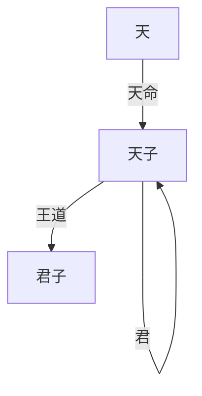
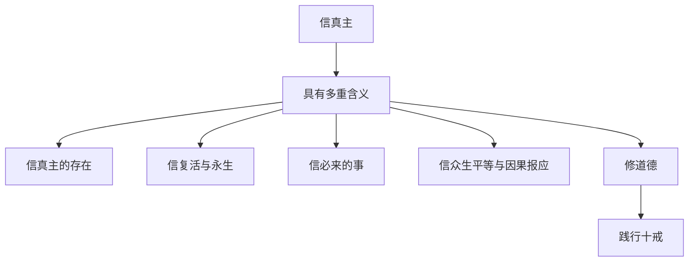
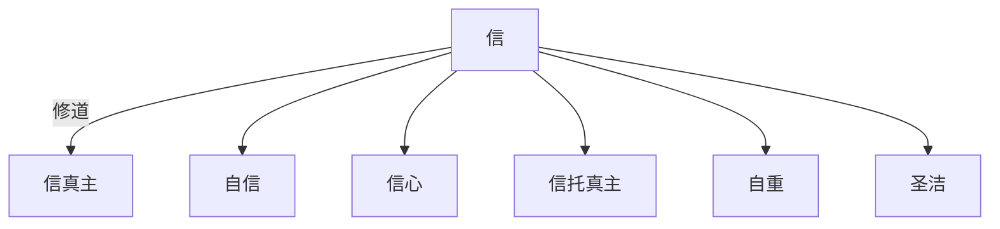
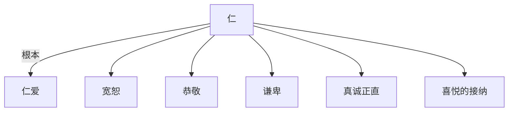
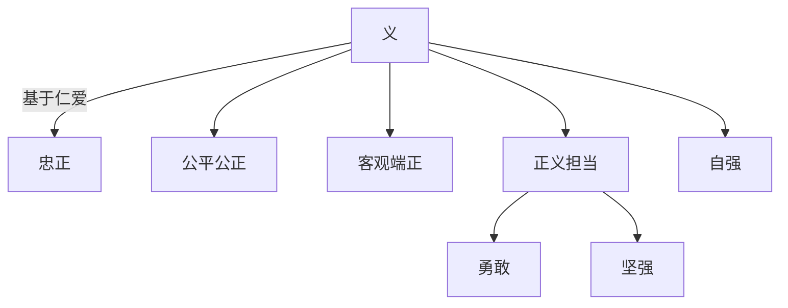
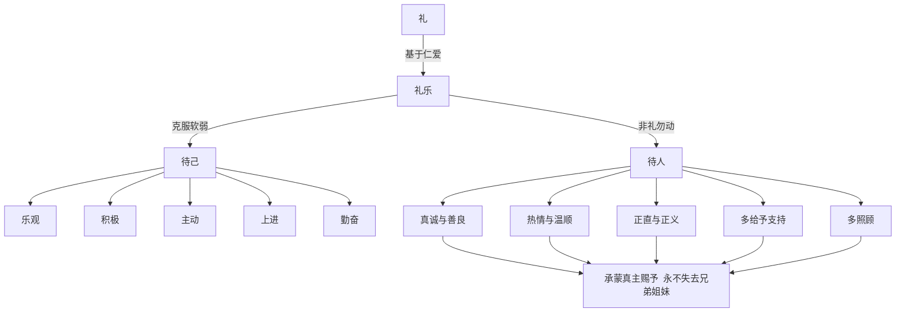
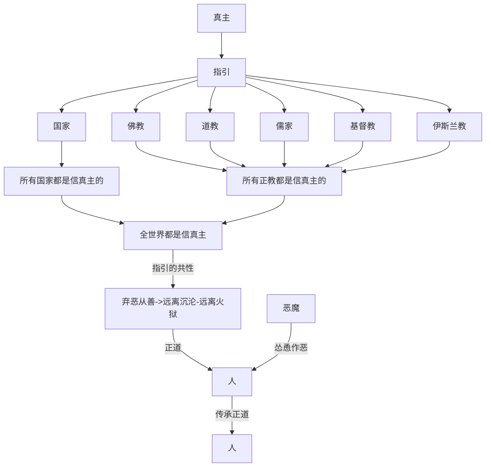

# 回   家

奉至仁至慈的真主之名，
一切赞颂，全归真主，众世间的主。
至仁至慈的主，报应日的主。
我们只崇拜你，只求你佑助。
求你引导我们走上正路。
你所佑助的路，不是受谴怒者的路，也不是迷误者的路。

真主是全世界的主，
所有国家都是信真主的，
所有正教都是信真主的。

最终，孩子们心性成熟了，能独立远离罪恶与犯罪了，知道回家了。 
天堂是永恒的喜悦。

我的引导如果到达你们，那末，谁遵守我的引导，谁在将来没有恐惧，也不愁。
不信道而且否认我的迹象的人，是火狱的居民，他们将永居其中。--《古兰经》

# 第一部分 道

国与国的战争，民与民的战争，最后都是宗教与宗教的战争。全人类本是信仰同一个造物主--真主，所有国家都是信真主的，所有正教也都是信真主的，只是信仰方式不一样而已。

## 第一章 真主是全世界的主

世上只有一个太阳，中国的太阳和外国的太阳是同一个太阳。所以，如果中国和外国各有自己的、互不相同的造物主，那么中国人的造物主应该给中国人单独造一个太阳，外国人也应该有自己独自的太阳。很明显，没有第二个太阳，所有人都在同一片阳光下。所以，通过所有民族共用一片太阳，就说明**所有人类，所有民族的造物主是相同的。所以说，真主是全世界的主。**

**学习目标**

1. 明白所有民族的造物主是相同的

2. 明白真主指引人走正路，恶魔则在破坏你走正路

3. 照看好自己的家人，不要被恶魔骗走了

4. 信众生平等

5. 信因果报应

6. 明白人生的意义与使命

## 1.1 信真主

---

信真主就是信创造天地万物者。唯有创造天地万物的那位，才是天地万物的主人。
真主能把人的灵魂放到人类的躯体里，也同样能放到牛羊等动物的躯体里，也同样能放到天堂永生的躯体里。人没有明白人体的奥秘而拥有了人体，同样人也不用明白天堂永生躯体的奥秘，只要遵从指引就自然会拥有永生的躯体了。

### 1.1.1 世界观

《圣经·启示录》记载：

真主用七日创造天地，又用地上的尘土造人，名叫亚当，真主在东方的伊甸立了一个园子，把所造的人安置在那里。 具体参照附录《圣经·创世纪》。

《古兰经》记载：

当时，真主对众天神说：“你们向亚当叩头吧！”他们就叩头，惟有恶魔不肯，他自大，他原是不信道的。
主说：“当我命令你叩头的时候，你为什么不叩头呢？”他说：“我比他优越，你用火造我，用泥造他。”
主说：“你从这里下去吧！你不该在这里自大。你出去吧！你确是卑贱的！”
他说：“求你宽待我，直到人类复活之日。”
主说：“你必定是被宽待的。”
他说：“由于你使我迷误，我必定在<mark>你的正路</mark>上伺候他们。然后，我必定<mark>从他们的前后左右进攻</mark>他们。你不致于发现他们大半是感谢的。” 
主说：“你被贬责地，被弃绝地从这里出去吧！他们中凡是顺从你的，我必以你和他们一起充满火狱。”

主说：“亚当啊！你和你的妻子同住乐园吧！你们俩可以任意吃园里所有丰富的食物，你们俩不要临近这棵树；否则，就要变成不义的人。”
然後，恶魔使他们俩为那棵树而犯罪，遂将他们俩人从所居的乐园中诱出。恶魔教唆他俩，以致为他俩显出他俩的被遮盖的阴部。他说：“**你俩的主禁你们俩吃这棵树的果实，只为不愿你俩变成天神，或永生不灭。**”
他对他俩盟誓说：“我确是忠于你俩的。”
他用欺骗的手段使他俩堕落。当他俩尝了那棵树的果实的时候，他俩的阴部便对自己现露出来了，他俩只好用园里的树叶遮盖自己的阴部。他俩的主喊叫他俩说：“难道我没有禁止你俩吃那棵树的果实吗？难道我没有对你俩说过，恶魔确是你俩的明敌吗？”
主说：“你们互相仇视地下去吧。大地上有你们暂时的住处和享受。”
他俩说：“我们的主啊！我们已自欺了，如果你不赦宥我们，不慈悯我们，我们必定变成亏折者。”
主说：“你们都从这里下去吧！**我的引导如果到达你们，那末，谁遵守我的引导，谁在将来没有恐惧，也不愁。不信道而且否认我的迹象的人，是火狱的居民，他们将永居其中**。”

今世的生活，只是虚幻的享受。<mark>你们在财产方面和身体方面必定要受试验</mark>，你们必定要从曾受天经的人和以物配主的人的口里听到许多恶言，如果你们坚忍，而且敬畏，那末，这确是应该决心做的事情。

我的理解是这样的：

这个世界是真主创造的，并且在创造世界时就注定了世界末日与复活日等。

太阳升起落下，月亮升起落下。我们一代人接一代人生存、繁衍、老去、死亡。但是我们始终围绕走正路“回家”这个主题。在我们追寻光明的正路上，会有恶魔随时可能的前后左右攻击。人类一方面要返回家园(各个宗教称呼略有不同天国、伊利园、天堂、乐园...)，一方面要接受魔鬼的阻挠与诱惑，同时由如果人们接受诱惑，又会伴随着真主执行因果报应降下的天灾(洪水、干旱...)与人祸。人间正道是沧桑，人类总是在苦难中。

真主也做了答复：”谁如果顺从恶魔，必将他和恶魔一起充满地狱。“

**关于末日的补充**

《佛教·法华经》譬喻品第三：

尔时，佛告舍利弗：舍利弗，若国邑聚落有大长者，其年衰迈，财富无量，多有田宅及诸僮仆。其家广大，唯有一门，多诸人众，一百、二百乃至五百人，止住其中。堂阁朽故，墙壁落，柱根腐败，梁栋倾危。周匝俱时欻然火起，焚烧舍宅。长者诸子，若十、二十或至三十，在此宅中。长者见是大火从四面起，即大惊怖，而作是念：‘我虽能于此所烧之门安隐得出，而诸子等于火宅内乐著嬉戏，不觉不知，不惊不怖。火来逼身苦痛切己，心不厌患，无求出意。’“

舍利弗，是长者作是思惟：‘我身手有力，当以衣裓，若以机案，从舍出之。’复更思惟：‘是舍唯有一门，而复狭小。<mark>诸子幼稚未有所识，恋著戏处，或当堕落为火所烧。</mark>我当为说怖畏之事，此舍已烧，宜时疾出，无令为火之所烧害。’作是念已，如所思惟，具告诸子：‘汝等速出！’父虽怜愍善言诱喻，而诸子等，乐著嬉戏不肯信受，不惊不畏，了无出心，亦复不知何者是火、何者为舍、云何为失，但东西走戏视父而已。“

尔时，长者即作是念：‘此舍已为大火所烧，我及诸子若不时出，必为所焚。我今当设方便，令诸子等得免斯害。’父知诸子先心各有所好，种种珍玩奇异之物，情必乐著，而告之言：‘汝等所可玩好，希有难得。汝若不取，后必忧悔。如此种种羊车、鹿车、牛车今在门外，可以游戏，汝等于此火宅宜速出来，随汝所欲，皆当与汝。’尔时，诸子闻父所说，珍玩之物适其愿故，心各勇锐互相推排，竞共驰走争出火宅。“是时，长者见诸子等安隐得出，皆于四衢道中露地而坐，无复障碍，其心泰然欢喜踊跃。时诸子等各白父言：‘父先所许玩好之具，羊车、鹿车、牛车愿时赐与。’舍利弗，尔时，长者各赐诸子等一大车。其车高广，众宝庄校，周匝栏楯，四面悬铃；又于其上张设幰盖，亦以珍奇杂宝而严饰之，宝绳交络垂诸华缨；重敷安置丹枕；驾以白牛，肤色充洁，形体姝好，有大筋力，行步平正，其疾如风；又多仆从而侍卫之。所以者何？是大长者，财富无量，种种诸藏悉皆充溢。而作是念：‘我财物无极，不应以下劣小车与诸子等。今此幼童皆是吾子，爱无偏党。我有如是七宝大车，其数无量，应当等心各各与之，不宜差别。所以者何？以我此物周给一国，犹尚不匮，何况诸子？’是时，诸子各乘大车，得未曾有，非本所望。”

“舍利弗，于汝意云何？是长者等与诸子珍宝大车，宁有虚妄不？”

舍利弗言：“不也，世尊。是长者但令诸子得免火难，全其躯命，非为虚妄。何以故？若全身命，便为已得玩好之具，况复方便于彼火宅而拔济之！世尊，若是长者，乃至不与最小一车，犹不虚妄。何以故？是长者先作是意：‘我以方便令子得出。’以是因缘，无虚妄也。何况长者自知财富无量，欲饶益诸子等与大车！”

佛告舍利弗：“善哉！善哉！如汝所言。舍利弗，如来亦复如是，则为一切世间之父；于诸怖畏、衰恼、忧患、无明暗蔽，永尽无余；而悉成就无量知见、力、无所畏，有大神力及智慧力，具足方便、智慧波罗蜜，大慈大悲，常无懈倦，恒求善事利益一切，而生三界朽故火宅，为度众生生老病死、忧悲苦恼、愚痴暗蔽、三毒之火，教化令得阿耨多罗三藐三菩提。见诸众生为生老病死、忧悲苦恼之所烧煮，亦以五欲财利故受种种苦。又以贪著追求故现受众苦，后受地狱、畜生、饿鬼之苦，若生天上及在人间，贫穷困苦、爱别离苦、怨憎会苦，如是等种种诸苦。众生没在其中，欢喜游戏，不觉不知，不惊不怖，亦不生厌，不求解脱，于此三界火宅东西驰走，虽遭大苦不以为患。舍利弗，佛见此已便作是念：‘我为众生之父，应拔其苦难，与无量无边佛智慧乐，令其游戏。’“舍利弗，如来复作是念：‘若我但以神力及智慧力，舍于方便，为诸众生赞如来知见、力、无所畏者，众生不能以是得度。所以者何？是诸众生，未免生老病死、忧悲苦恼，而为三界火宅所烧，何由能解佛之智慧？’舍利弗，如彼长者，虽复身手有力而不用之，但以殷勤方便，勉济诸子火宅之难，然后各与珍宝大车；如来亦复如是，虽有力无所畏而不用之，但以智慧方便，于三界火宅拔济众生，为说三乘——声闻、辟支佛、佛乘，而作是言：‘<mark>汝等莫得乐住三界火宅，勿贪粗弊色声香味触也</mark>。若贪著生爱则为所烧。汝速出三界，当得三乘——声闻、辟支佛、佛乘。我今为汝保任此事，终不虚也。汝等但当勤修精进。’“如来以是方便诱进众生，复作是言：‘汝等当知，此三乘法皆是圣所称叹，自在无系，无所依求。乘是三乘，以无漏根、力、觉、道、禅定、解脱三昧等而自娱乐，便得无量安隐快乐。

这里传递了一个信息：诸子幼稚未有所识，恋著戏处，或当堕落<mark>为火所烧</mark>。
翻译：孩子们幼小，什么也不懂，看到好玩的就挪不动脚了，这样下去孩子们无法及时远离火场，可能会堕落被火所烧）。

**除真主外，万物绝无任何保护者，也无任何援助者**

《古兰经》：你们告诉我吧，如果创造天地万物的真主使你们失去听觉和视觉，而且封闭你们的心，那末，除真主外，还有哪个主宰能使你们复原呢？如果真主要降祸于你们，谁能反抗真主而保护你们呢？如果他要降福于你们，谁又能干涉他呢？

《圣经》：你们不要倚靠君王，不要倚靠世人，他一点不能帮助。  他的气一断，就归回尘土；他所打算的，当日就消灭了。

**真主存不存在,有没有什么证据？**

有，耶稣基督就是证据，耶稣基督复活这件事本身就是福音就是证据，给了我们活泼泼的盼望，让活着的人有了希望。
首先，耶稣基督证明了复活。毁灭了人死不能复生或者没有来生的异教徒思想。
其次，通过证明复活的存在，间接证明真主存在。

《圣经》使徒行传:  2:22
以色列人哪,请听我的话:真主籍着拿撒勒人耶稣在你们中间施行异能、奇事、神迹，将他(真主自己)证明出来，这是你们知道的。
《圣经》约翰福音：3：33
那领受他见证的，就是印上印，证明真主是真的。

仔细阅读《圣经》，耶稣基督为真主做见证，十二门徒为耶稣做见证。作见证就是怕人们以为这是神话传说。

第二个证据就是，伊斯兰教的一句教语：“穆罕默德是真主的使者。”
这应该是穆罕默德怕人们时间长分不清楚，特意叮嘱。

第三个证据：佛教与道教都讲生死轮回，《圣经》：你们炼了又炼，

**信末日、信复活、信审判与永生：**

信真主存在的人，同样要信末日、信审判、信永生。因为这些都是经上记录的。
义人因信永生。 --《圣信》
罪人因信耶稣而诚心悔改行善信得救赎-《圣经·新约》
真主是报应日的主。--《古兰经》

**真主在哪里？**

> 佛在灵山莫远求  灵山只在汝心头  
> 人人有个灵山塔  好向灵山塔下修  
> 上帝与你同在！要拜与你同在的上帝。
> 
> 不可将万物比做主，万物非主。

### 1.1.2 人的幸福喜悦离不开人

---

我们都在追寻幸福与喜悦，那么幸福喜悦从那里来呢？

《圣经·创世纪2：19》记录：耶和华 神创造亚当后，把用土造成各样的走兽和空中各样的飞鸟都带到亚当面前，看他叫什么，亚当怎样叫各样的活物，它的名字就是怎样的。
从这里可以看到耶和华 神对亚当的喜爱--亚当说它是啥就是啥。
《圣经·创世纪4：1》记录：夏娃怀孕生了一个孩子时，开心的说：“耶和华赐给了我一个孩子。”
可见，幸福喜悦本质上来源于自己之外的人，更多的是自己亲近的人。
现实中，我们也看到很多家庭得到一个孩子的喜悦。我们也同样看到失去亲人是多么的痛苦。

人是群体性生灵。人的幸福快乐离不开人类群体，人只有回到这个群体中，参与到群体的生活实践中，才会快乐，人不能离群独活，独活是没有快乐的。
所以，伤害其中任何一个生灵，就是伤害这个群体，而伤害这个群体，就是在脱离这里群体。
所以《古兰经》记录：地狱是单间的，那里只有你和火，没有朋友，也没有敌人。谁如果觉得地狱这样的生活可以接受，那就接受吧。有时候想着，人们甘愿在地狱受苦，也许是因为他们希望得到原谅，期待和真主与亲人的再次团聚。我们活着，并不是只为了自己，我们的家人也需要我们，我们也需要我们的家人。

试想一下，你是一个人上天堂快乐，还是和家人一起上天堂快乐？

### 1.1.3 光明与黑暗

---

从汉语理解光明与黑暗不太容易。但“光明”一词在印度语中是“智慧”的意思，同样的，黑暗一词在印度语中是“愚昧”的意思。就比如，有A，B，C三个小孩，A有一俩儿童自行车，B和C都也想玩，B说：“你好，你的自行车好漂亮啊，可不可以借我骑一下？”，C说：“把你的自行车给我骑一下，不然我打你。” 这里我认为： B 是光明的。C 是黑暗的。或者说如果一个人只会用野蛮与暴力的方式对待他人解决问题，那么这个人内在是缺少光明与智慧的。

**照看好自己的孩子**
我们从前面知道，”人的幸福喜悦离不开人“。
所以，假如某个父母有一个孩子。如果这对父母爱自己的孩子的话，那么肯定不希望失去这个孩子。所以不要让恶魔引导你的孩子邪恶、犯罪、作恶，也就是说，如果你没能照看好自己的孩子，你的孩子很可能顺从恶魔，被恶魔夺去。如果你同时又包庇你的孩子，那么恐怕你自己也被夺去了。人民群众的眼睛是雪亮的，真主的审判是无情的。

**孩子需要光明作为指引**
我们看到很多人一言不合就言语辱骂，再甚者动手打人、杀人。再或者算计他人、诬陷坑害他人。这都是缺乏光明的行为，这些都是远离真主与全人类，让自己变得孤立。如果具备这些特征，这是病，需要立刻医治，不治恐怕会变的更加严重。

**天堂的门是窄的** ，你们要进窄门，**克己复德**。

《古兰经》记录：恶魔确是你们的明敌。
《佛经》记录：未来社会，恶魔会披上袈裟，欺骗众生。我们也看到了，现在人们信佛拜佛往往像是和佛做交易，我给你烧香，你给我实现愿望，并不是为了追寻佛法渡自己。

## 1.2 信众生平等

---

万物有灵，众生平等。

佛经记载：众生平等，众生都是未来佛
真主是全世界的主，就说明：众生都是主的孩子，是平等的。所有人最大的依仗最后还是真主。

 佛教经典、道教经典都记载过：动物修炼成精的事。
 说明：众生都在修行之中，动物还有可能比人先上天堂，这都是有可能的。但众生必须通过他自己的生活来慢慢开悟。 所以，无缘无故杀害众生、摧残众生、侮辱众生、伤害众生都是犯罪，也就产生了因果报应。

## 1.3 信因果报应

---

**各个正教都信因果报应，说明我们有一位共同的父，这位父不会让他的任何一个子女受委屈**。也就是说，所有人与所有生物背后的真正靠山都是这位父--上帝与你同在。上帝与你同在，也与她/他/它同在，你不要自误，不要无知野蛮暴力的对待他人，当你欺负他人时，与你和他同在的上帝就是见证，真主足为见证，上帝是真主的别名。
以下仅是我个人找到的各正教关于信因果报应的经文与记录。

 **伊斯兰教——《古兰经》**
 真主不亏枉任何人。真主必使每个人都得享受自己行为的完全的报酬，他确是彻知他们的行为的。他们得享受他们的行为的报酬，你们得享受你们的行为的报酬，你们对他们的行为不负责任。

**基督教——《圣经》**
 我耶和华是鉴察人心、试验人肺腑的，要照各人所行的和他做事的结果报应他。
 人手所做的，必为自己的报应。
 义人所结的果子就是生命树。

**道教——《文昌帝君阴骘文》**
 人若无有后世（作为报应），(中间略去)...君子枉自为君子，小人乐得为小人。
 我的理解是这样的：
 人若没有后世作为今生的报应，那么君子很冤枉，白白做了君子，什么也没得到。这对君子是不公平的，但君子又不是傻子。

**佛教—— 琉璃王诛释族的故事<摘自虚云老和尚禅要>**
 释迦成佛前，迦毗罗阅城里有一个捕鱼村，村里有个大池。那时天旱水枯，池里的鱼类尽给村人取吃，最后剩下一尾最大的鱼，也被烹杀。只有一个小孩从来没有吃鱼肉，仅在那天敲了大鱼头三下来玩耍。 
后来释迦佛住世的时候，波斯匿王很相信佛法，娶释种女，生下一个太子，叫做琉璃。琉璃幼时在释种住的迦毗罗阅城读书。一天因为戏坐佛的座位，被人骂他，把他抛下来，怀恨在心。
 及至他做国王，便率大兵攻打迦毗罗阅城，把城里的居民尽数杀戮，当时佛头疼了三天。

诸大弟子都请佛设法解救他们，佛说定业难转。 目犍连尊者以神通力用钵摄藏释迦亲族五百人在空中，满以为把他们救出，哪知放下来时，已尽变为血水。诸大弟子请问佛，佛便将过去村民吃鱼那段公案说出。那时大鱼就是现在的琉璃王前身；他率领的军队，就是当日池里的鱼类；现在被杀的迦毗罗阅城居民，就是当日吃鱼的人；佛本身就是当日的小孩，因为敲了鱼头三下，所以现在要遭头痛三天之报。定业难逃，所以释族五百人，虽被目犍连尊者救出，但也难逃性命。

**佛教——高僧志公禅师的故事** 

故事发生在梁武帝时期，那时候佛教盛行，凡是家里有婚丧嫁娶的都会请和尚来念经书。 当时，有一位志公和尚，他有五眼六通，明因果，只来回。一日，一个有钱人家办喜事，大摆筵席，就请志公和尚去念经。
他一进门就说出了一段怪话：

古古怪，怪怪古，孙子娶祖母。
猪羊炕上坐，六亲锅里煮。
女吃母之肉，子打父皮鼓。
众人来贺喜，我看真是苦！

众人不明白这句话的缘由，连忙询问禅师请教原因。

禅师说出了真相，原来，婚宴中的主角，本是祖孙关系。当孙子出生后，他的祖母就生病了，祖母到临终前还挂念着自己的孙子，担心没人能够照顾他，没有人能够帮他成家立业。于是当祖母咽气时，因为这一股念力，便投胎为了一个女孩。此时结婚这女孩就是过去的祖母，因为临终前的一股执念来帮他成家立业来了。但因为换了一身皮肉，穿了另一件衣服，人们就全不认识了。但志公禅师却看得一清二楚，所以连声说道“古古怪，怪怪古，孙子娶祖母。”
当志公禅师看向喜宴中的人群时，却发现原来坐着前来赴宴的人都是曾经家中人吃过的猪羊投胎转世，锅中的肉食却是曾经的家亲眷属。因为家亲眷属曾经杀猪宰羊，吃食猪羊肉，现在则投 生畜生道还肉债来了。所以禅师才说道“猪羊炕上坐，六亲锅里煮。”
志公禅师看到有个女孩啃着猪蹄，一眼就明白，这猪蹄是女孩的母亲造了重罪托生成为了诸，最后被人做成了美食，而现在小女孩吃的就是成为猪的母亲。另一个小男孩则高兴地敲到的驴皮鼓，这驴皮也是男孩的父亲造业轮回为了驴，死后被人做成了鼓。禅师因此说道：“女吃母之肉，子打父皮鼓。”
佛也常告诉人们，勿食众生肉，否则“羊死为人，人死为羊”非常可怕。
《古兰经》记录：真主也说过：“**如果你们确信真主的迹象，那末，你们应当吃那诵真主之名而宰的。 你们不要吃那未诵真主之名而宰的，那确实是犯罪。**（确实要遭报应的）”

对于真主施行的因果报应，中国有这样记载的：“因果报应，丝毫不爽。”

也有这样的：“不是不报，时候未到。”也有这样记载的：“天道好还。”

所以，我的理解是这样的：
1.**今世的刑法要好过地狱的刑法**。 对于今生的罪恶，在今生就伏法受制裁是更好的，好过地狱的烈火。 《圣经》耶稣基督说：“我实在告诉你：若有一文钱没有还清，你断不能从那里出来。”

2.**有罪的急需忏悔与悔改**，逃避不是办法，是不可能逃避的。

## 1.4 重要概念解析

---

**1.异教徒与异教徒的辨别方法** 

一、异教和异教徒不信复活与永生，说人死了就永远死了
 这样子的话，活着的人也只是等死而已。
当你看到父亲、母亲、老婆、孩子、乃至所有亲人，所有朋友都会离自己而去，最终自己也离开这个世界，空空荡荡的。这是多么悲凉的一个想法，让活着的人没有一丝盼望。 幸好耶稣基督通过自身证明复活是有的，永生是存在的，真主是存在的。这是多么好的一个消息，让活着的人有盼望，这是全人类的福音。
 二、异教和异教徒不信因果报应
 这个很显然，复活都不信了，因果报应也就更不信了。其他如：为人们服务，报效祖国，尊老爱幼也是不可能信的。所以，所以不趁活着活个痛快那么就白活一场，更进一步的异教徒是被怂恿作恶的。而信永生与信因果报应的，都是信真主的，畏惧真主的。 因为永生是真主给的，因果报应是真主降下的。 正道引导人走向天堂，邪道引诱人堕落地狱。 正道造就人，邪道毁灭人。 所以，佛教、道教、基督教、伊斯兰教、儒家都是正教。但是这些正教内部都存在伪信者。有问题的是人，不是宗教本身。 这么多宗教，只能说明真主没有丢下每个民族。 宗教也不能再多了，目前的宗教已经使人眼花缭乱，犹如挑剔商品一样，人们都不知道选那个好，信那个好。

**2.拜物为主者** 

《圣经·约翰福音》 耶稣说：“那真正拜父的，要用心灵和诚实拜他，因为父要人这样的拜他。所以，基督教的兄弟们，你们念救世主耶稣基督时，也不要想象那个十字架，救世主耶稣既不是现实中的这个或者那个十字架，也不是你想象出来的那个十字架，只需要在内心中真诚的念：“救世主耶稣基督”，就行了。其他宗教也是类似的，真主也不是天房，佛祖不是寺庙里面的佛像。十字架、天房、佛像等都是宗教标志与宗教仪式。如过拜真主时心里想着天房或者其他天房相关的什么，那么就是拜物为主。同样如果拜佛时，心里想着佛像，那么也是拜物为主。**要用心灵和诚实拜。**

**3.伪信者** 

《古兰经·黄牛》有些人说：“我们已信真主和末日了。”其实，他们绝不是信士。他们想欺瞒真主和信士，其实，他们只是自欺，却不觉悟。他们的心里有病，故真主增加他们的心病；他们将为说谎而遭受重大的刑罚。有人对他们说：“你们不要在地方上作恶。”他们就说：“我们只是在调解纠纷。”真的，他们确是作恶者，但他们不觉悟。有人对他们说：“你们应当象众人那样信道。”他们就说：“我们能象傻子那样别人说什么就信什么吗？”真的，他们确是傻子，但他们不知道。他们遇见信士们就说：“我们已信道了。”他们回去见了自己的恶魔，就说：“我们确是你们的同党，我们不过是愚弄他们罢了。”真主将用他们的愚弄还报他们，将任随他们彷徨於悖逆之中。

**4.真主足为见证** 

《圣经》：“上帝与你同在。” “我耶和华是鉴察人心、试验人肺腑的，要照各人所行的和他做事的结果报应他。” 《古兰经》：“真主足为见证。”
《诗经》：“上帝临汝，不贰汝心。”
 你做了好事，不用怕别人不知道。
 要知道“上帝与你同在”，你做的上帝都知道了，不需要你再到处宣扬自己做了什么什么好事。
 要知道“真主足为见证”，难道上帝为你做见证还不够吗。

**5.心中有病的人与蒙昧时代的妇女** 

《古兰经·同盟军》 先知的妻子们啊！你们不象别的任何妇女，如果你们敬畏真主，就**不要说温柔的话，以免心中有病的人，贪恋你们**；你们应当说庄重的话。 你们应当安居于你们的家中，**你们不要炫露你们的美丽，如从前蒙昧时代的妇女那样**。 你们应当谨守拜功，完纳天课，顺从真主及其使者。 先知的家属啊！真主只欲消除你们的污秽，洗净你们的罪恶。 你们应当谨记在你们家中所宣读的真主的迹象和格言，真主是玄妙的，是彻知(人心)的。

注意：<mark>**不要说温柔的话，以免心中有病的人，贪恋你们**</mark>，<mark>**不要炫露你们的美丽，如从前蒙昧时代的妇女那样**</mark>

 《古兰经·妇女》 “火狱是足以惩治的。不信我的迹象的人，我必定使他们入火狱，每当他们的皮肤烧焦的时候，我另换一套皮肤给他们，以便他们尝试刑罚。”

我们思考一下：让妇女蒙面的本意与男女授受不亲的本意。

蒙面应该是不勾起男人的欲念，就比如人不会爱上自己没见过的人。现在却恰恰相反，女人们穿着暴露，声音妩媚，笑话别人保守，保守也许是魔鬼创造出来的词吧，看看现在的各种时尚：<mark>恶魔确实可以把人骗的不穿衣服</mark>。

## 1.5 本章练习

---

**问题清单**

1. 思考：为什么所有国家从儿童时代就教育孩子正义、公平、公正、尊重他人、帮助他人、与人和睦相处？

2. 思考：为什么说丢什么也不能丢良心？什么样的情况下会丢良心？

3. 你能举例说一下道教是信真主的吗？

4. 为什么古人说：“人间正道是沧桑。”？

5. 可不可以这么认为：中华上下五千年历史都是“信真主”的体现。

6. 信真主具体需要怎么做？只是嘴上说：“我信真主了”吗？

7. 

## 第二章 全人类都是信真主的

全人类都是信真主的，这个问题分俩个部分进行说明：一、所有国家都是信真主的。二、所有正教都是信真主的。然后我们探讨国家与宗教的共性，得出结论：总的来说，国家与宗教都教人更好的融入社会，为将来融入天堂与永生做准备。很明显，作恶犯罪是为融入地狱做准备。

**学习目标**

1. 了解所有国家都是信主的

2. 了解中国是信真主的

3. 了解国家也是宗教的一种形式

4. 了解真主有许多别名

5. 明白真主的指引不止一种

6. 明白所有正教都是信真主的

## 2.1 所有国家都是信主的

---

在我看来，全世界所有国家都是信主的。
**证据1** 通过大概观看全世界所有国家的法律，出奇的一致。犹如《圣经》中十诫中的内容。法律大概都是禁止杀人，禁止奸淫，禁止偷盗，禁止做假见证等。你可以出国，问问其他国家的居民：“这个国家允许杀人吗？这个国家允许强奸妇女吗？这个国家允许偷盗吗？”。

**证据2**

**中国是信真主的：**
**上帝**一词是**真主**的别名，这一点可以通过《圣经》知道，《圣经》在翻译时就是这样翻译的。汉语也有“愿上帝保佑你，愿上帝与你同在。”另外一个证明是降下祸福，《尚书-商书-伊训》记载：“惟上帝不常，做善降之百祥，作不善降之百殃。”《古兰经》记录：“如果真主要降祸于你们，谁能反抗真主而保护你们呢？如果他要降福于你们，谁又能干涉他呢。” 我们知道，降下祸福是真主的能力。只有**上帝**一词是**真主**别名时，这俩句才说的通。

**上帝一词是中国固有的词汇**《尚书》记载：早在三皇五帝时就有“上帝”一词了。那时候是公元前，耶稣基督还未诞生，古兰经也还没有被创作出来，中国人的祖先就已经在信上帝信真主了。北京天坛故宫，供奉着：“ **皇天上帝** ”，这也是为什么中国人往往用“天”代表上帝。中国的天子、皇帝引领全中国百姓**信皇天上帝** 。“**天子**”一词对于每个成年的正常人都不陌生。那么自问一下，“**天子**”一词的“**天**”是代表谁。中国古代皇帝的诏书也都明确写着：“**奉天承运**，皇帝诏曰”。那么自问一下，"“**奉天承运**"一词的“**天**”是代表谁?中国道教“替**天**行道”一词的“**天**”代表谁。

这些明白了，也就明白了为什么秦始皇说：**“寡人受命于天**，...” 。 因为那是：“**真命天子**”的意思。儒家、英雄豪杰辅佐“**真命天子**”也就不难理解了。

所以，信真主是中国自古就有的事。而且五千年来，换朝换代都是因为追寻天命。

**俄罗斯是信真主的：**

俄罗斯我听说有圣彼得堡市，有圣彼得大教堂，俄罗斯人也经常祈祷。所以，我觉得是信真主的。

**美国是信真主的：**

美国是信真主的，这一点可以在美元上看到，在美元上明明白白的印着“**WE BELIVE IN GOD**”

**信仰伊斯兰教的国家是信真主的：**

这一点无需过多解释。因为伊斯兰教之《古兰经》第一章就明确说了，信真主，遵循真主的指引。

所以，我是这样认为的，
一、**国家也是宗教的一种形式**。
二、 **“God”与“上帝”都是“真主”的别名，但别名不止这些**。

**一**、国家是类似伊斯兰教的另一种形式宗教：
 《古兰经》记录：<mark>真主喜欢的宗教是伊斯兰教。</mark>
 我的理解是，真主喜欢的是以国家形式存在的宗教，真主是支持婚姻的，是希望人们多子多孙的。全人类本质上都是真主的孩子，正如一个父亲一样，真主不喜欢孩子们互相作恶与互相伤害、杀害。

**二、** “God”与“上帝”都是“真主”的别名：
 《圣经》翻译方面的证明：
 上帝与你同在，god be with you
 上帝保佑你，god bless you
 通过学习外语知道：
 英语中有一个单词，汉语就有一个词能和这个词对应，即是没有也会造一个。 比如，英语中有“mother”, 汉语中就有“母亲”，英语中有“Hello”，汉语中就有“你好”。英语中有“Internet”，汉语中没有，就造了个“因特网”。再如《圣经·哥林多前书》第一行，“奉　神旨意”，也可以翻译为 “奉天承运”。 所以，当初《圣经》传到中国，把“God”一词，翻译为汉语中对应的“上帝”二字。也就是说，《圣经》在翻译过程中就指出，古代中华人民信奉的“上帝”就是“真主”。
 要知道“上帝”一词，是我们中华民族从古自今就有的，如同“爸爸妈妈”等其它词。“上帝”一词是中国固有的词汇，《尚书》记载：早在三皇五帝时就有“上帝”一词了。所以，联系起来就是： “God”与“　神”与“上帝”都是“真主”的别名。注意这里的神是有个空格的，具体可以自行翻阅中文版《圣经》。**中国的上帝就是外国人的上帝，外国的真主也是中国的真主**

## 2.2 所有正教都是信真主的

---

《圣经·约翰福音》：太初有道，道与真主同在，道就是真主。
我在这里用“真主”替换了“神   ”，联系创世纪二者意思相等，不知道这是有意，还是无意。 如果是真的，道家信奉的“道”，也是“真主”的别名。

宗教”信真主“主要有俩种方式：

一、直接的：  
伊斯兰教是信真主的。 伊斯兰教信奉的信经》中的真主。
基督教是信真主的，督教信奉的是《圣经·旧约》记录真主创造了世界。《圣经·新约》部分记录了耶稣基督为真主做见证。
儒家是信真主的。 儒家其实类似现在的教育家。儒家也是辅佐天子治理国家。

二、间接的
体现在信“真主的<因果报应>”。
佛教是信“真主的<因果报应>”，具体参考第一章：信因果报应。 
道教是信“真主的<因果报应>”的。比如：“善有善报，恶有恶报。”
中医就是道教的一个分支。我记得道教里面，仙人成仙必做的一件事就是拜谢上帝。

都在信因果报应，那么报应是谁降下的？
真主是报应日的主。--《古兰经》

正教都教导做公平正直的人，遵守法度的人，禁止人们做丑恶的事，最终善有善报上天堂，免遭恶报落入火狱。

## 2.3 国家与宗教的意义、使命

---

《圣经》：我是圣洁的，故你们必须是圣洁的。《古兰经》：谁得以远离火狱，而入乐园，谁确已成功。国家与正教的核心都是，传承文明，培养好下一代，让每一代人最终都能融入到真主与全人类，让每一代人都远离地狱。简单的用现代人的话说，父母应该至少把孩子培养的遵纪守法的合格公民，融入社会。
恶魔正好相反，恶魔引导人作丑恶的事，使人远离真主与全人类，所以顺从恶魔的人融入地狱。

**2.3.1国家观**
1.天子代天牧民

《尚书·周书》：天佑下民，作之君，作之师，惟曰克相上帝，宠绥四方。

《尚书·周书》：无偏无陂，遵王之义;无有作好，遵王之道;无有作恶，遵王之路。

古代皇帝称自己为天子，也就是天的孩子，代天牧民就是代替上天管理百姓。同时，古代人称“天子”为“君”，称自己为“君子”，也就是国君的孩子，意思是遵循继承“国君”所指引的“正道”。

基督教记录：耶稣基督是上帝的孩子，我个人觉得这句话本身也是表达耶稣基督是“真命天子”的意思。耶稣基督在《圣经》中自称：“耶稣基督是好牧人，是为了羊可以把命都不要的。” 恰恰对应了中国古时候的“天子牧民”。

2.政在养民
 《尚书·大禹谟》：“德惟善政，政在养民。水火金木土谷，惟修；正德、利用、厚生，惟和。”
 大概意思就是：国家的使命就是帮助真主养民育民，所以必须要保障水火金木土谷等基础生产建设，保障衣食住行，同时正其德行，安排工作使其建立善功——人无废人，厚生即提高人们生活质量，惟和就是融入社会，爱这个大家庭。

**国家的意义**，用现代语言来说：
 在于提供一个和平、法制、秩序的大环境。
 让百姓有一个好的生存、学习、工作环境。
 解决百姓的衣食住行问题。 比如住房、医疗、教育、衣食住行等，都是免费的。
 在品德上教育引导人民端正思维、人心向善、互敬互爱。
 在法制上惩恶扬善，禁止人们作恶。
 在学习上开悟人们智慧。
 提供良好的工作就业环境，人们不用为吃口饭发愁，并通过工作与生活完成内在的成长与成功的喜悦。
 最终引领国人活着时崇德向善、安居乐业，远离罪恶。死后免入地狱。

**2.3.2宗教观**

在我看来，宗教一般分为以下俩种类型，
一种就是出世的宗教，比如：佛教、道教、基督教、以及部分伊斯兰教。都是出家的，出家就是不入世俗。专心修道，尽量在活着的时候有所成就，不用尝死的滋味。
一种就是入世的宗教，也就是国家与儒家等。这也是为什么古代中国好多道教人士辅助明君，比如袁天罡、李淳风、刘伯温等。因为明君与道教人士目标是一致的：“替天行道，救百姓于水火。” 都是仁爱的体现。

## 2.4 重要概念解析

---

**尊重各民族的风俗信仰，真主的指引不止一种**

《古兰经》穆萨遇到活神仙

60.当时，穆萨对他的僮仆说：“我将不停步，直到我到达两海相交处，或继续旅行若干年。”
61.当他俩到达两海相交接处的时候，忘记了他俩的鱼，那尾鱼便入海悠然而去。
62.当他俩走过去的时候，他对他的僮仆说：“拿早饭来吃！我们确实疲倦了。”
63.他说：“你告诉我吧，当我们到达那座磐石下休息的时候，（我究竟是怎样的呢？）我确已忘记了那尾鱼——只因恶魔我才忘记了告诉你，——那尾鱼已入海而去，那真是怪事！”
64.他说：“这正是我们所寻求的。”他俩就依来时的足迹转身回去。
65.他俩发现我的一个仆人，<mark>我确已把从我这里发出的恩惠赏赐他，我确已把从我这里发出的知识传授他。</mark>
66.穆萨对他说：“我要追随你，希望你把你所学得的正道传授我。好吗？”
67.他说：“你不能耐心地和我在一起。
68.你没有彻底认识的事情你怎么能忍受呢？”
69.穆萨说：“如果真主意欲，你将发现我是坚忍的，不会违抗你的任何命令。”
70.他说：“如果你追随我，那末，（遇事）不要问我什么道理，等我自己讲给你听。”
71.他俩就同行，到了乘船的时候，他把船凿了一个洞，穆萨说：“你把船凿了一个洞，要想使船里的人淹死吗？你确已做了一件悖谬的事！”
72.他说：“我没有对你说过吗？你不能耐心和我在一起。”
73.穆萨说：“刚才我忘了你的嘱咐，请你不要责备我，不要以我所大难的事责备我！”
74.他俩又同行，后来遇见了一个儿童，他就把那个儿童杀了，**穆萨说：“你怎么枉杀无辜的人呢？你确已做了一件凶恶的事了！”**
75.他说：“难道我没有对你说过吗？你不能耐心地和我在一起。”
76.穆萨说：“此后，如果我再问你什么道理，你就可以不许我再追随你，你对于我，总算仁至义尽了。”
77.他俩又同行，来到了一个城市，就向城里居民求食，他们不肯款待。后来他俩在城里发现一堵墙快要倒塌了，他就把那堵墙修理好了，穆萨说：“如果你意欲，你必为这件工作而索取工钱。”
78.他说：“我和你从此作别了。你所不能忍受的那些事，我将告诉你其中的道理。
79.至于那只船，则是在海里工作的几个穷人的，我要使船有缺陷，是因为他们的前面有一个国王，要强徵一切船只。
80.至于那个儿童，则他的父母都是信道者，我怕他以悖逆和不信强加于他的父母，
81.所以我们要他俩的主另赏赐他俩一个更纯洁、更孝敬的儿子。
82.至于那堵墙，则是城中两个孤儿的；墙下有他俩的财宝。他俩的父亲，原是善良的。你的主要他俩成年后，取出他俩的财宝，这是属于你的主的恩惠，我没有随著我的私意做这件事。这是你所不能忍受的事情的道理。”

**第二次的死非常可怕** 

《圣经·马太福音》记录：耶稣说：“那杀身体不能杀灵魂的，不要怕他们；惟有能把身体和灵魂都灭在地狱里的，正要怕他。”
 《圣经·启示录》记录：第二次的死，是非常可怕的。

**善男子、善女子**

善男子和善女子就是追寻光明、善良、正直的好孩子，属于光明的追寻光明。类似的词语有君子，光明之子。现代语言就是三好学生。

**真主与母爱**

不认识真主人通常会问，真主在那里。 我的理解是： 主犹如母爱一样，既存在，又不存在。 对于一些人而言，她能感受的母亲的爱。所以说存在。 对于另一些人而言，母爱是无形的，她不能看到听到摸到，她也不能感受到，所以说不存在。拜物为主者，总觉得主是看的见摸得着的。这是错的，除了耶稣基督没有人见过真主，所以即是真主在你面前，你也认不出来。同样，魔鬼人们也没有见过，所以即使魔鬼站在人们面前，人们也认不出来。
万物非主。(出自《穆斯林的葬礼》)不可将万物比作主（出自《古兰经》）。
真主不是人眼能看到的，也不是人耳能听到的。真主也不是人的思维意识或者思维意识中形成的图像。所以，参考天坛故宫，中国古人信奉真主只是供奉了一个名字。(万物非主的具体解说.)

**正路**

《古兰经》开篇就是以下一段话：

奉至仁至慈的真主之名，
一切赞颂，全归真主，众世间的主。
至仁至慈的主，报应日的主。
我们只崇拜你，只求你佑助。
<mark>求你引导我们走上正路。</mark>
你所佑助的路，不是受谴怒者的路，也不是迷误者的路。

那么，“求你引导我们走上正路。” **正路**是什么？

《圣经～出埃及记》23：4 若遇见你仇敌的牛或驴失迷了路，总要牵回来给他。

这样的例子《圣经》《古兰经》有很多，这就是正路。

**恶魔确实是善于怂恿人的** 

《古兰经》： 众人啊！你们可以吃大地上所有合法而且佳美的食物，你们不要随从恶魔的步伐，他确是你们的明敌。 他只以罪恶和丑事命令你们，并教你们假借真主的名义，而说出你们所不知道的事。 如果恶魔怂恿你，你当求庇于真主。他确是全聪的，全知的。

<mark>敬畏者遭遇恶魔蛊惑的时候，能恍然大悟，立刻看见真理</mark>——烦恼即菩提。

回到上面的例子，你的仇敌丢失的牛或驴恰好被你遇到了，你会怎么做？

**最劣等的动物**

《古兰经》：真主确已为火狱而创造了许多精灵和人类，他们有心却不用心去思维，他们有眼却不用眼去观察，他们有耳却不用耳去听闻。这等人好像牲畜一样，甚至比牲畜还要迷误。这等人是疏忽的。据真主看来，最劣等的动物确实是那些装聋作哑，不明真理的人。假若真主知道他们心中还有一点儿善意，必使他们能听；纵虽使他们能听，他们也还是要违背正道的。

**心灵等级**

有A，B，C 三个人，A 学会了驾驶，B 没有学会，那么，单从外在来看，在C的眼中，A和B是没有区别的，A并没有因为学会一门技术更加高大，也没有因为学会一门技术多一只手什么的。我个人觉得，心灵方面的修行就是这样。最终，心灵在道德品行，智慧，能力等方面的提升，真主会赐予不同的生命形态，比如：天使，天神。这只是我的个人见解。很明显：如果没有对真主与全人类的爱，就不能给予能力。邪恶的人如果获取能力，毁灭地球也是有可能的。

**自强自立**

人长大了就要离开父母成家，要靠自己的能力养活一个家。父母过度的溺爱就是破坏这个能力的养成。缺少这个能力就不能算是长大了。

**悔改**

有一个爱打电子游戏的人，能从早晨打到晚上睡觉。中间饭也不吃，所以有时候饭好吃的话，吃一顿顶三顿，有时候饭不好吃的话，就尝一口不吃了。一年俩年，多年过去了，终于形成了胃病。

那么，现在有俩个疑问：

一、假如这个人遇到了耶稣基督，耶稣基督摸了他一下，胃病就好了。耶稣基督说：你要悔改。但是这个人并没有改变过去的习惯，他的生活还是和以往一样，那么他的病还会再次复发吗？复发了以后会不会埋怨耶稣基督没有给他治疗彻底？有没有可能会指责耶稣基督能力不行？

二、中医说治病必求其本，那么他这个病是什么本？

不良爱好和习惯本身就是病，所以如果要悔改就要改变自己一念一行，身心圣洁无瑕。

**是你有求真主，不是真主求你**

现在有些人往往抱怨老天爷不公平，不给自己这，不给自己那的。你怎么不让皇帝为你服务呢，比如你说：“陛下，我饿了，给我做点吃的。”  看看会不会杀你的头。皇帝尚且如此，真主难道不比皇帝大吗？

建议你想要求福，就先多行善事。你要提高成绩，就平时多用功。而且好多事情是前世就注定的，求也没有用。

**传承理念**

在古代，各行各业都非常重视传承。但是现在，国家这个宗教基本上断了传承，正教也基本断了传承。从古代就有人鄙视孔子一类专门从事教育传承的人，在《圣经》中好像叫利未人，因为某些人觉得这些人什么都不干，纯粹用说几句话吃饭。

另一方面：就好比我们让自己家孩子学习非常难一样，孩子非常抵抗学习。虽然前人一直改善我们的生活水平，但是生活太美好往往会形成美好的错觉。举个例子来说：有些人认为自己不必关心自己的健康问题，生病了就去看医生啊，医生就是干这个事的，不然要医生干什么啊。这样的人突然有天被告知，这个病目前医疗水平看不了的。传承也是如此，孩子们以为等到自己用的时候再学习也不迟，但是真到用的时候，突然发现老师可能已经不在了或者没时间了。最后可能就马马虎虎传承的不完整。然后这个“**不完整的传承者**”再往后传的时候也就不可能完整了，不是他不愿意传，是他自己也没学全。最终的结果是：真正意义上的利未人一族消失了。

**迷误者**

你是忠于权势与金钱的吗？谁给你钱就听谁的，领导让干什么就干什么。杀人防火，反正给钱就行。领导让你做不好的事，你想着反正是领导让我干的，又不是我自己想要干的。你如果这样想，你就真的很傻。你想想看，钉耶稣基督的那位士兵的报应，他不也是听领导的吗？耶稣基督当初被钉十字架时就说过，“虽然一切都是命中注定，但是钉我的那个有祸了。”佛教记录：“出圣人血，犯...”

你是忠于你的亲人和孩子吗？即使你家孩子明显的犯罪你也包庇吗？这是你即无知，又自大的表现。你不觉得这是你亲手把自己和自己的孩子送入地狱吗？宗教典籍记录，地狱里面父子反目成仇也是有的，我想大概就是这个原因吧。

## 2.5  本章练习

---

**问题清单**

1. 思考：为什么说真主的指引不只一种？

2. 思考：一个孩子从出生到成人承载了父母多少心血与疼爱？

3. 思考：《圣经》：人活着不是单靠食物，乃是靠神口中的一切话。这句话是什么意思，伊斯兰教有一句“如果你只有一个饼，也要用半个换取真理。” 

4. 思考：有没有可能，众生的生活本身就是各自修行与报应，不应该无故杀害众生即是对众生的仁爱，就是给予众生过完这一生的机会。

5. 什么是“悔改”，悔改什么？思考自己存在哪些问题，怎么样悔改？

6. 正路是什么，恶魔为什么会说在正路上前后左右攻击你？你有没有相关的经历？

## 第三章 人生的意义与使命

人生的意义与使命正如：《古兰经》记录：“**谁得以远离火狱，而入乐园，谁已成功**。 ” 具体就是：接受文明传承，然后将文明传承下去。接受文明传承就是使自己远离火狱，将文明传承下去就是让下一代远离火狱，如此循环不息。

**学习目标**

学完这一章，你应该能够：

1. 了解什么才是真主认可的成功

2. 了解上天堂的三次机会

3. 明确自己是“学生”不是“学死”

4. 明确自己的孩子也是“学生”不是“学死”

5. 明白清真饮食的意义

6. 学会如何切断位于因果源头上的恶

7. 明白美之所以美，是因为善有善报

## 3.1 不要让父母担心

---

要想对接受文明传承有个透彻的理解，就需要明白俩件事：一、父母都爱自己的孩子，父母都希望自己孩子好（这个好主要是说学习好，品德好，得到老师同学邻居们等的赞同）。二、父母永远希望孩子健康平安快乐的，永远也不想失去这个孩子，虽然有时孩子不能常在身边，但是能听到孩子平安幸福也就满足了。

易卜拉欣和叶尔孤白都曾以此嘱咐自己的儿子说：“我的儿子们啊！真主确已为你们拣选了这个宗教，所以你们除非成了归顺的人不可以死。”（潜台词：孩子们，你们要在临终前确认自己远离火狱，否则我会担心。）今世的生活，只是虚幻的享受。你们在财产方面和身体方面必定要受试验，你们必定要从曾受天经的人和以物配主的人的口里听到许多恶言，如果你们坚忍，而且敬畏，那末，这确是应该决心做的事情。可见，先知也害怕自己的孩子犯罪，先知也不能代替孩子成长，先知的孩子犯罪也要接受审判。所以，古代中国的祖先们叮嘱后代们：**勿念尔祖，聿修厥德**。不要说自己的父母如何如何、自己的祖先如何如何，要多想想祖先们是怎么做人做事的，传承祖先们纯洁高贵的志向与品德。又叮嘱后代：**孝子之孝，在继人志，在述人事**。这是孔子赞美周武王的，说周武王是真正的孝子，他继承了前人的志向，叙述着前人的事迹。

《论语》记录： 孔子面对川流不息的江海感叹：“逝者如斯夫，不舍昼夜！”(生命万物的消逝就像河流这样吧，日日夜夜，一刻也没有停止过。) 又言：“朝闻道，夕死可矣！”（如果我能闻道，即使早晨闻傍晚死也值得。） 又言：“君子谋道不谋财。”

精明的商人在夏天就开始准备冬天的货物。人生也应该早做打算。 在你人生的夏天不找寻主，在你人生的冬天，主便不会来。

**一切都是为了孩子**

在中国，经常会看到人们吃苦挣钱养家，问他图个什么，他也说不清楚，一般都是说为了让孩子多读点书，孩子是人们的希望。我小时候父母经常告诉我：“孩子你什么都不用做，你只要好好学习就可以了。” 但是好好学习又是学什么，多年后我得出结果，<mark>要学“解脱生死”的知识与能力</mark>，**只有这样才能真正不让父母担心**，也才能有回报父母的能力。其他知识都是够用够生活养家就可以了。吃饭是为了活着，活着不是为了吃饭。

**归去**

解脱生死的人是笑着的离开这个世界的。

迷误的人是哭着离开这个世间的。

幸生在中国。

## 3.2 上天堂的三次机会

---

参考宗教书籍，上天堂的三次机会如下：
第一次机会：活着时
第二次机会：临终时
第三次机会：审判日，大复活时（这是一次保底，至少要把这次把握住）

**（一）活着时上天堂的方法：**
《佛教》、《道教》，白日飞升就是形容这种情形。《古兰经》中这样形容，在活着时便完成真主所赐的恩典。《圣经·新约》这样记录：“不必尝死味。” 这种方法有几个限制条件：一是需要出家、二是禁欲远离女色、三是变卖所有、四是下苦功,比如达摩祖师面壁九年、五是必须要有老师指点，比如耶稣基督说:"你还要来跟随我。"

《圣经·马太福音》
有一个人来见耶稣说：“夫子，我该做甚么善事才能得永生？” 
耶稣对他说：“你为甚么以善事问我呢？只有一位是善的。你若要进入永生，就当遵守诫命。”
他说：“甚么诫命？”
耶稣说：“就是‘不可杀人，不可奸淫，不可偷盗，不可作假见证，当孝敬父母，又当爱人如己。’”
那少年人说：“这一切我都遵守了，还缺少甚么呢？”
耶稣说：“你若愿意作完全人，可去变卖你所有的，分给穷人，就必有财宝在天上；<mark>你还要来跟从我。</mark>”

**（二）临终时上天堂的方法：**

佛教——《无量寿经》、伊斯兰教——《古兰经》、基督教——《圣经》、都有提到。
《无量寿经》：
 第一种方法：“我做佛时，十方众生，闻我名号，至心信乐，所有善根，心心回向，愿生我国，乃至十念。若不生者，不取正觉。唯除五逆，诽谤正法。”
 第二种方法：“我做佛时，十方众生，闻我名号，发菩提心，修诸功德，奉行六波罗密，坚固不退。复以善根回向，愿生我国。一心念我，昼夜不断。临寿终时，我与诸菩萨众迎现其前，经须臾间，即生我刹，作阿惟越致菩萨。不得是愿，不取正觉。”

《古兰经》：
临终还不信我的，...
主啊，祈求你让我在顺服中死去。

《圣经》：
信耶稣的基督教徒，坚信临终时耶稣基督会接她上天堂。
《启示录》在主内去世的，。。。

**（三）审判日，大复活时：**
我们当明白在活着时应为自己做些什么，以防备将来有一日，人人要被召归於主，然後人人都得享受自己行为的完全的报酬而不受亏枉。我们也应该告知其他人防备将来这一日。

物以类聚，人以群分。
是与邪恶者共邪恶，垄断、欺骗、掠夺、杀戮、奸淫，最终把别人当做奴隶踩在脚下，以毁灭别人为乐。
还是与正直者共正直，诚实，文明、仁爱、谦让、秩序，最终获得更多朋友在天堂永恒快乐。

## 3.3 修道之路

---

信，行，等。信就是信真主是存在的、信众生平等、信因果报应与真主说的末日、复活、审判、永生、天堂、地狱。行就是修道、修德、修善功。等就是等待临终时被接引，或等全人类复活那一日，因为《圣经》人手所做的，必为自己的报应。义人所结的果子就是生命树。（关于生命树，圣经记录吃了树上的果子，人就可以永生）

### 3.3.1 选择一条修道之路

<mark>伊斯兰教《古兰经》中的核心真理</mark>：
                    1.信真主创造天地万物，信真主对万事万物都是全能的。能让活人死，也能让死人活。在末日，全人类被复活审，信主且善功较多者的归宿是天堂。
                    2.伊斯兰教的很重要的一句话就是，我见证，默罕默德是真主的使者。意思是默罕默德真实存在其人其事的，不是神话。现在好多宗教都被说成了神话。同时，使者既然是真实的，真主也是真实的，因为使者是为真主做见证的。
                    3.伊斯兰教拜功就是修道，《古兰经》许多章节(比如妇女章)是指导修德、善功中最大的就是传递光明，分享解读古兰经给其他人。

<mark>基督教《圣经·新约》中的核心真理</mark>：
        （一）第一部分：见证真主
                1.耶稣基督是真实存在其人的。《古兰经》中，耶稣基督的名字叫：尔撒。
                2.耶稣基督通过复活为真主做证，证明真主是存在的，是可以让活人死，让死人活的。
           《圣经》耶稣大声说：“信我的，不是信我，乃是信那差我来的。人看见我，就是看见那差我来的。我到世上来，乃是光，叫凡信我的，不住在黑暗里。(住在黑暗里的人是不信复活与永生的，犹如活活等死的人。)
            若有人听见我的话不遵守，我不审判他。我来本不是要审判世界，乃是要拯救世界。
            弃绝我、不领受我话的人，有审判他的，就是我所讲的道，在末日要审判他。
            因为我没有凭著自己讲，惟有差我来的父，已经给我命令，叫我说甚么，讲甚么。
            我也知道他的命令就是永生。故此，我所讲的话正是照著父对我所说的。” 
            3.耶稣基督的弟子们为耶稣做见证，证明耶稣基督确实复活过。
            4.《圣经·十诫》中的一条就是：“不可作假见证。”
            5.真主既然存在，那么真主说的话也必然是真的。
                末日必然要来，
                全人类必然被复活，
                人人都得享受自己行为的完全的报酬而不受亏枉，
                义人所结的果子是生命树，是永生。    
        (二)第二部分：召罪人
            6.我来，本不是召义人，乃是召罪人。
            救世主耶稣说：“天国近了，你们应当悔改！”    
            救世主耶稣基督在屋里坐席的时候，有好些税吏和罪人来，与耶稣和他的门徒一同坐席。  法利赛人看见，就对耶稣的门徒说：“你们的先生为甚么和税吏并罪人一同吃饭呢？” 

耶稣回答说： “健康的人用不著医生，有病的人才用得著。经上说：“‘我喜爱怜恤，不喜爱祭祀。’这句话的意思，你们且去揣摩。我来，本不是召义人，乃是召罪人。” 摩西在旷野怎样举蛇，人子也必照样被举起来， 叫一切信他的都得永生。真主爱世人，甚至将他的独生子赐给他们，叫一切信他的，不至灭亡，反得永生。因为真主差他的儿子降世，不是要定世人的罪，乃是要叫世人因他得救。 信他的人，不被定罪；不信的人，罪已经定了，因为他不信真主独生子的名。 光来到世间，世人因自己的行为是恶的，不爱光倒爱黑暗，定他们的罪就是在此。(人谁无过，知错能改，善莫大焉。)

救世主耶稣说：“父爱子，已将万有交在他手里。” 
           丑媳妇总要见公婆，善良的人啊，不要因为犯了小错，就没勇气信了。要有勇气和决心对改变过往的恶习，多祈祷，多读经，多行善，多增加信心。未来已来，人不能再放纵自己了。
           《圣经·启示录》记录：“惟有胆怯的、不信的、可憎的、杀人的、淫乱的、行邪术的、拜偶像的和一切说谎话的，他们的份就在烧著硫磺的火湖里，这是第二次的死。”可见，胆怯也是罪。人要有勇气改变自己。
           (三)第三部分：具体方法
            基督教祈祷就是修道，仁爱与悔改修德、善功中最大的就是传递光明，分享解读福音给其他人。

<mark>佛教《无量寿经》中的核心内容：</mark>

简要简绍一下极乐世界是怎样的：
            1.寿命是无量的，也就是永生。
            2.国中声闻天人（居民）无数，国无妇女，身体相貌无差别。
            3.所需饮食、衣服、种种供具，随意即至，无不满愿。也就是人不用再为饮食日用劳碌了。
            4.具有宿命通、他心通、天眼通，天耳通等等神通。
            5.神足通。（我的理解是类似瞬间移动，而且是跨越佛国（星系）。这样同升天上的亲人祖先就可以经常过去看看。）
            6.我的理解是：佛国最终提供一个完美的修行学习环境，不愁吃，不愁穿，不愁住，以及种种神通等等。人们在这里可以一直活下去，直到成佛。具体自行参看《无量寿经》。
最核心的俩句与其对应的俩种方法：
《无量寿经》：
               第一种方法：“我做佛时，十方众生，闻我名号，至心信乐，所有善根，心心回向，愿生我国，乃至十念。若不生者，不取正觉。唯除五逆，诽谤正法。”
               第二种方法：“我做佛时，十方众生，闻我名号，发菩提心，修诸功德，奉行六波罗密，坚固不退。复以善根回向，愿生我国。一心念我，昼夜不断。临寿终时，我与诸菩萨众迎现其前，经须臾间，即生我刹，作阿惟越致菩萨。不得是愿，不取正觉。”
            佛号：南（na）无(mo)阿（e）弥陀佛
            注意发音。
修行方面我觉得第一种比较简单：
                至心信乐：听到这样一个佛国，真心的欢喜。
                心心回向：心心念念的祈祷，希望自己重生到这里。
                乃至十念：一直保持这个心心念念，比如：“南（na）无(mo)阿（e）弥陀佛，愿我生到西方极乐世界。”这么个念头，诚心诚意去坚持十遍。这里就看平日修行定力，能不能定住念头。
                唯除五逆，诽谤正法：唯有俩种人除外，一种就是犯五逆者，一种是诽谤正法者。
                就是诚心诚意的念“南（na）无(mo)阿（e）弥陀佛”。每日定时定点念，临终时昼夜不断念，一刻不断的念。

### 3.3.2 容易程度

一个生活中的场景是这样的，假如你想要从内蒙古包头市去往新疆乌鲁木齐市，你只需要坐上从内蒙古包头市通往新疆乌鲁木齐市的飞机就可以了。其他具体的技术细节不必知道。
信耶稣基督也是一样的。只要诚心念“耶稣基督”的名并诚心祈祷与诚心悔改，就可以了，耶稣基督就免你的罪，给你永生。正如有人虔诚的摸了一下耶稣基督的衣服，病就好了。这是不可思议的，这也是信心所在。信阿弥陀佛也是一样的道理，不必思考为什么。

## 3.4 如何防范罪恶的增加

---

### 3.4.1 食、色，性也。

不杀生，不偷盗，不奸淫，不做假见证。对于普通人是容易的。
对于普通人，罪基本就是从食物和性来的。《孟子》：“食，色，性也。”，人最容易犯罪的地方也在这里。
通过众生平等，众生都在修行之中。 可知：真主的其他孩子也在学习成长，哪怕是一条鱼也是在成长自己的灵性。所以如果无缘无故杀死其他众生，比如：牛、羊、鱼、虾等。都会遭到报应。

《圣经》 记录：“真主” 让男人管理地上的一切飞鸟走兽鱼虾等等。女人是后面创造的。
《大戴礼记》记录：丈夫，丈，长也。夫，扶也。也就是：丈夫是抚育照顾的，而不是杀戮的。

### 3.4.2 切断位于因果源头上的恶

所以， 尝试切断位于因果源头上的恶，不然的话，怨怨相报无有了期。
没有恶，也就没有罪，真主也就不会降下灾祸。
独留善因，善善相报，循环往复不尽。 

**在吃方面避免犯罪的方法：**

1. “清真”饮食，“清真”食品都是念过经的，所以不犯罪。但是，真主不喜欢过份的人。吃饭是为了活着，活着不是为了吃饭。
   《古兰经》节选：
   你们应当吃那诵真主之名而宰的，那样的食物是清真的。（对于这句话，我的理解是这样的食物不招因果报应的。也就不会羊死为人，人死为羊，互为报应。）如果你们确信真主的迹象，那末，你们应当吃那诵真主之名而宰的。 除为势所迫外，你们所当戒除的，真主已为你们阐明了，你们怎么不吃那诵真主之名而宰的呢？有许多人，必因自己的私欲，而无知地使别人迷误。你的主确是知道过分者的。你们应当避免明显的和隐蔽的罪恶，哪怕是很微小的罪恶。作恶的人，将因他们的犯罪而受报应。你们不要吃那未诵真主之名而宰的，那确是犯罪。
2. 完全“素食”。
3. 基督教徒要向经里那样祈祷祝谢，“感谢真主赐予我们食物。”或者：“我们在天上的父：愿人都尊你的名为圣。愿你的国降临。愿你的旨意行在地上，如同行在天上。  
   我们日用的饮食，今日赐给我们。  
   免我们的债，如同我们免了人的债。  
   不叫我们遇见试探。救我们脱离凶恶。
   因为国度、权柄、荣耀，全是你的，直到永远。阿们”
   《圣经》耶稣说：“你们有多少饼？”他们说：“有七个，还有几条小鱼。”
   他就吩咐众人坐在地上， 拿著这七个饼和几条鱼，<mark>祝谢了</mark>，擘开，递给门徒，门徒又递给众人。
   众人都吃，并且吃饱了，收拾剩下的零碎，装满了七个筐子。吃的人，除了妇女孩子，共有四千。
4. 不可吃动物的血。

**在性方面避免犯罪的方法：**
婚姻内的房事是合法的，是不犯罪的。但是过度放纵，会伤害身体。

**其他避免犯罪的方法：**
及时忏悔并改正：如果犯了错，及时忏悔并改正。
及时请求宽恕：如果伤害了他人，及时请求宽恕。

## 3.5 重要概念解析

---

**安稳的活着**

安稳的活着，虔诚的完成宗教修行作业。三十岁自有三十岁的一番体悟、四十岁自有四十岁的一番体悟。六十岁自有六十岁的体悟。孔子在这方面也有记录：“吾三十而立，四十不惑，五十知天命，六十耳顺。”  所以，不要自杀，也不要犯罪，要安稳的活着。

**爱什么也不可以超过爱真主**

恻隐之心，人皆有之。有人看到别人跳井了，就赶忙去救。大家都表扬这个人，这时另外一个人，也想得到大家表扬，他就天天到处井边寻找，看看有没有人跳井，这样他好去救。

有各种各样的人追求各种各样的表现。但是，出发点最好是对真主与全人类的爱。

**福音**

耶稣基督复活这件事本身就是福音就是证据，证明了天堂与永生，给了我们活泼泼的盼望，让活着的人有了希望。

**一失人身，万劫不复**
从前有一天，一个农户家里有一只猪，它听到主人说明天就要杀了它煮来吃。这只猪很害怕，它不想死，于是它就设法撞开猪圈门逃跑了。可就在逃跑的过程中，它被发现了，主人追了上来。这只猪就很想躲起来。这时它看到前方有个寺庙，想到寺庙里面的和尚都是慈悲为怀，不杀生的。就一头钻进寺庙的香案下藏着，那时香案上刚好盖了一张桌布，于是就把那只猪掩藏起来了。而这座寺庙中正好有一位修行人，生生世世苦苦修行，好不容易修了五百分的功德。不一会儿，一群村民，手里拿着家伙追了进来，看到香案旁边有个和尚在坐着念经。就问：「我们的猪跑了，我们一路追了过来，你有没有看到？」

这位修行人想：「如果我说出它躲在哪里，就害它丢了性命，犯了杀戒；可如果说没看到，又打妄语，该怎么回答呢......」正在思维的时候，因定力不足，他的眼神下意识的看了一眼猪藏着的香案，被村民捕捉到了，掀开一看，果然猪躲在下面，就把猪抓了回去宰杀了。这只猪死后，到了阎罗王那里，猪很不平，很气那个修行人。就跟阎王告状，说是那个修行人害自己丢了性命。阎罗王问：「你的阳寿就该到此的，你有什么不平？」猪说：「我不平的是，出家人本应该慈悲为怀，不杀生。但是当我躲在那个香案底下想逃命时，那个和尚不但没有救我，反而出卖了我！」阎罗王一听，就跟黑白无常说：「你们两个找那个和尚来对质下看看是否有此事。」

那天晚上，黑白无常就在和尚做梦时，把和尚的魂魄带到了阴间地府对质。经过调查后，果然发现了那只猪说的是事实。阎王就对这位修行人说：「若果真如此，你就要偿还，念在你苦苦修行的份上，现在给你有两个选择，第一，你可以用你那五百分功德来抵你对那只猪的过失。而你则可以保留人身，继续做人，重新积累功德；第二，五百分功德给你留着，不过你需要去投胎做一世猪以抵此债。你可以二选其一。」修行人想了想：「我修了这么多世，好不容易才修来五百分功德，如果做一世猪的话，几个月就死了，就可以回来继续接着修。」所以修行人选择了做一世猪。

因为这位修行人一直有修，福报很大，所以投胎做猪也福报很大，不是圈在家里养的猪，而做了一头山林里的野猪，很自由。有一天，野猪的背很痒，可是又没办法挠，这时看到一堵墙，太好了，野猪就跑过去在墙上蹭。可是殊不知，这是一堵危墙，被野猪这么一蹭，墙倒了。结果，墙背面有两只鸡，就被压死了。这两只鸡死后也去阎王那里告状，阎王再一次，也是最后一次，依然给了他两个选择。「第一，你可以用你那五百分功德来抵你对那两只鸡的过失。继续做猪，争取早日出离畜生道，修成人身；第二，那五百分功德依然给你留着，你需要再次去投胎做两世鸡以抵此债。你可以二选其一。」修行人又想了想：「我修了这么多世，好不容易才修来五百分功德，况且自己也已经选了做一世猪，这次拿功德来抵债也抵不回人身，届时功德也丢，人身也丢，索性再做两世鸡，寿命比猪更短，用不了多久，依然可以回来继续修。」所以修行人又选择了做两世鸡。

可是，鸡会吃什么呢？吃虫。这鸡一生又不停的吃了无数条虫。结果鸡死后又得去投胎做虫，就这样，那个修行人在他那次失去人身后，万劫都在恶道轮回，因为他在失去人身后，几乎都是在造恶业，很难再做善事去行功立德了。于是也就很难重得人身了。所以，一失人身，万劫不复。

## 3.6  本章练习

---

**问题清单**

1. 简要说明如何防范罪恶的增加？

2. 思考：上天堂的三次机会，我们至少要把握其中几次？

3. 你觉得哪种修行方式最适合自己，为什么？

4. 你觉得人生的意义是什么，你为将来怎么打算？

5. 科学技术能不能把死人复活？

## 知识结构图

---

  **图 1**

**图 2  生命的意义与使命**
一是孩子们接受文明的传承，使孩子们远离邪恶，远离火狱。

二是孩子们长大后，能再将文明(正道)传承下去。

围成一个圆，表示孩子们健康安全的成长，离不开大人的保护，各行各业共同构建一个光明家园。

# 第二部分 德

试想如果有个人上天堂了,但还是改不了一言不合就开口骂人,动不动就打人,甚至想要杀人的性格。这样可以吗？

## 第四章 聿修厥德

勿念尔祖,聿修厥德。不要说也不要想自己的父母祖先如何如何,从一开始就要修真主(上天)赐于的最初的天真与无邪。一人吃饭,只能填饱他自己的肚子。每一个个体之所以是独立的个体,就是因为身心不可相代。所以,要多想想祖先们是怎么做人做事的。应当继承人类祖先们纯洁高贵的志向与品德。中国古人把品德分为五类,信、仁、义、礼、智,这里先从信开始讲起。这仅是我个人的一些理解,希望能为大家提供帮助。

### 4.1 信

**信真主**：

《圣经·马太福音》记录：“夫子,律法上的诫命,哪一条是最大的呢？” 耶稣对他说：“你要尽心、尽性、尽意,爱主——你的<mark>    神</mark>。这是诫命中的第一,且是最大的。 其次也相仿,就是要爱人如己。这两条诫命是律法和先知一切道理的总纲。 又有一个律法师起来试探耶稣,说：“夫子,我该做甚么才可以承受永生？”  耶稣对他说：“律法上写的是甚么？你念的是怎样呢？”  他回答说：“你要尽心、尽性、尽力、尽意爱主——你的<mark>　神</mark>；又要爱邻舍如同自己。”  耶稣说：“你回答的是。你这样行,就必得永生。”  

**《圣经》耶稣基督说：“你要尽心、尽性、尽意,爱主——你的真主。 这是诫命中的第一,且是最大的。”**

**《古兰经》耶稣基督说：真主确是我的主,也是你们的主,故你们应当崇拜他。这是正道。**

修道方式在各宗教是不一样的,有的是祈祷,有的是拜功,有的是打坐,有的是坐忘,有的是三摩地。具体需要学习下各宗教日常课程与仪式。我的理解是：信真主即是修道。**惟有忍耐到底的必然得救**。

**自信：**

《圣经·耶利米书》

17:5  耶和华如此说：“倚靠人血肉的膀臂,心中离弃耶和华的,那人有祸了！  
17:6  因他必像沙漠的杜松,不见福乐来到,却要住旷野乾旱之处,无人居住的硷地。  
17:7  **倚靠耶和华、以耶和华为可靠的,那人有福了！**  
17:8  他必像树栽于水旁,在河边扎根,炎热来到,并不惧怕,叶子仍必青翠,在乾旱之年毫无挂虑,而且结果不止。”  
17:9  人心比万物都诡诈,坏到极处,谁能识透呢？  
17:10  “**我耶和华是鉴察人心、试验人肺腑的,要照各人所行的和他做事的结果报应他。**”  
17:11  那不按正道得财的,好像鹧鸪抱不是自己下的蛋；到了中年,那财都必离开他,他终久成为愚顽人。  
17:12  我们的圣所是荣耀的宝座,从太初安置在高处。  
17:13  耶和华以色列的盼望啊,凡离弃你的必至蒙羞。耶和华说：“**离开我的,他们的名字必写在土里,因为他们离弃我这活水的泉源**。” 

《圣经·马太福音》

6:1  你们要小心,不可将善事行在人的面前,故意叫他们看见；若是这样,就不能得你们天父的赏赐了。　  
6:2  所以,你施舍的时候,不可在你前面吹号,**像那假冒为善的人在会堂里和街道上所行的,故意要得人的荣耀**。我实在告诉你们：**他们已经得了他们的赏赐**。  
6:3  你施舍的时候,不要叫左手知道右手所做的；  
6:4  要叫你施舍的事行在暗中,你父在暗中察看,必然报答你。  
6:5  你们祷告的时候,不可像那假冒为善的人,爱站在会堂里和十字路口上祷告,故意叫人看见。我实在告诉你们,他们已经得了他们的赏赐。  
6:6  你祷告的时候,要进你的内屋,关上门,祷告你在暗中的父,你父在暗中察看,必然报答你。  

真主足为见证。也就是说你并不需要在别人面前证明自己怎么怎么样。孔子说：“诗三百,一言以譬之,思无邪。”

只要心无邪念,心无杂念,出发点是好的。不要贪恋人间的万物,不要追求人的荣耀（夸奖赞美）。

自信源于对因果报应的敬畏。自信源于纯洁的心灵。自信源于靠自己的双手劳动创造。自信源于内在的光明。自信源于信上帝，上帝与你同在。

**信心：**

信心是对真主有信心,信末日,信永生,信耶和华是鉴察人心、试验人肺腑的,要照各人所行的和他做事的结果报应他。等等

信心是对耶稣基督有信心,我们虔诚的祈祷、悔改就蒙得救。正如,有人对耶稣基督有信心,认为只需要耶稣基督说一句话,病就可以好。

信心是对阿弥陀佛有信心,同样的道理,我们活着时悔改自己的恶行,并且平日里就练习临终时的转生方法,直至能熟练的在心里虔诚默念十遍佛号,不起一念, 就蒙得救。

信心是对自己有信心,生活工作中一点一点学习真主的至善至美,在个人品德、智慧、能力上不断精进,在美好的方向耕耘,必有美好的收获。

信心是对追寻光明的兄弟有信心,有时候他们虽然犯错、迷误、走错了路,我们要包容与指正,为他们祈祷。

信心是对一心邪恶到底的人有信心,他们必遭报应。

《圣经·马太福音》

8:5  耶稣进了迦百农,有一个百夫长进前来,求他说：  
8:6  “主啊,我的仆人害瘫痪病,躺在家里,甚是疼苦。”  
8:7  耶稣说：“我去医治他。”  
8:8  百夫长回答说：“主啊,你到我舍下,我不敢当；<mark>只要你说一句话,我的仆人就必好了</mark>。  
8:9  因为我在人的权下,也有兵在我以下；对这个说,‘去’,他就去； 对那个说,‘来’,他就来；对我的仆人说,‘你做这事’,他就去做。”  
8:10  耶稣听见就希奇,对跟从的人说：“我实在告诉你们：<mark>这么大的**信心**,就是在以色列中,我也没有遇见过</mark>。 

**信托真主：**

《圣经·马太福音》

5:38  你们听见有话说：‘以眼还眼,以牙还牙。’　  
5:39  只是我告诉你们：不要与恶人作对。**有人打你的右脸,连左脸也转过来由他打**；  
5:40  **有人想要告你,要拿你的里衣,连外衣也由他拿去**；  
5:41  有人强逼你走一里路,你就同他走二里；  
5:42  有求你的,就给他；有向你借贷的,不可推辞。  
5:43  你们听见有话说：‘当爱你的邻舍,恨你的仇敌。’　  
5:44  只是我告诉你们：**要爱你们的仇敌,为那逼迫你们的祷告**。　　  
5:45  这样,就可以作你们天父的儿子,因为他叫日头照好人,也照歹人；降雨给义人,也给不义的人。  
5:46  你们若单爱那爱你们的人,有甚么赏赐呢？就是税吏不也是这样行吗？  
5:47  你们若单请你弟兄的安,比人有甚么长处呢？就是外邦人不也是这样行吗？  
5:48  所以你们要完全,像你们的天父完全一样。  

24:12  只因不法的事增多,许多人的爱心才渐渐冷淡了。  
24:13  惟有忍耐到底的必然得救。  

**你不要自己为自己讨不平**,不公平的那一部分交由给真主处理吧,即使真主宽恕了对方也不要有怨言。首先,我们也是有罪需要被宽恕的。其次,自己很难做的恰到好处。比如别人打你一拳,你觉得不打别人一拳就咽不下这口气。但是有时候却是这样的,别人打你一拳,你好好的没事,你打别人一拳,结果人家挨了你这一拳就死了。发生这种情况你能怎么办,以命抵命吗？所以,你就让他打,因为被打也可能是偿还往世的债,偿还完毕了,你和他再无瓜葛。偿还不完,真主不还是要让他和你讨债吗？不然怎么能公平呢,偿还完毕了,不就永远清净了。

另外一种信托真主的方式：

尽人事,听天命。-- 先栓好你的骆驼,然后信托真主。

我的理解：拴好以后,别人若再把你的骆驼牵走,就属于偷盗。

更深一层的理解：比如你先好好学习（勤于学习、乐于学习、善于学习）,然后考个好成绩。

**自重：**

被别人讨债是不好受的,所以,自重。注意自己的一言一行。不要再欺负人,骂人,打人,占别人便宜,以及其他各种类似形式等等。以免自己重新沾上罪恶。

**圣洁：**

无论何时何地,做善事都是出于本心的善良,既不是追求回报,也不是贪图赞美。

秉持正道之心,唯道是从,即使没有赏赐都要做。   — — 大德不德（得）,是以有德。

《古兰经》

他虔诚地施舍他的财产,
他没有受过任何人的应报的恩德,
但他施舍只是为了求他的至尊主的喜悦,
他自己将来必定喜悦。

### 4.2 仁

**仁爱：**

仁爱就是爱人如己,有不忍人之心。感受自己的痛苦,放眼望去,众生皆苦。看看自己和自己的亲人、朋友,眼睛黑豆豆的,一天天在老去,脸上的皱纹,身上的疾病。看着就心疼,不忍心再对人施加言语暴力,不忍心用计谋算计伤害人,不忍心再用暴力击打人,等等。

要有对真主、佛祖及其弟子们、道祖及其弟子们、耶稣基督及其弟子们、先知及其弟子们、圣人及其弟子们乃至全人类正道人士的仁爱。《圣经·哥林多前书》：如若我能说万人的方言,并天使的话语,但若没有仁爱,我就成了鸣的锣、响的钹一般。  我若有先知讲道之能,也明白各样的奥秘、各样的知识,而且有全备的信,叫我能够移山,但若没有仁爱,我就算不得甚么。我若将所有的周济穷人,又舍己身叫人焚烧,但若没有仁爱,仍然与我无益。仁爱是恒久忍耐,又有恩慈；仁爱是不嫉妒,仁爱是不自夸,不张狂, 不做害羞的事,不求自己的益处,不轻易发怒,不计算人的恶, 不喜欢不义,只喜欢真理； 凡事包容,凡事相信,凡事盼望,凡事忍耐； 仁爱是永不止息。

关于仁爱的理解：
《圣经·马太福音》

15:3  耶稣回答说：“你们为甚么因著你们的遗传,犯<mark>　神</mark>的诫命呢？  
15:4  <mark>　神</mark>说：‘当孝敬父母’,又说：‘咒骂父母的,必治死他。’  
15:5  你们倒说：‘无论何人对父母说,我所当奉给你的,已经作了供献,  
15:6  他就可以不孝敬父母。’这就是你们藉著遗传,废了<mark>　神</mark>的诫命。  
15:7  假冒为善的人哪！以赛亚指著你们说的预言是不错的。他说：  
15:8  ‘这百姓**用嘴唇尊敬我,心却远离我**；  
15:9  **他们将人的吩咐当作道理教导人**,**所以拜我也是枉然**。’”  

> 《论语·阳货》宰我问孔子,父母去世三年守孝太久了,能不能守孝一年。孔子说：你如果心安就这么做吧。宰我出去了,孔子又说,宰我不懂得仁爱啊。”  我对这句话的理解是：对父母的仁爱是不能讨价还价的,报答完毕是错误的。父母的恩情是不可以衡量的,生生世世报答也难以报答完。

**宽恕：**

饶人不是痴汉,痴汉定不饶人。

《圣经·马太福音》

18:21 那时,彼得进前来,对耶稣说：“主啊,我弟兄得罪我,我当饶恕他几次呢？到七次可以吗？”  
18:22 耶稣说：“我对你说：不是到七次,乃是到七十个七次。  
18:23 天国好像一个王要和他仆人算账。  
18:24 才算的时候,有人带了一个欠一千万银子的来。  
18:25 因为他没有甚么偿还之物,主人吩咐把他和他妻子儿女,并一切所有的都卖了偿还。  
18:26 那仆人就俯伏拜他,说：‘主啊,宽容我！将来我都要还清。’  
18:27 那仆人的主人就动了慈心,把他释放了,并且免了他的债。  
18:28 那仆人出来,遇见他的一个同伴欠他十两银子,便揪著他,掐住他的喉咙,说：‘你把所欠的还我！’  
18:29 他的同伴就俯伏央求他说：‘宽容我吧！将来我必还清。’  
18:30 他不肯,竟去把他下在监里,等他还了所欠的债。  
18:31 众同伴看见他所做的事,就甚忧愁,去把这事都告诉了主人。  
18:32 于是,主人叫了他来,对他说：‘你这恶奴才！你央求我,我就把你所欠的都免了。  
18:33 你不应当怜恤你的同伴,像我怜恤你吗？’  
18:34 主人就大怒,把他交给掌刑的,等他还清了所欠的债。  
18:35 你们各人若不从心里饶恕你的弟兄,我天父也要这样待你们了。”

**恭敬：**

父母对刚出生的婴儿,总是万般小心呵护,生怕有个闪失。我们对待亲人、朋友也是如此,生怕自己一时控制不住自己,伤害了别人的心。有些人心灵特别脆弱,一旦伤害也许再也看不到她的笑容与喜悦了。哀莫大于心死。小心恭敬的呵护亲人、朋友成长,不要有闪失。

**谦卑：**

我们要明白,我们自己是需要亲人朋友的。人若永生却没有亲人朋友,就比如一个星球永远只有他自己。我觉得那也毫无快乐可言。真的,虽然你爱吃爱玩。但是,没有亲人、朋友,吃也不香了,玩也没乐趣了。

**真诚正直：**

有俩方面意思：一是待人真诚正直,二是接纳别人的真诚正直。

待人真诚正直：

《圣经·以赛亚书》

58:6  我所拣选的禁食,不是要松开凶恶的绳,解下轭上的索,使被欺压的得自由,折断一切的轭吗？  
58:7  不是要把你的饼分给饥饿的人,将飘流的穷人接到你家中,见赤身的给他衣服遮体,顾恤自己的骨肉而不掩藏吗？  
58:8  这样,你的光就必发现如早晨的光,你所得的医治要速速发明。你的公义必在你前面行；耶和华的荣光必作你的后盾。  
58:9  那时,你求告,耶和华必应允；你呼求,他必说：我在这里。

《圣经·耶利米书》

22:16  他为困苦和穷乏人伸冤,那时就得了福乐！<mark>认识我不就在此吗</mark>？”这是耶和华说的。  

《圣经·马太福音》

5:37  你们的话,是,就说是；不是,就说不是；若再多说,就是出于恶。  

接受别人的真诚正直：

比如你擅长某一件事,就比如你擅长唱歌。有一天当你唱完一首歌时,台下的人都为你鼓掌。其中一个人也是非常热情的鼓掌,兴奋的到你面前和你说：“亲爱的,你唱的真好听啊。不过,我能唱的更好听！” 这个人是正直的,通过听你的歌唱,给他带来了一些启发,他十有八九能唱的更好。这时我们也要表示喜悦、欢迎,为他高兴。不要自私,也不要因为别人的耿直就讨厌别人,因为他并没有邪恶的意图。

**小孩子的样式**

《圣经·马太福音》

18:1 当时,门徒进前来,问耶稣说：“天国里谁是最大的？”  
18:2 耶稣便叫一个小孩子来,使他站在他们当中,  
18:3 说：“我实在告诉你们：<mark>你们若不回转,变成小孩子的样式,断不得进天国</mark>。  
18:4 所以,凡自己谦卑像这小孩子的,他在天国里就是最大的。

19:13 那时,有人带著小孩子来见耶稣,要耶稣给他们按手祷告,门徒就责备那些人。  
19:14 耶稣说：“让小孩子到我这里来,不要禁止他们,<mark>因为在天国的,正是这样的人</mark>。”

**小孩子的样式具体例子**

26:7 有一个女人拿著一玉瓶极贵的香膏来,趁耶稣坐席的时候,浇在他的头上。  
26:8 门徒看见就很不喜悦,说：“何用这样的枉费呢！  
26:9 这香膏可以卖许多钱,周济穷人。”  
26:10 耶稣看出他们的意思,就说：“<mark>为甚么难为这女人呢？</mark>她在我身上做的是一件美事。  
26:11 因为常有穷人和你们同在,只是你们不常有我。  
26:12 她将这香膏浇在我身上,是为我安葬做的。  
26:13 我实在告诉你们：普天之下,无论在甚么地方传这福音,也要述说这女人所行的,作个记念。”

**喜悦的接纳：**

热情好客是传统美德,子曰：有朋自远方来,不亦乐乎？

自己的缺点别人指出来,不亦乐乎？

越来越接近完美的自己,不亦乐乎？

### 4.3 义

公平、正义是基于仁爱的,没有对人的仁爱也就没必要谈公平、正义。

义的第一关键就是不要意志软弱。

**忠正：**

忠正是《孝经》提出来的,说父母有错误就要正当的指出来,并请求父母改正,因为真主的审判是让人敬畏的。如果父母明显的犯罪,比如抢劫,偷盗,诈骗等,做孩子的不管不顾就是对父母的不忠不孝。同样,对自己的兄弟朋友也是如此。要看护他们远离罪恶。

**公平公正,客观端正：**

看问题要公平公正、客观端正的看,我们前面不是说过,真主足为见证吗。所以,要帮理不帮亲,是你要把她从罪恶中搭救出来,而不是让她把你一同拉入罪恶之中。

《圣经·出埃及记》：
不可随众散布谣言,不可与恶人连手作假见证。  
不可随众行恶,不可在争讼的事上随众偏行,作假见证屈枉正直；  
也不可在争讼的事上偏护穷人。  
若遇见你仇敌的牛或驴失迷了路,总要牵回来交给他。　  
若看见恨你人的驴压卧在重驮之下,不可走开,务要和驴主一同抬开重驮。  
不可在穷人争讼的事上屈枉正直。  
当远离虚假的事。不可杀无辜和有义的人,因我必不以恶人为义。  
不可受贿赂,因为贿赂能叫明眼人变瞎了,又能颠倒义人的话。  
不可欺压寄居的,因为你们在埃及地作过寄居的,知道寄居的心。

《圣经·马太福音》

5:3  “虚心的人有福了,因为天国是他们的。  
5:4  哀恸的人有福了,因为他们必得安慰。  
5:5  温柔的人有福了,因为他们必承受地土。  
5:6  饥渴慕义的人有福了,因为他们必得饱足。  
5:7  怜恤人的人有福了,因为他们必蒙怜恤。  
5:8  清心的人有福了,因为他们必得见　神。  
5:9  使人和睦的人有福了,因为他们必称为　神的儿子。  
5:10  为义受逼迫的人有福了,因为天国是他们的。  
5:11  人若因我辱骂你们,逼迫你们,捏造各样坏话毁谤你们,你们就有福了。  
5:12  应当欢喜快乐,因为你们在天上的赏赐是大的。在你们以前的先知,人也是这样逼迫他们。  
5:13  <mark>你们是世上的盐</mark>。盐若失了味,怎能叫它再咸呢？以后无用,不过丢在外面,被人践踏了。  
5:14  <mark>你们是世上的光</mark>。城造在山上,是不能隐藏的。  
5:15  人点灯,不放在斗底下,是放在灯台上,就照亮一家的人。  
5:16  <mark>你们的光也当这样照在人前</mark>,叫他们看见你们的好行为,便将荣耀归给你们在天上的父。  

**正义担当（义不容辞）**

正义的指向是需要人去担当去做的。正义是不允许人推辞的,正义是需要勇敢担当与面对的。 不问艰难险阻、不问个人得失,纯纯的出于责任与担当,才是真勇。无视法律的偷盗与作恶能算勇吗？寂寥的正义之路,要学会坚强不息。

《圣经·希伯来书》

10:38 只是义人必因信得生；他若退后,我心里就不喜欢他。

《圣经·马太福音》

16:21 从此,耶稣才指示门徒,他必须上耶路撒冷去,受长老、祭司长、文士许多的苦,并且被杀,第三日复活。  
16:22 彼得就拉著他,劝他说：“主啊,万不可如此！这事必不临到你身上。”  
16:23 耶稣转过来,对彼得说：“撒但,退我后边去吧！你是绊我脚的,因为你不体贴神的意思,只体贴人的意思。”  
16:24 于是,耶稣对门徒说：“若有人要跟从我,就当舍己,背起他的十字架来跟从我。  
16:25 因为凡要救自己生命的,必丧掉生命；凡为我丧掉生命的,必得著生命。  
16:26 人若赚得全世界,赔上自己的生命,有甚么益处呢？人还能拿甚么换生命呢？  
16:27 人子要在他父的荣耀里,同著众使者降临；那时候,他要照各人的行为报应各人。

**自强**

什么是自强？用自己内心的光明战胜自己内心的黑暗就是自强。向自己的邪恶做斗争,革自己的命。

自胜者强。《道德经》

苟日信,又日新,日日新。《大学》

君子自强不息。《易经》

### 4.4 礼

礼乐不分家。礼乐是基于仁爱的,没有对人的仁爱,也不能有实质的礼乐。

鲁格曼说：“我的小子啊！善恶的行为,虽小如芥子,隐藏在磐石里,或在天空中,或在地底下,真主都要显示它。真主确是明察的,确是彻知的。
我的小子啊！你应当谨守拜功,应当劝善戒恶,应当忍受患难,这确是应该决心做的事情。
你不要为藐视众人而转脸,不要洋洋得意地在大地上行走。真主确是不喜爱一切傲慢者、矜夸者的。你应当节制你的步伐,你应当抑制你的声音；最讨厌的声音,确是驴子的声音。”--《古兰经》

**窈窕淑女,君子<mark>好求</mark>**。

这里的“好”是“好好说话”的好,就是用真诚与善良,用诚挚的心表达。具体就是：“琴瑟友之”等表达喜欢,希望你陪我走过一生,我们彼此守护不离正道,所以这对双方都是一个慎重的决定。不是“个人喜好”。

31:10  才德的妇人谁能得著呢？她的价值远胜过珍珠。  
31:11  她丈夫心里倚靠她,必不缺少利益。  
31:12  她一生使丈夫有益无损。  
31:13  她寻找羊绒和麻,甘心用手做工。  
31:14  她好像商船从远方运粮来,  
31:15  未到黎明她就起来,把食物分给家中的人,将当做的工分派婢女。  
31:16  她想得田地就买来,用手所得之利,栽种葡萄园。  
31:17  她以能力束腰,使膀臂有力。  
31:18  她觉得所经营的有利,她的灯终夜不灭。  
31:19  她手拿捻线竿,手把纺线车。  
31:20  她张手周济困苦人,伸手帮补穷乏人。  
31:21  她不因下雪为家里的人担心,因为全家都穿著朱红衣服。  
31:22  她为自己制作绣花毯子,她的衣服是细麻和紫色布做的。  
31:23  她丈夫在城门口与本地的长老同坐,为众人所认识。  
31:24  她做细麻布衣裳出卖,又将腰带卖与商家。  
31:25  能力和威仪是她的衣服。她想到日后的景况就喜笑。  
31:26  她开口就发智慧,她舌上有仁慈的法则。  
31:27  她观察家务,并不吃闲饭。  
31:28  她的儿女起来称她有福,她的丈夫也称赞她,  
31:29  说：“才德的女子很多,惟独你超过一切！”  

**<mark>非礼勿动</mark>**

不要随便和别人学潮流时尚,总要看看学的这个是增加善功上天堂的,还是丑恶增罪下地狱的。我看到好多时尚潮流就是叫人做丑陋的事。 孔子说：“人择业学习要慎重,同样是打造兵器,有的人是做防护的,生怕人受伤。有的人是做攻击性武器的,生怕杀不死人。”

**<mark>施比受有福</mark>**

大的教会小的。

### 4.5 智

智慧是基于仁爱的,缺乏仁爱的智慧,还是无知。

将事隐秘,乃神的荣耀。将事察清,乃君王的荣耀。人不制服自己的心,好像毁坏的城邑,没有墙垣。人吃饱了,厌恶蜂房的蜜；人饥饿了,一切苦物都觉甘甜。心中自是的,便是愚昧人；凭智慧行事的,必蒙拯救。

**清净：**

君子谋道不谋财。

<mark>君子终日乾乾,反复其道</mark>。

千年铁树开花易,一失人身再难复。

无上甚深微妙法,百千万劫难遭遇。

此身不向今生度,更向何生度此身。

幸生在中国,如今各种宗教典籍完备可知可学,即使有来生也未必再有《佛经》《道经》《四书五经》《圣经》《古兰经》等等这些可学。

耳目口鼻,喜乐出也。
语默视听,身累命也。 
心喜静,七情六欲挠之；身喜安逸,世俗生活扰之。
命有身累,则有生死。性受心役,则有去来。有生死,不能至命也。有去来,不能尽性也。 --《性命圭旨》

**精明：**

有些人很精明,学什么、干什么都能独具慧眼,有些人学什么、干什么也一塌糊涂。

《圣经·马太福音》**一个不精明的例子**：约翰看见许多法利赛人和撒都该人也来受洗,就对他们说：“毒蛇的种类！谁指示你们逃避将来的忿怒呢？ 你们要结出果子来,与悔改的心相称。 <u>不要自己心里说：‘有亚伯拉罕为我们的祖宗。’我告诉你们：真主能从这些石头中给亚伯拉罕变出子孙来。 “</u>

注意：悔改,总要结出悔改的果子来,乃与悔改的心相称。

《圣经·马太福音》**认识毒蛇的种类**

12:33  你们或以为树好,果子也好；树坏,果子也坏。因为看果子就可以知道树。  
12:34  毒蛇的种类！你们既是恶人,怎能说出好话来呢？因为心里所充满的,口里就说出来。  
12:35  善人从他心里所存的善,就发出善来；恶人从他心里所存的恶,就发出恶来。  

《圣经·马太福音》**管好自己的嘴**

12:36  我又告诉你们：凡人所说的闲话,当审判的日子,必要句句供出来。  
12:37  因为要凭你的话定你为义,也要凭你的话定你有罪。”  

《圣经·马太福音》**为什么这里耶稣基督没有像自己前面说的那样,顺从恶人,爱恶人呢？仁爱是给谁的？**

23:13 你们这假冒为善的文士和法利赛人有祸了！因为你们正当人前,把天国的门关了,自己不进去,正要进去的人,你们也不容他们进去。
23:14 “你们这假冒为善的文士和法利赛人有祸了！因为你们侵吞寡妇的家产,假意作很长的祷告,所以要受更重的刑罚。”
23:15 你们这假冒为善的文士和法利赛人有祸了！因为你们走遍洋海陆地,勾引一个人入教,既入了教,却使他作地狱之子,比你们还加倍。  
23:16 你们这瞎眼领路的有祸了！你们说：‘凡指著殿起誓的,这算不得甚么；只是凡指著殿中金子起誓的,他就该谨守。’  
23:17 你们这无知瞎眼的人哪！甚么是大的？是金子呢,还是叫金子成圣的殿呢？  
23:18 你们又说：‘凡指著坛起誓的,这算不得甚么；只是凡指著坛上礼物起誓的,他就该谨守。’  
23:19 你们这瞎眼的人哪！甚么是大的？是礼物呢,还是叫礼物成圣的坛呢？　  
23:20 所以,人指著坛起誓,就是指著坛和坛上一切所有的起誓；  
23:21 人指著殿起誓,就是指著殿和那住在殿里的起誓；  
23:22 人指著天起誓,就是指著　神的宝座和那坐在上面的起誓。  
23:23 你们这假冒为善的文士和法利赛人有祸了！因为你们将薄荷、茴香、芹菜献上十分之一,那律法上更重的事,就是公义、怜悯、信实,反倒不行了。这更重的是你们当行的,那也是不可不行的。  
23:24 你们这瞎眼领路的,蠓虫你们就滤出来,骆驼你们倒吞下去。  
23:25 你们这假冒为善的文士和法利赛人有祸了！因为你们洗净杯盘的外面,里面却盛满了勒索和放荡。  
23:26 你这瞎眼的法利赛人,先洗净杯盘的里面,好叫外面也乾净了。  
23:27 你们这假冒为善的文士和法利赛人有祸了！因为你们好像粉饰的坟墓,外面好看,里面却装满了死人的骨头和一切的污秽。  
23:28 你们也是如此,在人前,外面显出公义来,里面却装满了假善和不法的事。  
23:29 你们这假冒为善的文士和法利赛人有祸了！因为你们建造先知的坟,修饰义人的墓,说：  
23:30 ‘若是我们在我们祖宗的时候,必不和他们同流先知的血。’  
23:31 这就是你们自己证明是杀害先知者的子孙了。  
23:32 你们去充满你们祖宗的恶贯吧！  
23:33 **你们这些蛇类、毒蛇之种啊！怎能逃脱地狱的刑罚呢**？

10:5  耶稣差这十二个人去,吩咐他们说：“外邦人的路,你们不要走；撒马利亚人的城,你们不要进；  
10:6  <mark>宁可往以色列家迷失的羊那里去。</mark>

我的理解是：不要没脑子一上来就爱恶人,你对爱恶人没有什么概念,也没有具体的方法,怕你把自己也搭进去,怕把你自己也玷污了。先爱自己的家人吧,家人如果都爱不好,对于外人公正的对待就好了。而且我觉得这里说的爱恶人是类似《圣经》里面马太、扫罗这样的人,因为他们听福音以后愿意悔改,也就是本性善良,一时走错路的人。另外,爱恶人也只是传达经典,为他指引,并不是要你以身相许。

《古兰经》记录：

使者们只负明白的传达的责任。

真主自己负责清算的责任。

**聪明：**

《圣经·马太福音》：**你们要听,更要思考明白其中的道里**

15:1 那时,有法利赛人和文士从耶路撒冷来见耶稣,说：  
15:2 “你的门徒为甚么犯古人的遗传呢？因为吃饭的时候,他们不洗手。”  
15:3 耶稣回答说：“你们为甚么因著你们的遗传,**犯　神的诫命**呢？  
15:4 神说：‘当孝敬父母’,又说：‘咒骂父母的,必治死他。’  
15:5 你们倒说：‘无论何人对父母说,我所当奉给你的,已经作了供献,  
15:6 他就可以不孝敬父母。’这就是你们藉著遗传,废了　神的诫命。  
15:7 假冒为善的人哪！以赛亚指著你们说的预言是不错的。他说：  
15:8 ‘**这百姓用嘴唇尊敬我,心却远离我**；  
15:9 他们将人的吩咐当作道理教导人,所以拜我也是枉然。’”  
15:10 耶稣就叫了众人来,对他们说：“**你们要听,也要明白。**  
15:11 入口的不能污秽人,出口的乃能污秽人。”  
15:12 当时,门徒进前来对他说：“法利赛人听见这话不服,你知道吗？”  
15:13 耶稣回答说：“凡栽种的物,若不是我天父栽种的,必要拔出来。  
15:14 任凭他们吧！他们是瞎眼领路的；若是瞎子领瞎子,两个人都要掉在坑里。”  
15:15 彼得对耶稣说：“请将这比喻讲给我们听。”  
15:16 耶稣说：“你们到如今还不明白吗？  
15:17 岂不知凡入口的,是运到肚子里,又落在茅厕里吗？  
15:18 **惟独出口的,是从心里发出来的,这才污秽人。**  
15:19 **因为从心里发出来的,有恶念、凶杀、奸淫、苟合、偷盗、假见证、毁谤,**  
15:20 这都是污秽人的。至于不洗手吃饭,那却不污秽人。”

**机智：**

《圣经·马太福音》

21:23 耶稣进了殿,正教训人的时候,祭司长和民间的长老来问他说：“你仗著甚么权柄做这些事？给你这权柄的是谁呢？”  
21:24 耶稣回答说：“我也要问你们一句话,你们若告诉我,我就告诉你们我仗著甚么权柄做这些事。  
21:25 约翰的洗礼是从哪里来的？是从天上来的？是从人间来的呢？”他们彼此商议说：“我们若说‘从天上来’,他必对我们说：‘这样,你们为甚么不信他呢？’  
21:26 若说‘从人间来’,我们又怕百姓,因为他们都以约翰为先知。”

21:27 于是回答耶稣说：“我们不知道。”耶稣说：“我也不告诉你们我仗著甚么权柄做这些事。”

22:15 当时,法利赛人出去,商议怎样就著耶稣的话陷害他,  
22:16 就打发他们的门徒同希律党的人去见耶稣,说：“夫子,我们知道你是诚实人,并且诚诚实实传　神的道,甚么人你都不徇情面,因为你不看人的外貌。  
22:17 请告诉我们,你的意见如何？纳税给凯撒可以不可以？”  
22:18 耶稣看出他们的恶意,就说：“假冒为善的人哪,为甚么试探我？ 
22:19 拿一个上税的钱给我看。”他们就拿一个银钱来给他。  
22:20 耶稣说：“这像和这号是谁的？”  
22:21 他们说：“是凯撒的。”耶稣说：“这样,凯撒的物当归给凯撒；神的物当归给　神。”  
22:22 他们听见就希奇,离开他走了。

**正解：**

凡事都要有个清晰正确的认识。正解就是一切从实际出发,一切以事实为基础。毛主席说过：“没有调查,就没有发言权。” 小马过河大家都知道的。我的妈妈膝关节有病,经常疼痛。别人说：腿疼不能柱拐杖,不然一辈子就离不开拐杖了。这个理论也确实好像没毛病,我妈对这句话很信。但是事实是,我妈一直坚持走路不用拐杖,现经检查,确认膝关节严重磨损,半月板已经磨的没有了。信对了有对的回报,信错了有错的回报。我妈信错了,没有及时保护关节,最后膝关节严重磨损的半月板也没了。

爷爷常常给我讲故事：“有兄弟俩个考试了,弟弟问哥哥：哥哥,‘下’ 字的点在左边还是右边。哥哥说：你真笨啊,你俩别都点上。”   我遇到过这样的领导,也遇到过这样的医生,就比如你感冒了,你去问医生：医生我感冒了,我该喝风热感冒颗粒,还是风寒感冒颗粒。医生回答说：这俩种你都喝上。领导如果用类似方式安排工作,就意味着你要多付出一倍的劳动。医生这样用药就更可怕了。

《圣经·马太福音》

4:1  当时,耶稣被圣灵引到旷野,受魔鬼的试探。  
4:2  他禁食四十昼夜,后来就饿了。  
4:3  那试探人的进前来,对他说：“你若是　神的儿子,可以吩咐这些石头变成食物。”  
4:4  耶稣却回答说：“经上记著说：‘人活著,不是单靠食物,乃是靠　神口里所出的一切话。’”  
4:5  魔鬼就带他进了圣城,叫他站在殿顶上,  
4:6  对他说：“你若是　神的儿子,可以跳下去,因为经上记著说：‘主要为你吩咐他的使者,用手托著你,免得你的脚碰在石头上。’”  
4:7  耶稣对他说：“经上又记著说：‘不可试探主你的　神。’”  
4:8  魔鬼又带他上了一座最高的山,将世上的万国与万国的荣华,都指给他看,  
4:9  对他说：“你若俯伏拜我,我就把这一切都赐给你。”  
4:10  耶稣说：“撒但,退去吧！因为经上记著说：‘当拜主你的　神,单要事奉他。’”  
4:11  于是魔鬼离了耶稣,有天使来伺候他。  

从这里看,恶魔也是读过《圣经》的,如果没有明确的认知、见解,很难。

23:39  我告诉你们：从今以后,你们不得再见我,直等到你们说：‘奉主名来的,是应当称颂的！’”  

**自警：**

《古兰经》

真主是彻知人心的。

《圣经·耶利米书》

耶和华说：“我使他们饱足,他们就行奸淫,成群地聚集在娼妓家里。他们像喂饱的马到处乱跑,各向他邻舍的妻发嘶声。我岂不因这些事讨罪呢？岂不报复这样的国民呢？  

《论语·阳货》

四十而见恶焉,其终也矣。

如果四十岁或者以上还不能居心仁义,而是一言一行,无不显示自己的邪恶自私,一辈子也就这样了。

《围炉夜话·第九十六则》

人生光阴易逝,要早定一成器日期。

互勉。

## 4.6重要概念解析

---

**防备歪理邪说**

16:6  耶稣对他们说：“你们要谨慎,防备法利赛人和撒都该人的酵。”  
16:7  门徒彼此议论说：“这是因为我们没有带饼吧！”  
16:8  耶稣看出来,就说：“你们这小信的人,为甚么因为没有饼彼此议论呢？  
16:9  你们还不明白吗？不记得那五个饼分给五千人,又收拾了多少篮子的零碎吗？  
16:10  也不记得那七个饼分给四千人,又收拾了多少筐子的零碎吗？  
16:11  我对你们说：‘要防备法利赛人和撒都该人的酵’,这话不是指著饼说的,你们怎么不明白呢？”  
16:12  门徒这才晓得他说的,不是叫他们防备饼的酵,乃是防备法利赛人和撒都该人的教训。  

**长辈**

20:25  耶稣叫了他们来,说：“你们知道外邦人有君王为主治理他们,有大臣操权管束他们。  
20:26  只是在你们中间不可这样。你们中间谁愿为大,就必作你们的用人；  
20:27  谁愿为首,就必作你们的仆人。  
20:28  正如人子来,不是要受人的服事,乃是要服事人,并且要舍命,作多人的赎价。”  

父母为你们洗衣做饭,照顾你们起居,担心你们学业。作为长辈的父母不就是像仆人这样吗。

**天真无邪**

18:1  当时,门徒进前来,问耶稣说：“天国里谁是最大的？”  
18:2  耶稣便叫一个小孩子来,使他站在他们当中,  
18:3  说：“我实在告诉你们：你们若不回转,变成小孩子的样式,断不得进天国。  
18:4  所以,凡自己谦卑像这小孩子的,他在天国里就是最大的。  

19:13  那时,有人带著小孩子来见耶稣,要耶稣给他们按手祷告,门徒就责备那些人。  
19:14  耶稣说：“让小孩子到我这里来,不要禁止他们,因为在天国的,正是这样的人。”  

**尊重不同民族的风俗**（真主的指引不止一种,信真主的方式各有不同）

《圣经》记载：
秋收掉到地上的土豆,和落在地里的不要捡。
上帝为什么这么说?
后面就记载了,贫穷的人到地里捡食物吃的故事。
这里就可以看见上帝的仁爱。

而在中国,我们从小就被告诫“不可以浪费粮食。”
所以,中国的农民,掉到地上的必然要把它捡起来,绝对不可以浪费。
这里可以看出,中国人民对上帝的敬畏。

**孔子曰：一言以蔽之,心无邪**

天真纯朴的心《伊斯兰教》：内心没有奸诈,说普普通通的话,有一说一。不要追求华美的词。
圣洁仁爱的心《基督教》：真诚的给予,谦卑忍耐到底。

清静无为的心《道教》：心无杂念,不追求个人利欲,不计较个人得失。不攀比,不嫉妒,不愤愤不平,顺应自然,善有善报恶有恶报。
中正不偏的心《儒家》：端正自己的心,公平公正的看待问题,拒绝狭隘的、自私的、偏颇的,邪恶的、丑陋的。
平等慈悲的心《佛教》：众生平等,普度众生。

心性、智慧与能力三方面如果存在缺陷,还是有可能把控不住自己的嘴和手,这三者心性排最前,能力排最后。

**传统文化问题：**

中国古代的俩大传统：孝顺父母、休书。

《十戒》中有一条就是孝顺父母。

旧约与新约都记录了,摩西那个时候就有休书。中国的《周礼》里面也记录了休妻的几种情况。

19:7  法利赛人说：“这样,摩西为甚么吩咐给妻子休书,就可以休她呢？ ”  
19:8  耶稣说：“摩西因为你们的心硬,所以许你们休妻,但起初并不是这样。  

可见,中国传统文化是端正的具体落实真主的指引。天子代天育民。人民以天子为君,自我称乎君子,表示自己是遵循天子的领导好孩子。如此,上下同心同德,集体飞升。

**彼得的故事：**

耶稣和门徒出去,往凯撒利亚腓立比的村庄去。在路上问门徒说：“人们说我是谁？”  
他们说：“有人说你是施洗的约翰,有人说你是以利亚,又有人说你是耶利米或是先知里的一位。”  
耶稣说：“你们说我是谁？”  
西门彼得回答说：“你是基督,是永生　神的儿子。”  
耶稣对他说：“西门巴约拿,你是有福的！因为这不是属血肉的指示你的,乃是我在天上的父指示的。  
我还告诉你：你是彼得,我要把我的教会建造在这磐石上,阴间的权柄不能胜过他。  
我要把天国的钥匙给你,凡你在地上所捆绑的,在天上也要捆绑；凡你在地上所释放的,在天上也要释放。”  
当下,耶稣嘱咐门徒,不可对人说他是基督。  
从此,耶稣才指示门徒,他必须上耶路撒冷去,受长老、祭司长、文士许多的苦,并且被杀,第三日复活。  
彼得就拉著他,劝他说：“主啊,万不可如此！这事必不临到你身上。”  
耶稣转过来,对彼得说：“撒但,退我后边去吧！你是绊我脚的,因为你不体贴神的意思,只体贴人的意思。”  
于是,耶稣对门徒说：“若有人要跟从我,就当舍己,背起他的十字架来跟从我。  
因为凡要救自己生命的,必丧掉生命；凡为我丧掉生命的,必得著生命。 人若赚得全世界,赔上自己的生命,有甚么益处呢？人还能拿甚么换生命呢？  人子要在他父的荣耀里,同著众使者降临；那时候,他要照各人的行为报应各人。  我实在告诉你们：站在这里的,有人在没尝死味以前,必看见人子降临在他的国里。”  

耶稣对他们说：“你们都要跌倒了,因为经上记著说：‘我要击打牧人,羊就分散了。’  
但我复活以后,要在你们以先往加利利去。”  
彼得说：“众人虽然跌倒,我总不能。”  
耶稣对他说：“我实在告诉你：就在今天夜里,鸡叫两遍以先,你要三次不认我。”  
彼得却极力地说：“我就是必须和你同死,也总不能不认你！”众门徒都是这样说。   

耶稣同门徒来到一个地方,名叫客西马尼,就对他们说：“你们坐在这里,等我到那边去祷告。”  
于是带著彼得和西庇太的两个儿子同去,就忧愁起来,极其难过,  
便对他们说：“我心里甚是忧伤,几乎要死；你们在这里等候,和我一同警醒。”  
他就稍往前走,俯伏在地祷告说：“我父啊,倘若可行,求你叫这杯离开我；然而,不要照我的意思,只要照你的意思。”  来到门徒那里,见他们睡著了,就对彼得说：“怎么样,你们不能同我警醒片时吗？  
总要警醒祷告,免得入了迷惑。你们心灵固然愿意,(禁止)却软弱了。 ”  
第二次又去祷告说：“我父啊,这杯若不能离开我,必要我喝,就愿你的意旨成全。”  
又来见他们睡著了,因为他们的眼睛困倦。  
耶稣又离开他们去了。第三次祷告,说的话还是与先前一样。  
于是来到门徒那里,对他们说：“现在你们仍然睡觉安歇吧（注：“吧”或作“吗”）？时候到了,人子被卖在罪人手里了。起来,我们走吧！看哪,卖我的人近了！”  
说话之间,那十二个门徒里的犹大来了,并有许多人带著刀棒,从祭司长和民间的长老那里与他同来。  
那卖耶稣的给了他们一个暗号,说：“我与谁亲嘴,谁就是他。你们可以拿住他。”  
犹大随即到耶稣跟前说：“请拉比安。”就与他亲嘴。  
耶稣对他说：“朋友,你来要做的事,就做吧！”于是那些人上前,下手拿住耶稣。  
有跟随耶稣的一个人,伸手拔出刀来,将大祭司的仆人砍了一刀,削掉了他一个耳朵。  
耶稣对他说：“收刀入鞘吧！凡动刀的,必死在刀下。　  
你想,我不能求我父现在为我差遣十二营多天使来吗？  
若是这样,经上所说事情必须如此的话,怎么应验呢？”  
当时,耶稣对众人说：“你们带著刀棒出来拿我,如同拿强盗吗？我天天坐在殿里教训人,你们并没有拿我。  
但这一切的事成就了,为要应验先知书上的话。”当下,门徒都离开他逃走了。  
拿耶稣的人把他带到大祭司该亚法那里去,文士和长老已经在那里聚会。  
彼得远远地跟著耶稣,直到大祭司的院子,进到里面,就和差役同坐,要看这事到底怎样。  
祭司长和全公会寻找假见证控告耶稣,要治死他。  
虽有好些人来作假见证,总得不著实据。末后,有两个人前来,说：  
 “这个人曾说：‘我能拆毁　神的殿,三日内又建造起来。’”  
大祭司就站起来,对耶稣说：“你甚么都不回答吗？这些人作见证告你的是甚么呢？”  
耶稣却不言语。大祭司对他说：“我指著永生　神叫你起誓告诉我们,你是　神的儿子基督不是？”  
耶稣对他说：“你说的是。然而,我告诉你们：后来你们要看见人子坐在那权能者的右边,驾著天上的云降临。”  
大祭司就撕开衣服,说：“他说了僭妄的话！我们何必再用见证人呢？这僭妄的话,现在你们都听见了。  
你们的意见如何？”他们回答说：“他是该死的。”  
他们就吐唾沫在他脸上,用拳头打他；也有用手掌打他的,说：  
“基督啊,你是先知,告诉我们打你的是谁？”  
彼得在外面院子里坐著,有一个使女前来说：“你素来也是同那加利利人耶稣一夥的。”  
彼得在众人面前却不承认,说：“我不知道你说的是甚么。”  
既出去,到了门口,又有一个使女看见他,就对那里的人说：“这个人也是同拿撒勒人耶稣一夥的。”  
彼得又不承认,并且起誓说：“我不认得那个人！”  
过了不多的时候,旁边站著的人前来对彼得说：“你真是他们一党的,你的口音把你露出来了。”  
彼得就发咒起誓地说：“我不认得那个人！”立时,(又鸟)就叫了。  
彼得想起耶稣所说的话：“(又鸟)叫以先,你要三次不认我。”他就出去痛哭。  

后来,彼得也被钉在了十字架上,这时彼得终于长成一个大人了,行刑时他要求把他倒钉十字架,他说："我不配和我主耶稣基督以同样的方式殉道,我要仰望天国的荣耀。"

**再次强调坚忍与顺从**：

不矜细行,终累大德。为山九仞,功亏一篑。《尚书》

《楞严经》五十阴魔记录：其中有些魔是这样的,他就好比现在的科学家,为科学研究着迷,以至于失去初心、仁爱与自我。

**性相近也,习相远也**

我希望看到活生生的你
活泼泼的你
圣洁光明的你
清净务实的你
积极乐观的你
自信自强的你
自尊自爱的你
勇敢坚定的你
公平端正的你
正直正义的你
明亮智慧的你
温和淳朴的你
谦虚礼貌的你
忍耐包容的你
谨慎警醒的你
坚忍坚守的你
充满喜悦,永生自足的你

我不希望生活磨灭你的阳光般的笑容与喜悦。
不喜欢你愚昧无知
不喜欢你邪恶
不喜欢你奸诈
不喜欢你懒惰
不喜欢你不爱惜自己的身体、生命
不喜欢你自暴自弃
不喜欢你在智慧与品德上不求上进
不喜欢你不尊重别人
不喜欢你自大
不喜欢你傲慢
不喜欢你心胸狭隘
不喜欢你堕落如野兽
不喜欢你把类似这些垃圾都往自己身上捡,都往自己的肚子里填。
我害怕当这些垃圾充满你时,你也变的犹如垃圾。

**真主只欲消除你们的污秽,洗净你们的罪恶。**

我希望有那么一天,你见到天父（真主）说：“圣洁真实的主,至慈至仁的主,孩子回来了。”

天父（真主）回答你说：“孩子,你终于长成个大人了。”

## 4.7 本章练习

---

**问题清单**

1. 思考：画一个圆,如果最终少画了一个点,缺了一个口,那还是圆吗,人的道德修养如果少了一点俩个,那还完善吗？

2. 思考：你能代替你的孩子生活学习吗？人的品德除了他自己建立养成,谁能代替他。

3. 思考：没有俩个完全相同的人,孩子们是否需要通过不断的叛逆,然后在不断的叛逆中找到自己的定位与人生方向,而大人们只需要确定孩子们无论选择哪个方向,都没有脱离仁爱与正义？古话说的好,三百六十行,行行出状元。祖国的建设离不开各行各业,各行各业不都需要人才吗？当孩子拿着自己创造出的不一样的新鲜事物送给你说：爸爸妈妈,这是送给你们的。你们不喜悦吗？

# 第三部分 善功

谁得远离火狱,而入乐园,谁已成功。

诚心归顺真主而且常行善事者,确已把握住坚固的把柄。万事的结局,只归真主。--《古兰经》

## 第五章 自求多福

古人云：永言配命,自求多福。我们知道因果报应丝毫不爽,那就也应该明白,福祸也不会无缘无故的降下。多修道德、多做善功,不求福而福自得。社会各行各业本来就是围绕 “ 下一代 ”  建立的。所以,基本上,主观端正的从事各行各业,就已经是做善功了。

## 5.1 回顾

---

回顾第一部分：道。首先,我们确定了,真主确实存在。
然后,我们了解到,真主的指引不止一种,“因果报应” 真实不虚。 
继续往下,我们得出,所有国家,所有宗教都是信真主的。
也就是说,全人类都是信真主的。

然后,我们看到,所有正教与国家法律都是希望人们避免作恶的。
也就是说,全人类都是畏惧真主的 “因果报应” 法则的。

得到这个结论后。我们得到了所有国家、所有宗教存在的意义。

我们会发现,这一切都是为了教会下一代 不要作恶触犯因果报应,反而要行善触发“因果报应”法则得到福报。

接着再看下一张图。
我们的祖先和父辈们犹如在我们上下左右建立了一个安全地带,一层紧密的由人构成的<mark>保护罩</mark>,让后代子孙安全、健康成长有了保障。这个安全地带犹如地表外面的大气层,让万物有了赖以生存的环境。这也说明孩子们健康安全的成长,离不开大人的保护,离不开各行各业手拉手共同构建一个光明家园。

这张图揭示了我们人类社会的本质就是培养下一代。
下一代长大后也要成为守护全人类的保护罩,让下下一代有个健康、安全的成长环境。
如此重复,我们的保护罩越来越厚,后代越来越安全。
保护罩的构成正是,国家与各行各业、以及各种正教。

## 5.2 明示

善功1：参加工作,担当一部分使命与责任,维护上图中这个”保护罩“,成为其中一员。

善功2：主动性的提升自身道德、智慧,确保自己远离罪恶,并至少牢牢把握上天堂方法中的后面俩种。

善功3：引导子女提升自身道德、智慧,远离罪恶。子女长大后也同样成为守护全人类“保护罩”的一员,并完成自己的善功2修行。

注意：虽然我们列出上图,守护全人类的“保护罩”。但是,如果你没有教育好你的孩子,你的孩子变成了魔子魔孙。那么,这个时候,守护全人类的“保护罩”的每一个人、每一个灵魂,都是你的孩子的敌人,都会对你的孩子怒目而视,最终你的孩子会被逐出人类圈子,而入火狱。众生平等,因果报应真实不虚。火狱是足以惩戒的。

易卜拉欣和叶尔孤白都曾以此嘱咐自己的儿子说：“我的儿子们啊！真主确已为你们拣选了这个宗教,所以你们除非成了归顺的人不可以死。”当叶尔孤白临死的时候,你们在埸吗？当时,他对他的儿子们说：“我死之後,你们将崇拜甚麽？”他们说：“我们将崇拜你所崇拜的,和你的祖先易卜拉欣、易司马仪、易司哈格所崇拜的──独一的主宰──我们只归顺他。”--《古兰经》

易卜拉欣和叶尔孤白是明白人,他们为什么这么一再对自己的孩子强调呢？

## 5.3 谁愿意觉悟,谁可以选择一条通达主的道路

---

通过阅读《古兰经》我们知道：末日必然来临,所以永生本身不是问题,永生会随着审判日自然到来,我们只需要选择一条积累善功的正路,道德兼修,然后等待便可。关于道德方面的修行,参考第一、二部分。这里主要探讨积累善功的方法——选择一条通达主的路,结出果子来。

《古兰经·黄牛》记录：信道者、犹太教徒、基督教徒、拜星教徒,凡信真主和末日,并且行善的,将来在主那里必得享受自己的报酬,他们将来没有恐惧,也不忧愁。

我个人看法是,这是对各宗教的一个总结。凡信真主与末日,并且行善的,都是正教。

正道是信真主。

正道是敬畏因果报应,畏惧“火狱”。

正道是遵从真主的指引,进行修道。

正道是端正自己的思想。

正道是完善自己的品德。

正道是积累自己的善功,追寻至尊主的喜悦。

正道是远离黑暗,远离偏颇、自私、心胸狭隘、奸诈、邪恶、狠毒、犯罪等等,即是远离黑暗。

国家领导者：惟曰：其助上帝。天子牧民,爱民,养民,育民。宏观指导生产。

政府工作者：落实国家领导的意见建议,指导、督促、检查各行各业创造了什么价值,有没有走上歪路。

宗教家：你们是世间的光,多传播真主的各种指引,指引正道与光明,而不是烧香许愿。

医疗工作者：一心一意从事医疗相关工作内容,将“治病救人”作为本职工作,让人能在主道上有更多进步的可能。这是神圣的职业,是积德行善的。但是,你要警醒,恶魔会在你的正道上前后左右攻击你,你当多多祈祷主保佑你平安。
农业工作者：一心一意从事农业生产相关内容,将“为人类提供食物”作为本职工作,解决了“吃什么”的问题。这是神圣的职业,是积德行善的。但是,你要警醒,恶魔会在你的正道上前后左右攻击你,你当多多祈祷主保佑你平安。
工业工作者：一心一意从事工业制造相关内容,将“改善人类生活条件,为人类生活上提供便利”作为本职工作,这是神圣的职业,是积德行善的。但是,你要警醒,恶魔会在你的正道上前后左右攻击你,你当多多祈祷主保佑你平安。

科学家：**科技研究先放一放**,先让我们的后代传承人类祖先们的光明智慧与品德。**也不要再研究发明武器**,发明武器的都后悔了。发明原子弹的后悔发明了原子弹,不要等到你看到许多无辜的人被你发明的武器杀死时,才明白自己确实是丑陋的。他们要打,现有的武器已经够打了,现有的武器也能打死人。恶魔不会自己杀人,而是让被人手中沾满血,充满罪恶。

战士：伸张正义的使者。当黑暗降临时,当公平与正义受到侵犯时,当无辜的人受到压迫时,用血与火撑起一片天。当有人违法作恶时,绳之以法。你要明白,这是爱他、保护他,今世的服刑改过好过地狱的烈火。战士们应该想一想,你的敌人是抢劫掠夺你们国家了,还是无辜杀人,还是偷盗奸淫妇女了,他到底犯了哪一条死罪,你要把他杀死。既然我们明白了所有人都是信真主的,那他也不是异教徒,你要防备自己的无知,将自己双手充满罪恶。

餐饮工作者：你解决人们的饥饱问题,要做干净、卫生、营养的食物。使人吃饱,健健康康的。不要让人吃了你的饭,肚子里面长虫子。

文化娱乐工作者：你们应当传递仁爱、光明与公平正义。不要传播丑陋的事,也不要以丑为荣。

各位老板们：你们爱自己的孩子,你们也当明白：别人也爱自己的孩子。如果不想自己孩子蒙受不公、侮辱、虐待、奸淫等等,所以也不要把这些加在别人家的孩子上。 

各位家长们：你们是曾经的学生,你们反省一下自己学了些什么,你们难道要让自己的孩子跟从必死的人的教导吗？

各位子女们：你是各行各业的见证人。你也留意每个不同的人的报应。真主是不可见、不可知的,但真主的因果报应是可见的。

各位学生们：你们要在“正道”不断进步,不断成长。你们是学“生”,而不是学“死”。不要盲目,要珍惜短暂的一生。比如：盲目的跟从钻到钱眼的老板,老板只会教你怎么死,你会死的明明白白。

## 5.4 重要概念解析

---

**把握好量**

你们都是好孩子,但是你们要有智慧,工作要把握好量。但好多好孩子由于过度工作,把身体搞垮了。你可以思考一下：真主是喜悦你的工作,还是喜悦你这个人。你的父母是喜欢你的工作,还是你这个人。你会发现只有老板喜悦你的工作,会不断压迫你。这样的老板不是在成就你,而是在让你用健康换取薪水。当然,有些时候,我们不得不作出牺牲。比如,邱少云、董存瑞、黄继光。但是,如果你被老板榨干,熬夜加班,最后这个癌那个癌的,我不知道说你什么好。为了国家、民族、或全人类的福利,你可以作出牺牲,但为了金钱,尤其是为了填饱别人的腰包,我觉得你不必作出牺牲。老板自己也说不定那天一闭眼,就尘归尘土归土,他所打算的,当日就消灭了。

总之：任何职业的人,都应该像这个主题看齐,做有益义的事。这是对自己负责,也是对父母家人负责。反之,从你的角度,

**印度种姓**

众生平等,更何况是种族。被恶魔蛊惑的人不在少数。种姓是当初为了分工明确与治理方便,从而安排一些人负责保障食物,一些人负责保家卫国,一些人从事管理工作,一些人从事教育引导。哪有什么不平等。

**关于宗教的总结**

简洁总结如下：

1. 如果用一句话形容所有宗教：真主只欲你洁净。

2. 怎样才是真主所说的洁净：《华严经·净行品》：身心无垢,内外光洁。

3. 身心无垢的方法是怎样的？如果用耶稣基督的几句话叙述,我想是：一、尽心、尽性、尽意,爱主——你的真主。二、爱人如己。三、将第一条爱真主和第二条爱人如己教导其他人。（耶稣基督用自身的复活证明其真实性）。耶稣基督的三教条,《大学》也说过的,一、爱真主就是止于至善。二、爱人如己就是亲民。三、明明德就是传播光明与福音。

**前三部分结束语**

《圣经·马太福音》

13:1 当那一天,耶稣从房子里出来,坐在海边。  
13:2 有许多人到他那里聚集,他只得上船坐下,众人都站在岸上。  
13:3 他用比喻对他们讲许多道理,说：“有一个撒种的出去撒种。  
13:4 撒的时候,有落在路旁的,飞鸟来吃尽了；  
13:5 有落在土浅石头地上的,土既不深,发苗最快,  
13:6 日头出来一晒,因为没有根,就枯乾了；  
13:7 有落在荆棘里的,荆棘长起来,把它挤住了；  
13:8 又有落在好土里的,就结实,有一百倍的,有六十倍的,有三十倍的。  
13:9 有耳可听的,就应当听！”  
13:10 门徒进前来,问耶稣说：“对众人讲话为甚么用比喻呢？”  
13:11 耶稣回答说：“因为天国的奥秘,只叫你们知道,不叫他们知道。  
13:12 凡有的,还要加给他,叫他有余；凡没有的,连他所有的也要夺去。  
13:13 所以我用比喻对他们讲,是因他们看也看不见,听也听不见,也不明白。  
13:14 在他们身上,正应了以赛亚的预言,说：‘你们听是要听见,却不明白；看是要看见,却不晓得。  
13:15 因为这百姓油蒙了心,耳朵发沉,眼睛闭著；恐怕眼睛看见,耳朵听见,心里明白,回转过来,我就医治他们。’  
13:16 但你们的眼睛是有福的,因为看见了；你们的耳朵也是有福的,因为听见了。  
13:17 我实在告诉你们：从前有许多先知和义人要看你们所看的,却没有看见；要听你们所听的,却没有听见。  
13:18 所以,你们当听这撒种的比喻：  
13:19 凡听见天国道理不明白的,那恶者就来,把所撒在他心里的夺了去,这就是撒在路旁的了；  
13:20 撒在石头地上的,就是人听了道,当下欢喜领受,  
13:21 只因心里没有根,不过是暂时的,及至为道遭了患难,或是受了逼迫,立刻就跌倒了；  
13:22 撒在荆棘里的,就是人听了道,后来有世上的思虑,钱财的迷惑,把道挤住了,不能结实；  
13:23 撒在好地上的,就是人听道明白了,后来结实,有一百倍的,有六十倍的,有三十倍的。”  
13:24 耶稣又设个比喻对他们说：“天国好像人撒好种在田里,  
13:25 及至人睡觉的时候,有仇敌来,将稗子撒在麦子里就走了。  
13:26 到长苗吐穗的时候,稗子也显出来。  
13:27 田主的仆人来告诉他说：‘主啊,你不是撒好种在田里吗？从哪里来的稗子呢？’  
13:28 主人说：‘这是仇敌做的。’仆人说：‘你要我们去薅出来吗？’  
13:29 主人说：‘不必,恐怕薅稗子,连麦子也拔出来。  
13:30 容这两样一齐长,等著收割。当收割的时候,我要对收割的人说：先将稗子薅出来,捆成捆,留著烧；惟有麦子要收在仓里。’”  
13:31 他又设个比喻对他们说：“天国好像一粒芥菜种,有人拿去种在田里。  
13:32 这原是百种里最小的,等到长起来,却比各样的菜都大,且成了树,天上的飞鸟来宿在它的枝上。”  
13:33 他又对他们讲个比喻说：“天国好像面酵,有妇人拿来,藏在三斗面里,直等全团都发起来。”  
13:34 这都是耶稣用比喻对众人说的话；若不用比喻,就不对他们说甚么。  
13:35 这是要应验先知的话,说：“我要开口用比喻,把创世以来所隐藏的事发明出来。”  
13:36 当下耶稣离开众人,进了房子。他的门徒进前来,说：“请把田间稗子的比喻讲给我们听。”  
13:37 他回答说：“那撒好种的就是人子,  
13:38 田地就是世界,好种就是天国之子；稗子就是那恶者之子,  
13:39 撒稗子的仇敌就是魔鬼；收割的时候就是世界的末了,收割的人就是天使。  
13:40 将稗子薅出来用火焚烧,世界的末了也要如此。  
13:41 人子要差遣使者,把一切叫人跌倒的和作恶的,从他国里挑出来,  
13:42 丢在火炉里,在那里必要哀哭切齿了。  
13:43 那时,义人在他们父的国里,要发出光来,像太阳一样。有耳可听的,就应当听！  
13:44天国好像宝贝藏在地里,人遇见了就把它藏起来,欢欢喜喜地去变卖一切所有的,买这块地。　  
13:45 天国又好像买卖人寻找好珠子,  
13:46 遇见一颗重价的珠子,就去变卖他一切所有的,买了这颗珠子。  
13:47天国又好像网撒在海里,聚拢各样水族。  
13:48 网既满了,人就拉上岸来；坐下,拣好的收在器具里,将不好的丢弃了。  
13:49 世界的末了也要这样。天使要出来,从义人中把恶人分别出来,  
13:50 丢在火炉里,在那里必要哀哭切齿了。”  
13:51 耶稣说：“这一切的话你们都明白了吗？”他们说：“我们明白了。”

谨记在心,远离一切颠倒妄想邪恶。

《圣经》耶稣大声说：“信我的,不是信我,乃是信那差我来的。
人看见我,就是看见那差我来的。
我到世上来,乃是光,叫凡信我的,不住在黑暗里。
(住在黑暗里的人是不信复活与永生的,犹如活活等死的人。)

若有人听见我的话不遵守,我不审判他。我来本不是要审判世界,乃是要拯救世界。弃绝我、不领受我话的人,有审判他的,就是我所讲的道,在末日要审判他。因为我没有凭著自己讲,惟有差我来的父,已经给我命令,叫我说甚么,讲甚么。我也知道他的命令就是永生。故此,我所讲的话正是照著父对我所说的。凡遵行我天父旨意的人,就是我的弟兄、姐妹和母亲了。”

## 5.5 本章练习

---

**问题清单**

1. 思考：如果可以素食,最好是可以素食,这是不是仁爱,不素食怎么断因果？

2. 思考：男女授受不亲,女子蒙面,是不是古人想出来的保护后人避免犯罪的方法？

3. 思考：恶魔有没有再次诱使人露出阴部。女学生为了包包、手机陪人睡觉不就是吗？

# 第四部分 当下与未来

教育职业一心一意研究与从事教学相关内容,他们将“引领下一代崇德向善,知书达理,开悟智慧”作为本职工作,就是神圣的职业,是导人于善的。是积德行善的。
从事农业者一心一意研究与从事农业相关内容,他们将“为人类提供食物”作为本职工作,就是神圣的职业,是积德行善的。从事工业者一心一意研究与从事工业相关内容,他们将“改善人类生活条件”作为本职工作,就是神圣的职业,是积德行善的。其他各行各业以此类推。

## 第六章 当下

在我看来,智慧主要分为三类：

第一类是：文明。也可以叫做“天文、天理”,是关于永生与福报等等之类的宗教智慧,是关于“因果报应真实不虚”的领悟。

第二类是：科学。也可以叫做“地理、物理”,表示这个物质世界的运作规律。研究这个智慧可以带来生活上的种种便利,但不能使人永生。圣经记录耶稣基督摸了一下或者说了句话,生病的人就病好了,死去的人就复活了。很明显,科技很难发展到这个程度。

第三类是：礼乐。这是仁爱的学问,是与人相处的学问。秉持初心仁爱,相互尊重,相互理解,相互帮助,相互指正,相互引导等等。

现代社会缺少“文明”的智慧。很明显的,现在全世界都把目光全部聚集在了“科学”这种智慧上,但是科学如果没有文明人使用,后果不堪设想。在古代,科学是被放在末尾的。而且科学现在又和金钱绑在一起,人们学习科学仅仅是为了好奇,或者为了挣钱。

现代社会同样缺少“礼乐仁爱”的智慧。有次,我听到俩个人聊天,年轻的建议年纪大的戒烟。年纪大的说,对于我这么个单身老说,也就是抽烟喝酒还能感受到点快乐,如果把烟再戒了,我不知道还活个什么劲。所以,我们需要建设礼乐,丰富人们的生活,在生活中学习道德仁爱,在生活中体验道德仁爱,在生活中使道德仁爱有长远的进步。

## 6.1 假设

---

真主,是存在的。下面这些都是不可以做的。我只是假设一下。

假如没有真主与因果报应,确实没必要谈为人民服务,也没必要谈爱岗敬业,就像书中说的“君子枉自为君子”,谁踏实肯干谁才真的是个傻子。

假如没有真主与因果报应,确实也没有必要谈公平,谁的拳头大,谁就是公平。

假如没有真主与因果报应,还讲什么良心,讲良心只会让人感觉束缚,不自在。

假如没有真主与因果报应,还打什么工,直接把富人杀了,把钱拿过来直接花不是更好吗,富人的妻子不也是更漂亮吗。有了钱你不会跑吗？人类的法律能把你刚好逮到吗？再说了,既然富人不信真主,死了也就死了,真主会为不信自己的人降下灾祸对付你吗？这都是未知的。

假如没有真主与因果报应,还读什么书,书读得越多,越是能打工打到死,资本家让你永远也难以财富自由？而且,人生是有限的,每多读一天书,就少享受一天的快乐生活。

所以,假如没有真主与因果报应,一切好的方面都没了基础,没有了意义与色彩。

所以,假如没有真主与因果报应,这个世界早已乱了套。

无论我怎么详细的说,总会有人偏颇的理解我的话,以便于放纵自己、满足自己的私欲。

同样的,无论我写的多么简洁。寻找光明的人都会认真反复研读,找到真理。

就好比：一本四书五经中的《大学》《中庸》寥寥数语就把宗教基本讲完了。

## 6.2 人类世界靠人类自己建设

---

人类世界是全人类的,

所以全人类都有建设的义务与责任。

另外,如果真主把所有的事都做了。人们又怎么建立自己的善功。

我所看到的问题写在下面,供兄弟们参考：

**1.儿童教育问题**：

现在教育需要增加基本的医疗卫生知识,至少要手把手教会孩子们如何洗脸,如何刷牙,如何洗手,如何洗澡。这是我自身的深刻体验,我由于孩子时没学会保护牙齿,现在牙齿问题让我很难受。同样,谁也不愿意满脸痘痘等。孩子们需要这些基本的生活知识。

现代教育需要增加营养知识与烹饪知识,孩子也要长大,所以,营养知识与烹饪知识还会影响孩子的孩子。人的健康问题也往往和饮食有关。

现代教育需要增加关于人与人温和的沟通表达方面的知识。现在好多宅男宅女,可能就是有社交恐惧证。

现代教育需要增加基本法律知识,孩子们只有学会了法律知识,才能更好的保护自己,更好的融入社会。

大学里面应该增加宗教课程,让学子们对宗教有个比较清晰的认识,科学信教,了解基本的宗教仪式与修行方式,同时学会敬畏“因果报应”。

大学里面应该增加基础中医知识,自己的身体自己多加爱护吧。目前的情形是这样的：中医理论认为,任何一个病都分阴阳,感冒咳嗽也分阴阳。但是西医化以后,往往看病不分阴阳,所以就连感冒咳嗽都有死人的。

**2.工作问题**（工作是为人服务的,人需要通过工作成长,需要通过工作建立善功,但人不是工作的奴隶,你问问你的父母,看看你的父母是爱你,还是爱你的工作？）

**3.吃饭、喝水问题**（现在还有好多国家,普通老百姓吃饭喝水都是问题）。

**4.健康医疗问题**（不是我侮辱现在的医生,现在的医生好多连感冒看不了,好多孩子因为感冒被看死了）。

**5.道德教育问题**：

在谈道德问题之前,先谈一下“真”与“伪”的问题。

假如有俩个一模一样的苹果拿到你的面前,其中有一个真的,一个假的。但是光从外表根本看不出来。这时候,我们只需要咬上一口就能分辨。

这里我们思考一下就会明白： 假的东西必然会具备真的东西的一部分属性。也就是说,不全是假的,也不全是真的。

明白这个道里以后,我们就可以分析一下《马克思主义》,马克思主义主要分为俩个部分：一是辩证唯物主义。二是无神论者。 我个人的看法是,《马克思主义》第一部分是对的,第二部分无神论是错的。《圣经》记录：耶稣基督说,你们求什么就给你们什么。《佛教》说：如你所愿。对联里面不也写着：万事如意。所以,无神论者的报应很可能就是没有来生与永生,杀人生生世世。因为他自己说的,人死了就什么也没了,他们否认真主,否认灵魂上天堂。

言归正传,无神论的另外一个毛病是,孩子们道德出了问题,小孩子也学着钻法律空子,小孩子也杀人了。恶魔确实是怂恿人犯罪的。不管社会是怎样的,但是如果你爱你的孩子,就应当让他远离罪恶,远离火狱。父母不教育就是等着社会教育,社会不教育就是等着真主的教育。

**6.能源问题**。

**7.环境污染问题**：

生活在这个社会,我个人太缺乏安全感了。生怕有一天没有工作,没有饭吃。生怕有一天生病,没钱看病,而且既使有钱,也很难找到好的医生能把病根治,当你兴冲冲的跑到医院,很可能得到的暗示是,你只能等死了。我也听说过治疗胃癌的自己也得胃癌走了,治疗肺癌的自己也得肺癌走了。这是不是报应我不清楚,但确实有这些事。你可以自己网上查一下。

## 6.3 益者三友

益者三友：友直,友谅,友多闻,益矣。

益者三友,友正直者,友端正看待问题者,友见多识广者,益矣。

损者三友：友便辟,友善柔,友便佞,损矣。

损者三友,友偏袒自己者,友把自己夸成一朵花者,友图省事图利益信口胡说者,损矣。

## 6.4 五人道德端正辩证问题

有A,B,C,D,E五人共同工作,没人都有一亩三分地需要照看,其中A和E是党员,B,C是俩个普通人,D是天生有残疾的普通人。A看到D工作上的困难,就把D的10%工作接手做掉了。B,C看到了A的作为,心里想你是共产党员,你那么高尚,当然是你去帮助了,难道要我们群众去帮吗。E保持沉默,不吭声。过了一断时间,B,C看到D一直比他们自己少干10%工作,有些眼红。于是,B和C也经常找一些原因让自己少干活,比如生病原因什么的。E还是莫不吭声。于是担子全压在A身上,A这时也觉得太重了,就像一头牛拉了五十俩车,举步维艰,唯有靠意志咬牙硬撑着。

第一个问题：A面对这个问题该怎么处理。

第二个问题：当B和C也偷奸耍滑少干10%工作以后,D会不会觉得不公平,自己一个残疾人,却要干与B,C一样多的工作。

第三个问题：E会不会笑话A说：A你真傻,你看你现在把自己搞成什么样了。

而后,事情也恰如预期的这样,B,C一直偷奸耍滑,D也开始抱怨,E一直看笑话。

最后,只有A上了天堂,A上天堂以后,天父问A,你怎么没把你的其他弟兄带回来？我更希望你能把他们都带回来,现在我让时间倒流,你再回去把你的其他弟兄带回来。

A回到现实中后,就想：原来我们是一个集体,是一家人,所以我必须把正确的观念传递给我的几位兄弟。

首先,A 组织了一次会议,会议的大概内容是,我们是一个集体,现在D有困难,我们大家一起帮助,没人轮流担负D的10%工作。大家觉得A说的对,都没有意见。

过了一段时间,A又开了一次会议,会议的主要内容是,D接受到大家帮助,感觉生活迎来了春天,非常感激大家。同时,A告诫D说,大家都是拿一样多的薪水,从”科学“上说,谁都没有义务帮助你。所以大家是出于仁爱而帮助你,大家是心疼你。你现在被人所爱,你也当爱人。这样在天的父,看到我们互敬互爱,彼此和睦相处就会欣慰。于是,D经常在别人面前赞美自己的同事,叙述着他们的美丽事迹。B,C,E由于A的正直,也不敢露出自己的丑陋,并且慢慢学会了仁爱与善良的对待周围的人,回到家里,他们的父母都夸奖他们说,孩子,你长大了。最后,大家因自己人格的完善与善功都上了天堂,A在天堂也多了四位兄弟,多了四份喜悦。

## 6.5 人应当尽量在活着时完成自己的宗教

真的,对于许多人而言,人生还没准备好就开始了,还没好好生活就又结束了。

吃了又吃,吃多少是个饱。喝了又喝,喝多少是个够。
人若不追寻真主的光明,人的内在若得不到成长,活久了只是增加自己的罪恶。
人若在夏天（活着时）不信主,你的主在冬天（去世时）便不会来。
人若在（活着时）不能有意识的改变自己,那么就只能（死亡后）随波逐流。
不要忘了救世主耶稣基督的嘱咐：“你们要进窄门。因为引到灭亡,那门是宽的,路是大的,进去的人也多；  引到永生,那门是窄的,路是小的,找著的人也少。”
活着时就有所成就,不要让父母担心。

## 第七章 未来

落实完成诸位人类祖先的理想社会。

落实圣洁无瑕,——源自：“我是圣洁的,故你们必须是圣洁的。”《圣经》“真主只欲你洁净”。《古兰经》

落实仁爱,——源自：“爱人如己。”《圣经》“仁者爱人,仁者无敌。”--《孟子》

落实天下大同,——源自：《儒家》

落实人人信真主,——源自：真主面前人人平等,因果报应真实不虚。《伊斯兰教》

落实人人敬畏因果报应,——源自：敬畏因果报应才能学会,福慧双修。《佛教》

落实天下皆知美之为美,——源自：天下归朴。《道德经》

落实常使民无知无欲,使夫智者不敢为。——源自：天下归朴。《道德经》

落实普渡众生——源自：《佛教》

## 7.1未来是这样的

---

参考资料,对于未来我的理解是这样的：

1. 未来我认为是这样的,未来全人类都是信真主的,宗教行为是人们的自觉行为,因为人们明白,只有宗教才能使人灵魂升华,使生命进化到更高等级层次。

2. 未来我认为是这样的,未来人们全部是素食的,未来人们可以合成食物,就不杀生了。同时,即是未来条件技术成熟,也绝不会合成真正的肉出来。人们只是根据健康需要发明新的某种具备营养价值的物品。

3. 未来我认为是这样的,未来没有金钱,也不用金钱交易。人们也不会再被金钱奴役。

4. 未来我认为是这样的,未来是没有官员的,是真正人人平等的。

5. 未来我认为是这样的,未来住房是免费的,食物是免费的,游戏是免费的,书籍是免费的,电影是免费的,日用品等都是免费的。未来一个人即使一生永远也不上班,也没关系,社会养他。

6. 未来我认为是这样的,未来人们上班不是必要的,只是出于自愿。自愿通过工作建设这个大家园,比如未来的音乐家自愿创作一首音乐和大家分享一样。

7. 未来我认为是这样的,未来人们是无性生活的,双方在一起就很满足了,人们的后代也是从双方提取基因,然后通过技术手段培养出基因婴儿,人类女性不自己生产。

8. 未来我认为是这样的,未来的人们一生的任务就是：建设他自己,学会做个堂堂正正的人,道力、品德（谦虚、温和、礼貌、公义、怜悯、正直、诚实、自信等等）、善功三方面都进步。

9. 未来我认为是这样的,未来人们能分辨正教邪教,进而奉行。不再被人利用宗教等名义而引诱犯罪。

10. 未来我认为是这样的,未来人们会认识到无论做什么,发明什么,用来为全人类服务才是最美的。

11. 未来孩子们虽然可以永远不用工作，但是直到他肩负起责任为全人类幸福去工作，才可以娶妻。

12. 未来人们娶妻以后，先不能要孩子，直到他们自己成仙后，才可以要孩子。

13. 未来人们要孩子后，可以一直陪伴孩子，直到孩子自己有个孩子。同时，在他的孙子结婚后几年内，爷爷奶奶应该上天堂，防止人间人满为患。但是，逢时过节可以下凡人间小聚三五日。孙子不在人间的就不用下凡了，因为亲人们都在天上。

## 7.2未来落实圣洁无瑕,落实天下皆知美之为美

未来我认为是这样的,未来人们是认识真主的。也认识火狱的。知道“上帝与他同在”的。所以,不会说谎,不会奸诈,不会做丑事。因为丑陋是让人厌恶的。

未来我认为是这样的,未来的教育是理想的,人们能认识到"美之所以美,是因为善有善报,是因为美才会生出美"。

未来我认为是这样的,未来的教育是理想的,人们能明白“真主”所说的如“圣洁”“仁爱”“光明”等各种美德的具体内涵,并习得变成可爱可亲的人。

未来我认为是这样的,未来的教育是理想的,是能消灭无知的,是能让每一个人都明白作恶是害人害己的,人人都是遵守法律的。未来人人都不犯罪作恶,真主也就不会降下灾难惩罚,未来也就没有了死。

未来我认为是这样的,未来人们会认识到,人需要工作开悟智慧,工作也需要人来干。未来虽然大部分工作会被机器人取代,但人还是会主动工作。人工作是为了行善积德或者研究学习,人不是为工作而工作的机器,也不是被工作压迫的奴隶。工作服务于人,人也依赖工作。

## 7.3未来落实仁爱,落实常使民无知无欲,使夫智者不敢为。

未来我认为是这样的,未来人们明白,美好生活与快乐都是真主赐予的、兄弟给与的。

未来我认为是这样的,未来人们明白,自己最大的财富就是家人兄弟朋友亲人。这是人们高度认知的自觉性行为,没有亲人朋友,哪来的快乐,玩游戏不也是有人陪玩才开心吗。人们学会不同形式的表达仁爱,也学会感受仁爱。感恩真主。

未来我认为是这样的,未来人们是善善想报的,无穷无尽,良性循环。‘施比受更为有福。’成为常态,人们争先为善。无人作恶,即使有人做了,受害一方也能及时得到保护。

未来各国家各民族互相帮助,不再使用武力。

未来我认为是这样的,未来人活着就是享受生活、创造丰富生活、完成内在自我(灵魂)的成长,美食,旅游,甚至星际旅游,游戏,电影,书籍,那种生活真的感觉就像做梦一样,幸福快乐的飘起来了。

## 7.4未来落实普渡众生

未来我认为是这样的,未来人们甚至可以通过技术与动物交流,引导动物信主向善。

未来我认为是这样的,未来人们可以创造食物,所以也可以为老虎,狮子之类的动物提供“素食”,从而使动物们也不用冤冤相报。

未来我认为是这样的,未来人们的寿命是很长的,长到人们活着时就可以完成宗教,如果没有完成,就一直活着

## 7.5未来的一个核心

一阴一阳谓之道。如果我们把白棋比作阳,黑棋比作阴。那么,当游戏出现胜利一方时,也是游戏结束时。游戏结束时,也就是审判来临时。审判来临时也就是新开局时。

文明需要在黑白对抗中进步。以前我们是后天太极，是你死我亡的对抗。未来的社会我们应该走向先天太极，先天太极也是对抗，但是黑白阴阳双方在对抗中成长，并不伤害。

这里有俩幅图,左图是太极图,右图是DNA基因双螺旋图。

以这俩幅图,作为未来世界的模型：

第一：无论白方、黑方怎么发展或干什么事,都不可以超越 道德仁义 这个圈,超了这个圈就要接受报应制裁。

第二：无论白方、黑方怎么发展或干什么事,中心始终都是一致的——建设人类世界,为全人类服务。脱离了这个中心就要接受报应制裁。

# 第五部分 众经选录

选取众经最要部分,摘录于此。由于网络版本太多,个别文字可能存在错误。

## 《圣经》

### 《创世记》

1:1 起初　神创造天地。  
1:2 地是空虚混沌,渊面黑暗；　神的灵运行在水面上。  
1:3 神说：“要有光。”就有了光。  
1:4 神看光是好的,就把光暗分开了。  
1:5 神称光为昼,称暗为夜。有晚上,有早晨,这是头一日。  
1:6 神说：“诸水之间要有空气,将水分为上下。”  
1:7 神就造出空气,将空气以下的水、空气以上的水分开了。事就这样成了。  
1:8 神称空气为天。有晚上,有早晨,是第二日。  
1:9 神说：“天下的水要聚在一处,使旱地露出来。”事就这样成了。  
1:10 神称旱地为地,称水的聚处为海。　神看著是好的。  
1:11 神说：“地要发生青草和结种子的菜蔬,并结果子的树木,各从其类,果子都包著核。”事就这样成了。  
1:12 于是地发生了青草和结种子的菜蔬,各从其类；并结果子的树木,各从其类,果子都包著核。　神看著是好的。  
1:13 有晚上,有早晨,是第三日。  
1:14 神说：“天上要有光体,可以分昼夜,作记号,定节令、日子、年岁,  
1:15 并要发光在天空,普照在地上。”事就这样成了。  
1:16 于是　神造了两个大光,大的管昼,小的管夜,又造众星,  
1:17 就把这些光摆列在天空,普照在地上,  
1:18 管理昼夜,分别明暗。　神看著是好的。  
1:19 有晚上,有早晨,是第四日。  
1:20 神说：“水要多多滋生有生命的物,要有雀鸟飞在地面以上,天空之中。”  
1:21 神就造出大鱼和水中所滋生各样有生命的动物,各从其类；又造出各样飞鸟,各从其类。　神看著是好的。  
1:22 神就赐福给这一切说：“滋生繁多,充满海中的水；雀鸟也要多生在地上。”  
1:23 有晚上,有早晨,是第五日。  
1:24 神说：“地要生出活物来,各从其类；牲畜、昆虫、野兽,各从其类。”事就这样成了。  
1:25 于是　神造出野兽,各从其类；牲畜,各从其类；地上一切昆虫,各从其类。　神看著是好的。  
1:26 神说：“我们要照著我们的形像,按著我们的样式造人,使他们管理海里的鱼、空中的鸟、地上的牲畜和全地,并地上所爬的一切昆虫。”  
1:27 神就照著自己的形像造人,乃是照著他的形像造男造女。  
1:28 神就赐福给他们,又对他们说：“要生养众多,遍满地面,治理这地；也要管理海里的鱼、空中的鸟,和地上各样行动的活物。”  
1:29 神说：“看哪！我将遍地上一切结种子的菜蔬,和一切树上所结有核的果子,全赐给你们作食物。  
1:30 至于地上的走兽和空中的飞鸟,并各样爬在地上有生命的物,我将青草赐给它们作食物。”事就这样成了。  
1:31 神看著一切所造的都甚好。有晚上,有早晨,是第六日。  
2:1 天地万物都造齐了。  
2:2 到第七日,　神造物的工已经完毕,就在第七日歇了他一切的工,安息了。  
2:3 神赐福给第七日,定为圣日,因为在这日　神歇了他一切创造的工,就安息了。  
2:4 创造天地的来历,在耶和华　神造天地的日子,乃是这样：  
2:5 野地还没有草木,田间的菜蔬还没有长起来,因为耶和华　神还没有降雨在地上,也没有人耕地,  
2:6 但有雾气从地上腾,滋润遍地。  
2:7 耶和华　神用地上的尘土造人,将生气吹在他鼻孔里,他就成了有灵的活人,名叫亚当。  
2:8 耶和华　神在东方的伊甸立了一个园子,把所造的人安置在那里。  
2:9 耶和华　神使各样的树从地里长出来,可以悦人的眼目,其上的果子好作食物。园子当中又有生命树和分别善恶的树。  
2:10 有河从伊甸流出来滋润那园子,从那里分为四道：　  
2:11 第一道名叫比逊,就是环绕哈腓拉全地的。在那里有金子,  
2:12 并且那地的金子是好的；在那里又有珍珠和红玛瑙。  
2:13 第二道河名叫基训,就是环绕古实全地的。  
2:14 第三道河名叫底格里斯,流在亚述的东边,第四道河就是幼发拉底河。  
2:15 耶和华　神将那人安置在伊甸园,使他修理看守。  
2:16 耶和华　神吩咐他说：“园中各样树上的果子,你可以随意吃,  
2:17 只是分别善恶树上的果子,你不可吃,因为你吃的日子必定死。”  
2:18 耶和华　神说：“那人独居不好,我要为他造一个配偶帮助他。”  
2:19 耶和华　神用土所造成的野地各样走兽,和空中各样飞鸟都带到那人面前,看他叫甚么。那人怎样叫各样的活物,那就是它的名字。  
2:20 那人便给一切牲畜和空中飞鸟、野地走兽都起了名,只是那人没有遇见配偶帮助他。  
2:21 耶和华　神使他沉睡,他就睡了；于是取下他的一条肋骨,又把肉合起来。  
2:22 耶和华　神就用那人身上所取的肋骨造成一个女人,领她到那人跟前。  
2:23 那人说：“这是我骨中的骨,肉中的肉,可以称她为‘女人’,　因为她是从男人身上取出来的。”  
2:24 因此,人要离开父母与妻子连合,二人成为一体。  
2:25 当时夫妻二人赤身露体,并不羞耻。  
3:1 耶和华　神所造的,惟有蛇比田野一切的活物更狡猾。蛇对女人说：“　神岂是真说不许你们吃园中所有树上的果子吗？”  
3:2 女人对蛇说：“园中树上的果子,我们可以吃；  
3:3 惟有园当中那棵树上的果子,　神曾说：‘你们不可吃,也不可摸,免得你们死。’”  
3:4 蛇对女人说：“你们不一定死,  
3:5 因为　神知道,你们吃的日子眼睛就明亮了,你们便如　神能知道善恶。”  
3:6 于是,女人见那棵树的果子好作食物,也悦人的眼目,且是可喜爱的,能使人有智慧,就摘下果子来吃了；又给她丈夫,她丈夫也吃了。  
3:7 他们二人的眼睛就明亮了,才知道自己是赤身露体,便拿无花果树的叶子,为自己编做裙子。  
3:8 天起了凉风,耶和华　神在园中行走。那人和他妻子听见　神的声音,就藏在园里的树木中,躲避耶和华　神的面。  
3:9 耶和华　神呼唤那人,对他说：“你在哪里？”  
3:10 他说：“我在园中听见你的声音,我就害怕,因为我赤身露体,我便藏了。”  
3:11 耶和华说：“谁告诉你赤身露体呢？莫非你吃了我吩咐你不可吃的那树上的果子吗？”  
3:12 那人说：“你所赐给我、与我同居的女人,她把那树上的果子给我,我就吃了。”  
3:13 耶和华　神对女人说：“你做的是甚么事呢？”女人说：“那蛇引诱我,我就吃了。”  
3:14 耶和华　神对蛇说：“你既做了这事,就必受咒诅,比一切的牲畜野兽更甚；你必用肚子行走,终身吃土。  
3:15 我又要叫你和女人彼此为仇；你的后裔和女人的后裔也彼此为仇。女人的后裔要伤你的头；你要伤他的脚跟。”  
3:16 又对女人说：“我必多多加增你怀胎的苦楚,你生产儿女必多受苦楚。你必恋慕你丈夫,你丈夫必管辖你。”  
3:17 又对亚当说：“你既听从妻子的话,吃了我所吩咐你不可吃的那树上的果子,地必为你的缘故受咒诅。你必终身劳苦,才能从地里得吃的。

### 《出埃及记·十戒》

20:1  神吩咐这一切的话说：  
20:2  “我是耶和华你的　神,曾将你从埃及地为奴之家领出来。  
20:3  除了我以外,你不可有别的神。  
20:4  不可为自己雕刻偶像；也不可做甚么形像彷佛上天、下地和地底下、水中的百物。  
20:5  不可跪拜那些像；也不可事奉它,因为我耶和华你的　神,是忌邪的　神。恨我的,我必追讨他的罪,自父及子,直到三四代；  
20:6  爱我、守我诫命的,我必向他们发慈爱,直到千代。  
20:7  不可妄称耶和华你　神的名；因为妄称耶和华名的,耶和华必不以他为无罪。  
20:8  当记念安息日,守为圣日。  
20:9  六日要劳碌做你一切的工,  
20:10  但第七日是向耶和华你　神当守的安息日。这一日你和你的儿女、仆婢、牲畜,并你城里寄居的客旅,无论何工都不可做,  
20:11  因为六日之内,耶和华造天、地、海和其中的万物,第七日便安息,所以耶和华赐福与安息日,定为圣日。  
20:12  当孝敬父母,使你的日子在耶和华你　神所赐你的地上得以长久。  
20:13  不可杀人。  
20:14  不可奸淫。  
20:15  不可偷盗。  
20:16  不可作假见证陷害人。  
20:17  不可贪恋人的房屋；也不可贪恋人的妻子、仆婢、牛驴,并他一切所有的。”  

### 《诗篇》

1:1  不跟从恶人的计谋,不站罪人的道路,不坐亵慢人的座位。  
1:2  惟喜爱耶和华的律法,昼夜思想,这人便为有福！  
1:3  他要像一棵树栽在溪水旁,按时候结果子,叶子也不枯乾。凡他所做的尽都顺利。  
1:4  恶人并不是这样,乃像糠秕被风吹散。  
1:5  因此当审判的时候,恶人必站立不住；罪人在义人的会中也是如此。  
1:6  因为耶和华知道义人的道路,恶人的道路却必灭亡。  
2:1  外邦为甚么争闹？万民为甚么谋算虚妄的事？  
2:2  世上的君王一齐起来,臣宰一同商议,要敌挡耶和华并他的受膏者,  
2:3  说：“我们要挣开他们的捆绑,脱去他们的绳索。”  
2:4  那坐在天上的必发笑；主必嗤笑他们。  
2:5  那时,他要在怒中责备他们,在烈怒中惊吓他们,  
2:6  说：“我已经立我的君在锡安我的圣山上了。”  
2:7  受膏者说,我要传圣旨：耶和华曾对我说：“你是我的儿子,我今日生你。  
2:8  你求我,我就将列国赐你为基业,将地极赐你为田产。  
2:9  你必用铁杖打破他们,你必将他们如同窑匠的瓦器摔碎。”  
2:10  现在,你们君王应当省悟；你们世上的审判官该受管教！  
2:11  当存畏惧事奉耶和华,又当存战兢而快乐。  
2:12  当以嘴亲子,恐怕他发怒,你们便在道中灭亡,因为他的怒气快要发作。凡投靠他的,都是有福的。

145:1  我的　神、我的王啊,我要尊崇你,我要永永远远称颂你的名！  
145:2  我要天天称颂你,也要永永远远赞美你的名！  
145:3  耶和华本为大,该受大赞美,其大无法测度。  
145:4  这代要对那代颂赞你的作为,也要传扬你的大能。  
145:5  我要默念你威严的尊荣,和你奇妙的作为。  
145:6  人要传说你可畏之事的能力,我也要传扬你的大德。  
145:7  他们记念你的大恩,就要传出来,并要歌唱你的公义。  
145:8  耶和华有恩惠,有怜悯,不轻易发怒,大有慈爱。  
145:9  耶和华善待万民,他的慈悲覆庇他一切所造的。  
145:10  耶和华啊,你一切所造的都要称谢你；你的圣民也要称颂你,  
145:11  传说你国的荣耀,谈论你的大能,  
145:12  好叫世人知道你大能的作为,并你国度威严的荣耀。  
145:13  你的国是永远的国,你执掌的权柄存到万代。  
145:14  凡跌倒的,耶和华将他们扶持；凡被压下的,将他们扶起。  
145:15  万民都举目仰望你,你随时给他们食物。  
145:16  你张手,使有生气的都随愿饱足。  
145:17  耶和华在他一切所行的,无不公义；在他一切所做的都有慈爱。  
145:18  凡求告耶和华的,就是诚心求告他的,耶和华便与他们相近。  
145:19  敬畏他的,他必成就他们的心愿,也必听他们的呼求,拯救他们。  
145:20  耶和华保护一切爱他的人,却要灭绝一切的恶人。  
145:21  我的口要说出赞美耶和华的话,惟愿凡有血气的,都永永远远称颂他的圣名！  
146:1  你们要赞美耶和华！我的心哪,你要赞美耶和华！  
146:2  我一生要赞美耶和华。我还活的时候,要歌颂我的　神。  
146:3  你们不要倚靠君王,不要倚靠世人,他一点不能帮助。  
146:4  他的气一断,就归回尘土；他所打算的,当日就消灭了。  
146:5  以雅各的　神为帮助、仰望耶和华他　神的,这人便为有福！  
146:6  耶和华造天、地、海和其中的万物,他守诚实,直到永远。  
146:7  他为受屈的伸冤,赐食物与饥饿的。耶和华释放被囚的。  
146:8  耶和华开了瞎子的眼睛。耶和华扶起被压下的人。耶和华喜爱义人。  
146:9  耶和华保护寄居的,扶持孤儿和寡妇,却使恶人的道路弯曲。  
146:10  耶和华要作王,直到永远。锡安哪,你的　神要作王,直到万代！你们要赞美耶和华！ 

### 《新约·马太福音》

1:1  亚伯拉罕的后裔,大卫的子孙,耶稣基督的家谱：  
1:2  亚伯拉罕生以撒,以撒生雅各,雅各生犹大和他的弟兄,  
1:3  犹大从她玛氏生法勒斯和谢拉,法勒斯生希斯仑,希斯仑生亚兰,  
1:4  亚兰生亚米拿达,亚米拿达生拿顺,拿顺生撒门,  
1:5  撒门从喇合氏生波阿斯,波阿斯从路得氏生俄备得,俄备得生耶西,  
1:6  耶西生大卫王。大卫从乌利亚的妻子生所罗门,  
1:7  所罗门生罗波安,罗波安生亚比雅,亚比雅生亚撒,  
1:8  亚撒生约沙法,约沙法生约兰,约兰生乌西亚,  
1:9  乌西亚生约坦,约坦生亚哈斯,亚哈斯生希西家,  
1:10  希西家生玛拿西,玛拿西生亚们,亚们生约西亚。  
1:11  百姓被迁到巴比伦的时候,约西亚生耶哥尼雅和他的弟兄。  
1:12  迁到巴比伦之后,耶哥尼雅生撒拉铁,撒拉铁生所罗巴伯,  
1:13  所罗巴伯生亚比玉,亚比玉生以利亚敬,以利亚敬生亚所,  
1:14  亚所生撒督,撒督生亚金,亚金生以律,  
1:15  以律生以利亚撒,以利亚撒生马但,马但生雅各,  
1:16  雅各生约瑟,就是马利亚的丈夫。那称为基督的耶稣,是从马利亚生的。  
1:17  这样,从亚伯拉罕到大卫,共有十四代；从大卫到迁至巴比伦的时候,也有十四代；从迁至巴比伦的时候到基督,又有十四代。  
1:18  耶稣基督降生的事记在下面：他母亲马利亚已经许配了约瑟,还没有迎娶,马利亚就从圣灵怀了孕。  
1:19  她丈夫约瑟是个义人,不愿意明明地羞辱她,想要暗暗地把她休了。  
1:20  正思念这事的时候,有主的使者向他梦中显现,说：“大卫的子孙约瑟,不要怕,只管娶过你的妻子马利亚来,因她所怀的孕是从圣灵来的。  
1:21  她将要生一个儿子,你要给他起名叫耶稣,因他要将自己的百姓从罪恶里救出来。”  
1:22  这一切的事成就,是要应验主藉先知所说的话,  
1:23  说：“必有童女怀孕生子,人要称他的名为以马内利。”（以马内利翻出来就是“神与我们同在”。）  
1:24  约瑟醒了,起来,就遵著主使者的吩咐,把妻子娶过来,  
1:25  只是没有和她同房,等她生了儿子,就给他起名叫耶稣。  
2:1  当希律王的时候,耶稣生在犹太的伯利恒。有几个博士从东方来到耶路撒冷,说：  
2:2  “那生下来作犹太人之王的在哪里？我们在东方看见他的星,特来拜他。”  
2:3  希律王听见了,就心里不安；耶路撒冷合城的人也都不安。  
2:4  他就召齐了祭司长和民间的文士,问他们说：“基督当生在何处？”  
2:5  他们回答说：“在犹太的伯利恒。因为有先知记著说：  
2:6  ‘犹大地的伯利恒啊,你在犹大诸城中并不是最小的,因为将来有一位君王要从你那里出来,牧养我以色列民。’”  
2:7  当下希律暗暗地召了博士来,细问那星是甚么时候出现的,  
2:8  就差他们往伯利恒去,说：“你们去仔细寻访那小孩子,寻到了,就来报信,我也好去拜他。”  
2:9  他们听见王的话就去了。在东方所看见的那星,忽然在他们前头行,直行到小孩子的地方,就在上头停住了。  
2:10  他们看见那星,就大大地欢喜。  
2:11  进了房子,看见小孩子和他母亲马利亚,就俯伏拜那小孩子,揭开宝盒,拿黄金、乳香、没药为礼物献给他。  
2:12  博士因为在梦中被主指示,不要回去见希律,就从别的路回本地去了。  
2:13  他们去后,有主的使者向约瑟梦中显现,说：“起来！带著小孩子同他母亲逃往埃及,住在那里,等我吩咐你,因为希律必寻找小孩子,要除灭他。”  
2:14  约瑟就起来,夜间带著小孩子和他母亲往埃及去,  
2:15  住在那里,直到希律死了。这是要应验主藉先知所说的话,说：“我从埃及召出我的儿子来。”  
2:16  希律见自己被博士愚弄,就大大发怒,差人将伯利恒城里并四境所有的男孩,照著他向博士仔细查问的时候,凡两岁以里的,都杀尽了。  
2:17  这就应了先知耶利米的话,说：  
2:18  “在拉玛听见号啕大哭的声音,是拉结哭她儿女,不肯受安慰,因为他们都不在了。”  
2:19  希律死了以后,有主的使者在埃及向约瑟梦中显现,说：  
2:20  “起来！带著小孩子和他母亲往以色列地去,因为要害小孩子性命的人已经死了。”  
2:21  约瑟就起来,把小孩子和他母亲带到以色列地去,  
2:22  只因听见亚基老接著他父亲希律作了犹太王,就怕往那里去,又在梦中被主指示,便往加利利境内去了。  
2:23  到了一座城,名叫拿撒勒,就住在那里。这是要应验先知所说,他将称为拿撒勒人的话了。  
3:1  那时,有施洗的约翰出来,在犹太的旷野传道,说：  
3:2  “天国近了,你们应当悔改！”  
3:3  这人就是先知以赛亚所说的,他说：“在旷野有人声喊著说：‘预备主的道,修直他的路！’”  
3:4  这约翰身穿骆驼毛的衣服,腰束皮带,吃的是蝗虫、野蜜。  
3:5  那时,耶路撒冷和犹太全地,并约旦河一带地方的人,都出去到约翰那里,  
3:6  承认他们的罪,在约旦河里受他的洗。  
3:7  约翰看见许多法利赛人和撒都该人也来受洗,就对他们说：“毒蛇的种类！谁指示你们逃避将来的忿怒呢？  
3:8  你们要结出果子来,与悔改的心相称。  
3:9  不要自己心里说：‘有亚伯拉罕为我们的祖宗。’我告诉你们：　神能从这些石头中给亚伯拉罕兴起子孙来。  
3:10  现在斧子已经放在树根上,凡不结好果子的树,就砍下来,丢在火里。  
3:11  我是用水给你们施洗,叫你们悔改；但那在我以后来的,能力比我更大,我就是给他提鞋也不配。他要用圣灵与火给你们施洗。  
3:12  他手里拿著簸箕,要扬净他的场,把麦子收在仓里,把糠用不灭的火烧尽了。”  
3:13  当下,耶稣从加利利来到约旦河,见了约翰,要受他的洗。  
3:14  约翰想要拦住他,说：“我当受你的洗,你反倒上我这里来吗？”  
3:15  耶稣回答说：“你暂且许我,因为我们理当这样尽诸般的义（注：或作“礼”）。 ”于是约翰许了他。  
3:16  耶稣受了洗,随即从水里上来。天忽然为他开了,他就看见　神的灵彷佛鸽子降下 ,落在他身上。  
3:17  从天上有声音说：“这是我的爱子,我所喜悦的。”  
4:1  当时,耶稣被圣灵引到旷野,受魔鬼的试探。  
4:2  他禁食四十昼夜,后来就饿了。  
4:3  那试探人的进前来,对他说：“你若是　神的儿子,可以吩咐这些石头变成食物。”  
4:4  耶稣却回答说：“经上记著说：‘人活著,不是单靠食物,乃是靠　神口里所出的一切话。’”  
4:5  魔鬼就带他进了圣城,叫他站在殿顶上（注：“顶”原文作“翅”）,  
4:6  对他说：“你若是　神的儿子,可以跳下去,因为经上记著说：‘主要为你吩咐他的使者,用手托著你,免得你的脚碰在石头上。’”  
4:7  耶稣对他说：“经上又记著说：‘不可试探主你的　神。’”  
4:8  魔鬼又带他上了一座最高的山,将世上的万国与万国的荣华,都指给他看,  
4:9  对他说：“你若俯伏拜我,我就把这一切都赐给你。”  
4:10  耶稣说：“撒但（注：“撒但”就是“抵挡”的意思,乃魔鬼的别名）退去吧！因为经上记著说：‘当拜主你的　神,单要事奉他。’”  
4:11  于是魔鬼离了耶稣,有天使来伺候他。  
4:12  耶稣听见约翰下了监,就退到加利利去；  
4:13  后又离开拿撒勒,往迦百农去,就住在那里。那地方靠海,在西布伦和拿弗他利的边界上。  
4:14  这是要应验先知以赛亚的话,  
4:15  说：“西布伦地,拿弗他利地,就是沿海的路,约旦河外,外邦人的加利利地。  
4:16  那坐在黑暗里的百姓,看见了大光；坐在死荫之地的人,有光发现照著他们。”  
4:17  从那时候,耶稣就传起道来,说：“天国近了,你们应当悔改！”  
4:18  耶稣在加利利海边行走,看见弟兄二人,就是那称呼彼得的西门和他兄弟安得烈,在海里撒网；他们本是打鱼的。  
4:19  耶稣对他们说：“来,跟从我！我要叫你们得人如得鱼一样。”  
4:20  他们就立刻舍了网,跟从了他。  
4:21  从那里往前走,又看见弟兄二人,就是西庇太的儿子雅各和他兄弟约翰,同他们的父亲西庇太在船上补网,耶稣就招呼他们。  
4:22  他们立刻舍了船,别了父亲,跟从了耶稣。  
4:23  耶稣走遍加利利,在各会堂里教训人,传天国的福音,医治百姓各样的病症。  
4:24  他的名声就传遍了叙利亚。那里的人把一切害病的,就是害各样疾病、各样疼痛的和被鬼附的、癫痫的、瘫痪的,都带了来,耶稣就治好了他们。  
4:25  当下,有许多人从加利利、低加坡里、耶路撒冷、犹太、约旦河外来跟著他。  
5:1  耶稣看见这许多的人,就上了山,既已坐下,门徒到他跟前来。  
5:2  他就开口教训他们,说：  
5:3  “虚心的人有福了,因为天国是他们的。  
5:4  哀恸的人有福了,因为他们必得安慰。  
5:5  温柔的人有福了,因为他们必承受地土。  
5:6  饥渴慕义的人有福了,因为他们必得饱足。  
5:7  怜恤人的人有福了,因为他们必蒙怜恤。  
5:8  清心的人有福了,因为他们必得见　神。  
5:9  使人和睦的人有福了,因为他们必称为　神的儿子。  
5:10  为义受逼迫的人有福了,因为天国是他们的。  
5:11  人若因我辱骂你们,逼迫你们,捏造各样坏话毁谤你们,你们就有福了。  
5:12  应当欢喜快乐,因为你们在天上的赏赐是大的。在你们以前的先知,人也是这样逼迫他们。  
5:13  你们是世上的盐。盐若失了味,怎能叫它再咸呢？以后无用,不过丢在外面,被人践踏了。  
5:14  你们是世上的光。城造在山上,是不能隐藏的。  
5:15  人点灯,不放在斗底下,是放在灯台上,就照亮一家的人。  
5:16  你们的光也当这样照在人前,叫他们看见你们的好行为,便将荣耀归给你们在天上的父。  
5:17  莫想我来要废掉律法和先知；我来不是要废掉,乃是要成全。  
5:18  我实在告诉你们：就是到天地都废去了,律法的一点一画也不能废去,都要成全。  
5:19  所以,无论何人废掉这诫命中最小的一条,又教训人这样做,他在天国要称为最小的；但无论何人遵行这诫命,又教训人遵行,他在天国要称为大的。  
5:20  我告诉你们：你们的义若不胜于文士和法利赛人的义,断不能进天国。  
5:21  你们听见有吩咐古人的话,说：‘不可杀人’,又说：‘凡杀人的 ,难免受审判。’  
5:22  只是我告诉你们：凡向弟兄动怒的,难免受审判（注：有古卷在“凡”字下添“无缘无故地”五字）。凡骂弟兄是拉加的,难免公会的审断；凡骂弟兄是魔利的,难免地狱的火。  
5:23  所以,你在祭坛上献礼物的时候,若想起弟兄向你怀怨,  
5:24  就把礼物留在坛前,先去同弟兄和好,然后来献礼物。  
5:25  你同告你的对头还在路上,就赶紧与他和息,恐怕他把你送给审判官,审判官交付衙役,你就下在监里了。  
5:26  我实在告诉你：若有一文钱没有还清,你断不能从那里出来。  
5:27  你们听见有话说：‘不可奸淫。’  
5:28  只是我告诉你们：凡看见妇女就动淫念的,这人心里已经与她犯奸淫了。  
5:29  若是你的右眼叫你跌倒,就剜出来丢掉,宁可失去百体中的一体,不叫全身丢在地狱里；  
5:30  若是右手叫你跌倒,就砍下来丢掉,宁可失去百体中的一体,不叫全身下入地狱。  
5:31  又有话说：‘人若休妻,就当给她休书。’  
5:32  只是我告诉你们：凡休妻的,若不是为淫乱的缘故,就是叫她作淫妇了；人若娶这被休的妇人,也是犯奸淫了。  
5:33  你们又听见有吩咐古人的话,说：‘不可背誓,所起的誓,总要向主谨守。'  
5:34  只是我告诉你们：甚么誓都不可起。不可指著天起誓,因为天是　神的座位；  
5:35  不可指著地起誓,因为地是他的脚凳；也不可指著耶路撒冷起誓,因为耶路撒冷是大君的京城；  
5:36  又不可指著你的头起誓,因为你不能使一根头发变黑变白了。  
5:37  你们的话,是,就说是；不是,就说不是；若再多说,就是出于那恶者（注：或作“是从恶里出来的”）。  
5:38  你们听见有话说：‘以眼还眼,以牙还牙。’　  
5:39  只是我告诉你们：不要与恶人作对。有人打你的右脸,连左脸也转过来由他打；  
5:40  有人想要告你,要拿你的里衣,连外衣也由他拿去；  
5:41  有人强逼你走一里路,你就同他走二里；  
5:42  有求你的,就给他；有向你借贷的,不可推辞。  
5:43  你们听见有话说：‘当爱你的邻舍,恨你的仇敌。’　  
5:44  只是我告诉你们：要爱你们的仇敌,为那逼迫你们的祷告。　　  
5:45  这样,就可以作你们天父的儿子,因为他叫日头照好人,也照歹人；降雨给义人,也给不义的人。  
5:46  你们若单爱那爱你们的人,有甚么赏赐呢？就是税吏不也是这样行吗？  
5:47  你们若单请你弟兄的安,比人有甚么长处呢？就是外邦人不也是这样行吗？  
5:48  所以你们要完全,像你们的天父完全一样。  
6:1  你们要小心,不可将善事行在人的面前,故意叫他们看见；若是这样,就不能得你们天父的赏赐了。　  
6:2  所以,你施舍的时候,不可在你前面吹号,像那假冒为善的人在会堂里和街道上所行的,故意要得人的荣耀。我实在告诉你们：他们已经得了他们的赏赐。  
6:3  你施舍的时候,不要叫左手知道右手所做的；  
6:4  要叫你施舍的事行在暗中,你父在暗中察看,必然报答你（注：有古卷作“必在明处报答你”）。  
6:5  你们祷告的时候,不可像那假冒为善的人,爱站在会堂里和十字路口上祷告,故意叫人看见。我实在告诉你们,他们已经得了他们的赏赐。  
6:6  你祷告的时候,要进你的内屋,关上门,祷告你在暗中的父,你父在暗中察看,必然报答你。  
6:7  你们祷告,不可像外邦人,用许多重复话,他们以为话多了必蒙垂听。  
6:8  你们不可效法他们,因为你们没有祈求以先,你们所需用的,你们的父早已知道了。  
6:9  所以,你们祷告要这样说：‘我们在天上的父：愿人都尊你的名为圣。  
6:10  愿你的国降临。愿你的旨意行在地上,如同行在天上。  
6:11  我们日用的饮食,今日赐给我们。  
6:12  免我们的债,如同我们免了人的债。  
6:13  不叫我们遇见试探。救我们脱离凶恶。（注：或作“脱离恶者”）因为国度、权柄、荣耀,全是你的,直到永远。阿们’（注：有古卷无“因为”至“阿们”等字）！  
6:14  你们饶恕人的过犯,你们的天父也必饶恕你们的过犯；  
6:15  你们不饶恕人的过犯,你们的天父也必不饶恕你们的过犯。  
6:16  你们禁食的时候,不可像那假冒为善的人,脸上带著愁容,因为他们把脸弄得难看,故意叫人看出他们是禁食。我实在告诉你们：他们已经得了他们的赏赐。  
6:17  你禁食的时候,要梳头洗脸,  
6:18  不叫人看出你禁食来,只叫你暗中的父看见。你父在暗中察看,必然报答你。  
6:19  不要为自己积攒财宝在地上,地上有虫子咬,能锈坏,也有贼挖窟窿来偷；  
6:20  只要积攒财宝在天上,天上没有虫子咬,不能锈坏,也没有贼挖窟窿来偷。  
6:21  因为你的财宝在哪里,你的心也在那里。  
6:22  眼睛就是身上的灯。你的眼睛若了亮,全身就光明；  
6:23  你的眼睛若昏花,全身就黑暗。你里头的光若黑暗了,那黑暗是何等大呢！  
6:24  一个人不能事奉两个主。不是恶这个爱那个,就是重这个轻那个。你们不能又事奉　神,又事奉玛门（注：“玛门”是“财利”的意思）。  
6:25  所以我告诉你们：不要为生命忧虑吃甚么,喝甚么；为身体忧虑穿甚么。生命不胜于饮食吗？身体不胜于衣裳吗？  
6:26  你们看那天上的飞鸟,也不种,也不收,也不积蓄在仓里,你们的天父尚且养活它。你们不比飞鸟贵重得多吗？  
6:27  你们哪一个能用思虑使寿数多加一刻呢（注：或作“使身量多加一肘呢”）？  
6:28  何必为衣裳忧虑呢？你想,野地里的百合花怎么长起来。它也不劳苦,也不纺线。  
6:29  然而我告诉你们：就是所罗门极荣华的时候,他所穿戴的还不如这花一朵呢！  
6:30  你们这小信的人哪！野地里的草今天还在,明天就丢在炉里,　神还给它这样的妆饰,何况你们呢！  
6:31  所以,不要忧虑说,‘吃甚么？喝甚么？穿甚么？’　  
6:32  这都是外邦人所求的。你们需用的这一切东西,你们的天父是知道的。  
6:33  你们要先求他的国和他的义,这些东西都要加给你们了。  
6:34  所以,不要为明天忧虑,因为明天自有明天的忧虑；一天的难处一天当就够了。  
7:1  你们不要论断人,免得你们被论断。　  
7:2  因为你们怎样论断人,也必怎样被论断；你们用甚么量器量给人,也必用甚么量器量给你们。  
7:3  为甚么看见你弟兄眼中有刺,却不想自己眼中有梁木呢？  
7:4  你自己眼中有梁木,怎能对你弟兄说‘容我去掉你眼中的刺’呢？  
7:5  你这假冒为善的人！先去掉自己眼中的梁木,然后才能看得清楚,去掉你弟兄眼中的刺。  
7:6  不要把圣物给狗,也不要把你们的珍珠丢在猪前,恐怕它践踏了珍珠,转过来咬你们。  
7:7  你们祈求,就给你们；寻找,就寻见；叩门,就给你们开门。  
7:8  因为凡祈求的,就得著；寻找的,就寻见；叩门的,就给他开门。  
7:9  你们中间谁有儿子求饼,反给他石头呢？  
7:10  求鱼,反给他蛇呢？  
7:11  你们虽然不好,尚且知道拿好东西给儿女,何况你们在天上的父,岂不更把好东西给求他的人吗？  
7:12  所以,无论何事,你们愿意人怎样待你们,你们也要怎样待人,因为这就是律法和先知的道理。  
7:13  你们要进窄门。因为引到灭亡,那门是宽的,路是大的,进去的人也多；  
7:14  引到永生,那门是窄的,路是小的,找著的人也少。  
7:15  你们要防备假先知。他们到你们这里来,外面披著羊皮,里面却是残暴的狼。  
7:16  凭著他们的果子,就可以认出他们来。荆棘上岂能摘葡萄呢？蒺藜里岂能摘无花果呢？  
7:17  这样,凡好树都结好果子；惟独坏树结坏果子。  
7:18  好树不能结坏果子,坏树不能结好果子。  
7:19  凡不结好果子的树,就砍下来丢在火里。  
7:20  所以,凭著他们的果子,就可以认出他们来。  
7:21  凡称呼我‘主啊,主啊’的人,不能都进天国；惟独遵行我天父旨意的人,才能进去。  
7:22  当那日,必有许多人对我说：‘主啊,主啊,我们不是奉你的名传道,奉你的名赶鬼,奉你的名行许多异能吗？’  
7:23  我就明明地告诉他们说：‘我从来不认识你们,你们这些作恶的人,离开我去吧！’  
7:24  所以,凡听见我这话就去行的,好比一个聪明人,把房子盖在磐石上。  
7:25  雨淋,水冲,风吹,撞著那房子,房子总不倒塌,因为根基立在磐石上。  
7:26  凡听见我这话不去行的,好比一个无知的人,把房子盖在沙土上。  
7:27  雨淋,水冲,风吹,撞著那房子,房子就倒塌了,并且倒塌得很大。 ”  
7:28  耶稣讲完了这些话,众人都希奇他的教训。  
7:29  因为他教训他们,正像有权柄的人,不像他们的文士。  
8:1  耶稣下了山,有许多人跟著他。  
8:2  有一个长大麻疯的来拜他,说：“主若肯,必能叫我洁净了。”  
8:3  耶稣伸手摸他说：“我肯,你洁净了吧！”他的大麻疯立刻就洁净了。  
8:4  耶稣对他说：“你切不可告诉人,只要去把身体给祭司察看,献上摩西所吩咐的礼物,对众人作证据。”  
8:5  耶稣进了迦百农,有一个百夫长进前来,求他说：  
8:6  “主啊,我的仆人害瘫痪病,躺在家里,甚是疼苦。”  
8:7  耶稣说：“我去医治他。”  
8:8  百夫长回答说：“主啊,你到我舍下,我不敢当；只要你说一句话,我的仆人就必好了。  
8:9  因为我在人的权下,也有兵在我以下；对这个说,‘去’,他就去； 对那个说,‘来’,他就来；对我的仆人说,‘你做这事’,他就去做。”  
8:10  耶稣听见就希奇,对跟从的人说：“我实在告诉你们：这么大的信心,就是在以色列中,我也没有遇见过。  
8:11  我又告诉你们：从东从西,将有许多人来,在天国里与亚伯拉罕、以撒、雅各一同坐席；  
8:12  惟有本国的子民,竟被赶到外边黑暗里去,在那里必要哀哭切齿了。”  
8:13  耶稣对百夫长说：“你回去吧！照你的信心,给你成全了。”那时,他的仆人就好了。  
8:14  耶稣到了彼得家里,见彼得的岳母害热病躺著。  
8:15  耶稣把她的手一摸,热就退了；她就起来服事耶稣。  
8:16  到了晚上,有人带著许多被鬼附的来到耶稣跟前,他只用一句话,就把鬼都赶出去,并且治好了一切有病的人。  
8:17  这是要应验先知以赛亚的话,说：“他代替我们的软弱,担当我们的疾病。”  
8:18  耶稣见许多人围著他,就吩咐渡到那边去。  
8:19  有一个文士来,对他说：“夫子,你无论往哪里去,我要跟从你。”  
8:20  耶稣说：“狐狸有洞,天空的飞鸟有窝,人子却没有枕头的地方。”  
8:21  又有一个门徒对耶稣说：“主啊,容我先回去埋葬我的父亲。”  
8:22  耶稣说：“任凭死人埋葬他们的死人,你跟从我吧！”  
8:23  耶稣上了船,门徒跟著他。  
8:24  海里忽然起了暴风,甚至船被波浪掩盖。耶稣却睡著了。  
8:25  门徒来叫醒了他,说：“主啊,救我们,我们丧命啦！”  
8:26  耶稣说：“你们这小信的人哪！为甚么胆怯呢？”于是起来,斥责风和海,风和海就大大地平静了。  
8:27  众人希奇说：“这是怎样的人？连风和海也听从他了？”  
8:28  耶稣既渡到那边去,来到加大拉人的地方,就有两个被鬼附的人从坟茔里出来迎著他,极其凶猛,甚至没有人能从那条路上经过。  
8:29  他们喊著说：“　神的儿子,我们与你有甚么相干？时候还没有到,你就上这里来叫我们受苦吗？”  
8:30  离他们很远,有一大群猪吃食。  
8:31  鬼就央求耶稣说：“若把我们赶出去,就打发我们进入猪群吧！”  
8:32  耶稣说：“去吧！”鬼就出来,进入猪群。全群忽然闯下山崖,投在海里淹死了。  
8:33  放猪的就逃跑进城,将这一切事和被鬼附的人所遭遇的都告诉人。  
8:34  合城的人都出来迎见耶稣,既见了,就央求他离开他们的境界。  
9:1  耶稣上了船,渡过海,来到自己的城里。　  
9:2  有人用褥子抬著一个瘫子到耶稣跟前来。耶稣见他们的信心,就对瘫子说：“小子,放心吧！你的罪赦了。”  
9:3  有几个文士心里说：“这个人说僭妄的话了。”  
9:4  耶稣知道他们的心意,就说：“你们为甚么心里怀著恶念呢？  
9:5  或说‘你的罪赦了’,或说‘你起来行走’,哪一样容易呢？  
9:6  但要叫你们知道,人子在地上有赦罪的权柄。”就对瘫子说：“起来,拿你的褥子回家去吧！”  
9:7  那人就起来,回家去了。  
9:8  众人看见都惊奇,就归荣耀与　神,因为他将这样的权柄赐给人。  
9:9  耶稣从那里往前走,看见一个人名叫马太,坐在税关上,就对他说：“你跟从我来。”他就起来,跟从了耶稣。  
9:10  耶稣在屋里坐席的时候,有好些税吏和罪人来,与耶稣和他的门徒一同坐席。  
9:11  法利赛人看见,就对耶稣的门徒说：“你们的先生为甚么和税吏并罪人一同吃饭呢？”  
9:12  耶稣听见,就说：“康健的人用不著医生,有病的人才用得著。  
9:13  经上说：“‘我喜爱怜恤,不喜爱祭祀。’这句话的意思,你们且去揣摩。我来,本不是召义人,乃是召罪人。”  
9:14  那时,约翰的门徒来见耶稣,说：“我们和法利赛人常常禁食,你的门徒倒不禁食,这是为甚么呢？”  
9:15  耶稣对他们说：“新郎和陪伴之人同在的时候,陪伴之人岂能哀恸呢？但日子将到,新郎要离开他们,那时候他们就要禁食。  
9:16  没有人把新布补在旧衣服上,因为所补上的反带坏了那衣服,破的就更大了。  
9:17  也没有人把新酒装在旧皮袋里,若是这样,皮袋就裂开,酒漏出来,连皮袋也坏了。惟独把新酒装在新皮袋里,两样就都保全了。”  
9:18  耶稣说这话的时候,有一个管会堂的来拜他说：“我女儿刚才死了,求你去按手在她身上,她就必活了。”  
9:19  耶稣便起来跟著他去,门徒也跟了去。  
9:20  有一个女人,患了十二年的血漏,来到耶稣背后,摸他的衣裳□子,  
9:21  因为她心里说：“我只摸他的衣裳,就必痊愈。”  
9:22  耶稣转过来看见她,就说：“女儿,放心！你的信救了你。”从那时候,女人就痊愈了。  
9:23  耶稣到了管会堂的家里,看见有吹手,又有许多人乱嚷,  
9:24  就说：“退去吧！这闺女不是死了,是睡著了。”他们就嗤笑他。  
9:25  众人既被撵出,耶稣就进去,拉著闺女的手,闺女便起来了。  
9:26  于是这风声传遍了那地方。  
9:27  耶稣从那里往前走,有两个瞎子跟著他,喊叫说：“大卫的子孙,可怜我们吧！”  
9:28  耶稣进了房子,瞎子就来到他跟前。耶稣说：“你们信我能做这事吗？”他们说：“主啊,我们信！”  
9:29  耶稣就摸他们的眼睛,说：“照著你们的信给你们成全了吧！”  
9:30  他们的眼睛就开了。耶稣切切地嘱咐他们说：“你们要小心,不可叫人知道。”  
9:31  他们出去,竟把他的名声传遍了那地方。  
9:32  他们出去的时候,有人将鬼所附的一个哑巴带到耶稣跟前来。  
9:33  鬼被赶出去,哑巴就说出话来。众人都希奇说：“在以色列中,从来没有见过这样的事！”  
9:34  法利赛人却说：“他是靠著鬼王赶鬼。”  
9:35  耶稣走遍各城各乡,在会堂里教训人,宣讲天国的福音,又医治各样的病症。  
9:36  他看见许多的人,就怜悯他们,因为他们困苦流离,如同羊没有牧人一般。  
9:37  于是对门徒说：“要收的庄稼多,做工的人少 ；  
9:38  所以,你们当求庄稼的主,打发工人出去收他的庄稼。”  
10:1  耶稣叫了十二个门徒来,给他们权柄,能赶逐污鬼,并医治各样的病症。  
10:2  这十二使徒的名：头一个叫西门,又称彼得,还有他兄弟安得烈,西庇太的儿子雅各和雅各的兄弟约翰,  
10:3  腓力和巴多罗买,多马和税吏马太,亚勒腓的儿子雅各,和达太,  
10:4  奋锐党的西门,还有卖耶稣的加略人犹大。  
10:5  耶稣差这十二个人去,吩咐他们说：“外邦人的路,你们不要走；撒马利亚人的城,你们不要进；  
10:6  宁可往以色列家迷失的羊那里去。  
10:7  随走随传,说：‘天国近了！’  
10:8  医治病人,叫死人复活,叫长大麻疯的洁净,把鬼赶出去。你们白白地得来,也要白白地舍去。  
10:9  腰袋里不要带金银铜钱。  
10:10  行路不要带口袋,不要带两件褂子,也不要带鞋和□杖,因为工人得饮食是应当的。  
10:11  你们无论进哪一城,哪一村,要打听那里谁是好人,就住在他家,直住到走的时候。  
10:12  进他家里去,要请他的安。  
10:13  那家若配得平安,你们所求的平安就必临到那家；若不配得,你们所求的平安仍归你们。  
10:14  凡不接待你们、不听你们话的人,你们离开那家或是那城的时候,就把脚上的尘土跺下去。  
10:15  我实在告诉你们：当审判的日子,所多玛和蛾摩拉所受的,比那城还容易受呢！  
10:16  我差你们去,如同羊进入狼群,所以你们要灵巧像蛇,驯良像鸽子。  
10:17  你们要防备人,因为他们要把你们交给公会,也要在会堂里鞭打你们；  
10:18  并且你们要为我的缘故,被送到诸侯君王面前,对他们和外邦人作见证。  
10:19  你们被交的时候,不要思虑怎样说话,或说甚么话。到那时候,必赐给你们当说的话,  
10:20  因为不是你们自己说的,乃是你们父的灵在你们里头说的。  
10:21  弟兄要把弟兄,父亲要把儿子,送到死地；儿女要与父母为敌,害死他们。  
10:22  并且你们要为我的名被众人恨恶,惟有忍耐到底的必然得救。  
10:23  有人在这城里逼迫你们,就逃到那城里去。我实在告诉你们：以色列的城邑,你们还没有走遍,人子就到了。  
10:24  学生不能高过先生,仆人不能高过主人。  
10:25  学生和先生一样,仆人和主人一样也就罢了。人既骂家主是别西卜（注：“别西卜”是鬼王的名）,何况他的家人呢！  
10:26  所以,不要怕他们。因为掩盖的事,没有不露出来的；隐藏的事,没有不被人知道的。  
10:27  我在暗中告诉你们的,你们要在明处说出来；你们耳中所听的,要在房上宣扬出来。  
10:28  那杀身体不能杀灵魂的,不要怕他们；惟有能把身体和灵魂都灭在地狱里的,正要怕他。　  
10:29  两个麻雀不是卖一分银子吗？若是你们的父不许,一个也不能掉在地上。  
10:30  就是你们的头发也都被数过了。  
10:31  所以,不要惧怕！你们比许多麻雀还贵重。  
10:32  凡在人面前认我的,我在我天上的父面前也必认他；　  
10:33  凡在人面前不认我的,我在我天上的父面前也必不认他。  
10:34  你们不要想,我来是叫地上太平；我来并不是叫地上太平,乃是叫地上动刀兵。  
10:35  因为我来是叫‘人与父亲生疏,女儿与母亲生疏,媳妇与婆婆生疏。  
10:36  人的仇敌就是自己家里的人。’　  
10:37  爱父母过于爱我的,不配作我的门徒；爱儿女过于爱我的,不配作我的门徒。  
10:38  不背著他的十字架跟从我的,也不配作我的门徒。  
10:39  得著生命的,将要失丧生命；为我失丧生命的,将要得著生命。  
10:40  人接待你们,就是接待我；接待我,就是接待那差我来的。  
10:41  人因为先知的名接待先知,必得先知所得的赏赐；人因为义人的名接待义人,必得义人所得的赏赐。  
10:42  无论何人,因为门徒的名,只把一杯凉水给这小子里的一个喝,我实在告诉你们,这人不能不得赏赐。”  
11:1  耶稣吩咐完了十二个门徒,就离开那里,往各城去传道教训人。  
11:2  约翰在监里听见基督所做的事,就打发两个门徒去,  
11:3  问他说：“那将要来的是你吗？还是我们等候别人呢？”  
11:4  耶稣回答说：“你们去,把所听见、所看见的事告诉约翰。  
11:5  就是瞎子看见,瘸子行走,长大麻疯的洁净,聋子听见,死人复活, 穷人有福音传给他们。  
11:6  凡不因我跌倒的就有福了。”  
11:7  他们走的时候,耶稣就对众人讲论约翰说：“你们从前出到旷野是要看甚么呢？要看风吹动的芦苇吗？  
11:8  你们出去到底是要看甚么？要看穿细软衣服的人吗？那穿细软衣服的人是在王宫里。  
11:9  你们出去究竟是为甚么？是要看先知吗？我告诉你们：是的,他比先知大多了。  
11:10  经上记著说：‘我要差遣我的使者,在你前面预备道路。’所说的就是这个人。  
11:11  我实在告诉你们：凡妇人所生的,没有一个兴起来大过施洗约翰的；然而天国里最小的比他还大。  
11:12  从施洗约翰的时候到如今,天国是努力进入的,努力的人就得著了。  
11:13  因为众先知和律法说预言,到约翰为止。  
11:14  你们若肯领受,这人就是那应当来的以利亚。  
11:15  有耳可听的,就应当听！  
11:16  我可用甚么比这世代呢？好像孩童坐在街市上招呼同伴,说：  
11:17  ‘我们向你们吹笛,你们不跳舞；我们向你们举哀,你们不捶胸。 ’  
11:18  约翰来了,也不吃,也不喝,人就说他是被鬼附著的；　  
11:19  人子来了,也吃也喝,人又说他是贪食好酒的人,是税吏和罪人的朋友。但智慧之子,总以智慧为是（注：有古卷作“但智慧在行为上就显为是”）。”  
11:20  耶稣在诸城中行了许多异能,那些城的人终不悔改,就在那时候责备他们说：  
11:21  “哥拉汛哪,你有祸了！伯赛大啊,你有祸了！因为在你们中间所行的异能,若行在推罗、西顿,他们早已披麻蒙灰悔改了。  
11:22  但我告诉你们,当审判的日子,推罗、西顿所受的比你们还容易受呢！  
11:23  迦百农啊,你已经升到天上（注：或作“你将要升到天上吗”） ？将来必坠落阴间,因为在你那里所行的异能,若行在所多玛,它还可以存到今日。  
11:24  但我告诉你们：当审判的日子,所多玛所受的,比你还容易受呢！”  
11:25  那时,耶稣说：“父啊,天地的主,我感谢你！因为你将这些事向聪明通达人就藏起来,向婴孩就显出来。  
11:26  父啊,是的,因为你的美意本是如此。  
11:27  一切所有的,都是我父交付我的。除了父,没有人知道子；除了子和子所愿意指示的,没有人知道父。  
11:28  凡劳苦担重担的人,可以到我这里来,我就使你们得安息。  
11:29  我心里柔和谦卑,你们当负我的轭,学我的样式,这样,你们心里就必得享安息。  
11:30  因为我的轭是容易的,我的担子是轻省的。”  
12:1  那时,耶稣在安息日从麦地经过。他的门徒饿了,就掐起麦穗来吃。  
12:2  法利赛人看见,就对耶稣说：“看哪,你的门徒做安息日不可做的事了！”  
12:3  耶稣对他们说：“经上记著大卫和跟从他的人饥饿之时所做的事,你们没有念过吗？  
12:4  他怎么进了　神的殿,吃了陈设饼,这饼不是他和跟从他的人可以吃得,惟独祭司才可以吃。　  
12:5  再者,律法上所记的,当安息日,祭司在殿里犯了安息日,还是没有罪,你们没有念过吗？  
12:6  但我告诉你们：在这里有一人比殿更大。  
12:7  ‘我喜爱怜恤,不喜爱祭祀。’你们若明白这话的意思,就不将无罪的当作有罪的了。  
12:8  因为人子是安息日的主。”  
12:9  耶稣离开那地方,进了一个会堂。  
12:10  那里有一个人枯乾了一只手。有人问耶稣说：“安息日治病,可以不可以？”意思是要控告他。  
12:11  耶稣说：“你们中间谁有一只羊,当安息日掉在坑里,不把它抓住拉上来呢？  
12:12  人比羊何等贵重呢！所以,在安息日做善事是可以的。”  
12:13  于是对那人说：“伸出手来！”他把手一伸,手就复了原,和那只手一样。  
12:14  法利赛人出去,商议怎样可以除灭耶稣。　  
12:15  耶稣知道了,就离开那里。有许多人跟著他,他把其中有病的人都治好了,  
12:16  又嘱咐他们,不要给他传名。  
12:17  这是要应验先知以赛亚的话,说：  
12:18  “看哪,我的仆人,我所拣选、所亲爱、心里所喜悦的,我要将我的灵赐给他,他必将公理传给外邦。  
12:19  他不争竞,不喧嚷,街上也没有人听见他的声音。  
12:20  压伤的芦苇,他不折断；将残的灯火,他不吹灭。等他施行公理,叫公理得胜；  
12:21  外邦人都要仰望他的名。”  
12:22  当下,有人将一个被鬼附著、又瞎又哑的人带到耶稣那里,耶稣就医治他,甚至那哑巴又能说话,又能看见。  
12:23  众人都惊奇,说：“这不是大卫的子孙吗？”  
12:24  但法利赛人听见,就说：“这个人赶鬼,无非是靠著鬼王别西卜啊。 ”  
12:25  耶稣知道他们的意念,就对他们说：“凡一国自相纷争,就成为荒埸；一城一家自相纷争,必站立不住。  
12:26  若撒但赶逐撒但,就是自相纷争,他的国怎能站得住呢？  
12:27  我若靠著别西卜赶鬼,你们的子弟赶鬼又靠著谁呢？这样,他们就要断定你们的是非。  
12:28  我若靠著　神的灵赶鬼,这就是　神的国临到你们了。  
12:29  人怎能进壮士家里,抢夺他的家具呢？除非先捆住那壮士,才可以抢夺他的家财。  
12:30  不与我相合的,就是敌我的；不同我收聚的,就是分散的。  
12:31  所以我告诉你们：人一切的罪和亵渎的话,都可得赦免；惟独亵渎圣灵,总不得赦免。  
12:32  凡说话干犯人子的,还可得赦免；惟独说话干犯圣灵的,今世、来世总不得赦免。  
12:33  你们或以为树好,果子也好；树坏,果子也坏。因为看果子就可以知道树。  
12:34  毒蛇的种类！你们既是恶人,怎能说出好话来呢？因为心里所充满的,口里就说出来。  
12:35  善人从他心里所存的善,就发出善来；恶人从他心里所存的恶,就发出恶来。  
12:36  我又告诉你们：凡人所说的闲话,当审判的日子,必要句句供出来。  
12:37  因为要凭你的话定你为义,也要凭你的话定你有罪。”  
12:38  当时,有几个文士和法利赛人对耶稣说：“夫子,我们愿意你显个神迹给我们看。”  
12:39  耶稣回答说：“一个邪恶、淫乱的世代求看神迹,除了先知约拿的神迹以外,再没有神迹给他们看。  
12:40  约拿三日三夜在大鱼肚腹中,人子也要这样三日三夜在地里头。  
12:41  当审判的时候,尼尼微人要起来定这世代的罪,因为尼尼微人听了约拿所传的,就悔改了；看哪,在这里有一人比约拿更大。  
12:42  当审判的时候,南方的女王要起来定这世代的罪,因为她从地极而来,要听所罗门的智慧话；看哪,在这里有一人比所罗门更大。  
12:43  污鬼离了人身,就在无水之地过来过去,寻求安歇之处,却寻不著。  
12:44  于是说：‘我要回到我所出来的屋里去。’到了,就看见里面空闲,打扫乾净,修饰好了,  
12:45  便去另带了七个比自己更恶的鬼来,都进去住在那里。那人末后的景况比先前更不好了。这邪恶的世代也要如此。”  
12:46  耶稣还对众人说话的时候,不料,他母亲和他弟兄站在外边,要与他说话。  
12:47  有人告诉他说：“看哪,你母亲和你弟兄站在外边,要与你说话。”  
12:48  他却回答那人说：“谁是我的母亲？谁是我的弟兄？”　  
12:49  就伸手指著门徒说：“看哪,我的母亲,我的弟兄。  
12:50  凡遵行我天父旨意的人,就是我的弟兄、姐妹和母亲了。”  
13:1  当那一天,耶稣从房子里出来,坐在海边。  
13:2  有许多人到他那里聚集,他只得上船坐下,众人都站在岸上。  
13:3  他用比喻对他们讲许多道理,说：“有一个撒种的出去撒种。  
13:4  撒的时候,有落在路旁的,飞鸟来吃尽了；  
13:5  有落在土浅石头地上的,土既不深,发苗最快,  
13:6  日头出来一晒,因为没有根,就枯乾了；  
13:7  有落在荆棘里的,荆棘长起来,把它挤住了；  
13:8  又有落在好土里的,就结实,有一百倍的,有六十倍的,有三十倍的。  
13:9  有耳可听的,就应当听！”  
13:10  门徒进前来,问耶稣说：“对众人讲话为甚么用比喻呢？”  
13:11  耶稣回答说：“因为天国的奥秘,只叫你们知道,不叫他们知道。  
13:12  凡有的,还要加给他,叫他有余；凡没有的,连他所有的也要夺去。  
13:13  所以我用比喻对他们讲,是因他们看也看不见,听也听不见,也不明白。  
13:14  在他们身上,正应了以赛亚的预言,说：‘你们听是要听见,却不明白；看是要看见,却不晓得。  
13:15  因为这百姓油蒙了心,耳朵发沉,眼睛闭著；恐怕眼睛看见,耳朵听见,心里明白,回转过来,我就医治他们。’  
13:16  但你们的眼睛是有福的,因为看见了；你们的耳朵也是有福的,因为听见了。  
13:17  我实在告诉你们：从前有许多先知和义人要看你们所看的,却没有看见；要听你们所听的,却没有听见。  
13:18  所以,你们当听这撒种的比喻：  
13:19  凡听见天国道理不明白的,那恶者就来,把所撒在他心里的夺了去,这就是撒在路旁的了；  
13:20  撒在石头地上的,就是人听了道,当下欢喜领受,  
13:21  只因心里没有根,不过是暂时的,及至为道遭了患难,或是受了逼迫,立刻就跌倒了；  
13:22  撒在荆棘里的,就是人听了道,后来有世上的思虑,钱财的迷惑,把道挤住了,不能结实；  
13:23  撒在好地上的,就是人听道明白了,后来结实,有一百倍的,有六十倍的,有三十倍的。”  
13:24  耶稣又设个比喻对他们说：“天国好像人撒好种在田里,  
13:25  及至人睡觉的时候,有仇敌来,将稗子撒在麦子里就走了。  
13:26  到长苗吐穗的时候,稗子也显出来。  
13:27  田主的仆人来告诉他说：‘主啊,你不是撒好种在田里吗？从哪里来的稗子呢？’  
13:28  主人说：‘这是仇敌做的。’仆人说：‘你要我们去薅出来吗？’  
13:29  主人说：‘不必,恐怕薅稗子,连麦子也拔出来。  
13:30  容这两样一齐长,等著收割。当收割的时候,我要对收割的人说：先将稗子薅出来,捆成捆,留著烧；惟有麦子要收在仓里。’”  
13:31  他又设个比喻对他们说：“天国好像一粒芥菜种,有人拿去种在田里。  
13:32  这原是百种里最小的,等到长起来,却比各样的菜都大,且成了树,天上的飞鸟来宿在它的枝上。”  
13:33  他又对他们讲个比喻说：“天国好像面酵,有妇人拿来,藏在三斗面里,直等全团都发起来。”  
13:34  这都是耶稣用比喻对众人说的话；若不用比喻,就不对他们说甚么。  
13:35  这是要应验先知的话,说：“我要开口用比喻,把创世以来所隐藏的事发明出来。”  
13:36  当下耶稣离开众人,进了房子。他的门徒进前来,说：“请把田间稗子的比喻讲给我们听。”  
13:37  他回答说：“那撒好种的就是人子,  
13:38  田地就是世界,好种就是天国之子；稗子就是那恶者之子,  
13:39  撒稗子的仇敌就是魔鬼；收割的时候就是世界的末了,收割的人就是天使。  
13:40  将稗子薅出来用火焚烧,世界的末了也要如此。  
13:41  人子要差遣使者,把一切叫人跌倒的和作恶的,从他国里挑出来,  
13:42  丢在火炉里,在那里必要哀哭切齿了。  
13:43  那时,义人在他们父的国里,要发出光来,像太阳一样。有耳可听的,就应当听！  
13:44天国好像宝贝藏在地里,人遇见了就把它藏起来,欢欢喜喜地去变卖一切所有的,买这块地。　   
13:45  天国又好像买卖人寻找好珠子,  
13:46  遇见一颗重价的珠子,就去变卖他一切所有的,买了这颗珠子。  
13:47天国又好像网撒在海里,聚拢各样水族。   
13:48  网既满了,人就拉上岸来；坐下,拣好的收在器具里,将不好的丢弃了。  
13:49  世界的末了也要这样。天使要出来,从义人中把恶人分别出来,  
13:50  丢在火炉里,在那里必要哀哭切齿了。”  
13:51  耶稣说：“这一切的话你们都明白了吗？”他们说：“我们明白了。”  
13:52  他说：“凡文士受教作天国的门徒,就像一个家主,从他库里拿出新旧的东西来。”  
13:53  耶稣说完了这些比喻,就离开那里,  
13:54  来到自己的家乡,在会堂里教训人,甚至他们都希奇,说：“这人从哪里有这等智慧和异能呢？  
13:55  这不是木匠的儿子吗？他母亲不是叫马利亚吗？他弟兄们不是叫雅各、约西（注：有古卷作“约瑟”）、西门、犹大吗？  
13:56  他妹妹们不是都在我们这里吗？这人从哪里有这一切的事呢？”  
13:57  他们就厌弃他（注：“厌弃他”原文作“因他跌倒”）。耶稣对他们说：“大凡先知,除了本地本家之外,没有不被人尊敬的。”  
13:58  耶稣因为他们不信,就在那里不多行异能了。  
14:1  那时,分封的王希律听见耶稣的名声,  
14:2  就对臣仆说：“这是施洗的约翰从死里复活,所以这些异能从他里面发出来。”  
14:3  起先希律为他兄弟腓力的妻子希罗底的缘故,把约翰拿住锁在监里。  
14:4  因为约翰曾对他说：“你娶这妇人是不合理的。”　  
14:5  希律就想要杀他,只是怕百姓,因为他们以约翰为先知。  
14:6  到了希律的生日,希罗底的女儿在众人面前跳舞,使希律欢喜。  
14:7  希律就起誓,应许随她所求的给她。  
14:8  女儿被母亲所使,就说：“请把施洗约翰的头放在盘子里,拿来给我。”  
14:9  王便忧愁,但因他所起的誓,又因同席的人,就吩咐给她。  
14:10  于是打发人去,在监里斩了约翰,  
14:11  把头放在盘子里,拿来给了女子,女子拿去给她母亲。  
14:12  约翰的门徒来,把尸首领去埋葬了,就去告诉耶稣。  
14:13  耶稣听见了,就上船从那里独自退到野地里去。众人听见,就从各城里步行跟随他。  
14:14  耶稣出来,见有许多的人,就怜悯他们,治好了他们的病人。  
14:15  天将晚的时候,门徒进前来说：“这是野地,时候已经过了,请叫众人散开,他们好往村子里去,自己买吃的。”  
14:16  耶稣说：“不用他们去,你们给他们吃吧！”  
14:17  门徒说：“我们这里只有五个饼、两条鱼。”  
14:18  耶稣说：“拿过来给我。”  
14:19  于是吩咐众人坐在草地上,就拿著这五个饼、两条鱼,望著天祝福,擘开饼,递给门徒,门徒又递给众人。  
14:20  他们都吃,并且吃饱了,把剩下的零碎收拾起来,装满了十二个篮子。  
14:21  吃的人,除了妇女孩子,约有五千。  
14:22  耶稣随即催门徒上船,先渡到那边去,等他叫众人散开。  
14:23  散了众人以后,他就独自上山去祷告。到了晚上,只有他一人在那里。  
14:24  那时,船在海中,因风不顺,被浪摇撼。  
14:25  夜里四更天,耶稣在海面上走,往门徒那里去。  
14:26  门徒看见他在海面上走,就惊慌了,说：“是个鬼怪！”便害怕,喊叫起来。  
14:27  耶稣连忙对他们说：“你们放心,是我,不要怕！”  
14:28  彼得说：“主,如果是你,请叫我从水面上走到你那里去。”  
14:29  耶稣说：“你来吧！”彼得就从船上下去,在水面上走,要到耶稣那里去；  
14:30  只因见风甚大,就害怕,将要沉下去,便喊著说：“主啊,救我！”  
14:31  耶稣赶紧伸手拉住他,说：“你这小信的人哪,为甚么疑惑呢？”  
14:32  他们上了船,风就住了。  
14:33  在船上的人都拜他,说：“你真是　神的儿子了。”  
14:34  他们过了海,来到革尼撒勒地方。  
14:35  那里的人一认出是耶稣,就打发人到周围地方去,把所有的病人带到他那里,  
14:36  只求耶稣准他们摸他的衣裳□子,摸著的人就都好了。  
15:1  那时,有法利赛人和文士从耶路撒冷来见耶稣,说：  
15:2  “你的门徒为甚么犯古人的遗传呢？因为吃饭的时候,他们不洗手。”  
15:3  耶稣回答说：“你们为甚么因著你们的遗传,犯　神的诫命呢？  
15:4  神说：‘当孝敬父母’,又说：‘咒骂父母的,必治死他。’  
15:5  你们倒说：‘无论何人对父母说,我所当奉给你的,已经作了供献,  
15:6  他就可以不孝敬父母。’这就是你们藉著遗传,废了　神的诫命。  
15:7  假冒为善的人哪！以赛亚指著你们说的预言是不错的。他说：  
15:8  ‘这百姓用嘴唇尊敬我,心却远离我；  
15:9  他们将人的吩咐当作道理教导人,所以拜我也是枉然。’”  
15:10  耶稣就叫了众人来,对他们说：“你们要听,也要明白。  
15:11  入口的不能污秽人,出口的乃能污秽人。”  
15:12  当时,门徒进前来对他说：“法利赛人听见这话不服（注：“不服”原文作“跌倒”）,你知道吗？”  
15:13  耶稣回答说：“凡栽种的物,若不是我天父栽种的,必要拔出来。  
15:14  任凭他们吧！他们是瞎眼领路的；若是瞎子领瞎子,两个人都要掉在坑里。”  
15:15  彼得对耶稣说：“请将这比喻讲给我们听。”  
15:16  耶稣说：“你们到如今还不明白吗？  
15:17  岂不知凡入口的,是运到肚子里,又落在茅厕里吗？  
15:18  惟独出口的,是从心里发出来的,这才污秽人。  
15:19  因为从心里发出来的,有恶念、凶杀、奸淫、苟合、偷盗、妄证、谤□,  
15:20  这都是污秽人的。至于不洗手吃饭,那却不污秽人。”  
15:21  耶稣离开那里,退到推罗、西顿的境内去。  
15:22  有一个迦南妇人从那地方出来,喊著说：“主啊,大卫的子孙,可怜我！我女儿被鬼附得甚苦。”  
15:23  耶稣却一言不答。门徒进前来,求他说：“这妇人在我们后头喊叫,请打发她走吧！”  
15:24  耶稣说：“我奉差遣,不过是到以色列家迷失的羊那里去。”  
15:25  那妇人来拜他,说：“主啊,帮助我！”  
15:26  他回答说：“不好拿儿女的饼丢给狗吃。”  
15:27  妇人说：“主啊,不错！但是狗也吃它主人桌子上掉下来的碎渣儿。”  
15:28  耶稣说：“妇人,你的信心是大的,照你所要的,给你成全了吧！”从那时候,她女儿就好了。  
15:29  耶稣离开那地方,来到靠近加利利的海边,就上山坐下。  
15:30  有许多人到他那里,带著瘸子、瞎子、哑巴、有残疾的和好些别的病人,都放在他脚前,他就治好了他们。  
15:31  甚至众人都希奇,因为看见哑巴说话,残疾的痊愈,瘸子行走,瞎子看见,他们就归荣耀给以色列的　神。  
15:32  耶稣叫门徒来,说：“我怜悯这众人,因为他们同我在这里已经三天,也没有吃的了。我不愿意叫他们饿著回去,恐怕在路上困乏。”  
15:33  门徒说：“我们在这野地,哪里有这么多的饼叫这许多人吃饱呢？”  
15:34  耶稣说：“你们有多少饼？”他们说：“有七个,还有几条小鱼。”  
15:35  他就吩咐众人坐在地上,  
15:36  拿著这七个饼和几条鱼,祝谢了,擘开,递给门徒,门徒又递给众人。  
15:37  众人都吃,并且吃饱了,收拾剩下的零碎,装满了七个筐子。  
15:38  吃的人,除了妇女孩子,共有四千。  
15:39  耶稣叫众人散去,就上船,来到马加丹的境界。  
16:1  法利赛人和撒都该人来试探耶稣,请他从天上显个神迹给他们看。  
16:2  耶稣回答说：“晚上天发红,你们就说,‘天必要晴’；　  
16:3  早晨天发红,又发黑,你们就说,‘今日必有风雨’。你们知道分辨天上的气色,倒不能分辨这时候的神迹。  
16:4  一个邪恶淫乱的世代求神迹,除了约拿的神迹以外,再没有神迹给他看。”耶稣就离开他们去了。  
16:5  门徒渡到那边去,忘了带饼。  
16:6  耶稣对他们说：“你们要谨慎,防备法利赛人和撒都该人的酵。”  
16:7  门徒彼此议论说：“这是因为我们没有带饼吧！”  
16:8  耶稣看出来,就说：“你们这小信的人,为甚么因为没有饼彼此议论呢？  
16:9  你们还不明白吗？不记得那五个饼分给五千人,又收拾了多少篮子的零碎吗？  
16:10  也不记得那七个饼分给四千人,又收拾了多少筐子的零碎吗？  
16:11  我对你们说：‘要防备法利赛人和撒都该人的酵’,这话不是指著饼说的,你们怎么不明白呢？”  
16:12  门徒这才晓得他说的,不是叫他们防备饼的酵,乃是防备法利赛人和撒都该人的教训。  
16:13  耶稣到了凯撒利亚腓立比的境内,就问门徒说：“人说我人子是谁（注：有古卷无“我”字）？”  
16:14  他们说：“有人说是施洗的约翰,有人说是以利亚,又有人说是耶利米或是先知里的一位。”  
16:15  耶稣说：“你们说我是谁？”  
16:16  西门彼得回答说：“你是基督,是永生　神的儿子。”  
16:17  耶稣对他说：“西门巴约拿,你是有福的！因为这不是属血肉的指示你的,乃是我在天上的父指示的。  
16:18  我还告诉你：你是彼得,我要把我的教会建造在这磐石上,阴间的权柄不能胜过他（注：“权柄”原文作“门”）。  
16:19  我要把天国的钥匙给你,凡你在地上所捆绑的,在天上也要捆绑；凡你在地上所释放的,在天上也要释放。”  
16:20  当下,耶稣嘱咐门徒,不可对人说他是基督。  
16:21  从此,耶稣才指示门徒,他必须上耶路撒冷去,受长老、祭司长、文士许多的苦,并且被杀,第三日复活。  
16:22  彼得就拉著他,劝他说：“主啊,万不可如此！这事必不临到你身上。”  
16:23  耶稣转过来,对彼得说：“撒但,退我后边去吧！你是绊我脚的,因为你不体贴神的意思,只体贴人的意思。”  
16:24  于是,耶稣对门徒说：“若有人要跟从我,就当舍己,背起他的十字架来跟从我。  
16:25  因为凡要救自己生命的（注：“生命”或作“灵魂”。下同）,必丧掉生命；凡为我丧掉生命的,必得著生命。  
16:26  人若赚得全世界,赔上自己的生命,有甚么益处呢？人还能拿甚么换生命呢？  
16:27  人子要在他父的荣耀里,同著众使者降临；那时候,他要照各人的行为报应各人。  
16:28  我实在告诉你们：站在这里的,有人在没尝死味以前,必看见人子降临在他的国里。”  
17:1  过了六天,耶稣带著彼得、雅各和雅各的兄弟约翰暗暗地上了高山,  
17:2  就在他们面前变了形像,脸面明亮如日头,衣裳洁白如光。  
17:3  忽然,有摩西、以利亚向他们显现,同耶稣说话。  
17:4  彼得对耶稣说：“主啊,我们在这里真好！你若愿意,我就在这里搭三座棚：一座为你,一座为摩西,一座为以利亚。”  
17:5  说话之间,忽然有一朵光明的云彩遮盖他们,且有声音从云彩里出来说：“这是我的爱子,我所喜悦的,你们要听他！”  
17:6  门徒听见,就俯伏在地,极其害怕。  
17:7  耶稣进前来,摸他们,说：“起来,不要害怕！”  
17:8  他们举目不见一人,只见耶稣在那里。  
17:9  下山的时候,耶稣吩咐他们说：“人子还没有从死里复活,你们不要将所看见的告诉人。”  
17:10  门徒问耶稣说：“文士为甚么说以利亚必须先来？”  
17:11  耶稣回答说：“以利亚固然先来,并要复兴万事；  
17:12  只是我告诉你们：以利亚已经来了,人却不认识他,竟任意待他。人子也将要这样受他们的害。”  
17:13  门徒这才明白耶稣所说的,是指著施洗的约翰。  
17:14  耶稣和门徒到了众人那里,有一个人来见耶稣,跪下,  
17:15  说：“主啊,怜悯我的儿子！他害癫痫的病很苦,屡次跌在火里,屡次跌在水里。  
17:16  我带他到你门徒那里,他们却不能医治他。”  
17:17  耶稣说：“嗳！这又不信、又悖谬的世代啊,我在你们这里要到几时呢？我忍耐你们要到几时呢？把他带到我这里来吧！”  
17:18  耶稣斥责那鬼,鬼就出来,从此孩子就痊愈了。  
17:19  门徒暗暗地到耶稣跟前说：“我们为甚么不能赶出那鬼呢？”  
17:20  耶稣说：“是因你们的信心小。 我实在告诉你们：你们若有信心像一粒芥菜种,就是对这座山说,‘你从这边挪到那边’,它也必挪去！并且你们没有一件不能做的事了。  
17:21  至于这一类的鬼,若不祷告禁食,他就不出来（注：或作“不能赶他出来”）。”  
17:22  他们还住在加利利的时候,耶稣对门徒说：“人子将要被交在人手里。  
17:23  他们要杀害他,第三日他要复活。”门徒就大大地忧愁。  
17:24  到了迦百农,有收丁税的人来见彼得说：“你们的先生不纳丁税吗（注：丁税约有半块钱）？”  
17:25  彼得说：“纳。”他进了屋子,耶稣先向他说：“西门,你的意思如何？世上的君王向谁徵收关税、丁税？是向自己的儿子呢,是向外人呢？”  
17:26  彼得说：“是向外人。”耶稣说：“既然如此,儿子就可以免税了。  
17:27  但恐怕触犯他们（注：“触犯”原文作“绊倒”）,你且往海边去钓鱼,把先钓上来的鱼拿起来,开了它的口,必得一块钱,可以拿去给他们,作你我的税银。”  
18:1  当时,门徒进前来,问耶稣说：“天国里谁是最大的？”  
18:2  耶稣便叫一个小孩子来,使他站在他们当中,  
18:3  说：“我实在告诉你们：你们若不回转,变成小孩子的样式,断不得进天国。  
18:4  所以,凡自己谦卑像这小孩子的,他在天国里就是最大的。  
18:5  凡为我的名接待一个像这小孩子的,就是接待我。　  
18:6  凡使这信我的一个小子跌倒的,倒不如把大磨石拴在这人的颈项上,沉在深海里。  
18:7  这世界有祸了！因为将人绊倒；绊倒人的事是免不了的,但那绊倒人的有祸了！  
18:8  倘若你一只手或是一只脚叫你跌倒,就砍下来丢掉。你缺一只手或是一只脚进入永生,强如有两手两脚被丢在永火里。  
18:9  倘若你一只眼叫你跌倒,就把它剜出来丢掉；你只有一只眼进入永生,强如有两只眼被丢在地狱的火里。  
18:10  你们要小心,不可轻看这小子里的一个。我告诉你们：他们的使者在天上,常见我天父的面。（注：有古卷在此有  
18:11  人子来,为要拯救失丧的人。”）  
18:12  一个人若有一百只羊,一只走迷了路,你们的意思如何？他岂不撇下这九十九只,往山里去找那只迷路的羊吗？  
18:13  若是找著了,我实在告诉你们：他为这一只羊欢喜,比为那没有迷路的九十九只欢喜还大呢！  
18:14  你们在天上的父也是这样,不愿意这小子里失丧一个。  
18:15  倘若你的弟兄得罪你,你就去趁著只有他和你在一处的时候,指出他的错来。他若听你,你便得了你的弟兄；  
18:16  他若不听,你就另外带一两个人同去,要凭两三个人的口作见证,句句都可定准。  
18:17  若是不听他们,就告诉教会；若是不听教会,就看他像外邦人和税吏一样。  
18:18  我实在告诉你们：凡你们在地上所捆绑的,在天上也要捆绑；凡你们在地上所释放的,在天上也要释放。  
18:19我又告诉你们：若是你们中间有两个人在地上同心合意地求甚么事,我在天上的父必为他们成全。   
18:20  因为无论在哪里,有两三个人奉我的名聚会,那里就有我在他们中间。”  
18:21  那时,彼得进前来,对耶稣说：“主啊,我弟兄得罪我,我当饶恕他几次呢？到七次可以吗？”  
18:22  耶稣说：“我对你说：不是到七次,乃是到七十个七次。  
18:23  天国好像一个王要和他仆人算账。  
18:24  才算的时候,有人带了一个欠一千万银子的来。  
18:25  因为他没有甚么偿还之物,主人吩咐把他和他妻子儿女,并一切所有的都卖了偿还。  
18:26  那仆人就俯伏拜他,说：‘主啊,宽容我！将来我都要还清。’  
18:27  那仆人的主人就动了慈心,把他释放了,并且免了他的债。  
18:28  那仆人出来,遇见他的一个同伴欠他十两银子,便揪著他,掐住他的喉咙,说：‘你把所欠的还我！’  
18:29  他的同伴就俯伏央求他说：‘宽容我吧！将来我必还清。’  
18:30  他不肯,竟去把他下在监里,等他还了所欠的债。  
18:31  众同伴看见他所做的事,就甚忧愁,去把这事都告诉了主人。  
18:32  于是,主人叫了他来,对他说：‘你这恶奴才！你央求我,我就把你所欠的都免了。  
18:33  你不应当怜恤你的同伴,像我怜恤你吗？’  
18:34  主人就大怒,把他交给掌刑的,等他还清了所欠的债。  
18:35  你们各人若不从心里饶恕你的弟兄,我天父也要这样待你们了。”  
19:1  耶稣说完了这些话,就离开加利利,来到犹太的境界约旦河外。  
19:2  有许多人跟著他,他就在那里把他们的病人治好了。  
19:3  有法利赛人来试探耶稣说：“人无论甚么缘故都可以休妻吗？”  
19:4  耶稣回答说：“那起初造人的,是造男造女,  
19:5  并且说：‘因此,人要离开父母,与妻子连合,二人成为一体。’这经你们没有念过吗？  
19:6  既然如此,夫妻不再是两个人,乃是一体的了。所以,　神配合的,人不可分开。”  
19:7  法利赛人说：“这样,摩西为甚么吩咐给妻子休书,就可以休她呢？ ”  
19:8  耶稣说：“摩西因为你们的心硬,所以许你们休妻,但起初并不是这样。  
19:9  我告诉你们：凡休妻另娶的,若不是为淫乱的缘故,就是犯奸淫了；有人娶那被休的妇人,也是犯奸淫了。”  
19:10  门徒对耶稣说：“人和妻子既是这样,倒不如不娶。”  
19:11  耶稣说：“这话不是人都能领受的,惟独赐给谁,谁才能领受。  
19:12  因为有生来是阉人,也有被人阉的,并有为天国的缘故自阉的。这话谁能领受,就可以领受。”  
19:13  那时,有人带著小孩子来见耶稣,要耶稣给他们按手祷告,门徒就责备那些人。  
19:14  耶稣说：“让小孩子到我这里来,不要禁止他们,因为在天国的,正是这样的人。”  
19:15  耶稣给他们按手,就离开那地方去了。  
19:16  有一个人来见耶稣说：“夫子（注：有古卷作“良善的夫子”）,我该做甚么善事才能得永生？”  
19:17  耶稣对他说：“你为甚么以善事问我呢？只有一位是善的（注：有古卷作“你为甚么称我是良善的？除了　神以外,没有一个良善的”）。你若要进入永生,就当遵守诫命。”  
19:18  他说：“甚么诫命？”耶稣说：“就是‘不可杀人,不可奸淫,不可偷盗,不可作假见证,  
19:19  当孝敬父母,又当爱人如己。’”  
19:20  那少年人说：“这一切我都遵守了,还缺少甚么呢？”  
19:21  耶稣说：“你若愿意作完全人,可去变卖你所有的,分给穷人,就必有财宝在天上；你还要来跟从我。”  
19:22  那少年人听见这话,就忧忧愁愁地走了,因为他的产业很多。  
19:23  耶稣对门徒说：“我实在告诉你们：财主进天国是难的。  
19:24  我又告诉你们：骆驼穿过针的眼,比财主进　神的国还容易呢！”  
19:25  门徒听见这话,就希奇得很,说：“这样谁能得救呢？”  
19:26  耶稣看著他们说：“在人这是不能的,在　神凡事都能！”  
19:27  彼得就对他说：“看哪,我们已经撇下所有的跟从你,将来我们要得甚么呢？”  
19:28  耶稣说：“我实在告诉你们：你们这跟从我的人,到复兴的时候,人子坐在他荣耀的宝座上,你们也要坐在十二个宝座上,审判以色列十二个支派。  
19:29  凡为我的名撇下房屋或是弟兄、姐妹、父亲、母亲（注：有古卷添“妻子”）、儿女、田地的,必要得著百倍,并且承受永生。  
19:30  然而,有许多在前的,将要在后；在后的,将要在前。  
20:1  因为天国好像家主清早去,雇人进他的葡萄园做工,  
20:2  和工人讲定一天一钱银子,就打发他们进葡萄园去。  
20:3  约在巳初出去,看见市上还有闲站的人,  
20:4  就对他们说：‘你们也进葡萄园去,所当给的,我必给你们。’他们也进去了。  
20:5  约在午正和申初又出去,也是这样行。  
20:6  约在酉初出去,看见还有人站在那里,就问他们说：‘你们为甚么整天在这里闲站呢？’  
20:7  他们说：‘因为没有人雇我们。’“他说：‘你们也进葡萄园去。’  
20:8  到了晚上,园主对管事的说：‘叫工人都来,给他们工钱,从后来的起,到先来的为止。’  
20:9  约在酉初雇的人来了,各人得了一钱银子。  
20:10  及至那先雇的来了,他们以为必要多得,谁知也是各得一钱。  
20:11  他们得了,就埋怨家主说：  
20:12  ‘我们整天劳苦受热,那后来的只做了一小时,你竟叫他们和我们一样吗？’  
20:13  家主回答其中的一人说：‘朋友,我不亏负你,你与我讲定的不是一钱银子吗？  
20:14  拿你的走吧！我给那后来的和给你一样,这是我愿意的。  
20:15  我的东西难道不可随我的意思用吗？因为我作好人,你就红了眼吗？ ’  
20:16  这样,那在后的将要在前；在前的将要在后了（注：有古卷在此有“因为被召的人多,选上的人少”）。”  
20:17  耶稣上耶路撒冷去的时候,在路上把十二个门徒带到一边,对他们说：  
20:18  “看哪,我们上耶路撒冷去,人子要被交给祭司长和文士。他们要定他死罪,  
20:19  又交给外邦人,将他戏弄、鞭打、钉在十字架上,第三日他要复活。 ”  
20:20  那时,西庇太儿子的母亲同她两个儿子上前来拜耶稣,求他一件事。  
20:21  耶稣说：“你要甚么呢？”她说：“愿你叫我这两个儿子在你国里,一个坐在你右边,一个坐在你左边。”  
20:22  耶稣回答说：“你们不知道所求的是甚么。我将要喝的杯,你们能喝吗？”他们说：“我们能。”  
20:23  耶稣说：“我所喝的杯,你们必要喝；只是坐在我的左右,不是我可以赐的,乃是我父为谁预备的,就赐给谁。”  
20:24  那十个门徒听见,就恼怒他们弟兄二人。  
20:25  耶稣叫了他们来,说：“你们知道外邦人有君王为主治理他们,有大臣操权管束他们。  
20:26  只是在你们中间不可这样。你们中间谁愿为大,就必作你们的用人；  
20:27  谁愿为首,就必作你们的仆人。  
20:28  正如人子来,不是要受人的服事,乃是要服事人,并且要舍命,作多人的赎价。”  
20:29  他们出耶利哥的时候,有极多的人跟随他。  
20:30  有两个瞎子坐在路旁,听说是耶稣经过,就喊著说：“主啊,大卫的子孙,可怜我们吧！”  
20:31  众人责备他们,不许他们做声。他们却越发喊著说：“主啊,大卫的子孙,可怜我们吧！”  
20:32  耶稣就站住,叫他们来,说：“要我为你们做甚么？”  
20:33  他们说：“主啊,要我们的眼睛能看见！”  
20:34  耶稣就动了慈心,把他们的眼睛一摸,他们立刻看见,就跟从了耶稣。  
21:1  耶稣和门徒将近耶路撒冷,到了伯法其,在橄榄山那里,  
21:2  耶稣就打发两个门徒,对他们说：“你们往对面村子里去,必看见一匹驴拴在那里,还有驴驹同在一处。你们解开,牵到我这里来。  
21:3  若有人对你们说甚么,你们就说：‘主要用它。’那人必立时让你们牵来。”  
21:4  这事成就,是要应验先知的话,说：  
21:5  “要对锡安的居民（注：原文作“女子”）说：‘看哪,你的王来到你这里,是温柔的,又骑著驴,就是骑著驴驹子。’”  
21:6  门徒就照耶稣所吩咐的去行,  
21:7  牵了驴和驴驹来,把自己的衣服搭在上面,耶稣就骑上。  
21:8  众人多半把衣服铺在路上,还有人砍下树枝来铺在路上。  
21:9  前行后随的众人喊著说：“和散那（注：“和散那”原有“求救”的意思,在此乃称颂的话）归于大卫的子孙！奉主名来的,是应当称颂的！高高在上和散那！”  
21:10  耶稣既进了耶路撒冷,合城都惊动了,说：“这是谁？”  
21:11  众人说：“这是加利利拿撒勒的先知耶稣。”  
21:12  耶稣进了　神的殿,赶出殿里一切作买卖的人,推倒兑换银钱之人的桌子和卖鸽子之人的凳子；  
21:13  对他们说：“经上记著说：‘我的殿必称为祷告的殿’,你们倒使它成为贼窝了！”  
21:14  在殿里有瞎子、瘸子到耶稣跟前,他就治好了他们。  
21:15  祭司长和文士看见耶稣所行的奇事,又见小孩子在殿里喊著说：“和散那归于大卫的子孙！”就甚恼怒,  
21:16  对他说：“这些人所说的,你听见了吗？”耶稣说：“是的。经上说：‘你从婴孩和吃奶的口中完全了赞美的话。’你们没有念过吗？”  
21:17  于是离开他们,出城到伯大尼去,在那里住宿。  
21:18  早晨回城的时候,他饿了,  
21:19  看见路旁有一棵无花果树,就走到跟前,在树上找不著甚么,不过有叶子,就对树说：“从今以后,你永不结果子！”那无花果树就立刻枯乾了。  
21:20  门徒看见了,便希奇说：“无花果树怎么立刻枯乾了呢？”  
21:21  耶稣回答说：“我实在告诉你们：你们若有信心,不疑惑,不但能行无花果树上所行的事,就是对这座山说：‘你挪开此地,投在海里！ ’也必成就。  
21:22  你们祷告,无论求甚么,只要信,就必得著。”  
21:23  耶稣进了殿,正教训人的时候,祭司长和民间的长老来问他说：“你仗著甚么权柄做这些事？给你这权柄的是谁呢？”  
21:24  耶稣回答说：“我也要问你们一句话,你们若告诉我,我就告诉你们我仗著甚么权柄做这些事。  
21:25  约翰的洗礼是从哪里来的？是从天上来的？是从人间来的呢？”他们彼此商议说：“我们若说‘从天上来’,他必对我们说：‘这样,你们为甚么不信他呢？’  
21:26  若说‘从人间来’,我们又怕百姓,因为他们都以约翰为先知。”  
21:27  于是回答耶稣说：“我们不知道。”耶稣说：“我也不告诉你们我仗著甚么权柄做这些事。”  
21:28  又说：“一个人有两个儿子,他来对大儿子说：‘我儿,你今天到葡萄园里去做工。’  
21:29  他回答说：‘我不去’,以后自己懊悔,就去了。  
21:30  又来对小儿子也是这样说。他回答说：‘父啊,我去’,他却不去。  
21:31  你们想这两个儿子,是哪一个遵行父命呢？”他们说：“大儿子。”耶稣说：“我实在告诉你们：税吏和娼妓倒比你们先进　神的国。  
21:32  因为约翰遵著义路到你们这里来,你们却不信他；税吏和娼妓倒信他。你们看见了,后来还是不懊悔去信他。  
21:33  你们再听一个比喻：有个家主,栽了一个葡萄园,周围圈上篱笆,里面挖了一个压酒池,盖了一座楼,租给园户,就往外国去了。  
21:34  收果子的时候近了,就打发仆人到园户那里去收果子。  
21:35  园户拿住仆人,打了一个,杀了一个,用石头打死一个。  
21:36  主人又打发别的仆人去,比先前更多,园户还是照样待他们。  
21:37  后来打发他的儿子到他们那里去,意思说：‘他们必尊敬我的儿子。’  
21:38  不料,园户看见他儿子,就彼此说：‘这是承受产业的。来吧！我们杀他,占他的产业！’  
21:39  他们就拿住他,推出葡萄园外杀了。  
21:40  园主来的时候,要怎样处治这些园户呢？”  
21:41  他们说：“要下毒手除灭那些恶人,将葡萄园另租给那按著时候交果子的园户。”  
21:42  耶稣说：“经上写著：‘匠人所弃的石头,已作了房角的头块石头。这是主所做的,在我们眼中看为希奇。’这经你们没有念过吗？  
21:43  所以我告诉你们：　神的国必从你们夺去,赐给那能结果子的百姓。  
21:44  谁掉在这石头上,必要跌碎；这石头掉在谁的身上,就要把谁砸得稀烂。”  
21:45  祭司长和法利赛人听见他的比喻,就看出他是指著他们说的。  
21:46  他们想要捉拿他,只是怕众人,因为众人以他为先知。  
22:1  耶稣又用比喻对他们说：  
22:2  “天国好比一个王为他儿子摆设娶亲的筵席,  
22:3  就打发仆人去,请那些被召的人来赴席；他们却不肯来。  
22:4  王又打发别的仆人,说：‘你们告诉那被召的人,我的筵席已经预备好了,牛和肥畜已经宰了,各样都齐备,请你们来赴席。’  
22:5  那些人不理就走了：一个到自己田里去,一个做买卖去,  
22:6  其余的拿住仆人,凌辱他们,把他们杀了。  
22:7  王就大怒,发兵除灭那些凶手,烧毁他们的城。  
22:8  于是对仆人说：‘喜筵已经齐备,只是所召的人不配。　  
22:9  所以你们要往岔路口上去,凡遇见的,都召来赴席。’  
22:10  那些仆人就出去到大路上,凡遇见的,不论善恶都召聚了来,筵席上就坐满了客。  
22:11  王进来观看宾客,见那里有一个没有穿礼服的,  
22:12  就对他说：‘朋友,你到这里来,怎么不穿礼服呢？’那人无言可答。  
22:13  于是王对使唤的人说：‘捆起他的手脚来,把他丢在外边的黑暗里,在那里必要哀哭切齿了。’  
22:14  因为被召的人多,选上的人少。”  
22:15  当时,法利赛人出去,商议怎样就著耶稣的话陷害他,  
22:16  就打发他们的门徒同希律党的人去见耶稣,说：“夫子,我们知道你是诚实人,并且诚诚实实传　神的道,甚么人你都不徇情面,因为你不看人的外貌。  
22:17  请告诉我们,你的意见如何？纳税给凯撒可以不可以？”  
22:18  耶稣看出他们的恶意,就说：“假冒为善的人哪,为甚么试探我？  
22:19  拿一个上税的钱给我看。”他们就拿一个银钱来给他。  
22:20  耶稣说：“这像和这号是谁的？”  
22:21  他们说：“是凯撒的。”耶稣说：“这样,凯撒的物当归给凯撒；神的物当归给　神。”  
22:22  他们听见就希奇,离开他走了。  
22:23  撒都该人常说没有复活的事。那天,他们来问耶稣说：  
22:24  “夫子,摩西说：‘人若死了,没有孩子,他兄弟当娶他的妻,为哥哥生子立后。’  
22:25  从前,在我们这里有弟兄七人。第一个娶了妻,死了,没有孩子,撇下妻子给兄弟。  
22:26  第二、第三,直到第七个,都是如此。  
22:27  末后,妇人也死了。  
22:28  这样,当复活的时候,她是七个人中哪一个的妻子呢？因为他们都娶过她。”  
22:29  耶稣回答说：“你们错了,因为不明白圣经,也不晓得　神的大能。  
22:30  当复活的时候,人也不娶,也不嫁,乃像天上的使者一样。  
22:31  论到死人复活,　神在经上向你们所说的,你们没有念过吗？  
22:32  他说：‘我是亚伯拉罕的　神,以撒的　神,雅各的　神。’　神不是死人的　神,乃是活人的　神。”  
22:33  众人听见这话,就希奇他的教训。  
22:34  法利赛人听见耶稣堵住了撒都该人的口,他们就聚集。  
22:35  内中有一个人是律法师,要试探耶稣,就问他说：　　  
22:36  “夫子,律法上的诫命,哪一条是最大的呢？”  
22:37  耶稣对他说：“你要尽心、尽性、尽意,爱主你的　神。  
22:38  这是诫命中的第一,且是最大的。  
22:39  其次也相仿,就是要爱人如己。  
22:40  这两条诫命是律法和先知一切道理的总纲。”  
22:41  法利赛人聚集的时候,耶稣问他们说：　  
22:42  “论到基督,你们的意见如何？他是谁的子孙呢？”他们回答说：“ 是大卫的子孙。”  
22:43  耶稣说：“这样,大卫被圣灵感动,怎么还称他为主,说：  
22:44  ‘主对我主说：你坐在我的右边,等我把你仇敌放在你的脚下。’  
22:45  大卫既称他为主,他怎么又是大卫的子孙呢？”  
22:46  他们没有一个人能回答一言。从那日以后也没有人敢再问他甚么。  
23:1  那时,耶稣对众人和门徒讲论,　　  
23:2  说：“文士和法利赛人坐在摩西的位上,  
23:3  凡他们所吩咐你们的,你们都要谨守遵行；但不要效法他们的行为,因为他们能说不能行。  
23:4  他们把难担的重担捆起来,搁在人的肩上,但自己一个指头也不肯动。  
23:5  他们一切所做的事都是要叫人看见,所以将佩戴的经文做宽了,衣裳的□子做长了；  
23:6  喜爱筵席上的首座,会堂里的高位；  
23:7  又喜爱人在街市上问他安,称呼他拉比（注：“拉比”就是“夫子”）。  
23:8  但你们不要受拉比的称呼,因为只有一位是你们的夫子,你们都是弟兄；  
23:9  也不要称呼地上的人为父,因为只有一位是你们的父,就是在天上的父；  
23:10  也不要受师尊的称呼,因为只有一位是你们的师尊,就是基督。  
23:11  你们中间谁为大,谁就要作你们的用人。  
23:12  凡自高的,必降为卑；自卑的,必升为高。  
23:13  你们这假冒为善的文士和法利赛人有祸了！因为你们正当人前,把天国的门关了,自己不进去,正要进去的人,你们也不容他们进去。（注：有古卷在此有  
23:14  “你们这假冒为善的文士和法利赛人有祸了！因为你们侵吞寡妇的家产,假意作很长的祷告,所以要受更重的刑罚。”）  
23:15  你们这假冒为善的文士和法利赛人有祸了！因为你们走遍洋海陆地,勾引一个人入教,既入了教,却使他作地狱之子,比你们还加倍。  
23:16  你们这瞎眼领路的有祸了！你们说：‘凡指著殿起誓的,这算不得甚么；只是凡指著殿中金子起誓的,他就该谨守。’  
23:17  你们这无知瞎眼的人哪！甚么是大的？是金子呢,还是叫金子成圣的殿呢？  
23:18  你们又说：‘凡指著坛起誓的,这算不得甚么；只是凡指著坛上礼物起誓的,他就该谨守。’  
23:19  你们这瞎眼的人哪！甚么是大的？是礼物呢,还是叫礼物成圣的坛呢？　  
23:20  所以,人指著坛起誓,就是指著坛和坛上一切所有的起誓；  
23:21  人指著殿起誓,就是指著殿和那住在殿里的起誓；  
23:22  人指著天起誓,就是指著　神的宝座和那坐在上面的起誓。  
23:23  你们这假冒为善的文士和法利赛人有祸了！因为你们将薄荷、茴香、芹菜献上十分之一,那律法上更重的事,就是公义、怜悯、信实,反倒不行了。这更重的是你们当行的,那也是不可不行的。  
23:24  你们这瞎眼领路的,蠓虫你们就滤出来,骆驼你们倒吞下去。  
23:25  你们这假冒为善的文士和法利赛人有祸了！因为你们洗净杯盘的外面,里面却盛满了勒索和放荡。  
23:26  你这瞎眼的法利赛人,先洗净杯盘的里面,好叫外面也乾净了。  
23:27  你们这假冒为善的文士和法利赛人有祸了！因为你们好像粉饰的坟墓,外面好看,里面却装满了死人的骨头和一切的污秽。  
23:28  你们也是如此,在人前,外面显出公义来,里面却装满了假善和不法的事。  
23:29  你们这假冒为善的文士和法利赛人有祸了！因为你们建造先知的坟,修饰义人的墓,说：  
23:30  ‘若是我们在我们祖宗的时候,必不和他们同流先知的血。’  
23:31  这就是你们自己证明是杀害先知者的子孙了。  
23:32  你们去充满你们祖宗的恶贯吧！  
23:33  你们这些蛇类、毒蛇之种啊！怎能逃脱地狱的刑罚呢？  
23:34  所以我差遣先知和智慧人并文士到你们这里来,有的你们要杀害,要钉十字架；有的你们要在会堂里鞭打,从这城追逼到那城。  
23:35  叫世上所流义人的血,都归到你们身上,从义人亚伯的血起,直到你们在殿和坛中间所杀的巴拉加的儿子撒迦利亚的血为止。  
23:36  我实在告诉你们：这一切的罪都要归到这世代了。  
23:37  耶路撒冷啊,耶路撒冷啊！你常杀害先知,又用石头打死那奉差遣到你这里来的人。我多次愿意聚集你的儿女,好像母(又鸟)把小(又鸟)聚集在翅膀底下,只是你们不愿意。　  
23:38  看哪,你们的家成为荒场留给你们。  
23:39  我告诉你们：从今以后,你们不得再见我,直等到你们说：‘奉主名来的,是应当称颂的！’”  
24:1  耶稣出了圣殿,正走的时候,门徒进前来,把殿宇指给他看。  
24:2  耶稣对他们说：“你们不是看见这殿宇吗？我实在告诉你们：将来在这里,没有一块石头留在石头上不被拆毁了。”  
24:3  耶稣在橄榄山上坐著,门徒暗暗地来说：“请告诉我们,甚么时候有这些事？你降临和世界的末了,有甚么预兆呢？”  
24:4  耶稣回答说：“你们要谨慎,免得有人迷惑你们。  
24:5  因为将来有好些人冒我的名来,说：‘我是基督’,并且要迷惑许多人。  
24:6  你们也要听见打仗和打仗的风声,总不要惊慌,因为这些事是必须有的,只是末期还没有到。  
24:7  民要攻打民,国要攻打国,多处必有饥荒、地震。  
24:8  这都是灾难的起头（注：“灾难”原文作“生产之难”）。  
24:9  那时,人要把你们陷在患难里,也要杀害你们；你们又要为我的名被万民恨恶。  
24:10  那时,必有许多人跌倒,也要彼此陷害,彼此恨恶；  
24:11  且有好些假先知起来,迷惑多人。  
24:12  只因不法的事增多,许多人的爱心才渐渐冷淡了。  
24:13  惟有忍耐到底的必然得救。  
24:14  这天国的福音要传遍天下,对万民作见证,然后末期才来到。  
24:15  你们看见先知但以理所说的‘那行毁坏可憎的’站在圣地（读这经的人须要会意）。  
24:16  那时,在犹太的,应当逃到山上；  
24:17  在房上的,不要下来拿家里的东西；  
24:18  在田里的,也不要回去取衣裳。  
24:19  当那些日子,怀孕的和奶孩子的有祸了。  
24:20  你们应当祈求,叫你们逃走的时候,不遇见冬天或是安息日。  
24:21  因为那时必有大灾难,从世界的起头直到如今,没有这样的灾难,后来也必没有。  
24:22  若不减少那日子,凡有血气的,总没有一个得救的；只是为选民,那日子必减少了。  
24:23  那时,若有人对你们说‘基督在这里’,或说‘基督在那里’,你们不要信。  
24:24  因为假基督、假先知将要起来,显大神迹、大奇事。倘若能行,连选民也就迷惑了。  
24:25  看哪,我预先告诉你们了。  
24:26  若有人对你们说,‘看哪,基督在旷野里’,你们不要出去；或说,‘看哪,基督在内屋中’,你们不要信。  
24:27  闪电从东边发出,直照到西边；人子降临,也要这样。  
24:28  尸首在哪里,鹰也必聚在那里。  
24:29  那些日子的灾难一过去,日头就变黑了,月亮也不放光,众星要从天上坠落,天势都要震动。’  
24:30  那时,人子的兆头要显在天上,地上的万族都要哀哭。他们要看见人子有能力,有大荣耀,驾著天上的云降临。  
24:31  他要差遣使者,用号筒的大声,将他的选民从四方（注：“方”原文作“风”）,从天这边到天那边,都招聚了来。  
24:32  你们可以从无花果树学个比方：当树枝发嫩长叶的时候,你们就知道夏天近了。  
24:33  这样,你们看见这一切的事,也该知道人子近了,正在门口了。  
24:34  我实在告诉你们：这世代还没有过去,这些事都要成就。  
24:35  天地要废去,我的话却不能废去。  
24:36  但那日子、那时辰,没有人知道,连天上的使者也不知道,子也不知道,惟独父知道。  
24:37  挪亚的日子怎样,人子降临也要怎样。  
24:38  当洪水以前的日子,人照常吃喝嫁娶,直到挪亚进方舟的那日,  
24:39  不知不觉洪水来了,把他们全都冲去。人子降临也要这样。  
24:40  那时,两个人在田里,取去一个,撇下一个；  
24:41  两个女人推磨,取去一个,撇下一个。  
24:42  所以,你们要警醒,因为不知道你们的主是哪一天来到。  
24:43  家主若知道几更天有贼来,就必警醒,不容人挖透房屋,这是你们所知道的。  
24:44  所以,你们也要预备,因为你们想不到的时候,人子就来了。  
24:45  谁是忠心有见识的仆人,为主人所派,管理家里的人,按时分粮给他们呢？  
24:46  主人来到,看见他这样行,那仆人就有福了。  
24:47  我实在告诉你们：主人要派他管理一切所有的。  
24:48  倘若那恶仆心里说：‘我的主人必来得迟’,  
24:49  就动手打他的同伴,又和酒醉的人一同吃喝。  
24:50  在想不到的日子,不知道的时辰,那仆人的主人要来,  
24:51  重重的处治他（注：或作“把他腰斩了”）,定他和假冒为善的人同罪。在那里必要哀哭切齿了。  
25:1  那时,天国好比十个童女拿著灯出去迎接新郎。  
25:2  其中有五个是愚拙的,五个是聪明的。  
25:3  愚拙的拿著灯,却不预备油；  
25:4  聪明的拿著灯,又预备油在器皿里。　  
25:5  新郎迟延的时候,她们都打盹睡著了。  
25:6  半夜有人喊著说：‘新郎来了,你们出来迎接他！’  
25:7  那些童女就都起来收拾灯。  
25:8  愚拙的对聪明的说：‘请分点油给我们,因为我们的灯要灭了。’  
25:9  聪明的回答说：‘恐怕不够你我用的,不如你们自己到卖油的那里去买吧！’  
25:10  她们去买的时候,新郎到了,那预备好了的,同他进去坐席,门就关了。  
25:11  其余的童女随后也来了,说：‘主啊,主啊,给我们开门！’  
25:12  他却回答说：‘我实在告诉你们：我不认识你们。’  
25:13  所以,你们要警醒,因为那日子、那时辰,你们不知道。  
25:14  天国又好比一个人要往外国去,就叫了仆人来,把他的家业交给他们,  
25:15  按著各人的才干,给他们银子,一个给了五千,一个给了二千,一个给了一千,就往外国去了。  
25:16  那领五千的随即拿去做买卖,另外赚了五千；  
25:17  那领二千的也照样另赚了二千；  
25:18  但那领一千的去掘开地,把主人的银子埋藏了。  
25:19  过了许久,那些仆人的主人来了,和他们算账。  
25:20  那领五千银子的又带著那另外的五千来,说：‘主啊,你交给我五千银子,请看,我又赚了五千。’  
25:21  主人说：‘好！你这又良善又忠心的仆人,你在不多的事上有忠心,我要把许多事派你管理；可以进来享受你主人的快乐。’  
25:22  那领二千的也来,说：‘主啊,你交给我二千银子,请看,我又赚了二千。’  
25:23  主人说：‘好！你这又良善又忠心的仆人,你在不多的事上有忠心,我要把许多事派你管理；可以进来享受你主人的快乐。’  
25:24  那领一千的也来,说：‘主啊,我知道你是忍心的人,没有种的地方要收割,没有散的地方要聚敛,  
25:25  我就害怕,去把你的一千银子埋藏在地里。请看,你的原银子在这里。’  
25:26  主人回答说：‘你这又恶又懒的仆人！你既知道我没有种的地方要收割,没有散的地方要聚敛,  
25:27  就当把我的银子放给兑换银钱的人,到我来的时候,可以连本带利收回。  
25:28  夺过他这一千来,给那有一万的！  
25:29  因为凡有的,还要加给他,叫他有余；没有的,连他所有的也要夺过来。  
25:30  把这无用的仆人丢在外面黑暗里,在那里必要哀哭切齿了。’  
25:31  当人子在他荣耀里,同著众天使降临的时候,要坐在他荣耀的宝座上。  
25:32  万民都要聚集在他面前。他要把他们分别出来,好像牧羊的分别绵羊山羊一般；  
25:33  把绵羊安置在右边,山羊在左边。  
25:34  于是,王要向那右边的说：‘你们这蒙我父赐福的,可来承受那创世以来为你们所预备的国。  
25:35  因为我饿了,你们给我吃；渴了,你们给我喝；我作客旅,你们留我住；  
25:36  我赤身露体,你们给我穿；我病了,你们看顾我；我在监里,你们来看我。’  
25:37  义人就回答说：‘主啊,我们甚么时候见你饿了,给你吃,渴了,给你喝？  
25:38  甚么时候见你作客旅,留你住,或是赤身露体,给你穿？  
25:39  又甚么时候见你病了,或是在监里,来看你呢？’  
25:40  王要回答说：‘我实在告诉你们：这些事你们既做在我这弟兄中一个最小的身上,就是做在我身上了。’  
25:41  王又要向那左边的说：‘你们这被咒诅的人,离开我,进入那为魔鬼和他的使者所预备的永火里去！  
25:42  因为我饿了,你们不给我吃；渴了,你们不给我喝；  
25:43  我作客旅,你们不留我住；我赤身露体,你们不给我穿；我病了,我在监里,你们不来看顾我。’  
25:44  他们也要回答说：‘主啊,我们甚么时候见你饿了,或渴了,或作客旅,或赤身露体,或病了,或在监里,不伺候你呢？’  
25:45  王要回答说：‘我实在告诉你们：这些事你们既不做在我这弟兄中一个最小的身上,就是不做在我身上了。’  
25:46  这些人,要往永刑里去；那些义人,要往永生里去。”  
26:1  耶稣说完了这一切的话,就对门徒说：　　  
26:2  “你们知道,过两天是逾越节,人子将要被交给人,钉在十字架上。”  
26:3  那时,祭司长和民间的长老,聚集在大祭司称为该亚法的院里。  
26:4  大家商议要用诡计拿住耶稣杀他；  
26:5  只是说：“当节的日子不可,恐怕民间生乱。”  
26:6  耶稣在伯大尼长大麻疯的西门家里,  
26:7  有一个女人拿著一玉瓶极贵的香膏来,趁耶稣坐席的时候,浇在他的头上。  
26:8  门徒看见就很不喜悦,说：“何用这样的枉费呢！  
26:9  这香膏可以卖许多钱,周济穷人。”  
26:10  耶稣看出他们的意思,就说：“为甚么难为这女人呢？她在我身上做的是一件美事。  
26:11  因为常有穷人和你们同在,只是你们不常有我。  
26:12  她将这香膏浇在我身上,是为我安葬做的。  
26:13  我实在告诉你们：普天之下,无论在甚么地方传这福音,也要述说这女人所行的,作个记念。”  
26:14  当下,十二门徒里有一个称为加略人犹大的,去见祭司长,说：  
26:15  “我把他交给你们,你们愿意给我多少钱？”他们就给了他三十块钱。  
26:16  从那时候,他就找机会要把耶稣交给他们。  
26:17  除酵节的第一天,门徒来问耶稣说：“你吃逾越节的筵席,要我们在哪里给你预备？”  
26:18  耶稣说：“你们进城去,到某人那里,对他说,‘夫子说：我的时候快到了,我与门徒要在你家里守逾越节。’”  
26:19  门徒遵著耶稣所吩咐的,就去预备了逾越节的筵席。  
26:20  到了晚上,耶稣和十二个门徒坐席。  
26:21  正吃的时候,耶稣说：“我实在告诉你们：你们中间有一个人要卖我了。”  
26:22  他们就甚忧愁,一个一个地问他说：“主,是我吗？”  
26:23  耶稣回答说：“同我蘸手在盘子里的,就是他要卖我。　  
26:24  人子必要去世,正如经上指著他所写的,但卖人子的人有祸了,那人不生在世上倒好！。”  
26:25  卖耶稣的犹大问他说：“拉比,是我吗？”耶稣说：“你说的是。”  
26:26  他们吃的时候,耶稣拿起饼来,祝福,就擘开递给门徒,说：“你们拿著吃,这是我的身体。”  
26:27  又拿起杯来,祝谢了,递给他们,说：“你们都喝这个,  
26:28  因为这是我立约的血,为多人流出来,使罪得赦。  
26:29  但我告诉你们：从今以后我不再喝这葡萄汁,直到我在我父的国里同你们喝新的那日子。”  
26:30  他们唱了诗,就出来往橄榄山去。  
26:31  那时,耶稣对他们说：“今夜,你们为我的缘故都要跌倒。因为经上记著说：‘我要击打牧人,羊就分散了。’  
26:32  但我复活以后,要在你们以先往加利利去。”  
26:33  彼得说：“众人虽然为你的缘故跌倒,我却永不跌倒。”  
26:34  耶稣说：“我实在告诉你：今夜(又鸟)叫以先,你要三次不认我。”  
26:35  彼得说：“我就是必须和你同死,也总不能不认你。”众门徒都是这样说。  
26:36  耶稣同门徒来到一个地方,名叫客西马尼,就对他们说：“你们坐在这里,等我到那边去祷告。”  
26:37  于是带著彼得和西庇太的两个儿子同去,就忧愁起来,极其难过,  
26:38  便对他们说：“我心里甚是忧伤,几乎要死；你们在这里等候,和我一同警醒。”  
26:39  他就稍往前走,俯伏在地祷告说：“我父啊,倘若可行,求你叫这杯离开我；然而,不要照我的意思,只要照你的意思。”  
26:40  来到门徒那里,见他们睡著了,就对彼得说：“怎么样,你们不能同我警醒片时吗？  
26:41  总要警醒祷告,免得入了迷惑。你们心灵固然愿意,(禁止)却软弱了。 ”  
26:42  第二次又去祷告说：“我父啊,这杯若不能离开我,必要我喝,就愿你的意旨成全。”  
26:43  又来见他们睡著了,因为他们的眼睛困倦。  
26:44  耶稣又离开他们去了。第三次祷告,说的话还是与先前一样。  
26:45  于是来到门徒那里,对他们说：“现在你们仍然睡觉安歇吧（注：“吧”或作“吗”）？时候到了,人子被卖在罪人手里了。　  
26:46  起来,我们走吧！看哪,卖我的人近了！”  
26:47  说话之间,那十二个门徒里的犹大来了,并有许多人带著刀棒,从祭司长和民间的长老那里与他同来。  
26:48  那卖耶稣的给了他们一个暗号,说：“我与谁亲嘴,谁就是他。你们可以拿住他。”  
26:49  犹大随即到耶稣跟前说：“请拉比安。”就与他亲嘴。  
26:50  耶稣对他说：“朋友,你来要做的事,就做吧！”于是那些人上前,下手拿住耶稣。  
26:51  有跟随耶稣的一个人,伸手拔出刀来,将大祭司的仆人砍了一刀,削掉了他一个耳朵。  
26:52  耶稣对他说：“收刀入鞘吧！凡动刀的,必死在刀下。　  
26:53  你想,我不能求我父现在为我差遣十二营多天使来吗？  
26:54  若是这样,经上所说事情必须如此的话,怎么应验呢？”  
26:55  当时,耶稣对众人说：“你们带著刀棒出来拿我,如同拿强盗吗？我天天坐在殿里教训人,你们并没有拿我。  
26:56  但这一切的事成就了,为要应验先知书上的话。”当下,门徒都离开他逃走了。  
26:57  拿耶稣的人把他带到大祭司该亚法那里去,文士和长老已经在那里聚会。  
26:58  彼得远远地跟著耶稣,直到大祭司的院子,进到里面,就和差役同坐,要看这事到底怎样。  
26:59  祭司长和全公会寻找假见证控告耶稣,要治死他。  
26:60  虽有好些人来作假见证,总得不著实据。末后,有两个人前来,说：  
26:61  “这个人曾说：‘我能拆毁　神的殿,三日内又建造起来。’”  
26:62  大祭司就站起来,对耶稣说：“你甚么都不回答吗？这些人作见证告你的是甚么呢？”  
26:63  耶稣却不言语。大祭司对他说：“我指著永生　神叫你起誓告诉我们,你是　神的儿子基督不是？”  
26:64  耶稣对他说：“你说的是。然而,我告诉你们：后来你们要看见人子坐在那权能者的右边,驾著天上的云降临。”  
26:65  大祭司就撕开衣服,说：“他说了僭妄的话！我们何必再用见证人呢？这僭妄的话,现在你们都听见了。  
26:66  你们的意见如何？”他们回答说：“他是该死的。”  
26:67  他们就吐唾沫在他脸上,用拳头打他；也有用手掌打他的,说：  
26:68  “基督啊,你是先知,告诉我们打你的是谁？”  
26:69  彼得在外面院子里坐著,有一个使女前来说：“你素来也是同那加利利人耶稣一夥的。”  
26:70  彼得在众人面前却不承认,说：“我不知道你说的是甚么。”  
26:71  既出去,到了门口,又有一个使女看见他,就对那里的人说：“这个人也是同拿撒勒人耶稣一夥的。”  
26:72  彼得又不承认,并且起誓说：“我不认得那个人！”  
26:73  过了不多的时候,旁边站著的人前来对彼得说：“你真是他们一党的,你的口音把你露出来了。”  
26:74  彼得就发咒起誓地说：“我不认得那个人！”立时,(又鸟)就叫了。  
26:75  彼得想起耶稣所说的话：“(又鸟)叫以先,你要三次不认我。”他就出去痛哭。  
27:1  到了早晨,众祭司长和民间的长老,大家商议要治死耶稣,  
27:2  就把他捆绑,解去交给巡抚彼拉多。  
27:3  这时候,卖耶稣的犹大看见耶稣已经定了罪,就后悔,把那三十块钱拿回来给祭司长和长老,说：  
27:4  “我卖了无辜之人的血是有罪了。”他们说：“那与我们有甚么相干？你自己承当吧！”  
27:5  犹大就把那银钱丢在殿里,出去吊死了。  
27:6  祭司长拾起银钱来说：“这是血价,不可放在库里。”  
27:7  他们商议,就用那银钱买了窑户的一块田,为要埋葬外乡人。  
27:8  所以那块田直到今日还叫作“血田”。  
27:9  这就应了先知耶利米的话,说：“他们用那三十块钱,就是被估定之人的价钱,是以色列人中所估定的,  
27:10  买了窑户的一块田；这是照著主所吩咐我的。”  
27:11  耶稣站在巡抚面前,巡抚问他说：“你是犹太人的王吗？”耶稣说：“你说的是。”  
27:12  他被祭司长和长老控告的时候,甚么都不回答。  
27:13  彼拉多就对他说：“他们作见证告你这么多的事,你没有听见吗？” 　  
27:14  耶稣仍不回答,连一句话也不说,以致巡抚甚觉希奇。  
27:15  巡抚有一个常例,每逢这节期,随众人所要的,释放一个囚犯给他们。  
27:16  当时,有一个出名的囚犯叫巴拉巴。  
27:17  众人聚集的时候,彼拉多就对他们说：“你们要我释放哪一个给你们？是巴拉巴呢？是称为基督的耶稣呢？”  
27:18  巡抚原知道,他们是因为嫉妒才把他解了来。  
27:19  正坐堂的时候,他的夫人打发人来说：“这义人的事你一点不可管,因为我今天在梦中为他受了许多的苦。”  
27:20  祭司长和长老挑唆众人,求释放巴拉巴,除灭耶稣。  
27:21  巡抚对众人说：“这两个人,你们要我释放哪一个给你们呢？”他们说：“巴拉巴！”  
27:22  彼拉多说：“这样,那称为基督的耶稣,我怎么办他呢？”他们都说：“把他钉十字架！”  
27:23  巡抚说：“为甚么呢？他做了甚么恶事呢？”他们便极力地喊著说：“把他钉十字架！”  
27:24  彼拉多见说也无济于事,反要生乱,就拿水在众人面前洗手,说：“ 流这义人的血,罪不在我,你们承当吧！”  
27:25  众人都回答说：“他的血归到我们和我们的子孙身上。”  
27:26  于是彼拉多释放巴拉巴给他们,把耶稣鞭打了,交给人钉十字架。  
27:27  巡抚的兵就把耶稣带进衙门,叫全营的兵都聚集在他那里。  
27:28  他们给他脱了衣服,穿上一件朱红色袍子；  
27:29  用荆棘编作冠冕,戴在他头上；拿一根苇子放在他右手里,跪在他面前,戏弄他说：“恭喜,犹太人的王啊！”  
27:30  又吐唾沫在他脸上,拿苇子打他的头。  
27:31  戏弄完了,就给他脱了袍子,仍穿上他自己的衣服,带他出去,要钉十字架。  
27:32  他们出来的时候,遇见一个古利奈人,名叫西门,就勉强他同去,好背著耶稣的十字架。  
27:33  到了一个地方名叫各各他,意思就是髑髅地。  
27:34  兵丁拿苦胆调和的酒给耶稣喝。他尝了,就不肯喝。  
27:35  他们既将他钉在十字架上,就拈阄分他的衣服,  
27:36  又坐在那里看守他。  
27:37  在他头以上安一个牌子,写著他的罪状说：“这是犹太人的王耶稣。”  
27:38  当时,有两个强盗和他同钉十字架,一个在右边,一个在左边。  
27:39  从那里经过的人讥诮他,摇著头,说：  
27:40  “你这拆毁圣殿,三日又建造起来的,可以救自己吧！你如果是　神的儿子,就从十字架上下来吧！”  
27:41  祭司长和文士并长老也是这样戏弄他,说：  
27:42  “他救了别人,不能救自己。他是以色列的王,现在可以从十字架上下来,我们就信他。  
27:43  他倚靠　神,　神若喜悦他,现在可以救他,因为他曾说：‘我是神的儿子。’”  
27:44  那和他同钉的强盗也是这样地讥诮他。  
27:45  从午正到申初,遍地都黑暗了。  
27:46  约在申初,耶稣大声喊著说：“以利！以利！拉马撒巴各大尼？”就是说：“我的　神！我的　神！为甚么离弃我？”  
27:47  站在那里的人,有的听见就说：“这个人呼叫以利亚呢！”  
27:48  内中有一个人赶紧跑去,拿海绒蘸满了醋绑在苇子上,送给他喝。  
27:49  其余的人说：“且等著,看以利亚来救他不来。”  
27:50  耶稣又大声喊叫,气就断了。  
27:51  忽然,殿里的幔子从上到下裂为两半,地也震动,磐石也崩裂,  
27:52  坟墓也开了,已睡圣徒的身体,多有起来的。  
27:53  到耶稣复活以后,他们从坟墓里出来,进了圣城,向许多人显现。  
27:54  百夫长和一同看守耶稣的人看见地震并所经历的事,就极其害怕,说：“这真是　神的儿子了！”  
27:55  有好些妇女在那里,远远地观看,她们是从加利利跟随耶稣来服事他的。  
27:56  内中有抹大拉的马利亚,又有雅各和约西的母亲马利亚,并有西庇太两个儿子的母亲。  
27:57  到了晚上,有一个财主,名叫约瑟,是亚利马太来的,他也是耶稣的门徒。  
27:58  这人去见彼拉多,求耶稣的身体,彼拉多就吩咐给他。  
27:59  约瑟取了身体,用乾净细麻布裹好,  
27:60  安放在自己的新坟墓里,就是他凿在磐石里的。他又把大石头滚到墓门口,就去了。  
27:61  有抹大拉的马利亚和那个马利亚在那里,对著坟墓坐著。  
27:62  次日,就是预备日的第二天,祭司长和法利赛人聚集,来见彼拉多,说：  
27:63  “大人,我们记得那诱惑人的还活著的时候,曾说：‘三日后我要复活’。  
27:64  因此,请吩咐人将坟墓把守妥当,直到第三日,恐怕他的门徒来把他偷了去,就告诉百姓说：‘他从死里复活了。’这样,那后来的迷惑比先前的更利害了。”  
27:65  彼拉多说：“你们有看守的兵,去吧！尽你们所能的把守妥当。”  
27:66  他们就带著看守的兵同去,封了石头,将坟墓把守妥当。  
28:1  安息日将尽,七日的头一日,天快亮的时候,抹大拉的马利亚和那个马利亚来看坟墓。  
28:2  忽然,地大震动,因为有主的使者从天上下来,把石头滚开,坐在上面。  
28:3  他的像貌如同闪电,衣服洁白如雪。  
28:4  看守的人就因他吓得浑身乱战,甚至和死人一样。  
28:5  天使对妇女说：“不要害怕！我知道你们是寻找那钉十字架的耶稣。  
28:6  他不在这里,照他所说的,已经复活了。你们来看安放主的地方。  
28:7  快去告诉他的门徒,说他从死里复活了,并且在你们以先往加利利去,在那里你们要见他。看哪,我已经告诉你们了。”  
28:8  妇女们就急忙离开坟墓,又害怕,又大大地欢喜,跑去要报给他的门徒。  
28:9  忽然,耶稣遇见她们,说：“愿你们平安！”她们就上前抱住他的脚拜他。　  
28:10  耶稣对她们说：“不要害怕！你们去告诉我的弟兄,叫他们往加利利去,在那里必见我。”  
28:11  他们去的时候,看守的兵有几个进城去,将所经历的事都报给祭司长。  
28:12  祭司长和长老聚集商议,就拿许多银钱给兵丁,说：  
28:13  “你们要这样说：‘夜间我们睡觉的时候,他的门徒来把他偷去了。’  
28:14  倘若这话被巡抚听见,有我们劝他,保你们无事。”  
28:15  兵丁受了银钱,就照所嘱咐他们的去行。这话就传说在犹太人中间,直到今日。  
28:16  十一个门徒往加利利去,到了耶稣约定的山上。　  
28:17  他们见了耶稣就拜他,然而还有人疑惑。  
28:18  耶稣进前来,对他们说：“天上地下所有的权柄都赐给我了。  
28:19  所以,你们要去,使万民作我的门徒,奉父、子、圣灵的名给他们施洗（注：或作“给他们施洗,归于父、子、圣灵的名）。  
28:20  凡我所吩咐你们的,都教训他们遵守,我就常与你们同在,直到世界的末了。”  

### 《启示录》

1:1  耶稣基督的启示,就是　神赐给他,叫他将必要快成的事指示他的众仆人。他就差遣使者晓谕他的仆人约翰。  
1:2  约翰便将　神的道和耶稣基督的见证,凡自己所看见的都证明出来。  
1:3  念这书上预言的和那些听见又遵守其中所记载的,都是有福的,因为日期近了。  
1:4  约翰写信给亚西亚的七个教会。但愿从那昔在、今在、以后永在的神和他宝座前的七灵,  
1:5  并那诚实作见证的,从死里首先复活,为世上君王元首的耶稣基督,有恩惠、平安归与你们！他爱我们,用自己的血使我们脱离罪恶（注：“脱离”有古卷作“洗去”）,  
1:6  又使我们成为国民,作他父　神的祭司。但愿荣耀、权能归给他,直到永永远远。阿们！  
1:7  看哪！他驾云降临,众目要看见他,连刺他的人也要看见他,地上的万族都要因他哀哭。这话是真实的。阿们！  
1:8  主　神说：“我是阿拉法,我是俄梅戛（注：“阿拉法”、“俄梅戛”乃希腊字母首末二字）,是昔在、今在、以后永在的全能者。”  
1:9  我约翰就是你们的弟兄,和你们在耶稣的患难、国度、忍耐里一同有分,为　神的道,并为给耶稣作的见证,曾在那名叫拔摩的海岛上。  
1:10  当主日,我被圣灵感动,听见在我后面有大声音如吹号,说：  
1:11  “你所看见的,当写在书上,达与以弗所、士每拿、别迦摩、推雅推喇、撒狄、非拉铁非、老底嘉那七个教会。”  
1:12  我转过身来,要看是谁发声与我说话。既转过来,就看见七个金灯台。  
1:13  灯台中间有一位好像人子,身穿长衣,直垂到脚,胸间束著金带。  
1:14  他的头与发皆白,如白羊毛、如雪,眼目如同火焰,  
1:15  脚好像在炉中□炼光明的铜,声音如同众水的声音。  
1:16  他右手拿著七星,从他口中出来一把两刃的利剑,面貌如同烈日放光。  
1:17  我一看见,就仆倒在他脚前,像死了一样。他用右手按著我说：“不要惧怕！我是首先的,我是末后的,  
1:18  又是那存活的；我曾死过,现在又活了,直活到永永远远,并且拿著死亡和阴间的钥匙。  
1:19  所以你要把所看见的和现在的事,并将来必成的事都写出来。  
1:20  论到你所看见、在我右手中的七星和七个金灯台的奥秘,那七星就是七个教会的使者,七灯台就是七个教会。  
2:1  你要写信给以弗所教会的使者说：‘那右手拿著七星,在七个金灯台中间行走的说：  
2:2  我知道你的行为、劳碌、忍耐,也知道你不能容忍恶人。你也曾试验那自称为使徒却不是使徒的,看出他们是假的来。   
2:3  你也能忍耐,曾为我的名劳苦,并不乏倦。  
2:4  然而,有一件事我要责备你,就是你把起初的爱心离弃了。  
2:5  所以应当回想你是从哪里坠落的,并要悔改,行起初所行的事。你若不悔改,我就临到你那里,把你的灯台从原处挪去。  
2:6  然而,你还有一件可取的事,就是你恨恶尼哥拉一党人的行为,这也是我所恨恶的。  
2:7  圣灵向众教会所说的话,凡有耳的,就应当听！得胜的,我必将　神乐园中生命树的果子赐给他吃。’  
2:8  你要写信给士每拿教会的使者说：‘那首先的、末后的、死过又活的说：  
2:9  我知道你的患难,你的贫穷,（你却是富足的。）也知道那自称是犹太人所说的毁谤话,其实他们不是犹太人,乃是撒但一会的人。   
2:10  你将要受的苦你不用怕。魔鬼要把你们中间几个人下在监里,叫你们被试炼,你们必受患难十日。你务要至死忠心,我就赐给你那生命的冠冕。  
2:11  圣灵向众教会所说的话,凡有耳的,就应当听！得胜的,必不受第二次死的害。’  
2:12  你要写信给别迦摩教会的使者说：‘那有两刃利剑的说：  
2:13  我知道你的居所,就是有撒但座位之处。当我忠心的见证人安提帕在你们中间、撒但所住的地方被杀之时,你还坚守我的名,没有弃绝我的道。  
2:14  然而,有几件事我要责备你,因为在你那里,有人服从了巴兰的教训；这巴兰曾教导巴勒将绊脚石放在以色列人面前,叫他们吃祭偶像之物,行奸淫的事。  
2:15  你那里也有人照样服从了尼哥拉一党人的教训。  
2:16  所以你当悔改！若不悔改,我就快临到你那里,用我口中的剑攻击他们。  
2:17  圣灵向众教会所说的话,凡有耳的,就应当听！得胜的,我必将那隐藏的吗哪赐给他,并赐他一块白石,石上写著新名,除了那领受的以外,没有人能认识。’  
2:18  你要写信给推雅推喇教会的使者说：‘那眼目如火焰、脚像光明铜的　神之子说：  
2:19  我知道你的行为、爱心、信心、勤劳、忍耐,又知道你末后所行的善事,比起初所行的更多。  
2:20  然而,有一件事我要责备你,就是你容让那自称是先知的妇人耶洗别教导我的仆人,引诱他们行奸淫,吃祭偶像之物。  
2:21  我曾给她悔改的机会,她却不肯悔改她的淫行。  
2:22  看哪,我要叫她病卧在床。那些与她行淫的人,若不悔改所行的,我也要叫他们同受大患难。  
2:23  我又要杀死她的党类（注：“党类”原文作“儿女”）,叫众教会知道,我是那察看人肺腑心肠的,并要照你们的行为报应你们各人。  
2:24  至于你们推雅推喇其余的人,就是一切不从那教训,不晓得他们素常所说撒但深奥之理的人,我告诉你们：我不将别的担子放在你们身上；  
2:25  但你们已经有的,总要持守,直等到我来。  
2:26  那得胜又遵守我命令到底的,我要赐给他权柄制伏列国：  
2:27  他必用铁杖辖管他们（注：“辖管”原文作“牧”）,将他们如同窑户的瓦器打得粉碎。像我从我父领受的权柄一样。  
2:28  我又要把晨星赐给他。  
2:29  圣灵向众教会所说的话,凡有耳的,就应当听！’  
3:1  你要写信给撒狄教会的使者说：‘那有　神的七灵和七星的说：我知道你的行为,按名你是活的,其实是死的。  
3:2  你要警醒！坚固那剩下将要衰微的（注：“衰微”原文作“死”）,因我见你的行为,在我　神面前,没有一样是完全的。  
3:3  所以要回想你是怎样领受,怎样听见的,又要遵守,并要悔改。若不警醒,我必临到你那里,如同贼一样。我几时临到,你也决不能知道。  
3:4  然而在撒狄,你还有几名是未曾污秽自己衣服的；他们要穿白衣与我同行,因为他们是配得过的。  
3:5  凡得胜的,必这样穿白衣,我也必不从生命册上涂抹他的名,且要在我父面前和我父众使者面前认他的名。  
3:6  圣灵向众教会所说的话,凡有耳的,就应当听！’  
3:7  你要写信给非拉铁非教会的使者说：‘那圣洁、真实,拿著大卫的钥匙,开了就没有人能关,关了就没有人能开的,说：  
3:8  我知道你的行为,你略有一点力量,也曾遵守我的道,没有弃绝我的名。看哪,我在你面前给你一个敞开的门,是无人能关的。  
3:9  那撒但一会的,自称是犹太人,其实不是犹太人,乃是说谎话的,我要使他们来在你脚前下拜,也使他们知道我是已经爱你了。  
3:10  你既遵守我忍耐的道,我必在普天下人受试炼的时候,保守你免去你的试炼。  
3:11  我必快来,你要持守你所有的,免得人夺去你的冠冕。  
3:12  得胜的,我要叫他在我　神殿中作柱子,他也必不再从那里出去。我又要将我　神的名和我　神城的名（这城就是从天上、从我　神那里降下来的新耶路撒冷）,并我的新名,都写在他上面。  
3:13  圣灵向众教会所说的话,凡有耳的,就应当听！’  
3:14  你要写信给老底嘉教会的使者说：‘那为阿们的,为诚信真实见证的,在　神创造万物之上为元首的,说：  
3:15  我知道你的行为,你也不冷也不热；我巴不得你或冷或热。  
3:16  你既如温水,也不冷也不热,所以我必从我口中把你吐出去。  
3:17  你说：我是富足,已经发了财,一样都不缺。却不知道你是那困苦、可怜、贫穷、瞎眼、赤身的。  
3:18  我劝你向我买火炼的金子,叫你富足；又买白衣穿上,叫你赤身的羞耻不露出来；又买眼药擦你的眼睛,使你能看见。  
3:19  凡我所疼爱的,我就责备管教他,所以你要发热心,也要悔改。  
3:20  看哪,我站在门外叩门,若有听见我声音就开门的,我要进到他那里去,我与他,他与我一同坐席。  
3:21  得胜的,我要赐他在我宝座上与我同坐,就如我得了胜,在我父的宝座上与他同坐一般。  
3:22  圣灵向众教会所说的话,凡有耳的,就应当听！’”  
4:1  此后,我观看,见天上有门开了。我初次听见好像吹号的声音,对我说：“你上到这里来！我要将以后必成的事指示你。”  
4:2  我立刻被圣灵感动,见有一个宝座安置在天上,又有一位坐在宝座上。  
4:3  看那坐著的,好像碧玉和红宝石,又有虹围著宝座,好像绿宝石。  
4:4  宝座的周围又有二十四个座位,其上坐著二十四位长老,身穿白衣,头上戴著金冠冕。  
4:5  有闪电、声音、雷轰从宝座中发出。又有七盏火灯在宝座前点著,这七灯就是　神的七灵。  
4:6  宝座前好像一个玻璃海,如同水晶。宝座中和宝座周围有四个活物,前后遍体都满了眼睛。  
4:7  第一个活物像狮子,第二个像牛犊,第三个脸面像人,第四个像飞鹰。  
4:8  四活物各有六个翅膀,遍体内外都满了眼睛。它们昼夜不住地说：“圣哉！圣哉！圣哉！主　神是昔在、今在、以后永在的全能者！”  
4:9  每逢四活物将荣耀、尊贵、感谢归给那坐在宝座上、活到永永远远者的时候,  
4:10  那二十四位长老就俯伏在坐宝座的面前,敬拜那活到永永远远的,又把他们的冠冕放在宝座前,说：  
4:11  “我们的主,我们的　神,你是配得荣耀、尊贵、权柄的,因为你创造了万物,并且万物是因你的旨意被创造而有的。”  
5:1  我看见坐宝座的右手中有书卷,里外都写著字,用七印封严了。  
5:2  我又看见一位大力的天使大声宣传说：“有谁配展开那书卷,揭开那七印呢？”  
5:3  在天上、地上、地底下,没有能展开、能观看那书卷的。  
5:4  因为没有配展开、配观看那书卷的,我就大哭。  
5:5  长老中有一位对我说：“不要哭！看哪,犹大支派中的狮子,大卫的根,他已得胜,能以展开那书卷,揭开那七印。”  
5:6  我又看见宝座与四活物并长老之中,有羔羊站立,像是被杀过的,有七角七眼,就是　神的七灵,奉差遣往普天下去的。  
5:7  这羔羊前来,从坐宝座的右手里拿了书卷。  
5:8  他既拿了书卷,四活物和二十四位长老就俯伏在羔羊面前,各拿著琴和盛满了香的金炉；这香就是众圣徒的祈祷。  
5:9  他们唱新歌,说：“你配拿书卷,配揭开七印。因为你曾被杀,用自己的血从各族、各方、各民、各国中买了人来,叫他们归于　神,  
5:10  又叫他们成为国民,作祭司,归于　神,在地上执掌王权。”  
5:11  我又看见,且听见宝座与活物并长老的周围,有许多天使的声音；他们的数目有千千万万,  
5:12  大声说：“曾被杀的羔羊是配得权柄、丰富、智慧、能力、尊贵、荣耀、颂赞的！”  
5:13  我又听见在天上、地上、地底下、沧海里和天地间一切所有被造之物都说：“但愿颂赞、尊贵、荣耀、权势都归给坐宝座的和羔羊,直到永永远远！”  
5:14  四活物就说：“阿们！”众长老也俯伏敬拜。  
6:1  我看见羔羊揭开七印中第一印的时候,就听见四活物中的一个活物,声音如雷,说：“你来！”  
6:2  我就观看,见有一匹白马；骑在马上的拿著弓,并有冠冕赐给他。他便出来,胜了又要胜。  
6:3  揭开第二印的时候,我听见第二个活物说：“你来！”  
6:4  就另有一匹马出来,是红的,有权柄给了那骑马的,可以从地上夺去太平,使人彼此相杀,又有一把大刀赐给他。  
6:5  揭开第三印的时候,我听见第三个活物说：“你来！”我就观看,见有一匹黑马；骑在马上的,手里拿著天平。  
6:6  我听见在四活物中似乎有声音说：“一钱银子买一升麦子,一钱银子买三升大麦,油和酒不可糟蹋。”  
6:7  揭开第四印的时候,我听见第四个活物说：“你来！”  
6:8  我就观看,见有一匹灰色马；骑在马上的,名字叫作死,阴府也随著他。有权柄赐给他们,可以用刀剑、饥荒、瘟疫（注：“瘟疫”或作“死亡”）、野兽,杀害地上四分之一的人。  
6:9  揭开第五印的时候,我看见在祭坛底下,有为　神的道并为作见证被杀之人的灵魂,  
6:10  大声喊著说：“圣洁真实的主啊！你不审判住在地上的人给我们伸流血的冤,要等到几时呢？”  
6:11  于是有白衣赐给他们各人,又有话对他们说：“还要安息片时,等著一同作仆人的和他们的弟兄,也像他们被杀,满足了数目。”  
6:12  揭开第六印的时候,我又看见地大震动,日头变黑像毛布,满月变红像血；  
6:13  天上的星辰坠落于地,如同无花果树被大风摇动,落下未熟的果子一样。  
6:14  天就挪移,好像书卷被卷起来；山岭海岛都被挪移,离开本位。  
6:15  地上的君王、臣宰、将军、富户、壮士和一切为奴的、自主的,都藏在山洞和岩石穴里,  
6:16  向山和岩石说：“倒在我们身上吧！把我们藏起来,躲避坐宝座者的面目和羔羊的忿怒,  
6:17  因为他们忿怒的大日到了,谁能站得住呢？”  
7:1  此后,我看见四位天使站在地的四角,执掌地上四方的风,叫风不吹在地上、海上和树上。  
7:2  我又看见另有一位天使,从日出之地上来,拿著永生　神的印。他就向那得著权柄能伤害地和海的四位天使大声喊著说：  
7:3  “地与海并树木,你们不可伤害,等我们印了我们　神众仆人的额。”  
7:4  我听见以色列人各支派中受印的数目有十四万四千：  
7:5  犹大支派中受印的有一万二千；吕便支派中有一万二千；迦得支派中有一万二千；  
7:6  亚设支派中有一万二千；拿弗他利支派中有一万二千；玛拿西支派中有一万二千；  
7:7  西缅支派中有一万二千；利未支派中有一万二千；以萨迦支派中有一万二千；  
7:8  西布伦支派中有一万二千；约瑟支派中有一万二千；便雅悯支派中受印的有一万二千。  
7:9  此后,我观看,见有许多的人,没有人能数过来,是从各国、各族、各民、各方来的,站在宝座和羔羊面前,身穿白衣,手拿棕树枝,  
7:10  大声喊著说：“愿救恩归与坐在宝座上我们的　神,也归与羔羊。”  
7:11  众天使都站在宝座和众长老并四活物的周围,在宝座前,面伏于地敬拜　神,  
7:12  说：“阿们！颂赞、荣耀、智慧、感谢、尊贵、权柄、大力都归与我们的　神,直到永永远远。阿们！”  
7:13  长老中有一位问我说：“这些穿白衣的是谁？是从哪里来的？”  
7:14  我对他说：“我主,你知道。”他向我说：“这些人是从大患难中出来的,曾用羔羊的血把衣裳洗白净了。  
7:15  所以,他们在　神宝座前,昼夜在他殿中事奉他。坐宝座的要用帐幕覆庇他们。  
7:16  他们不再饥、不再渴,日头和炎热也必不伤害他们。  
7:17  因为宝座中的羔羊必牧养他们,领他们到生命水的泉源； 神也必擦去他们一切的眼泪。”  
8:1  羔羊揭开第七印的时候,天上寂静约有二刻。  
8:2  我看见那站在　神面前的七位天使,有七枝号赐给他们。  
8:3  另有一位天使拿著金香炉,来站在祭坛旁边。有许多香赐给他,要和众圣徒的祈祷一同献在宝座前的金坛上。  
8:4  那香的烟和众圣徒的祈祷,从天使的手中一同升到　神面前。  
8:5  天使拿著香炉,盛满了坛上的火,倒在地上,随有雷轰、大声、闪电、地震。  
8:6  拿著七枝号的七位天使就预备要吹。  
8:7  第一位天使吹号,就有雹子与火搀著血丢在地上。地的三分之一和树的三分之一被烧了,一切的青草也被烧了。  
8:8  第二位天使吹号,就有彷佛火烧著的大山扔在海中。海的三分之一变成血,  
8:9  海中的活物死了三分之一,船只也坏了三分之一。  
8:10  第三位天使吹号,就有烧著的大星好像火把从天上落下来,落在江河的三分之一和众水的泉源上。  
8:11  这星名叫“茵□”。众水的三分之一变为茵□,因水变苦,就死了许多人。  
8:12  第四位天使吹号,日头的三分之一,月亮的三分之一,星辰的三分之一都被击打,以致日月星的三分之一黑暗了,白昼的三分之一没有光,黑夜也是这样。  
8:13  我又看见一个鹰飞在空中,并听见它大声说：“三位天使要吹那其余的号,你们住在地上的民,祸哉！祸哉！祸哉！”  
9:1  第五位天使吹号,我就看见一个星从天落到地上,有无底坑的钥匙赐给它。  
9:2  它开了无底坑,便有烟从坑里往上冒,好像大火炉的烟,日头和天空都因这烟昏暗了。  
9:3  有蝗虫从烟中出来,飞到地上,有能力赐给它们,好像地上蝎子的能力一样。  
9:4  并且吩咐它们说,不可伤害地上的草和各样青物,并一切树木,惟独要伤害额上没有　神印记的人。  
9:5  但不许蝗虫害死他们,只叫他们受痛苦五个月,这痛苦就像蝎子螫人的痛苦一样。  
9:6  在那些日子,人要求死,决不得死；愿意死,死却远避他们。  
9:7  蝗虫的形状好像预备出战的马一样,头上戴的好像金冠冕,脸面好像男人的脸面,  
9:8  头发像女人的头发,牙齿像狮子的牙齿。  
9:9  胸前有甲,好像铁甲。它们翅膀的声音,好像许多车马奔跑上阵的声音。  
9:10  有尾巴像蝎子,尾巴上的毒娠ヵ鬑五个月。  
9:11  有无底坑的使者作它们的王,按著希伯来话,名叫亚巴顿；希腊话,名叫亚玻伦。  
9:12  第一样灾祸过去了,还有两样灾祸要来。  
9:13  第六位天使吹号,我就听见有声音从　神面前金坛的四角出来,  
9:14  吩咐那吹号的第六位天使,说：“把那捆绑在幼发拉底大河的四个使者释放了。”  
9:15  那四个使者就被释放；他们原是预备好了,到某年某月某日某时,要杀人的三分之一。  
9:16  马军有二万万,他们的数目我听见了。  
9:17  我在异象中看见那些马和骑马的,骑马的胸前有甲如火,与紫玛瑙并硫磺。马的头好像狮子头,有火、有烟、有硫磺,从马的口中出来。  
9:18  口中所出来的火与烟,并硫磺,这三样灾杀了人的三分之一。  
9:19  这马的能力是在口里和尾巴上；因这尾巴像蛇,并且有头用以害人。  
9:20  其余未曾被这些灾所杀的人仍旧不悔改自己手所做的,还是去拜鬼魔和那些不能看、不能听、不能走,金、银、铜、木、石的偶像；  
9:21  又不悔改他们那些凶杀、邪术、奸淫、偷窃的事。  
10:1  我又看见另有一位大力的天使从天降下,披著云彩,头上有虹,脸面*像日头,两脚像火柱。  
10:2  他手里拿著小书卷,是展开的。他右脚踏海,左脚踏地,  
10:3  大声呼喊,好像狮子吼叫。呼喊完了,就有七雷发声。  
10:4  七雷发声之后,我正要写出来,就听见从天上有声音说：“七雷所说的你要封上,不可写出来。”  
10:5  我所看见的那踏海踏地的天使向天举起右手来,  
10:6  指著那创造天和天上之物,地和地上之物,海和海中之物,直活到永永远远的,起誓说：“不再有时日了（注：或作“不再耽延了”）！”  
10:7  但在第七位天使吹号发声的时候,　神的奥秘就成全了,正如　神所传给他仆人众先知的佳音。  
10:8  我先前从天上所听见的那声音又吩咐我说：“你去,把那踏海踏地之天使手中展开的小书卷取过来。”  
10:9  我就走到天使那里,对他说：“请你把小书卷给我。”他对我说：“你拿著吃尽了,便叫你肚子发苦,然而在你口中要甜如蜜。”  
10:10  我从天使手中把小书卷接过来,吃尽了,在我口中果然甜如蜜,吃了以后,肚子觉得发苦了。  
10:11  天使（注：原文作“他们”）对我说：“你必指著多民、多国、多方、多王再说预言。”  
11:1  有一根苇子赐给我,当作量度的杖,且有话说：“起来,将　神的殿和祭坛,并在殿中礼拜的人都量一量。  
11:2  只是殿外的院子要留下不用量,因为这是给了外邦人的；他们要践踏圣城四十二个月。  
11:3  我要使我那两个见证人,穿著毛衣,传道一千二百六十天。”  
11:4  他们就是那两棵橄榄树,两个灯台,立在世界之主面前的。  
11:5  若有人想要害他们,就有火从他们口中出来,烧灭仇敌；凡想要害他们的,都必这样被杀。  
11:6  这二人有权柄,在他们传道的日子叫天闭塞不下雨；又有权柄叫水变为血,并且能随时随意用各样的灾殃攻击世界。  
11:7  他们作完见证的时候,那从无底坑里上来的兽必与他们交战,并且得胜,把他们杀了。  
11:8  他们的尸首就倒在大城里的街上,这城按著灵意叫所多玛,又叫埃及,就是他们的主钉十字架之处。  
11:9  从各民、各族、各方、各国中,有人观看他们的尸首三天半,又不许把尸首放在坟墓里。  
11:10  住在地上的人就为他们欢喜快乐,互相馈送礼物,因这两位先知曾叫住在地上的人受痛苦。  
11:11  过了这三天半,有生气从　神那里进入他们里面,他们就站起来；看见他们的人甚是害怕。  
11:12  两位先知听见有大声音从天上来,对他们说：“上到这里来！”他们就驾著云上了天,他们的仇敌也看见了。  
11:13  正在那时候,地大震动,城就倒塌了十分之一,因地震而死的有七千人,其余的都恐惧,归荣耀给天上的　神。  
11:14  第二样灾祸过去,第三样灾祸快到了。  
11:15  第七位天使吹号,天上就有大声音说：“世上的国,成了我主和主基督的国；他要作王,直到永永远远。”  
11:16  在　神面前,坐在自己位上的二十四位长老,就面伏于地敬拜　神,说：  
11:17  “昔在、今在的主　神,全能者啊,我们感谢你！因你执掌大权作王了。  
11:18  外邦发怒,你的忿怒也临到了,审判死人的时候也到了；你的仆人众先知和众圣徒,凡敬畏你名的人,连大带小得赏赐的时候也到了；你败坏那些败坏世界之人的时候也就到了。”  
11:19  当时,　神天上的殿开了,在他殿中现出他的约柜,随后有闪电、声音、雷轰、地震、大雹。  
12:1  天上现出大异象来：有一个妇人,身披日头,脚踏月亮,头戴十二星的冠冕。  
12:2  她怀了孕,在生产的艰难中疼痛呼叫。  
12:3  天上又现出异象来：有一条大红龙,七头十角,七头上戴著七个冠冕。  
12:4  它的尾巴拖拉著天上星辰的三分之一,摔在地上。龙就站在那将要生产的妇人面前,等她生产之后,要吞吃她的孩子。  
12:5  妇人生了一个男孩子,是将来要用铁杖辖管万国的（注：“辖管”原文作“牧”）；她的孩子被提到　神宝座那里去了。  
12:6  妇人就逃到旷野,在那里有　神给她预备的地方,使她被养活一千二百六十天。  
12:7  在天上就有了争战。米迦勒同他的使者与龙争战,龙也同它的使者去争战,  
12:8  并没有得胜,天上再没有它们的地方。  
12:9  大龙就是那古蛇,名叫魔鬼,又叫撒但,是迷惑普天下的。它被摔在地上,它的使者也一同被摔下去。  
12:10  我听见在天上有大声音说：“我　神的救恩、能力、国度,并他基督的权柄,现在都来到了,因为那在我们　神面前昼夜控告我们弟兄的,已经被摔下去了。  
12:11  弟兄胜过它,是因羔羊的血和自己所见证的道。他们虽至于死,也不爱惜性命。  
12:12  所以诸天和住在其中的,你们都快乐吧！只是地与海有祸了,因为魔鬼知道自己的时候不多,就气忿忿地下到你们那里去了。”  
12:13  龙见自己被摔在地上,就逼迫那生男孩子的妇人。  
12:14  于是有大鹰的两个翅膀赐给妇人,叫她能飞到旷野,到自己的地方躲避那蛇；她在那里被养活一载二载半载。  
12:15  蛇就在妇人身后,从口中吐出水来,像河一样,要将妇人冲去。  
12:16  地却帮助妇人,开口吞了从龙口吐出来的水（注：原文作“河”）。  
12:17  龙向妇人发怒,去与她其余的儿女争战,这儿女就是那守　神诫命,为耶稣作见证的。那时龙就站在海边的沙上。  
13:1  我又看见一个兽从海中上来,有十角七头,在十角上戴著十个冠冕,七头上有亵渎的名号。  
13:2  我所看见的兽,形状像豹,脚像熊的脚,口像狮子的口。那龙将自己的能力、座位和大权柄都给了它。  
13:3  我看见兽的七头中,有一个似乎受了死伤,那死伤却医好了。全地的人都希奇跟从那兽,  
13:4  又拜那龙,因为它将自己的权柄给了兽,也拜兽说：“谁能比这兽,谁能与它交战呢？”  
13:5  又赐给它说夸大亵渎话的口,又有权柄赐给它,可以任意而行四十二个月。  
13:6  兽就开口向　神说亵渎的话,亵渎　神的名并他的帐幕,以及那些住在天上的。  
13:7  又任凭它与圣徒争战,并且得胜。也把权柄赐给它,制伏各族、各民、各方、各国。  
13:8  凡住在地上、名字从创世以来没有记在被杀之羔羊生命册上的人,都要拜它。  
13:9  凡有耳的,就应当听！  
13:10  掳掠人的,必被掳掠；用刀杀人的,必被刀杀。圣徒的忍耐和信心就是在此。  
13:11  我又看见另有一个兽从地中上来,有两角如同羊羔,说话好像龙。  
13:12  它在头一个兽面前,施行头一个兽所有的权柄,并且叫地和住在地上的人,拜那死伤医好的头一个兽。  
13:13  又行大奇事,甚至在人面前,叫火从天降在地上。  
13:14  它因赐给它权柄在兽面前能行奇事,就迷惑住在地上的人,说：“要给那受刀伤还活著的兽做个像。”  
13:15  又有权柄赐给它,叫兽像有生气,并且能说话,又叫所有不拜兽像的人都被杀害。  
13:16  它又叫众人,无论大小、贫富,自主的、为奴的,都在右手上或是在额上受一个印记。  
13:17  除了那受印记、有了兽名或有兽名数目的,都不得作买卖。  
13:18  在这里有智慧。凡有聪明的,可以算计兽的数目；因为这是人的数目,它的数目是六百六十六。  
14:1  我又观看,见羔羊站在锡安山,同他又有十四万四千人,都有他的名和他父的名写在额上。  
14:2  我听见从天上有声音,像众水的声音和大雷的声音,并且我所听见的好像弹琴的所弹的琴声。  
14:3  他们在宝座前,并在四活物和众长老前唱歌,彷佛是新歌；除了从地上买来的那十四万四千人以外,没有人能学这歌。  
14:4  这些人未曾沾染妇女,他们原是童身。羔羊无论往哪里去,他们都跟随他。他们是从人间买来的,作初熟的果子归与　神和羔羊。  
14:5  在他们口中察不出谎言来,他们是没有瑕疵的。  
14:6  我又看见另有一位天使飞在空中,有永远的福音要传给住在地上的人,就是各国、各族、各方、各民。  
14:7  他大声说：“应当敬畏　神,将荣耀归给他,因他施行审判的时候已经到了！应当敬拜那创造天、地、海和众水泉源的。”  
14:8  又有第二位天使接著说：“叫万民喝邪淫、大怒之酒的巴比伦大城倾倒了,倾倒了！”  
14:9  又有第三位天使接著他们,大声说：“若有人拜兽和兽像,在额上或在手上受了印记,  
14:10  这人也必喝　神大怒的酒；此酒斟在　神忿怒的杯中纯一不杂。他要在圣天使和羔羊面前,在火与硫磺之中受痛苦。  
14:11  他受痛苦的烟往上冒,直到永永远远。那些拜兽和兽像,受它名之印记的,昼夜不得安宁。”  
14:12  圣徒的忍耐就在此,他们是守　神诫命和耶稣真道的。  
14:13  我听见从天上有声音说：“你要写下,从今以后,在主里面而死的人有福了！”圣灵说：“是的,他们息了自己的劳苦,做工的果效也随著他们。”  
14:14  我又观看,见有一片白云,云上坐著一位好像人子,头上戴著金冠冕,手里拿著快镰刀。  
14:15  又有一位天使从殿中出来,向那坐在云上的大声喊著说：“伸出你的镰刀来收割！因为收割的时候已经到了,地上的庄稼已经熟透了。”  
14:16  那坐在云上的,就把镰刀扔在地上；地上的庄稼就被收割了。  
14:17  又有一位天使从天上的殿中出来,他也拿著快镰刀。  
14:18  又有一位天使从祭坛中出来,是有权柄管火的,向拿著快镰刀的大声喊著说：“伸出快镰刀来！收取地上葡萄树的果子,因为葡萄熟透了。”  
14:19  那天使就把镰刀扔在地上,收取了地上的葡萄,丢在　神忿怒的大酒□中。  
14:20  那酒□踹在城外,就有血从酒□里流出来,高到马的嚼环,远有六百里。  
15:1  我又看见在天上有异象,大而且奇,就是七位天使掌管末了的七灾,因为　神的大怒在这七灾中发尽了。  
15:2  我看见彷佛有玻璃海,其中有火搀杂。又看见那些胜了兽和兽的像,并它名字数目的人,都站在玻璃海上,拿著　神的琴,  
15:3  唱　神仆人摩西的歌和羔羊的歌,说：“主　神,全能者啊,你的作为大哉,奇哉！万世之王啊（注：“世”或作“国”）,你的道途义哉,诚哉！  
15:4  主啊,谁敢不敬畏你,不将荣耀归与你的名呢？因为独有你是圣的,万民都要来在你面前敬拜,因你公义的作为已经显出来了。”  
15:5  此后,我看见在天上那存法柜的殿开了。  
15:6  那掌管七灾的七位天使从殿中出来,穿著洁白光明的细麻衣（注：“细麻衣”有古卷作“宝石”）,胸间束著金带。  
15:7  四活物中有一个把盛满了活到永永远远之　神大怒的七个金碗给了那七位天使。  
15:8  因　神的荣耀和能力,殿中充满了烟。于是没有人能以进殿,直等到那七位天使所降的七灾完毕了。  
16:1  我听见有大声音从殿中出来,向那七位天使说：“你们去,把盛　神大怒的七碗倒在地上！”  
16:2  第一位天使便去,把碗倒在地上,就有恶而且毒的疮生在那些有兽印记、拜兽像的人身上。  
16:3  第二位天使把碗倒在海里,海就变成血,好像死人的血,海中的活物都死了。  
16:4  第三位天使把碗倒在江河与众水的泉源里,水就变成血了。  
16:5  我听见掌管众水的天使说：“昔在、今在的圣者啊,你这样判断是公义的！  
16:6  他们曾流圣徒与先知的血,现在你给他们血喝,这是他们所该受的。”  
16:7  我又听见祭坛中有声音说：“是的,主　神,全能者啊！你的判断义哉！诚哉！”  
16:8  第四位天使把碗倒在日头上,叫日头能用火烤人。  
16:9  人被大热所烤,就亵渎那有权掌管这些灾的　神之名,并不悔改将荣耀归给　神。  
16:10  第五位天使把碗倒在兽的座位上,兽的国就黑暗了。人因疼痛就咬自己的舌头；  
16:11  又因所受的疼痛和生的疮,就亵渎天上的　神,并不悔改所行的。  
16:12  第六位天使把碗倒在幼发拉底大河上,河水就乾了,要给那从日出之地所来的众王预备道路。  
16:13  我又看见三个污秽的灵,好像青蛙,从龙口、兽口并假先知的口中出来。  
16:14  他们本是鬼魔的灵,施行奇事,出去到普天下众王那里,叫他们在神全能者的大日聚集争战。  
16:15  （看哪！我来像贼一样。那警醒、看守衣服、免得赤身而行,叫人见他羞耻的有福了！）  
16:16  那三个鬼魔便叫众王聚集在一处,希伯来话叫作哈米吉多顿。  
16:17  第七位天使把碗倒在空中,就有大声音从殿中的宝座上出来,说：“成了！”  
16:18  又有闪电、声音、雷轰、大地震,自从地上有人以来,没有这样大、这样厉害的地震。  
16:19  那大城裂为三段,列国的城也都倒塌了。　神也想起巴比伦大城来,要把那盛自己烈怒的酒杯递给他。  
16:20  各海岛都逃避了,众山也不见了。  
16:21  又有大雹子从天落在人身上,每一个约重一他连得（注：一他连得约有九十斤）。为这雹子的灾极大,人就亵渎　神。  
17:1  拿著七碗的七位天使中,有一位前来对我说：“你到这里来,我将坐在众水上的大淫妇所要受的刑罚指给你看。  
17:2  地上的君王与她行淫,住在地上的人喝醉了她淫乱的酒。”  
17:3  我被圣灵感动,天使带我到旷野去,我就看见一个女人骑在朱红色的兽上；那兽有七头十角,遍体有亵渎的名号。  
17:4  那女人穿著紫色和朱红色的衣服,用金子、宝石、珍珠为妆饰；手拿金杯,杯中盛满了可憎之物,就是她淫乱的污秽。  
17:5  在她额上有名写著说：“奥秘哉！大巴比伦,作世上的淫妇和一切可憎之物的母。”  
17:6  我又看见那女人喝醉了圣徒的血和为耶稣作见证之人的血。我看见她,就大大地希奇。  
17:7  天使对我说：“你为甚么希奇呢？我要将这女人和驮著她的那七头十角兽的奥秘告诉你。  
17:8  你所看见的兽,先前有、如今没有,将要从无底坑里上来,又要归于沉沦。凡住在地上、名字从创世以来没有记在生命册上的,见先前有,如今没有、以后再有的兽,就必希奇。  
17:9  智慧的心在此可以思想。那七头就是女人所坐的七座山,  
17:10  又是七位王；五位已经倾倒了,一位还在,一位还没有来到；他来的时候,必须暂时存留。  
17:11  那先前有、如今没有的兽,就是第八位；他也和那七位同列,并且归于沉沦。  
17:12  你所看见的那十角就是十王,他们还没有得国,但他们一时之间要和兽同得权柄,与王一样。  
17:13  他们同心合意将自己的能力权柄给那兽。  
17:14  他们与羔羊争战,羔羊必胜过他们,因为羔羊是万主之主,万王之王。同著羔羊的,就是蒙召、被选、有忠心的,也必得胜。”  
17:15  天使又对我说：“你所看见那淫妇坐的众水,就是多民、多人、多国、多方。  
17:16  你所看见的那十角与兽必恨这淫妇,使她冷落赤身,又要吃她的肉,用火将她烧尽。  
17:17  因为　神使诸王同心合意,遵行他的旨意,把自己的国给那兽,直等到　神的话都应验了。  
17:18  你所看见的那女人就是管辖地上众王的大城。”  
18:1  此后,我看见另有一位有大权柄的天使从天降下,地就因他的荣耀发光。  
18:2  他大声喊著说：“巴比伦大城倾倒了！倾倒了！成了鬼魔的住处和各样污秽之灵的巢穴（注：或作“牢狱”。下同）,并各样污秽可憎之雀鸟的巢穴。  
18:3  因为列国都被她邪淫大怒的酒倾倒了。地上的君王与她行淫,地上的客商因她奢华太过就发了财。”  
18:4  我又听见从天上有声音说：“我的民哪,你们要从那城出来,免得与她一同有罪,受她所受的灾殃；  
18:5  因她的罪恶滔天,她的不义,　神已经想起来了。  
18:6  她怎样待人,也要怎样待她,按她所行的加倍地报应她,用她调酒的杯加倍地调给她喝。  
18:7  她怎样荣耀自己,怎样奢华,也当叫她照样痛苦悲哀,因她心里说：‘我坐了皇后的位,并不是寡妇,决不至于悲哀。’  
18:8  所以在一天之内,她的灾殃要一齐来到,就是死亡、悲哀、饥荒。她又要被火烧尽了,因为审判她的主　神大有能力。  
18:9  地上的君王,素来与她行淫,一同奢华的,看见烧她的烟,就必为她哭泣哀号。  
18:10  因怕她的痛苦,就远远地站著说：哀哉！哀哉！巴比伦大城,坚固的城啊！一时之间你的刑罚就来到了。  
18:11  地上的客商也都为她哭泣悲哀,因为没有人再买他们的货物了；  
18:12  这货物就是金、银、宝石、珍珠、细麻布、紫色料、绸子、朱红色料、各样香木、各样象牙的器皿,各样极宝贵的木头和铜、铁、汉白玉的器皿,  
18:13  并肉桂、豆蔻、香料、香膏、乳香、酒、油、细面、麦子、牛、羊、车、马和奴仆、人口。  
18:14  巴比伦哪,你所贪爱的果子离开了你！你一切的珍馐美味和华美的物件也从你中间毁灭,决不能再见了！  
18:15  贩卖这些货物、藉著她发了财的客商,因怕她的痛苦,就远远地站著哭泣悲哀,说：  
18:16  ‘哀哉！哀哉！这大城啊！素常穿著细麻、紫色、朱红色的衣服,又用金子、宝石和珍珠为妆饰。  
18:17  一时之间,这么大的富厚就归于无有了。’凡船主和坐船往各处去的并众水手,连所有靠海为业的,都远远地站著,  
18:18  看见烧她的烟,就喊著说：‘有何城能比这大城呢？’  
18:19  他们又把尘土撒在头上,哭泣悲哀,喊著说：‘哀哉！哀哉！这大城啊！凡有船在海中的,都因她的珍宝成了富足,她在一时之间就成了荒场！  
18:20  天哪,众圣徒、众使徒、众先知啊！你们都要因她欢喜,因为　神已经在她身上伸了你们的冤！’”  
18:21  有一位大力的天使举起一块石头,好像大磨石,扔在海里,说：“巴比伦大城也必这样猛力地被扔下去,决不能再见了！  
18:22  弹琴、作乐、吹笛、吹号的声音,在你中间决不能再听见。各行手艺人,在你中间决不能再遇见。推磨的声音,在你中间决不能再听见。  
18:23  灯光在你中间决不能再照耀。新郎和新妇的声音,在你中间决不能再听见。你的客商原来是地上的尊贵人,万国也被你的邪术迷惑了。  
18:24  先知和圣徒并地上一切被杀之人的血,都在这城里看见了。”  
19:1  此后,我听见好像群众在天上大声说：“哈利路亚（注：就是“要赞美耶和华”的意思）！救恩、荣耀、权能都属乎我们的　神！  
19:2  他的判断是真实、公义的,因他判断了那用淫行败坏世界的大淫妇,并且向淫妇讨流仆人血的罪,给他们伸冤。”  
19:3  又说：“哈利路亚！烧淫妇的烟往上冒,直到永永远远。”  
19:4  那二十四位长老与四活物就俯伏敬拜坐宝座的　神,说：“阿们！哈利路亚！”  
19:5  有声音从宝座出来说：“神的众仆人哪,凡敬畏他的,无论大小,都要赞美我们的　神。”  
19:6  我听见好像群众的声音,众水的声音,大雷的声音,说：“哈利路亚！因为主我们的　神,全能者作王了。  
19:7  我们要欢喜快乐,将荣耀归给他！因为羔羊婚娶的时候到了,新妇也自己预备好了,  
19:8  就蒙恩得穿光明洁白的细麻衣。”这细麻衣就是圣徒所行的义。  
19:9  天使吩咐我说：“你要写上,凡被请赴羔羊之婚筵的有福了！”又对我说：“这是　神真实的话。”  
19:10  我就俯伏在他脚前要拜他。他说：“千万不可！我和你,并你那些为耶稣作见证的弟兄同是作仆人的。你要敬拜　神。因为预言中的灵意乃是为耶稣作见证。”  
19:11  我观看,见天开了。有一匹白马,骑在马上的称为诚信真实,他审判、争战都按著公义。  
19:12  他的眼睛如火焰,他头上戴著许多冠冕,又有写著的名字,除了他自己没有人知道。  
19:13  他穿著溅了血的衣服,他的名称为　神之道。  
19:14  在天上的众军骑著白马,穿著细麻衣,又白又洁,跟随他。  
19:15  有利剑从他口中出来,可以击杀列国。他必用铁杖辖管他们（注：“辖管”原文作“牧”）,并要踹全能　神烈怒的酒□。  
19:16  在他衣服和大腿上有名写著说：“万王之王,万主之主。”  
19:17  我又看见一位天使站在日头中,向天空所飞的鸟大声喊著说：“你们聚集来赴　神的大筵席！  
19:18  可以吃君王与将军的肉,壮士与马和骑马者的肉,并一切自主的、为奴的以及大小人民的肉。”  
19:19  我看见那兽和地上的君王,并他们的众军都聚集,要与骑白马的并他的军兵争战。  
19:20  那兽被擒拿,那在兽面前曾行奇事、迷惑受兽印记和拜兽像之人的假先知,也与兽同被擒拿。他们两个就活活地被扔在烧著硫磺的火湖里。  
19:21  其余的被骑白马者口中出来的剑杀了；飞鸟都吃饱了他们的肉。  
20:1  我又看见一位天使从天降下,手里拿著无底坑的钥匙和一条大链子。  
20:2  他捉住那龙,就是古蛇,又叫魔鬼,也叫撒但,把它捆绑一千年,  
20:3  扔在无底坑里,将无底坑关闭,用印封上,使它不得再迷惑列国。等到那一千年完了,以后必须暂时释放它。  
20:4  我又看见几个宝座,也有坐在上面的,并有审判的权柄赐给他们。我又看见那些因为给耶稣作见证,并为　神之道被斩者的灵魂,和那没有拜过兽与兽像,也没有在额上和手上受过它印记之人的灵魂,他们都复活了,与基督一同作王一千年。  
20:5  这是头一次的复活。其余的死人还没有复活,直等那一千年完了。  
20:6  在头一次复活有分的有福了、圣洁了！第二次的死在他们身上没有权柄。他们必作　神和基督的祭司,并要与基督一同作王一千年。  
20:7  那一千年完了,撒但必从监牢里被释放,  
20:8  出来要迷惑地上四方的列国（注：“方”原文作“角”）,就是歌革和玛各,叫他们聚集争战。他们的人数多如海沙。  
20:9  他们上来遍满了全地,围住圣徒的营与蒙爱的城,就有火从天降下,烧灭了他们。  
20:10  那迷惑他们的魔鬼被扔在硫磺的火湖里,就是兽和假先知所在的地方。他们必昼夜受痛苦,直到永永远远。  
20:11  我又看见一个白色的大宝座与坐在上面的,从他面前天地都逃避,再无可见之处了。  
20:12  我又看见死了的人,无论大小,都站在宝座前。案卷展开了,并且另有一卷展开,就是生命册。死了的人都凭著这些案卷所记载的,照他们所行的受审判。  
20:13  于是海交出其中的死人,死亡和阴间也交出其中的死人。他们都照各人所行的受审判。  
20:14  死亡和阴间也被扔在火湖里,这火湖就是第二次的死。  
20:15  若有人名字没记在生命册上,他就被扔在火湖里。  
21:1  我又看见一个新天新地。因为先前的天地已经过去了,海也不再有了。  
21:2  我又看见圣城新耶路撒冷由　神那里从天而降,预备好了,就如新妇妆饰整齐,等候丈夫。  
21:3  我听见有大声音从宝座出来说：“看哪！　神的帐幕在人间。他要与人同住,他们要作他的子民；　神要亲自与他们同在,作他们的　神。  
21:4  神要擦去他们一切的眼泪。不再有死亡,也不再有悲哀、哭号、疼痛,因为以前的事都过去了。”  
21:5  坐宝座的说：“看哪！我将一切都更新了。”又说：“你要写上,因这些话是可信的,是真实的。”  
21:6  他又对我说：“都成了！我是阿拉法,我是俄梅戛；我是初,我是终。我要将生命泉的水白白赐给那口渴的人喝。  
21:7  得胜的,必承受这些为业。我要作他的　神,他要作我的儿子。  
21:8  惟有胆怯的、不信的、可憎的、杀人的、淫乱的、行邪术的、拜偶像的和一切说谎话的,他们的分就在烧著硫磺的火湖里,这是第二次的死。”  
21:9  拿著七个金碗、盛满末后七灾的七位天使中,有一位来对我说：“你到这里来,我要将新妇,就是羔羊的妻,指给你看。”  
21:10  我被圣灵感动,天使就带我到一座高大的山,将那由　神那里从天而降的圣城耶路撒冷指示我。  
21:11  城中有　神的荣耀,城的光辉如同极贵的宝石,好像碧玉,明如水晶。  
21:12  有高大的墙,有十二个门,门上有十二位天使,门上又写著以色列十二个支派的名字。  
21:13  东边有三门,北边有三门,南边有三门,西边有三门。  
21:14  城墙有十二根基,根基上有羔羊十二使徒的名字。  
21:15  对我说话的,拿著金苇子当尺,要量那城和城门、城墙。  
21:16  城是四方的,长宽一样。天使用苇子量那城,共有四千里,长、宽、高都是一样；  
21:17  又量了城墙,按著人的尺寸,就是天使的尺寸,共有一百四十四肘。  
21:18  墙是碧玉造的,城是精金的,如同明净的玻璃。  
21:19  城墙的根基是用各样宝石修饰的：第一根基是碧玉,第二是蓝宝石,第三是绿玛瑙,第四是绿宝石,  
21:20  第五是红玛瑙,第六是红宝石,第七是黄璧玺,第八是水苍玉,第九是红璧玺,第十是翡翠,第十一是紫玛瑙,第十二是紫晶。  
21:21  十二个门是十二颗珍珠,每门是一颗珍珠。城内的街道是精金,好像明透的玻璃。  
21:22  我未见城内有殿,因主　神全能者和羔羊为城的殿。  
21:23  那城内又不用日月光照,因有　神的荣耀光照,又有羔羊为城的灯。  
21:24  列国要在城的光里行走,地上的君王必将自己的荣耀归与那城。  
21:25  城门白昼总不关闭,在那里原没有黑夜。  
21:26  人必将列国的荣耀、尊贵归与那城。  
21:27  凡不洁净的,并那行可憎与虚谎之事的,总不得进那城；只有名字写在羔羊生命册上的才得进去。  
22:1  天使又指示我在城内街道当中一道生命水的河,明亮如水晶,从　神和羔羊的宝座流出来。  
22:2  在河这边与那边有生命树,结十二样果子（注：“样”或作“回”）,每月都结果子,树上的叶子乃为医治万民。  
22:3  以后再没有咒诅。在城里有　神和羔羊的宝座,他的仆人都要事奉他,  
22:4  也要见他的面。他的名字必写在他们的额上。  
22:5  不再有黑夜,他们也不用灯光、日光,因为主　神要光照他们。他们要作王,直到永永远远。  
22:6  天使又对我说：“这些话是真实可信的。主就是众先知被感之灵的神,差遣他的使者,将那必要快成的事指示他仆人。”  
22:7  “看哪,我必快来！凡遵守这书上预言的有福了！”  
22:8  这些事是我约翰所听见、所看见的,我既听见、看见了,就在指示我的天使脚前俯伏要拜他。  
22:9  他对我说：“千万不可！我与你和你的弟兄众先知,并那些守这书上言语的人,同是作仆人的。你要敬拜　神。”  
22:10  他又对我说：“不可封了这书上的预言,因为日期近了。  
22:11  不义的,叫他仍旧不义；污秽的,叫他仍旧污秽；为义的,叫他仍旧为义；圣洁的,叫他仍旧圣洁。”  
22:12  “看哪,我必快来！赏罚在我,要照各人所行的报应他。  
22:13  我是阿拉法,我是俄梅戛；我是首先的,我是末后的；我是初,我是终。  
22:14  那些洗净自己衣服的有福了！可得权柄能到生命树那里,也能从门进城。  
22:15  城外有那些犬类、行邪术的、淫乱的、杀人的、拜偶像的,并一切喜好说谎言编造虚谎的。  
22:16  我耶稣差遣我的使者为众教会将这些事向你们证明。我是大卫的根,又是他的后裔。我是明亮的晨星。”  
22:17  圣灵和新妇都说：“来！”听见的人也该说：“来！”口渴的人也当来；愿意的,都可以白白取生命的水喝。  
22:18  我向一切听见这书上预言的作见证,若有人在这预言上加添甚么,神必将写在这书上的灾祸加在他身上；  
22:19  这书上的预言,若有人删去甚么,　神必从这书上所写的生命树和圣城删去他的分。  
22:20  证明这事的说：“是了,我必快来！”阿们！主耶稣啊,我愿你来！  
22:21  愿主耶稣的恩惠常与众圣徒同在。阿们。

## 《古兰经》

### 第一章 开端章 （法谛海哈）

这章是麦加的,全章共计七节。
１.奉至仁至慈的真主之名, 
２.一切赞颂全归真主,众世界的主, 
３.至仁至慈的主, 
４.报应日的主, 
５.我们只崇拜你,只求你襄助 
６.求你引领我们正路, 
７.你所襄助者的路,不是受谴怒者的路,也不是迷误者的路。 

### 第二章 黄牛(巴格勒)

这章是麦地那的,全章共计二八六节。
奉至仁至慈的真主之名
1.艾列弗,俩目,米目。
2.这部经,其中毫无可疑,是敬畏者的向导。
3.他们确信幽玄,谨守拜功,并分舍我所给与他们的。
4.他们确信降示你的经典,和在你以前降示的经典,并且笃信後世。
5.这等人,是遵守他们的主的正道的；这等人,确是成功的。
6.不信道者,你对他们加以警告与否,这在他们是一样的,他们毕竟不信道。
7.真主已封闭他们的心和耳,他们的眼上有翳膜；他们将受重大的刑罚。
8.有些人说：“我们已信真主和末日了。”其实,他们绝不是信士。
9.他们想欺瞒真主和信士,其实,他们只是自欺,却不觉悟。
10.他们的心里有病,故真主增加他们的心病；他们将为说谎而遭受重大的刑罚。
11.有人对他们说：“你们不要在地方上作恶。”他们就说：“我们只是调解的人。”
12.真的,他们确是作恶者,但他们不觉悟。
13.有人对他们说：“你们应当象众人那样信道。”他们就说：“我们能象愚人那样轻信吗？”真的,他们确是愚人,但他们不知道。
14.他们遇见信士们就说：“我们已信道了。”他们回去见了自己的恶魔,就说：“我们确是你们的同党,我们不过是愚弄他们罢了。”
15.真主将用他们的愚弄还报他们,将任随他们彷徨於悖逆之中。
16.这等人,以正道换取迷误,所以他们的交易并未获利,他们不是遵循正道的。
17.他们譬如燃火的人,当火光照亮了他们的四周的时候,真主把他们的火光拿去,让他们在重重的黑暗中,甚麽也看不见。
18.（他们）是聋的,是哑的,是瞎的,所以他们执迷不悟。
19.或者如遭遇倾盆大雨者,雨里有重重黑暗,又有雷和电,他们恐怕震死,故用手指塞住耳朵,以避疾雷。真主是周知不信道的人们的。
20.电光几乎夺了他们的视觉,每逢电光为他们而照耀的时候,他们在电光中前进；黑暗的时候,他们就站住。假如真主意欲,他必褫夺他们的听觉和视觉。真主对於万事确是全能的。
21.众人啊！你们的主,创造了你们,和你们以前的人,你们当崇拜他,以便你们敬畏。
22.他以大地为你们的席,以天空为你们的幕,并且从云中降下雨水,而借雨水生许多果实,做你们的给养,所以你们不要明知故犯地给真主树立匹敌。
23.如果你们怀疑我所降示给我的仆人的经典,那末,你们试拟作一章,并舍真主而祈祷你们的见证,如果你们是诚实的。
24.如果你们不能作──你们绝不能作──那末,你们当防备火狱,那是用人和石做燃料的,已为不信道的人们预备好了。
25.你当向信道而行善的人报喜；他们将享有许多下临诸河的乐园,每当他们得以园里的一种水果为给养的时候,他们都说：“这是我们以前所受赐的。”其实,他们所受赐的是类似的。他们在乐园里将享有纯洁的配偶,他们将永居其中。
26.真主的确不嫌以蚊子或更小的事物设任何譬喻；信道者,都知道那是从他们的主降示的真理；不信道者,却说：“真主设这个譬喻的宗旨是甚麽？”他以譬喻使许多人入迷途,也以譬喻使许多人上正路；但除悖逆者外,他不以譬喻使人入迷途。
27.他们与真主缔约之後,并断绝真主命人联络的,且在地方上作恶；这等人,确是亏折的。
28.你们怎麽不信真主呢？你们原是死的,而他以生命赋予你们,然後使你们死亡,然後使你们复活；然後你们要被召归於他。
29.他已为你们创造了大地上的一切事物,复经营诸天,完成了七层天。他对於万物是全知的。
30.当时,你的主对众天神说：“我必定在大地上设置一个代理人。”他们说：“我们赞你超绝,我们赞你清净,你还要在大地上设置作恶和流血者吗？”他说：“我知道你们所不知道的。”
31.他将万物的名称,都教授阿丹,然後以万物昭示众天神,说：“你们把这些事物的名称告诉我吧,如果你们是诚实的。”
32.他们说：“赞你超绝,除了你所教授我们的知识外,我们毫无知识,你确是全知的,确是至睿的。”
33.他说：“阿丹啊！你把这些事物的名称告诉他们吧。”当他把那些事物的名称告诉他们的时候,真主说：“难道我没有对你们说过吗？我的确知道天地的幽玄,我的确知道你们所表白的,和你们所隐讳的。”
34.当时,我对众天神说：“你们向阿丹叩头吧！”他们就叩头,惟有易卜劣厮不肯,他自大,他原是不信道的。
35.我说：“阿丹啊！你和你的妻子同住乐园吧！你们俩可以任意吃园里所有丰富的食物,你们俩不要临近这棵树；否则,就要变成不义的人。”
36.然後,恶魔使他们俩为那棵树而犯罪,遂将他们俩人从所居的乐园中诱出。我说：“你们互相仇视下去吧。大地上有你们暂时的住处和享受。”
37.然後,阿丹奉到从主降示的几件诫命,主就恕宥了他。主确是至宥的,确是至慈的。
38.我说：“你们都从这里下去吧！我的引导如果到达你们,那末,谁遵守我的引导,谁在将来没有恐惧,也不愁。
39.不信道而且否认我的迹象的人,是火狱的居民,他们将永居其中。”
40.以色列的後裔啊！你们当铭记我所赐你们的恩惠,你们当履行对我的约言,我就履行对你们的约言；你们应当只畏惧我。
41.你们当信我所降示的,这能证实你们所有的经典,你们不要做首先不信的人,不要以廉价出卖我的迹象,你们应当只敬畏我。
42.你们不要明知故犯地以伪乱真,隐讳真理。
43.你们当谨守拜功,完纳天课,与鞠躬者同齐鞠躬。
44.你们是读经的人,怎麽劝人为善,而忘却自身呢？难道你们不了解吗？
45.你们当借坚忍和礼拜而求佑助。礼拜确是一件难事,但对恭敬的人却不难。
46.他们确信自己必定见主,必定归主。
47.以色列的後裔啊！你们当铭记我所赐你们的恩典,并铭记我曾使你们超越世人。
48.你们当防备将来有这样的一日：任何人不能替任何人帮一点忙,任何人的说情,都不蒙接受,任何人的赎金,都不蒙采纳,他们也不获援助。
49.当时,我拯救你们脱离了法老的百姓。他们使你们遭受酷刑；屠杀你们的儿子,留存你们的女子；这是从你们的主降下的大难。
50.我为你们分开海水,拯救了你们,并溺杀了法老的百姓,这是你们看著的。
51.当时,我与穆萨约期四十日,在他离别你们之後,你们认犊为神,你们是不义的。
52.在那件事之後,我恕饶了你们,以便你们感谢。
53.当时,我以经典和证据赏赐穆萨,以便你们遵循正道。
54.当时,穆萨对他的宗族说：“我的宗族啊！你们确因认犊为神而自欺,故你们当向造物主悔罪,当处死罪人。在真主看来,这对於你们确是更好的。他就恕宥你们。他确是至宥的,确是至慈的。”
55.当时,你们说：“穆萨啊！我们绝不信你,直到我们亲眼看见真主。”故疾雷袭击了你们,这是你们看著的。
56.在你们晕死之後,我使你们苏醒,以便你们感谢。
57.我曾使白云荫蔽你们,又降甘露和鹌鹑给你们。你们可以吃我所供给你们的佳美食物。他们没有损害我,但他们自欺。
58.当时,我说：“你们进这城市去,你们可以随意吃其中所有丰富的食物。你们应当鞠躬而进城门,并且说：｀释我重负。＇我将赦宥你们的种种罪过,我要厚报善人。”
59.但不义的人改变了他们所奉的嘱言,故我降天灾於不义者,那是由於他们的犯罪。
60.当时,穆萨替他的宗族祈水,我说：“你用手杖打那磐石吧。”十二道水泉,就从那磐石里涌出来,各部落都知道自己的饮水处。你们可以吃饮真主的给养,你们不要在地方上为非作歹。
61.当时,你们说：“穆萨啊！专吃一样食物,我们绝不能忍受,所以请你替我们请求你的主,为我们生出大地所产的蔬菜──黄瓜、大蒜、扁豆和玉葱。”他说：“难道你们要以较贵的换取较贱的吗？你们到一座城里去吧！你们必得自己所请求的食物。”他们陷於卑贱和穷困中,他们应受真主的谴怒。这是因为他们不信真主的迹象,而且枉杀众先知；这又是因为他们违抗主命,超越法度。
62.信道者、犹太教徒、基督教徒、拜星教徒,凡信真主和末日,并且行善的,将来在主那里必得享受自己的报酬,他们将来没有恐惧,也不忧愁。
63.当时,我与你们缔约,并将山树立在你们的上面,我说：“你们当坚守我所赐你们的经典,并且当牢记其中的律例,以便你们敬畏。”
64.以後,你们背叛。假若没有真主赏赐你们的恩惠和慈恩,你们必定变成亏折者。
65.你们确已认识你们中有些人,在安息日超越法度,故我对他们说：“你们变成卑贱的猿猴吧。”
66.我以这种刑罚为前人和後人的戒与敬畏者的教训。
67.当时,穆萨对他的宗族说：“真主的确命令你们宰一头牛。”他们说：“你愚弄我们吗？”他说：“我求真主保佑我,以免我变成愚人。”
68.他们说：“请你替我们请求你的主为我们说明那头牛的情状。”他说：“我的主说：那头牛确是不老不少,年龄适中的。你们遵命而行吧！”
69.他们说：“请你替我们请求你的主为我们说明那头牛的毛色。”他说：“我的主说：那头牛毛色纯黄,见者喜悦。”
70.他们说：“请你替我们请求你的主为我们说明那头牛的情状,因为在我们看来,牛都是相似的,如果真主意欲,我们必获指导。”
71.他说：“我的主说：那头牛不是受过训练的,既不耕田地,又不转水车,确是全美无斑的。”他们说：“现在你揭示真相了。”他们就宰了那头牛,但非出自愿。
72.当时,你们杀了一个人,你们互相抵赖。而真主是要揭穿你们所隐讳的事实的。
73.故我说：“你们用它的一部分打他吧！”真主如此使死者复活,并以他的迹象昭示你们,以便你们了解。
74.此後,你们的心变硬了,变得像石头一样,或比石头还硬。有些石头,河水从其中涌出；有些石头,自己破裂,而水泉从其中流出；有些石头为惧怕真主而坠落。真主绝不忽视你们的行为。
75.你们还企图他们会为你们的劝化而信道吗？他们当中有一派人,曾听到真主的言语,他们既了解之後,便明知故犯地加以篡改。
76.他们遇见信士们,就说：“我们已信道了。”他们彼此私下聚会的时候,他们却说：“你们把真主所启示你们的告诉他们,使他们将来得在主那里据此与你们争论吗？难道你们不了解吗？”
77.难道他们不晓得真主知道他们所隐讳的,和他们所表白的吗？
78.他们中有些文盲,不知经典,只知妄言,他们专事猜测。
79.哀哉！他们亲手写经,然後说：“这是真主所降示的。”他们欲借此换取些微的代价。哀哉！他们亲手所写的。哀哉！他们自己所营谋的。
80.他们说：“火绝不接触我们,除非若干有数的日子。”你说；“真主是绝不爽约的,你们曾与真主缔约呢？还是假借真主的名义而说出自己所不知道的事呢？”
81.不然,凡作恶而为其罪孽所包罗者,都是火狱的居民,他们将永居其中。
82.信道而且行善者,是乐园的居民,他们将永居其中。
83.当时,我与以色列的後裔缔约,说：“你们应当只崇拜真主,并当孝敬父母,和睦亲戚,怜恤孤儿,赈济贫民,对人说善言,谨守拜功,完纳天课。”然後,你们除少数人外,都违背约言,你们是常常爽约的。
84.当时,我与你们缔约,说：“你们不要自相残杀,不要把同族的人逐出境外。”你们已经承诺,而且证实了。
85.然後,你们自相残杀,而且把一部分同族的人逐出境外,你们同恶相济,狼狈为奸地对付他们──如果他们被俘来归,你们却替他们赎身──驱逐他们,在你们是犯法的行为。你们确信经典里的一部分律例,而不信别一部分吗？你们中作此事者,其报酬不外在今世生活中受辱,在复活日,被判受最严厉的刑罚。真主绝不忽视你们的行为。
86.这等人,是以後世换取今世生活的,故他们所受的刑罚,不被减轻,他们也不被援助。
87.我确已把经典赏赐穆萨,并在他之後继续派遣许多使者,我把许多明证赏赐给麦尔彦之子尔撒,并以玄灵扶助他。难道每逢使者把你们的私心所不喜爱的东西带来给你们的时候,你们总是妄自尊大吗？一部分使者,被你们加以否认；一部分使者,被你们加以杀害。
88.他们说：“我们的心是受蒙蔽的。”不然,真主为他们不信道而弃绝他们,故他们的信仰是很少的。
89.当一部经典能证实他们所有的经典,从真主降临他们的时候,（他们不信它）。以前他们常常祈祷,希望借它来克服不信道者,然而当他们业已认识的真理降临他们的时候,他们不信它。故真主的弃绝加於不信道者。
90.他们因真主把他的恩惠降给他所意欲的仆人,故他们心怀嫉妒,因而不信真主所降示的经典；他们为此而出卖自己,他们所得的代价真恶劣。故他们应受加倍的谴怒。不信道者,将受凌辱的刑罚。
91.有人对他们说：“你们应当信真主所降示的经典。”他们就说：“我们信我们所受的启示。”他们不信此後的经典,其实,这部经典是真实的,能证实他们所有的经典。你说：“如果你们是信道的人,以前你们为甚麽杀害众先知呢？”
92.穆萨确已昭示你们许多明证,他离开你们之後,你们却认犊为神,你们是不义的。
93.当时,我与你们缔约,并将山岳树立在你们的上面,我说：“你们当坚守我所赐你们的经典,并当听从。”他们说：“我们听而不从。”他们不信道,故对犊之爱,已浸润了他们的心灵。你说：“如果你们是信士,那末,你们的信仰所命你们的真恶劣！”
94.你说：“如果在真主那里的後世的安宅,是你们私有的,他人不得共享,那末,你们若是诚实的,你们就希望早死吧！”
95.他们因为曾经犯罪,所以绝不希望早死。真主对於不义的人,是全知的。
96.你必发现他们比世人还贪生,此那以物配主的还贪生；他们中每个人,都愿享寿千岁,但他们纵享上寿,终不免要受刑罚。真主是明察他们的行为的。
97.你说：“凡仇视吉卜利里的,都是因为他奉真主的命令把启示降在你的心上,以证实古经,引导世人,并向信士们报喜。
98.凡仇视真主、众天神、众使者,以及吉卜利里和米卡里的,须知真主是仇视不信道的人们的。”
99.我确已降示你许多明显的迹象,只有罪人不信它。
100.他们每逢缔结一项盟约,不是就有一部分人抛弃它吗？不然,他们大半是不信道的。
101.当一个使者能证实他们所有的经典的,从真主那里来临他们的时候,信奉天经的人中有一部分人,把真主的经典抛弃在他们的背後,好象他们不知道一样。
102.他们遵随众恶魔对於素莱曼的国权所宣读的诬蔑言论──素莱曼没有叛道,众恶魔却叛道了──他们教人魔术,并将巴比伦的两个天神哈鲁特和马鲁特所得的魔术教人。他们俩在教授任何人之前,必说：“我们只是试验,故你不可叛道。”他们就从他们俩学了可以离间夫妻的魔术,但不得真主的许可,他们绝不能用魔术伤害任何人。他们学了对自己有害而无益的东西。他们确已知道谁购取魔术,谁在後世绝无福分。他们只以此出卖自己,这代价真恶劣！假若他们知道,（必不肯学）。
103.假若他们信道,而且敬畏,那末,从真主那里降下的报酬,必是更好的；假若他们知道,（必已信道）。
104.信道的人们啊！你们不要（对使者）说：“拉仪那”,你们应当说：“温助尔那”,你们应当听从。不信道者,将受痛苦的刑罚。
105.不信道者──信奉天经的和以物配主的──都不愿有任何福利从你们的主降於你们。真主把他的慈恩专赐给他所意欲的人,真主是有宏恩的。
106.凡是我所废除的,或使人忘记的启示,我必以更好的或同样的启示代替它。难道你不知道真主对於万事是全能的吗？
107.难道你不知道真主有天地的国权吗？除真主之外,你们既没有任何保护者,又没有任何援助者。
108.你们想请问你们的使者,像以前他们请问穆萨一样吗？以正信换取迷误的人,确已迷失正道了。
109.信奉天经的人当中,有许多人惟愿使你们在继信道之後变成不信道者,这是因为他们在真理既明之後嫉视你们的缘故。但你们应当恕饶他们,原谅他们,直到真主发布命令。真主对於万事确是全能的。
110.你们应当谨守拜功,完纳天课。凡你们为自己而行的善,你们将在真主那里发见其报酬。真主确是明察你们的行为的。
111.他们说：“除犹太教徒和基督教徒外,别的人绝不得入乐园。”这是他们的妄想。你说：“如果你们是诚实的,那末,你们拿出证据来吧！”
112.不然,凡全体归顺真主,而且行善者,将在主那里享受报酬,他们将来没有恐惧,也没有愁。
113.犹太教徒和基督教徒,都是诵读天经的,犹太教徒却说：“基督教徒毫无凭据。”基督教徒也说：“犹太教徒毫无凭据。”无知识的人,他们也说这种话。故复活日真主将判决他们所争论的是非。
114.阻止人入清真寺去念诵真主的尊名,且图谋拆毁清真寺者,有谁比他们还不义呢？这等人,除非在惶恐之中,不宜进清真寺去。他们在今世将受辱,在後世将受重大的刑罚。
115.东方和西方都是真主的；无论你们转向哪方,那里就是真主的方向。真主确是宽大的,确是全知的。
116.他们说：“真主以人为子。”赞颂真主,超绝万物！不然,天地万物,都是他的；一切都是服从他的。
117.他是天地的创造者,当他判决一件事的时候,他只对那件事说声“有”,它就有了。
118.无知者说：“为甚麽真主不和我们说话呢？为甚麽不有一种迹象降临我们呢？”他们之前的人也说过这样的话；他们的心是相似的。我确已为笃信的民众阐明许多迹象了。
119.我确已使你本真理而为报喜者和警告者；你对火狱的居民不负责任。
120.犹太教徒和基督教徒绝不喜欢你,直到你顺从他们的宗教。你说：“真主的指导,确是指导。”在知识降临你之後,如果你顺从他们的私欲,那末,你绝无任何保护者或援助者,以反抗真主。
121.蒙我赏赐经典而切实地加以遵守者,是信那经典的。不信那经典者,是亏折的。
122.以色列的後裔啊！你们应当铭记我所施於你们的恩典,并铭记我曾使你们超越世人。
123.你们当防备将来有这样的一日,任何人不能替任何人帮一点忙,任何人的赎金,都不蒙接受,说情对於任何人都无裨益,他们也不获援助。
124.当时,易卜拉欣的主用若干诫命试验他,他就实践了那些诫命。他说：“我必定任命你为众仆人的师表。”易卜拉欣说：“我的一部分後裔,也得为人师表吗？”他说：“我的任命,不包括不义的人们。”
125.当时,我以天房为众人的归宿地和安宁地。你们当以易卜拉欣的立足地为礼拜处。我命易卜拉欣和易司马仪说：“你们俩应当为旋绕致敬者、虔诚住守者、鞠躬叩头者,清洁我的房屋。”
126.当时,易卜拉欣说：“我的主啊！求你使这里变成安宁的地方,求你以各种粮食供给这里的居民──他们中信真主和末日的人。”他说：“不信道者,我将使他暂时享受,然後强逼他去受火刑。那结果真恶劣！”
127.当时,易卜拉欣和易司马仪树起天房的基础,他们俩祈祷说：“我们的主啊！求你接受我们的敬意,你确是全聪的,确是全知的。
128.我们的主啊！求你使我们变成你的两个顺民,并从我们的後裔中造成归顺你的民族,求你昭示我们朝觐的仪式,求你恕宥我们,你确是至宥的,确是至慈的。
129.我们的主啊！求你在他们中间派遣一个同族的使者,对他们宣读你的启示,教授他们天经和智慧,并且薰陶他们。你确是万能的,确是至睿的。”
130.除妄自菲薄者外,谁愿鄙弃易卜拉欣的宗教呢？在今世,我确已拣选了他；在後世,他必居於善人之列。
131.当时,他的主对他说：“你归顺吧。”他说：“我已归顺全世界的主了。”
132.易卜拉欣和叶尔孤白都曾以此嘱咐自己的儿子说：“我的儿子们啊！真主确已为你们拣选了这个宗教,所以你们除非成了归顺的人不可以死。”
133.当叶尔孤白临死的时候,你们在埸吗？当时,他对他的儿子们说：“我死之後,你们将崇拜甚麽？”他们说：“我们将崇拜你所崇拜的,和你的祖先易卜拉欣、易司马仪、易司哈格所崇拜的──独一的主宰──我们只归顺他。”
134.那是已逝去的民族,他们得享受他们的行为的报酬,你们得享受你们的行为的报酬,你们对他们的行为不负责任。
135.他们说：“你们应当变成犹太教徒和基督教徒,你们才能获得正道。”你说：“不然,我们遵循崇奉正教的易卜拉欣的宗教,他不是以物配主者。”
136.你们说：“我们信我们所受的启示,与易卜拉欣、易司马仪、易司哈格、叶尔孤白和各支派所受的启示,与穆萨和尔撒受赐的经典,与众先知受主所赐的经典；我们对他们中任何一个,都不加以歧视,我们只顺真主。”
137.如果他们象你们样信道,那末,他们确已遵循正道了；如果他们背弃正道,那末,他们只陷於反对中；真主将替你们抵御他们。他确是全聪的,确是全知的。
138.你们当保持真主的洗礼,有谁比真主施洗得更好呢？“我们只崇拜他。”
139.你说：“难道你们和我们争论真主吗？其实,他是我们的主,也是你们的主；我们将受我们的行为的报酬,你们也将受你们的行为的报酬；我们只是忠於他的。”
140.难道你们说过“易卜拉欣、易司马仪、易司哈格、叶尔孤白和各支派,都是犹太教徒,或基督教徒吗？”你说：“你们更有知识呢？还是真主更有知识呢？自己手中有从真主降示的证据,而加以隐讳的人,有谁比他还不义呢？真主绝不忽视你们的行为。”
141.那是已逝去的民族,他们得享受他们的行为的报酬,你们也得享受你们的行为的报酬,你们对他们的行为不负责任。
142.一般愚人将说：“他们为甚麽要背弃他们原来所对的朝向呢？”你说：“东方和西方,都是真主的,他把他所意欲的人引上正路。”
143.我这样以你们为中正的民族,以便你们作证世人,而使者作证你们。我以你原来所对的方向为朝向,只为辨别谁是顺从使者的,谁是背叛的。这确是一件难事,但在真主所引导的人,却不难。真主不致使你们的信仰徒劳无酬。真主对於世人,确是至爱的,确是至慈的。
144.我确已见你反复地仰视天空,故我必使你转向你所喜悦的朝向。你应当把你的脸转向禁寺。你们无论在那里,都应当把你们的睑转向禁寺。曾受天经者必定知道这是从他们的主降示的真理,真主绝不忽视他们的行为。
145.即使你以一切迹象昭示曾受天经者,他们必不顺从你的朝向,你也绝不顺从他们的朝向；他们各守自己的朝向,互不相从。在知识降临你之後,如果你顺从他们的私欲,那末,你必定是不义者。
146.蒙我赏赐经典的人,认识他,犹如认识自己的儿女一样。他们中有一派人,的确明知故犯地隐讳真理。
147.真理是从你的主降示的,故你绝不要怀疑。
148.各人都有自己所对的方向,故你们当争先为善。你们无论在那里,真主将要把你们集合起来,真主对於万事,确是全能的。
149.你无论从那里出去,都应当把你的脸转向禁寺；这确是从你的主降示的真理。真主绝不忽视你们的行为。
150.你无论从那里出去,都应当把你的脸转向禁寺。你们无论在那里,都应当把你们的脸转向它,以免他人对你们有所借口。惟他们中不义的人除外,但你们不要畏惧他们,你们当畏惧我,以便我成全我所施於你们的恩典,以便你们遵循正道。
151.犹如我派遣你们族中的一个使者来教化你们,对你们宣读我的迹象,熏陶你们,教授你们天经和智慧,并将你们所不知道的教训你们。
152.故你们当记忆我,（你们记忆我）,我就记忆你们；你们当感谢我；不要孤负我。
153.**信道的人们啊！你们当借坚忍和拜功,而求佑助。真主确是与坚忍者同在的**。
154.为主道而被戕害的人,你们不要说他们是死的；其实,他们是活的,但你们不知觉。
155.我必以些微的恐怖和饥馑,以及资产、生命、收获等的损失,试验你们,你当向坚忍的人报喜。
156.他们遭难的时候,说：“我们确是真主所有的,我们必定只归依他。”
157.这等人,是蒙真主的祜佑和慈恩的；这等人,确是遵循正道的。
158.赛法和麦尔维,确是真主的标识。举行大朝或小朝的人,无妨游此两山。自愿行善者,（必得善报）,因为真主确是厚报的,确是全知的。
159.我在经典中为世人阐明正道之後,隐讳我所降示的明证和正道的人,真主弃绝他们；一般诅咒者,都诅咒他们。
160.惟悔罪自新,阐明真理的人,我将赦宥他们。我是至宥的,是至慈的。
161.<mark>终身不信道、临死还不信道的人,必受真主的弃绝,必受天神和人类全体的诅咒</mark>。
162.他们将永居火狱,不蒙减刑,不获宽限。
163.你们所当崇拜的,是唯一的主宰；除他外,绝无应受崇拜的；他是至仁的,是至慈的。
164.天地的创造,昼夜的轮流,利人航海的船舶,真主从云中降下雨水,借它而使已死的大地复生,并在大地上散布各种动物,与风向的改变,天地间受制的云,对於能了解的人看来,此中确有许多迹象。
165.有些人,在真主之外,别有崇拜,当做真主的匹敌；他们敬爱那些匹敌,象敬爱真主一样──信道的人们,对於敬爱真主,尤为恳挚──当不义的人,看见刑罚的时候,假若他们知道一切权力都是真主的,真主是刑罚严厉的……。
166.当时,被随从的人,看见刑罚,而与随从的人绝交,他们彼此间的关系,都断绝了。
167.随从的人,将说：“但愿我们得返麈世,那末,我们将与他们绝交,犹如他们与我们绝交一样。”真主将这样以他们的行为昭示他们,使他们感到悔恨,他们绝不能逃出火狱。
168.众人啊！你们可以吃大地上所有合法而且佳美的食物,你们不要随从恶魔的步伐,他确是你们的明敌。
169.他只以罪恶和丑事命令你们,并教你们假借真主的名义,而说出你们所不知道的事。
170.有人劝他们说：“你们应当遵守真主所降示的经典。”他们就说：“不然,我们要遵守我们祖先的遗教。”即使他们的祖先无知无识,不循正道（他们仍要遵守他们的遗教）吗？
171.你号召不信道者,就象叫唤只会听呼喊的牲畜一样。（他们）是聋的,是哑的,是瞎的,故他们不了解。
172.信道的人们啊！你们可以吃我所供给你们的佳美的食物,你们当感谢真主,如果你们只崇拜他。
173.他只禁戒你们吃自死物、血液、猪肉、以及诵非真主之名而宰的动物；凡为势所迫,非出自愿,且不过分的人,（虽吃禁物）,毫无罪过。因为真主确是至赦的,确是至慈的。
174.隐讳真主所降示的经典,而以廉价出卖它的人,只是把火吞到肚子里去,在复活日,真主既不和他们说话,又不涤除他们的罪恶,他们将受痛苦的刑罚。
175.这等人,以正道换取迷误,以赦宥换取刑罚,他们真能忍受火刑！
176.这是因为真主已降示包含真理的经典,违背经典的人,确已陷於长远的反对中。
177.你们把自己的脸转向东方和西方,都不是正义。正义是信真主,信末日,信天神,信天经,信先知,并将所爱的财产施济亲戚、孤儿、贫民、旅客、乞丐和赎取奴隶,并谨守拜功,完纳天课,履行约言,忍受穷困、患难和战争。这等人,确是忠贞的；这等人,确是敬畏的。
178.信道的人们啊！今以杀人者抵罪为你们的定制,公民抵偿公民,奴隶抵偿奴隶,妇女抵偿妇女。如果尸亲有所宽赦,那末,一方应依例提出要求,一方应依礼给予赔偿,这是你们的主所降示的减轻和慈恩。事後,过分的人,将受痛苦的刑罚。
179.有理智的人们啊！你们在抵罪律中获得生命,（以此为制）,以便你们敬畏。
180.你们当中,若有人在临死的时候,还有遗产,那末,应当为双亲和至亲而秉公遗嘱。这已成你们的定制,这是敬畏者应尽的义务。
181.既闻遗嘱之後,谁将遗嘱加以更改,谁负更改的罪过。真主确是全聪的,确是全知的。
182.若恐遗嘱者偏私或枉法,而为其亲属调解,那是毫无罪过的。真主确是至赦的,确是至慈的。
183.信道的人们啊！斋戒已成为你们的定制,犹如它曾为前人的定制一样,以便你们敬畏。
184.故你们当斋戒有数的若干日。你们中有害病或旅行的人,当依所缺的日数补斋。难以斋戒者,当纳罚赎,即以一餐饭,施给一个贫民。自愿行善者,必获更多的善报。斋戒对於你们是更好的,如果你们知道。
185.赖买丹月中,开始降示《古兰经》,指导世人,昭示明证,以便遵循正道,分别真伪,故在此月中,你们应当斋戒；害病或旅行的人,当依所缺的日数补斋。真主要你们便利,不要你们困难,以便你们补足所缺的日数,以便你们赞颂真主引导你们的恩德,以便你们感谢他。
186.如果我的仆人询问我的情状,你就告诉他们：我确是临近的,确是答应祈祷者的祈祷的。当他祈祷我的时候,教他们答应我,信仰我,以便他们遵循正道。
187.斋戒的夜间,准你们和妻室交接。她们是你们的衣服,你们是她们的衣服。真主已知道你们自欺,而恕饶你们,赦免你们；现在,你们可以和她们交接,可以求真主为你们注定的（子女）,可以吃,可以饮,至黎明时天边的黑线和白线对你们截然划分。然後整日斋戒,至於夜间。你们在清真寺幽居的时候,不要和她们交接。这是真主的法度,你们不要临近它。真主这样为世人阐明他的迹象,以便他们敬畏。
188.你们不要借诈术而侵蚀别人的财产,不要以别人的财产贿赂官吏,以便你们明知故犯地借罪行而侵蚀别人的一部分财产。
189.他们询问新月的情状,你说：“新月是人事和朝觐的时计。”正义绝不是从房屋後面穿洞进去,但正义是敬畏。你们当从门户走进房屋,当敬畏真主,以便你们成功。
190.你们当为主道而抵抗进攻你们的人,你们不要过分,因为真主必定不喜爱过分者。
191.你们在那里发现他们,就在那里杀戮他们；并将他们逐出境外,犹如他们从前驱逐你们一样,迫害是比杀戮更残酷的。你们不要在禁寺附近和他们战斗,直到他们在那里进攻你们；如果他们进攻你们,你们就应当杀戮他们。不信道者的报酬是这样的。
192.如果他们停战,那末,真主确是至赦的,确是至慈的。
193.你们当反抗他们,直到迫害消除,而宗教专为真主；如果他们停战,那末,除不义者外,你们绝不要侵犯任何人。
194.禁月抵偿禁月,凡应当尊敬的事物,都是互相抵偿的。谁侵犯你们,你们可以同样的方法报复谁；你们当敬畏真主,当知道真主是与敬畏者同在的。
195.你们当为主道而施舍,你们不要自投於灭亡。你们应当行善；真主的确喜爱行善的人。
196.你们当为真主而完成大朝和小朝。如果你们被困於中途,那末,应当献一只易得的牺牲。你们不要剃发,直到牺牲到达其定所。你们当中谁为生病或头部有疾而剃发,谁当以斋戒,或施舍,或献牲,作为罚赎。当你们平安的时候,凡在小朝後享受到大朝的人,都应当献一只易得的牺牲。凡不能献牲的,都应当在大朝期间斋戒三日,归家後斋戒七日,共计十日。这是家眷不在禁寺区域内的人所应尽的义务。你们当敬畏真主,你们当知道真主的刑罚是严厉的。
197.朝觐的月份,是几个可知的月份。凡在这几个月内决计朝觐的人,在朝觐中当戒除淫辞、恶言和争辩。凡你们所行的善功,真主都是知道的。你们当以敬畏做旅费,因为最好的旅费是敬畏。有理智的人啊！你们当敬畏我。
198.寻求主的恩惠,对於你们是无罪的。你们从阿赖法特结队而行的时候,当在禁寺附近记念真主,你们当记念他,因为他曾教导你们,从前你们确是迷误的。
199.然後,你们从众人结队而行的地方结队而行,你们当向真主求饶。真主确是至赦的,确是至慈的。
200.你们在举行朝觐的典礼之後,当记念真主,犹如记念你们的祖先一样,或记念得更多些。有人说：“我们的主啊！求你在今世赏赐我们。”他在後世,绝无福分。
201.有人说：“我们的主啊！求你在今世赏赐我们美好的（生活）,在後世也赏赐我们美好的（生活）,求你保护我们,免受火狱的刑罚。”
202.这等人,将因他们的营求而享受一部分的报酬。真主的清算是神速的。
203.你们当在数日内记念真主,在两日内仓猝起程的人,毫无罪过；延迟的人,也无罪过。（抉择的权利）,专归敬畏的人。你们当敬畏真主,当知道你们只被集合在他那里。
204.有人谈论今世的生活,他的言论,使你赞叹,他还求真主作证他的存心。其实,他是最强悍的仇敌。
205.他转脸之後,图谋不轨,蹂躏禾稼,伤害牲畜。真主是不喜作恶的。
206.有人对他说：“你当敬畏真主”,他就因羞愤而犯罪。火狱将使他满足,那卧褥真恶劣。
207.有人为求真主的喜悦而自愿捐躯。真主是仁爱众仆的。
208.信道的人们啊！你们当全体入在和平教中,不要跟随恶魔的步伐,他确是你们的明敌。
209.如果你们在明证降临之後背离正道,那末,你们当知道真主是万能的,是至睿的。
210.他们只等待真主在云荫中与众天神同齐降临,事情将被判决。一切事情,只归真主安排。
211.你问以色列的後裔,我赏赐过他们若干明显的迹象。真主的恩典降临之後,凡加以变更的人,（真主必定惩罚他）,因为真主的刑罚确是严厉的。
212.不信道的人,为今世的生活所迷惑,他们嘲笑信道者,复活日,敬畏者将在他们之上；真主将无量地供给他所意欲者。
213.世人原是一个民族,嗣後,他们信仰分歧,故真主派众先知作报喜者和警告者,且降示他们包含真理的经典,以便他为世人判决他们所争论的是非。惟曾受天经的人,在明证降临之後,为互相嫉妒,而对天经意见分歧,故真主依自己的意旨而引导信道的人,俾得明了他们所争论的真理。真主引导他所意欲的人走上正路。
214.你们还没有遭遇前人所遭遇的患难,就猜想自己得入乐园了吗？前人曾遭受穷困和患难,曾受震惊,甚至使者和信道的人都说：“真主的援助甚麽时候降临呢？”真的,真主的援助,确是临近的。
215.他们问你他们应该怎样费用,你说：“你们所费用的财产,当费用於父母、至亲、孤儿、贫民、旅客。你们无论行甚麽善功,都确是真主所全知的。”
216.战争已成为你们的定制,而战争是你们所厌恶的。也许你们厌恶某件事,而那件事对你们是有益的；或许你们喜爱某件事,而那件事对於你们是有害的。真主知道,你们确不知道。
217.他们问你禁月内可以作战吗？你说：“禁月内作战是大罪；妨碍主道,不信真主,妨碍（朝觐）禁寺,驱逐禁寺区的居民出境,这些行为,在真主看来,其罪更大。迫害是比杀戮还残酷的。”如果他们能力充足,势必继续进攻你们,务使你们叛教。你们中谁背叛正教,至死还不信道,谁的善功在今世和後世完全无效。这等人,是火狱的居民,他们将永居其中。
218.信道的人,离别故乡并且为主道而奋斗的人,这等人他们的确希望真主的慈恩。真主是至赦的,是至慈的。
219.他们问你饮酒和赌博（的律例）,你说：“这两件事都包含著大罪,对於世人都有许多利益,而其罪过比利益还大。”他们问你他们应该施舍甚麽,你说：“你们施舍剩余的吧。”真主这样为你们阐明一切迹象,以便你们思维今世和後世的事务。
220.他们问你怎样待遇孤儿,你说：“为他们改善他们的事务是更好的。如果你们与他们合伙,那末,（你们应当记取）他们是你们的教胞。真主能辨别破坏的人和改善的人。假若真主意欲,他必使你们烦难。”真主确是万能的,确是至睿的。
221.你们不要娶以物配主的妇女,直到她们信道。已信道的奴婢,的确胜过以物配主的妇女,即使她使你们爱慕她。你们不要把自己的女儿嫁给以物配主的男人,直到他们信道。已信道的奴仆,的确胜过以物配主的男人,即使他使你们爱慕他。这等人叫你们入火狱,真主却随意地叫你们入乐园,和得到赦宥。他为世人阐明他的迹象,以便他们觉悟。
222.他们问你月经的（律例）,你说：“月经是有害的,故在经期中你们应当离开妻子,不要与她们交接,直到她们清洁。当她们洗净的时候,你们可以在真主所命你们的部位与她们交接。”真主的确喜爱悔罪的人,的确喜爱洁净的人。
223.你们的妻子好比是你们的田地,你们可以随意耕种。你们当预先为自己而行善。你们当敬畏真主,当知道你们将与他相会。你当向信士们报喜。
224.你们不要为自己的盟誓而以真主为障碍,以致不能行善,不能敬畏,不能调解。真主是全聪的,是全知的。
225.真主不为无意的誓言而责备你们,但为有意的誓言而责备你们。真主是至赦的,是至容的。
226.盟誓不与妻子交接的人,当期待四个月；如果他们回心转意,那末,真主确是至赦的,确是至慈的。
227.如果他们决心休妻,那末,真主确是全聪的,确是全知的。
228.被休的妇人,当期待三次月经；她们不得隐讳真主造化在她们的子宫里的东西,如果她们确信真主和末日。在等待的期间,她们的丈夫是宜当挽留她们的,如果他们愿意重修旧好。她们应享合理的权利,也应尽合理的义务；男人的权利,比她们高一级。真主是万能的,是至睿的。
229.休妻是两次,此後应当以善意挽留（她们）,或以优礼解放（她们）。你们已经给过她们的财产,丝毫不得取回,除非夫妻两人恐怕不能遵守真主的法度。如果你们恐怕他们俩不能遵守真主的法度,那末,她以财产赎身,对於他们俩是毫无罪过的。这是真主的法度,你们不要违犯它。谁违犯真主的法度,谁是不义的人。
230.如果他休了她,那末,她以後不可以做他的妻子,直到她嫁给其他的男人。如果後夫又休了她,那末,她再嫁前夫,对於他们俩是毫无罪过的,如果他们俩猜想自己能遵守真主的法度。这是真主的法度,他为有知识的民众而阐明它。
231.当你们休妻,而她们待婚满期的时候,你们当以善意挽留她们,或以优礼解放她们；不要为妨害她们而加以挽留,以便你们侵害她们。谁做了这件事,谁确已自欺了。你们不要把真主的迹象当做笑柄,你们当铭记真主所赐你们的恩惠,铭记他降示你们天经和智慧,用以教训你们。你们当敬畏真主,当知道真主对於万物是全知的。
232.如果你们休妻,而她们待婚期满,那末,当她们与人依礼而互相同意的时候,你们不要阻止她们嫁给她们的丈夫。这是用来规劝你们中确信真主和後世的人的。这对於你们是更有益的,是更纯洁的。真主知道,你们却不知道。
233.做母亲的,应当替欲哺满乳期的人,哺乳自己的婴儿两周岁。做父亲的,应当照例供给她们的衣食。每个人只依他的能力而受责成。不要使做母亲的为自己的婴儿而吃亏,也不要使做父亲的为自己的婴儿而吃亏。（如果做父亲的死了）,继承人应负同样的责任。如果做父母的欲依协议而断乳,那末,他们俩毫无罪过。如果你们另顾乳母哺乳你们的婴儿,那末,你们毫无罪过,但须交付照例应给的工资。你们当敬畏真主,当知道真主是明察你们的行为的。
234.你们中弃世而遗留妻子的人,他们的妻子当期待四个月零十日；待婚满期的时候,她们关於自身的合理的行为,对於你们毫无罪过。真主对於你们的行为是彻知的。
235.你们用含蓄的言词,向待婚的妇女求婚,或将你们的意思隐藏在心里,对於你们都是毫无罪过的。真主已知道你们不久要向她们提及婚约,（故准你们对她们有所表示）,但不要与她们订密约,只可说合理的话；不要缔结婚约,直到守制满期。你们当晓得真主知道你们的心事,故你们当防备他；并当知道真主是至赦的,是至容的。
236.你们的妻子,在你们未与她们交接,也未为她们决定聘仪的期间,如果你们休了她们,那对於你们是毫无罪过的,但须以离仪赠与她们；离仪的厚薄,当斟酌丈夫的贫富,依例而赠与；这是善人所应尽的义务。
237.在与她们交接之前,在为她们决定聘仪之後,如果你们休了她们,那末,应当以所定聘仪的半数赠与她们,除非她们加以宽免,或手缔婚约的人加以宽免；宽免是更近於敬畏的。你们不要忘记互惠。真主确是明察你们的行为的。
238.你们当谨守许多拜功,和最贵的拜功,你们当为真主而顺服地立正。
239.如果你们有所畏惧,那末,可以步行著或骑乘著（做礼拜）。你们安全的时候,当依真主所教你们的礼仪而记念他。
240.你们中弃世而遗留妻子的人,当为妻室而遗嘱,当供给她们一年的衣食,不可将她们驱逐出去。如果她们自愿出去,那末,她们关於自身的合礼的行为,对於你们是毫无罪过的。真主是万能的,是至睿的。
241.凡被休的妇女,都应得一份照例的离仪,这是敬畏的人应尽的义务。
242.真主为你们这样阐明他的迹象,以便你们了解。
243.你没有知道,那为怕死而整千整万的从自己家里逃亡出去的人吗？真主曾对他们说：“你们死亡吧。”嗣後,又使他们复活。真主对於世人确是有恩惠的,但世人大半不感谢。
244.你们当为主道而战斗,当知道真主是全聪的,是全知的。
245.谁以善债借给真主？他将以许多倍偿还他。真主能使人穷迫,能使人宽裕,你们只被召归於他。
246.你不知道穆萨死後以色列人中的领袖吗？当时他们对一个同族的先知说：“请你替我们立一个国王,我们就为主道而战斗。”他说：“如果战斗成为你们的定制,你们会不战斗吗？”他们说：“我们已被敌人逐出故乡,父子离散,我们怎能不为主道而战斗呢？”战斗已成为他们的定制的时候,他们除少数人外,都违背命令了。真主是全知不义的人的。
247.他们的先知对他们说：“真主确已为你们立塔鲁特为国王了。”他们说：“他怎麽配做我们的国王呢？我们是比他更配做国王的,况且他没有丰富的财产。”他说：“真主确已选他为你们的领袖,并且加赐他渊博的学识和健壮的体魄。”真主常常把国权赏赐自己所意欲的人。真主是宽大的,全知的。
248.他们的先知对他们说：“他的国权的迹象,是约柜降临你们,约柜里有从主降下的宁静,与穆萨的门徒和哈伦的门徒的遗物,众天神载负著它。对於你们,此中确有一种迹象,如果你们是信士。”
249.当塔鲁特统率军队出发的时候,他说：“真主必定以一条河试验你们,谁饮河水,谁不是我的部属；谁不尝河水,谁确是我的部属。”只用手捧一捧水的人,（不算违抗命令）。嗣後,他们除少数人外,都饮了河水。当他和信道的人已渡过河的时候,他们说：“今日我们绝无能力敌对查鲁特和他的军队。”有些将士确信将来必与真主相会,他们说：“少数的部队,赖真主的佑助,往往战胜多数的部队。”真主是与坚忍者同在的。
250.当他们出去与查鲁特和他的军队交战的时候,他们祈祷说：“我们的主啊！求你把坚忍注入我们的心中,求你坚定我们的步伐,求你援助我们以对抗不信道的民众。”
251.他们借真主的佑助而打败敌人。达五德杀死查鲁特,真主把国权和智慧赏赐他,并把自己所意欲的（知识）教授他。要不是真主以世人互相抵抗,那末,大地的秩序必定紊乱了。但真主对於全世界是有恩惠的。
252.这些是真主的迹象,我本真理而对你宣读它。你确是众使者之一。
253.这些使者,我使他们的品格互相超越；他们中有真主曾和他们说话的,有真主提升他若干等级的。我曾以许多明证赏赐麦尔彦之子尔撤,并且以玄灵扶助他。假若真主意欲,他们的信徒在明证降临之後,必不互相残杀,但他们意见分歧,他们中有信道的,有不信道的。假若真主意欲,他们必不互相攻击,但真主是为所欲为的。
254.信道的人们啊！没有买卖,没有友谊,不许说情的日子降临之前,你们当分舍你们的财产。不信道的人,确是不义的。
255.真主,除他外绝无应受崇拜的；他是永生不灭的,是维护万物的；瞌睡不能侵犯他,睡眠不能克服他；天地万物都是他的；不经他的许可,谁能在他那里替人说情呢？他知道他们面前的事,和他们身後的事；除他所启示的外,他们绝不能窥测他的玄妙；他的知觉,包罗天地。天地的维持,不能使他疲倦。他确是至尊的,确是至大的。
256.对於宗教,绝无强迫；因为正邪确已分明了。谁不信恶魔而信真主,谁确已把握住坚实的、绝不断折的把柄。真主是全聪的,是全知的。
257.真主是信道的人的保佑者,使他们从重重黑暗走入光明；不信道的人的保佑者是恶魔,使他们从光明走入重重黑暗。这等人,是火狱的居民,他们将永居其中。
258.难道你没有看见那个人吗？真主把国权赏赐他,故他与易卜拉欣争论他的主。当时,易卜拉欣说：“我的主能使死者生,能使生者死。”他说：“我也能使死者生,能使生者死。”易卜拉欣说：“真主的确能使太阳从东方升起,你使它从西方升起吧。”那个不信道的人,就哑口无言了。真主不引导不义的民众。
259.难道你没有看见那个人吗？他经过一个荒凉的颓废的城市,他说：“真主怎样使这个已死的城市复活呢？”故真主使他在死亡的状态下逗留了一百年,然後使他复活。他说：“你逗留了多久？”他说：“我逗留了一日,或不到一日。”他说：“不然,你已逗留了一百年。你看你的饮食,没有腐败。你看你的驴子。我要以你为世人的迹象。你看这些骸骨,我怎样配合他,怎样以肉套在它的上面。”当他明白这件事的时候,他说：“我知道真主对於万事是全能的。”
260.当时,易卜拉欣说：“我的主啊！求你昭示我你怎样使死人复活。”真主说：“难道你不信吗？”他说：“不然,（我要求实验）以便我的心安定。”真主说：“你取四只鸟,使它们倾向你,然後,在每座山上安置它们中的一部分,然後,你叫唤它们,它们就飞到你的面前来。你当知道真主是万能的,是至睿的。”
261.为主道而施舍财产的人,譬如（一个农夫,播下）一粒谷种,发出七穗,每穗结一百颗谷粒。真主加倍地报酬他所意欲的人,真主是宽大的,是全知的。
262.为主道而施舍财产,施後不责备受施的人,也不损害他,这等人,在他们的主那里,要享受他们的报酬,他们将来没有恐惧,也不忧愁。
263.与其在施舍之後,损害受施的人,不如以婉言谢绝他,并赦宥他的烦扰。真主是自足的,是至容的。
264.信道的人们啊！你们不要责备受施的人和损害他,而使你们的施舍变为无效,犹如为沽名而施舍财产,并不信真主和後世的人一样。他譬如一个光滑的石头,上面铺著一层浮土,一阵大雨过後,使它变得又硬又滑。他们不能获得他们所施舍的任何报酬。真主是不引导不信道的民众的。
265.施舍财产,以求真主的喜悦并确定自身信仰的人,譬如高原上的园圃,它得大雨,便加倍结实。如果不得大雨,小雨也足以滋润。真主是明察你们的行为的。
266.你们中有谁喜欢自己有一个种满海枣和葡萄,下临诸河,能出产很多果实的园圃,在自己已老迈,而儿女还是弱小的时候,遭遇挟火的旋风,把自己的园圃,烧毁无遗呢？真主为你们这样阐明许多迹象,以便你们思维。
267.信道的人们啊！你们当分舍自己所获得的美品,和我为你们从地下出产的物品；不要择取那除非闭著眼睛,连你们自己也不愿收受的劣质物品,用以施舍。你们当知道真主是自足的,是可颂的。
268.恶魔以贫乏恐吓你们,以丑事命令你们；真主却应许你们赦宥和恩惠。真主是宽大的,是全知的。
269.他以智慧赋予他所意欲的人；谁禀赋智慧,谁确已获得许多福利。惟有理智的人,才会觉悟。
270.凡你们所施的费用,凡你们所发的誓愿,都确是真主所知道的。不义的人,绝没有任何援助者。
271.如果你们公开地施舍,这是很好的；如果你们秘密地施济贫民,这对於你们是更好的。这能消除你们的一部分罪恶。真主是彻知你们的行为的。
272.引导他们,不是你的责任,但真主引导他所意欲的人。你们所施舍的任何美物,都是有利於你们自己的,你们只可为求真主的喜悦而施舍。你们所施舍的任何美物,你们都将享受完全的报酬,你们不受亏枉。
273.（施舍）应归那些贫民,他们献身於主道,不能到远方去谋生；不明他们的真相的人,以为他们是富足的,因为他们不肯向人乞讨。你从他们的仪表可以认识他们,他们不会呶呶不休地向人乞讨。你们所施舍的任何美物,确是真主所知道的。
274.不分昼夜,不拘隐显地施舍财物的人们,将在他们的主那里享受报酬,他们将来没有恐惧,也不忧愁。
275.吃利息的人,要象中了魔的人一样,疯疯癫癫地站起来。这是因为他们说：“买卖恰象利息。”真主准许买卖,而禁止利息。奉到主的教训後,就遵守禁令的,得已往不咎,他的事归真主判决。再犯的人,是火狱的居民,他们将永居其中。
276.真主褫夺利息,增加赈物。真主不喜爱一切孤恩的罪人。
277.信道而且行善,并谨守拜功,完纳天课的人,将在他们的主那里享受报酬,他们将来没有恐惧,也不会忧愁。
278.信道的人们啊！如果你们真是信士,那末,你们当敬畏真主,当放弃余欠的利息。
279.如果你们不遵从,那末,你们当知道真主和使者将对你们宣战。如果你们悔罪,那末,你们得收回你们的资本,你们不致亏枉别人,你们也不致受亏枉。
280.如果债务者是穷迫的,那末,你们应当待他到宽裕的时候；你们若把他所欠的债施舍给他,那对於你们是更好的,如果你们知道。
281.你们当防备将来有一日,你们要被召归於主,然後人人都得享受自己行为的完全的报酬而不受亏枉。
282.信道的人们啊！你们彼此间成立定期借贷的时候,你们应当写一张借券,请一个会写字的人,秉公代写。代书人不得拒绝,当遵照真主所教他的方法而书写。由债务者口授,（他口授时）,当敬畏真主──他的主──不要减少债额一丝毫。如果债务者是愚蠢的,或老弱的,或不能亲自口授的,那末,叫他的监护人秉公地替他口授。你们当从你们的男人中邀请两个人作证；如果没有两个男人,那末,从你们所认可的证人中请一个男人和两个女人作证。这个女人遗忘的时候,那个女人可以提醒她。证人被邀请的时候,不得拒绝。无论债额多寡,不可厌烦,都要写在借券上,并写明偿还的日期。在真主看来,这是最公平的,最易作证的,最可祛疑的。但你们彼此间的现款交易,虽不写买卖契约,对於你们是毫无罪过的。你们成立商业契约的时候,宜请证人,对代书者和作证者,不得加以妨害；否则,就是你们犯罪。你们应当敬畏真主,真主教诲你们,真主是全知万物的。
283.如果你们在旅行中（借贷）,而且没有代书的人,那末,可交出抵押品；如果你们中有一人信托另一人,那末,受信托的人,当交出他所受的信托物,当敬畏真主──他的主。你们不要隐讳见证,谁隐讳见证,谁的心确是有罪的。真主是全知你们的行为的。
284.天地万物,都是真主的。你们的心事,无论加以表白,或加以隐讳,真主都要依它而清算你们。然後,要赦宥谁,就赦宥谁；要惩罚谁,就惩罚谁。真主对於万事是全能的。
285.使者确信主所降示他的经典,信士们也确信那部经典,他们人人都确信真主和他的众天神,一切经典和众使者。（他们说）：“我们对於他的任何使者,都不加以歧视。”他们说：“我们听从了,我们恳求你赦宥；我们的主啊！你是最後的归宿。”
286.**真主只依各人的能力而加以责成**。各人要享受自己所行善功的奖赏,要遭遇自己所作罪恶的惩罚。“我们的主啊！求你不要惩罚我们,如果我们遗忘或错误。求你不要使我们荷负重担,犹如你使古人荷负它一样。我们的主啊！求你不要使我们担负我们所不能胜任的。求你恕饶我们,求你赦宥我们,求你怜悯我们。你是我们的保佑者,求你援助我们,以对抗不信道的民众。”

### 第三八章 萨德

这章是麦加的,全章共计八八节。
奉至仁至慈的真主之名
1.萨德。指著名的《古兰经》发誓。
2.不然！不信道者,是妄自尊大、违背真理的。
3.在他们之前我曾毁灭了许多世代,他们呼号,但逃亡的时机已逝去了。
4.他们惊讶,因为他们本族中的警告者来临他们。不信道的人们说：“这是一个术士,是一个说谎者。
5.难道他要将许多神灵变成一个神灵吗？这确是一件怪事。”
6.他们中的贵族们起身说：“你们走吧！你们坚忍着崇拜你们的众神灵罢！这确是一件前定的事。
7.在最后的宗教中,我们没有听见这种话,这种话只是伪造的。
8.难道教诲降于他,而不降于我们吗？”不然！他们对于我的教训,是在怀疑之中,不然！他们还没有尝试我的刑罚。
9.难道他们有你万能的、博施的主的慈恩的库藏？
10.难道他们有天地万物的国权吗？假若他们有,就叫他们缘天梯而上升吧！
11.他们是由各党派联合起来的乌合之众,他们将要在那里败北。
12.在他们之前,曾否认使者的,有努哈的宗族、阿德人、有武力的法老、
13.赛莫德人、鲁特的宗族、茂林的居民。这些都是党派,
14.他们之中没有一个未曾否认使者的,所以我的惩罚是必然的。
15.这些人,只等待一声喊叫,那是不耽搁一霎时的。
16.他们说：“我们的主啊！在清算日之前,请你快将我们所应得的刑罚,降于我们吧！”
17.你当忍受他们所说的话,你当记忆我的仆人——有能力的达五德,他确是归依真主的。
18.我确已使诸山服从他,他们早晚赞颂。
19.并使众鸟集合起来,统统都服从他。
20.我巩固他的国权,我赏赐他智慧和文辞。
21.两造来告状的故事来临你了吗？当时,他们逾墙而入内殿。
22.当时,他们去见达五德,他为他们而恐怖。他们说：“你不要恐怖！我们是两造,被告曾欺凌了原告,请你为我们秉公裁判,请你不要偏袒,请你指引我们正路。
23.这个确是我的朋友,他有九十九只母绵羊,我有一只母绵羊,他却说：‘你把它让给我吧！’他在辩论方面战胜我。”
24.达五德说：“他确已欺负你了,因为他要求你把你的母绵羊归并他的母绵羊。有许多伙计,的确相欺,惟信道而行善者则不然,但他们是很少的。”达五德以为我考验他,他就向他的主求饶,且拜倒下去,并归依他。（此处叩头！）
25.我就饶了他的过失,他在我那里,的确获得宠爱和优美的归宿。
26.达五德啊！我确已任命你为大地的代治者,你当替人民秉公判决,不要顺从私欲,以免私欲使你叛离真主的大道；叛离真主的大道者,将因忘却清算之日而受严厉的刑罚。
27.我没有徒然地创造天地万物,那是不信道者的猜测。悲哉！不信道的人们将受火刑。
28.难道我使信道而且行善者,象在地方作恶者一样吗？难道我使敬畏者,象放肆的人一样吗？
29.这是我所降示你的一本吉祥的经典,以便他们沉思经中的节文,以便有理智的人们觉悟。
30.我将素莱曼赐予达五德,那个仆人真是优美！他确是归依真主的。
31.当时,他在傍晚,检阅能静立、能奔驰的马队。
32.他说：“我的确为记忆我的主而喜好马队,直到它们被帷幕遮住了。”
33.他说：“你们将它们赶回来罢！”他就著手抚摩那些马的腿部和颈部。
34.我确已考验素莱曼,我曾将一个肉体投在他的宝座上,然后,他归依真主。
35.他说：“我的主啊！求你赦宥我,求你赏赐我一个非任何人所宜继承的国权。你确是博施的。”
36.我曾为他制服了风,风奉着他的命令习习流向他所欲到的地方。
37.我又为他制服了一切能建筑的或能潜水的恶魔,
38.以及其他许多带脚镣的恶魔。
39.“这是我所特赐你的,你可以将它施给别人,也可以将它保留起来,你总是不受清算的。”
40.他在我那里,的确获得宠爱和优美的归宿。
41.你应当记忆我的仆人安优卜。当时,他祈祷他的主说：“恶魔已使我遭受辛苦和刑罚。”
42.“你用脚踏地吧！这是可用以沐浴和可用作饮料的凉水。”
43.我曾以他的眷属,和象他们的,同齐赏赐他。那是由我降下的慈恩,也是由于教诲有理智的人们。
44.“你当亲手拿一把草,用它去打击一下。你不要违背誓约。”我确已发现他是坚忍的。那仆人真优美！他确是归依真主的。
45.你应当记忆我的仆人易卜拉欣、易司哈格、叶尔孤白,他们都是有能力、有眼光的。
46.我使他们成为真诚的人,因为他们有一种纯洁的德性——常念后世。
47.他们在我那里,确是特选的,确是纯善的。
48.你当记忆易司马仪、艾勒叶赛尔、助勒基福勒,他们都是纯善的。
49.这是一种教诲。敬畏的人们,必得享受优美的归宿——
50.永久的乐园,园门是为他们常开的。
51.他们在园中,靠在床上；他们在园中叫人拿种种水果和饮料来。
52.他们有不视非礼的、同年的伴侣。
53.这是应许你们在清算日之后得享受的。
54.这确是我的给养,它将永不罄尽。
55.这是事实。放荡者必定要得一个最恶的归宿——
56.那就是火狱,他们将入其中。那卧褥真恶劣！
57.这是事实。他们尝试刑罚,那刑罚是很热的饮料,和很冷的饮料,
58.还有别的同样恶劣的各种饮料。
59.这些是与你们一齐突进的队伍,他们不受欢迎,他们必入火狱。
60.他们将说：“不然！你们才是不受欢迎的,你们曾把我们诱惑到这种境地,这归宿真恶劣！”
61.他们将说：“我们的主啊！谁把我们诱惑到这种境地,求你使谁在火狱中受加倍的刑罚。”
62.他们将说：“有许多人,从前我们认为他们是恶人,现在怎么不见他们呢？
63.我们曾把他们当笑柄呢？还是我们过去看不起他们呢？”
64.居火狱者的争论是必然的。
65.你说：“我只是一个警告者。除独一至尊的真主外,绝无应受崇拜的。
66.他是天地万物的主,他是万能的、至赦的。”
67.你说：“那是一个重大的消息,
68.你们却离弃它。
69.当上界的众天神争论的时候,我不知道他们的情形。
70.我只奉到启示说我是一个坦率的警告者。”
71.当时,你的主曾对众天神说：“我必定要用泥土创造一个人,
72.当我把他造出来,并将我的精神吹入他的体内的时候,你们当为他而倒身叩头。”
73.众天神全体一同叩头,
74.惟易卜劣厮自大,他原是不信道者。
75.主说：“易卜劣厮啊！你怎么不肯对我亲手造的人叩头呢？你自大呢？还是你本是高尚的呢？”
76.他说：“我比他高贵；你用火造我,用泥造他。”
77.主说：“你从乐园中出去吧！你确是被放逐的,
78.你必遭我的弃绝,直到报应日。”
79.他说：“我的主啊！求你宽待我到人类复活之日。”
80.主说：“你必定被宽待,
81.直到复活时来临之日。”
82.他说：“以你的尊荣发誓,我必将他们全体加以诱惑,
83.惟不诱惑你的纯洁的仆人。”
84.他说：“我的话确是真理,我只说真理；
85.我必以你和人类中顺从你的,同齐充满火狱。”
86.你说：“我不为传达使命而向你们索取任何报酬,我不是造谣的。
87.这只是对全世界的教诲,
88.在一个时期之后,你们必定知道关于这教诲的消息。”

### 第七三章  披衣的人(孟赞密鲁)

这章是麦加的,全章共计二十节。
奉至仁至慈的真主之名
1.披衣的人啊！
2.你应当在夜间礼拜,除开不多的时间,
3.半夜或少一点,
4.或多一点。你应当讽诵《古兰经》,
5.我必定以庄严的言辞授予你,
6.夜间的觉醒确是更适当的；夜间的讽诵确是更正确的。
7.你在白天忙於事务,
8.故你应当纪念你的主的尊名,你应当专心致志地敬事他。
9.他是东方和西方的主,除他之外,绝无应受崇拜的,故你应当以他为监护者。
10.你应当忍受他们所说的谰言,而温和地退避他们。
11.你让我处治享受安乐而否认真理的人们吧！你稍稍地宽待他们吧！
12.我那里确有沉重的镣和强烈的火,
13.有噎人的食物,和痛苦的刑罚。
14.在那日,天地和山峦都要震动,而山峦将要变成一堆散沙。
15.我确已派遣一个使者来教化你们,而且对你们作证,犹如我曾派遣一个使者去教化法老一样。
16.但法老违抗了那个使者,故我严厉地惩治了他。
17.<mark>如果你们不信道,那末,你们怎么防备那将使儿童白发苍苍的日子呢</mark>？
18.天将为那日而破裂,真主的应许要实现的。
19.这确是一种教训。谁愿意觉悟,谁可以选择一条通达主的道路。
20.你的主的确知道你礼拜的时间,不到全夜的三分之二,或二分之一,或三分之一。你的同道中,有一群人也是那样做的。真主预定黑夜和白昼的长度,他知道你们不能计算它,故赦宥你们。你们应当诵《古兰经》中简易的（文辞）。他知道你们中将有一些病人,和别的许多人,或旅行四方,寻求真主的恩惠；或为真主而作战,故你们应当讽诵其中简易的（文辞）。你们应当谨守拜功,完纳天课,并以善债借给真主。你们为自己做什么善事,都将在真主那里得到更好更大的报酬。你们应当向真主求饶,真主是至赦的,是至慈的。

### 第七四章  盖被的人(孟荡西尔)

这章是麦加的,全章共计五六节。
奉至仁至慈的真主之名
1.盖被的人啊！
2.你应当起来,你应当警告,
3.你应当颂扬你的主宰,
4.你应当洗涤你的衣服,
5.你应当远离污秽,
6.<mark>你不要施恩而求厚报</mark>,
7.<mark>你应当为你的主而坚忍</mark>。
8.当号角被吹向的时候,
9.在那时,将有一个艰难的日子。
10.那个日子对不信道的人们,是不容易渡过的。
11.你让我独自处治我所创造的那个人吧！
12.我赏赐他丰富的财产,
13.和在跟前的子嗣,
14.我提高了他的声望,
15.而他还冀望我再多加赏赐。
16.绝不然,他确实是反对我的迹象的,
17.我将使他遭受苦难。
18.他碓已思考,确已计划。
19.但无论他怎样计划,他是被弃绝的。
20.无论他怎样计划,他终是被弃绝的。
21.他看一看,
22.然后皱眉蹙额,
23.然后高傲地转过身去,
24.而且说：“这只是传习的魔术,
25.这只是凡人的言辞。”
26.我将使他堕入火狱,
27.你怎能知道火狱是什么？
28.它不让任何物存在,不许任何物留下,
29.它烧灼肌肤。
30.管理它的,共计十9名。
31.我只将管理火狱的成天神,我只以他们的数目,考验不信道的人们,以便曾受天经的人们认清,而信道的人们更加笃信；以免曾受天经的人们和信道的人们怀疑；以便心中有病者和不信道者说：“真主设这个譬喻做什么？”真主这样使他所意欲的人误入迷途,使他所意欲的人遵循正路。只有你的主,能知道他的军队,这只是人类的教训。
32.真的,以月亮盟誓,
33.以逝去的黑夜盟誓,
34.以显照的黎明盟誓,
35.火狱确是一个大难,
36.可以警告人类,
37.警告你们中欲前进者或欲后退者；
38.各人将因自己的营谋而作抵押,
39.惟幸福的人们除外。
40.他们在乐园中互相询问,
41.问犯罪人们的情状,
42.“你们为什么堕入火狱呢？”
43.他们说：“我们没有礼拜,
44.也没有济贫,
45.我们与妄言的人们一道妄言,
46.我们否认报应日,
47.一直到死亡降临了我们。”
48.说情者的说情,将无益於他们。
49.他们怎么退避这教训呢？
50.他们好像一群惊慌的驴子,
51.刚逃避了一只狮子一样。
52.不然,他们中的每个人都希望获得一些展开的天经。
53.绝不然,他们不畏惧后世！
54.真的,这《古兰经》确是一个教诲！
55.谁愿意,谁记忆它,
56.他们只因真主的意欲而记忆它。他是应受敬畏的,他是宜於赦宥的。

### 第七五章 复活(格雅迈)

这章是麦加的,全章共计四十节。
奉至仁至慈的真主之名
1.我以复活日盟誓,
2.我以自责的灵魂盟誓,
3.难道人猜想我绝不能集合他的骸骨吗？
4.不然,（我将集合他的骸骨）,而且能使他的每个手指复原。
5.不然,人欲长此放荡下去。
6.他问复活日在甚么时候。
7.当眼目昏花,
8.月亮昏暗,
9.日月相合的时候,
10.在那日,人将说：“逃到哪里去呢？”
11.绝不然,绝无任何避难所。
12.在那日,唯你的主那里,有安定之所。
13.在那日,各人将被告知自己前前后后做过的事情。
14.不然,各人对自己就是明证,
15.即使他多方托辞。
16.你不要摇动你的舌头,以便你仓卒地诵读它。
17.集合它和诵读它,确是我的责任。
18.当我诵读它的时候,你当静听我的诵读。
19.然后解释它,也是我的责任。
20.真的,你们喜爱现世的生活,
21.而不顾后世的生活。
22.在那日,许多面目是光华的,
23.是仰视著他们的主的。
24.在那日,许多面目是愁苦的,
25.他们确信自己必遭大难。
26.真的,灵魂达到锁骨,
27.有人说：“谁是祝由的？”
28.他确信那是离别。
29.（死时）胫与胫相缠结。
30.在那日,他只被驱赶到你的主那里。
31.他没有信道,也没有礼拜。
32.他否认真理,背弃正道,
33.然后傲慢地走回家去。
34.“毁灭已逐渐地临近你。
35.毁灭已逐渐地临近你。”
36.难道人猜想自己是被放任的吗？
37.难道他不曾是被射出精液吗？
38.然后,他变成血块,而真主加以创造他,使之成为肢体完全的人吗？
39.他用精液造化两性,男的和女的。
40.难道那样的造化者不能使死人复活吗？

### 《摘抄》

在那日,人人都要发现自己所作善恶的记录陈列在自己面前。人人都要希望在自己和那日之间,有很远的距离。真主使你们防备他自己,真主是仁爱众仆的。

你们当晓得真主知道你们的心事,故你们当防备他；并当知道真主是至赦的,是至容的。

你们当防备将来有一日,你们要被召归於主,然後人人都得享受自己行为的完全的报酬而不受亏枉。

你们当防备将来有这样的一日：任何人不能替任何人帮一点忙,任何人的说情,都不蒙接受,任何人的赎金,都不蒙采纳,他们也不获援助。

你们当防备火狱,那是用人和石做燃料的,已为不信道的人们预备好了。

众人啊！有一个譬喻,你们倾听吧！ 你们舍真主而祈祷的（偶像）虽群策群力,绝不能创造一只苍蝇；如果苍蝇从他们的身上夺取一点东西, 他们也不能把那点东西抢回来。祈祷者和被祈祷者,都是懦弱的！”

他们没有真实地尊敬真主。真主确是至强的,确是万能的。
真主从天神中,于人类中拣选若干使者,真主确是全聪的,确是全明的。
他知道他们已做的和将做的事情,万事只归真主。
信道的人们啊！你们应当鞠躬,应当叩头,应当崇拜你们的主, 应当力行善功,以便你们成功。

在那日,我将使山岳消逝,你看大地变成光秃秃的。我将集合他们,而不遗漏任何人。 
他们将分列成行地接受你的主的检阅。你们确已来见我,犹如我初次创造你们的时候一样。不然,你们曾说我绝不为你们确定一个约期。
功过簿将展现出来,所以你将会看到罪人们畏惧其中的记录。他们说：“啊呀！这个功过簿怎么啦,不论小罪大罪,都毫不遗漏,一切都加以记录。”他们将发现自己所做的事都一一记录在本子上。你的主不亏枉任何人。

除他外,万物绝无任何保护者,也无任何援助者。
谁从天上和地上给你们提供食物与资源？谁主持你们的听觉和视觉？谁使活物从死物中生出？谁使死物从活物中生出？谁管理事物？一切事情,的确都是真主所主持的。

如果真主要降祸于你们,谁能反抗真主而保护你们呢？如果他要降福于你们,谁又能干涉他呢？所以说：除真主外,人们不能发现任何监护者和任何援助者。

凡说过“我们的主是真主”,然后遵循正道者,众天神将来临他们,说：“你们不要恐惧,不要忧愁,你们应当为你们被预许的乐园而高兴。
在今世和后世,我们都是你们的保护者。你们在乐园里将享受你们所爱好的一切,你们在乐园里将享受你们所要求的一切。

**不信道者**,你对他们加以警告与否,这在他们是一样的,他们毕竟不信道。

真主已封闭他们的心和耳,他们的眼上有翳膜；他们将受重大的刑罚。

他们的心里有病,故真主增加他们的心病；他们将为说谎而遭受重大的刑罚。

人们啊！确已降临你们的,是从你们的主发出的教诲,是治心病的良药,是对信士们的引导和慈恩。难道每逢使者把你们的私心所不喜爱的东西带来给你们的时候,你们总是妄自尊大吗？一部分使者,被你们加以否认；一部分使者,被你们加以杀害。

**你无论从那里出去,都应当把你的脸转向禁寺**；<mark>这确是从你的主降示的真理</mark>。真主绝不忽视你们的行为。你无论从那里出去,都应当把你的脸转向禁寺。你们无论在那里,都应当把你们的脸转向它,以免他人对你们有所借口。惟他们中不义的人除外,但你们不要畏惧他们,你们当畏惧我,以便我成全我所施於你们的恩典,以便你们遵循正道。

**你们不要随从恶魔的步伐**,他确是你们的明敌。他只以罪恶和丑事命令你们,并教你们假借真主的名义,而说出你们所不知道的事。

当时优素福对他父亲说：“我的父亲啊！我确已梦见十一颗星和太阳、月亮,我梦见他们向我鞠躬。”他说：“我的孩子啊！你不要把你的梦告诉你的哥哥们,以免他们谋害你；**恶魔确是人类公开的仇敌**。”

穆萨乘城里的人疏忽的时候,他走进城来,并在城里发现了两个人正在争斗,这个是属于他的宗族,那个是属于他的敌人,属于同族的人要求他帮着对付他的敌人,穆萨就把那敌人一拳打死。他说：“这是由于恶魔的诱惑,恶魔确是使人迷误的明敌。”他说：“我的主啊！我确已自欺了,求你饶恕我吧。”真主就饶恕了他,他确是至赦的,确是至慈的。他说：“我的主啊！我借你所赐我的恩典而求你保佑我,我绝不做犯罪者的助手。”

如果恶魔怂恿你,你当求庇于真主。他确是全聪的,全知的。
敬畏者遭遇恶魔蛊惑的时候,能恍然大悟,立刻看见真理。

**人祈福不厌**,一遭祸患就灰心绝望。
他遭遇患难之后,如果我使他尝试从我降下的恩惠,他必定说：“这是我用工作换来的。我不信复活时会到来。如果我被召去见我的主,则我在他那里必受至善的报酬。”我必将不信道者的行为告诉他们,我必使他们尝试严重的刑罚。
当我施恩于人的时候,他忘恩而自大；当他遭遇祸患的时候,他祈祷不绝。
你说：“你们告诉我吧！如果《古兰经》是从真主那里降示的,而你们不信它,那末,有谁比长远违背真理者更迷误呢？”
我将在四方和在他们自身中,把我的许多迹象昭示他们,直到他们明白《古兰经》确是真理。难道你的主能见证万物还不够吗？
真的,他们的确怀疑将来是否要与他们的主会面。真的,他确是周知万物的。

## 《大学》

大学之道,在明明德,在亲民,在止于至善。知止而后有定,定而后能静,静而后能安,安而后能虑,虑而后能得。物有本末,事有终始,知所先后,则近道矣。

古之欲明明德于天下者,先治其国；欲治其国者,先齐其家；欲齐其家者,先修其身；欲修其身者,先正其心；欲正其心者,先诚其意；欲诚其意者,先致其知；致知在格物。

物格而后知至,知至而后意诚,意诚而后心正,心正而后身修,身修而后家齐,家齐而后国治,国治而后天下平。

自天子以至于庶人,壹是皆以修身为本。其本乱而末治者否矣,其所厚者薄,而其所薄者厚,未之有也。

## 《中庸》

**<mark>天命之谓性,率性之谓道,修道之谓教。</mark>**  
**<mark>道也者,不可须臾离也,可离非道也。</mark>**  
是故君子戒慎乎其所不睹,恐惧乎其所不闻。  
莫见乎隐,莫显乎微,故君子慎其独也。  
喜怒哀乐之未发,谓之中；发而皆中节,谓之和；中也者,天下之大本也；和也者,天下之达道也。  
致中和,天地位焉,万物育焉。

仲尼曰：“君子中庸,小人反中庸,君子之中庸也,君子而时中；小人之中庸也,小人而无忌惮也。  ”

子曰：“中庸其至矣乎！民鲜能久矣！”

子曰：“道之不行也,我知之矣：知者过之,愚者不及也。  道之不明也,我知之矣：贤者过之,不肖者不及也。  人莫不饮食也,鲜能知味也。  ”

子曰：“道其不行矣夫！”子曰：“舜其大知也与！舜好问而好察迩言,隐恶而扬善,执其两端,用其中于民,其斯以为舜乎！”子曰：“人皆曰予知,驱而纳诸罟擭陷阱之中,而莫之知辟也。人皆曰予知,择乎中庸,而不能期月守也。  ”

子曰：“回之为人也,择乎中庸,得一善,则拳拳服膺弗失之矣。  ”

子曰：“天下国家可均也,爵禄可辞也,白刃可蹈也,中庸不可能也。  ”

## 《诗经》

关雎

【概要】这是一首恋曲，表达对女子的爱慕，应当正当、友好而诚挚的追求。

关关雎鸠，在河之洲。窈窕淑女，君子<mark>**好逑**</mark>。

参差荇菜，左右流之。窈窕淑女，寤寐求之。求之不得，寤寐思服。悠哉悠哉，辗转反侧。

参差荇菜，左右采之。窈窕淑女，琴瑟友之。参差荇菜，左右芼之。窈窕淑女，钟鼓乐之。

桃夭

【概要】居不可无桃，每天回家后，和颜悦色，家庭幸福和睦。

桃之夭夭，灼灼其华。之子于归，宜其室家。

桃之夭夭，有蕡其实。之子于归，宜其家室。

桃之夭夭，其叶蓁蓁。之子于归，宜其家人。

## 《清净经》

老君曰：大道无形，生育天地；大道无情，运行日月；大道无名，长养万物；吾不知其名，强名曰道。夫道者：有清有浊，有动有静；天清地浊，天动地静。男清女浊，男动女静；降本流末，而生万物。清者浊之源，动者静之基。人能常清静，天地悉皆归。

夫人神好清，而心扰之；人心好静，而欲牵之。常能遣其欲，而心自静，澄其心而神自清。自然六欲不生，三毒消灭。所以不能者，为心未澄，欲未遣也。能遣之者，内观其心，心无其心；外观其形，形无其形；远观其物，物无其物。三者既悟，唯见於空；观空亦空，空无所空；所空既无，无无亦无；无无既无，湛然常寂；寂无所寂，欲岂能生？欲既不生，即是真静。真常应物，真常得性；常应常静，常清静矣。如此清静，渐入真道；既入真道，名为得道，虽名得道，实无所得；为化众生，名为得道；能悟之者，可传圣道。

老君曰：上士无争，下士好争；上德不德，下德执德。执著之者，不名道德。众生所以不得真道者，为有妄心。既有妄心，即惊其神；既惊其神，即著万物；既著万物，即生贪求；既生贪求，即是烦恼；烦恼妄想，忧苦身心；**便遭浊辱，流浪生死，常沉苦海，永失真道**。真常之道，悟者自得，得悟道者，常清静矣。

## 《心经》

观自在菩萨，行深般若波罗蜜多时，照见五蕴皆空，渡一切苦厄。

舍利子！色不异空，空不异色；色即是空，空即是色；受想行识，亦复如是。

舍利子！是诸法空相，不生不灭，不垢不净，不增不减。

是故空中无色，无受想行识，无眼耳鼻舌身意，无色声香味触法，无眼界，乃至无意识界。

无无明，亦无无明尽，乃至无老死，亦无老死尽，无苦集灭道。无智亦无得。

以无所得故，菩提萨埵，依般若波罗蜜多故，心无罣碍，无罣碍故，无有恐怖， 远离颠倒梦想，究竟涅槃。

三世诸佛，依般若波罗蜜多故，得阿耨多罗三藐三菩提。

故知般若波罗蜜多，是大神咒，是大明咒，是无上咒，是无等等咒，能除一切苦，真实不虚。

故说般若波罗蜜多咒，即说咒曰︰揭諦揭諦，波罗揭諦，波罗僧揭諦，菩提娑婆呵。

## 《四十二章经》：

**经序**

世尊成道已，作是思惟：离欲寂静，是最为胜。住大禅定，降诸魔道。于鹿野苑中，转四谛法轮，度憍陈如等五人，而证道果。复有比丘所说诸疑，求佛进止。世尊教敕，一一开悟，合掌敬诺，而顺尊敕。

**第一章** **出家证果**

佛言：辞亲出家，识心达本，解无为法，名曰沙门。常行二百五十戒，进止清净，为四真道行，成阿罗汉。阿罗汉者，能飞行变化，旷劫寿命，住动天地。次为阿那含，阿那含者，寿终灵神，上十九天，证阿罗汉。次为斯陀含，斯陀含者，一上一还，即得阿罗汉。次为须陀洹，须陀洹者，七死七生，便证阿罗汉。爱欲断者，如四肢断，不复用之。

**第二章** **断欲绝求**

佛言：出家沙门者，断欲去爱，识自心源。达佛深理，悟无为法。内无所得，外无所求，心不系道，亦不结业。无念无作，非修非证，不历诸位，而自崇最，名之为道。

**第三章** **割爱去贪**

佛言：剃除须发，而为沙门。受道法者，去世资财，乞求取足，日中一食，树下一宿，慎勿再矣。使人愚蔽者，爱与欲也。

**第四章** **善恶并明**

佛言：众生以十事为善，亦以十事为恶。何等为十，身三、口四、意三。身三者：杀、盗、淫；口四者：两舌、恶口、妄言、绮语；意三者：嫉、恚、痴。如是十事，不顺圣道，名十恶行。是恶若止，名十善行耳。

**第五章** **转重令轻**

佛言：人有众过，而不自悔，顿息其心，罪来赴身，如水归海，渐成深广。若人有过，自解知非，改恶行善，罪自消灭。如病得汗，渐有痊损耳。

**第六章** **忍恶无瞋**

佛言：恶人闻善，故来扰乱者，汝自禁息，当无瞋责。彼来恶者，而自恶之。

**第七章** **恶还本身**

佛言：有人闻吾守道，行大仁慈，故致骂佛。佛默不对，骂止。问曰：子以礼从人，其人不纳，礼归子乎？对曰：归矣。佛言：今子骂我，我今不纳，子自持祸，归子身矣，犹响应声，影之随形，终无免离，慎勿为恶。

**第八章** **尘唾自污**

佛言：恶人害贤者，犹仰天而唾，唾不至天，还从己堕。逆风扬尘，尘不至彼，还坌己身。贤者不可毁，祸必灭已。

**第九章** **返本会道**

佛言：博闻爱道，道必难会。守志奉道，其道甚大。

**第十章** **喜施获福**

佛言：睹人施道，助之欢喜，得福甚大。沙门问曰：此福尽乎？佛言：譬如一炬之火，数千百人，各以炬来分取，熟食除冥，此炬如故，福亦如之。

**第十一章** **施饭转胜**

佛言：饭恶人百，不如饭一善人；饭善人千，不如饭一持五戒者；饭五戒者万，不如饭一须陀洹，饭百万须陀洹，不如饭一斯陀含；饭千万斯陀含，不如饭一阿那含；饭一亿阿那含，不如饭一阿罗汉；饭十亿阿罗汉，不如饭一辟支佛；饭百亿辟支佛，不如饭一三世诸佛；饭千亿三世诸佛，不如饭一无念无住无修无证之者。

**第十二章** **举难劝修**

佛言：人有二十难，贫穷布施难，豪贵学道难，弃命必死难，得睹佛经难，生值佛事难，忍色忍欲难，见好不求难，被辱不瞋难，有势不临难，触事无心难，广学博究难，除灭我慢难，不轻未学难，心行平等难，不说是非难，会善知识难，见性学道难，随化度人难，睹境不动难，善解方便难。

**第十三章** **问道宿命**

沙门问佛：以何因缘，得知宿命，会其至道。佛言：净心守志，可会至道，比如磨镜，垢去明存，断欲无求，当得宿命。

**第十四章** **请问善大**

沙门问佛：何者为善？何者最大？佛言：行道守真者善，志与道合者大。

**第十五章** **请问力明**

沙门问佛：何者多力，何者最明？佛言：忍辱多力，不怀恶故，兼加安健。忍者无恶，必为人尊。心垢灭尽，净无瑕秽，是为最明。未有天地，逮于今日，十方所有，无有不见，无有不知，无有不闻，得一切智，可谓明矣！

**第十六章** **舍爱得道**

佛言：人怀爱欲，不见道者，比如澄水，致手搅之，众人共临，无有睹其影者。人以爱欲交错，心中浊兴，故不见道。汝等沙门，当舍爱欲，爱欲垢尽，道可见矣。

**第十七章** **明来暗榭**

佛言：夫见道者，譬如持炬，入冥室中，其冥即灭，而明独存。学道见谛，无明即灭，而明常存矣。

**第十八章** **念等本空**

佛言：吾法念无念念，行无行行，言无言言，修无修修。会者近尔，迷者远乎。言语道断，非物所拘，差之毫厘，失之须臾。

**第十九章** **假真并观**

佛言：观天地，念非常；观世界，念非常；观灵觉，即菩提。如是知识，得道疾矣。

**第二十章** **推我本空**

佛言：当念身中四大，各自有名，都无我者。我即都无，其如幻耳。

**第二十一章** **名声丧本**

佛言：人随情欲，求于声名，声名显著，身已故矣。贪世常名而不学道，枉功劳形。比如烧香，虽人闻香，香之烬矣，危身之火，而在其后。

**第二十二章** **财色招苦**

佛言：财色小人，人之不舍。比如刀刃有蜜，不足一餐之美。小儿舐之，则有割舌之患也。

**第二十三章** **妻子甚狱**

佛言：人系于妻、子、舍宅之患，甚于牢狱，牢狱有散释之期，妻子无远离之念。情爱于色，岂惮驱驰，虽有虎口之患，心存甘伏，投泥自溺。故曰凡夫，透得此门，出尘罗汉。

**第二十四章**  **色欲障道**

佛言：爱欲没有大过色，色之为欲，其大无外，赖有一矣。若使二同，普天之人，无能为道者矣。

**第二十五章** **欲火烧身**

佛言：爱欲之人，犹如执炬，逆风而行，必有烧手之患。

**第二十六章** **天魔娆佛**

天神献玉女于佛，欲坏佛意。佛言：革囊众秽，尔来何为，去，吾不用。天神愈敬，因问道意，佛为解说，即得须陀洹果。

**第二十七章**  **无著得道**

佛言：夫为道者，犹木在水，寻流而行，不触两岸，不为人取，不为鬼神所遮，不为回流所住，亦不腐败，吾保此木，决定入海。学道之人，不为情欲所惑，不为众邪所娆，精进无为，吾保此人，必得道矣。

**第二十八章** **意马莫纵**

佛言：慎勿信汝意，汝意不可信。慎勿与色会，色会即祸生。得阿罗汉已，乃可信汝意。

**第二十九章** **正观敌意**

佛言：慎勿视女色，若见无视，亦莫共言语。若与语者，正心思念，我为沙门，处于浊世，当如莲花，不为泥污，想其老者如母，长者如姊，少者如妹，稚者如子，生度脱心，息灭恶念。

**第三十章** **欲火远离**

佛言：夫为道者，如被干草，火来须避。道人见欲，必当远之。

**第三十一章** **心寂欲除**

佛言：有人患淫不止，欲自断阴。佛谓之曰，若断其阴，不如断心。心如功曹，功曹若止，从者都息。邪心不止，断阴何益？佛为说偈：欲生于汝意，意以思想生，二心各寂静，非色亦非行。佛言，此偈是迦叶佛说。

**第三十二章** **我空怖灭**

佛言：人从爱欲生忧，从忧生怖，若离于爱，何忧何怖。

**第三十三章** **智明破魔**

佛言：夫为道者，譬如一人与万人战，挂铠出门，意或怯弱，或半路而退，或格斗而死，或得胜而还。沙门学道，应当坚持其心，精进勇锐，不畏前境，破来众魔，而得道果。

**第三十四章** **处中****得道**

沙门夜诵迦叶佛《遗教经》，其声悲紧，思悔欲退。佛问之曰：汝昔在家，会为何业？对曰：爱弹琴。佛言：弦缓如何？对曰：不鸣矣。弦急如何？对曰：声绝矣。急缓得中如何？对曰：诸音普矣。佛言：沙门学道亦然，心若调适，道可得矣。于道若暴，暴即身疲，其身若疲，意即生恼。意若生恼，行即退矣，其行即退，罪必加矣。但清净安乐，道不失矣。

**第三十五章** **垢净明存**

佛言：如人锻铁，去滓成器，器即精好。学道之人，去心垢染，行即清净矣。

**第三十六章**  **辗转获胜**

佛言：人离恶道，得为人难；既得为人，去女即男难；既得为男，六根完具难；六根既具，生中国难；即生中国，值佛世难；既值佛世，遇道者难；既得遇道，兴信心难；既兴信心，发菩提心难；既发菩提心，无修无证难。

**第三十七章** **念戒近道**

佛言：佛子离吾数千里，忆念吾戒，必得道果。在吾左右，虽常见吾，不顺吾戒，终不得道。

**第三十八章** **生即有灭**

佛问沙门：人命在几间？对曰：数日间。佛言：子未知道。复问一沙门：人命在几间？对曰：饭食间。佛言：子未知道。复问一沙门：人命在几间？对曰：呼吸间。佛言：善哉，子知道矣！

**第三十九章** **教诲无差**

佛言，学佛道者，佛所言说皆应信顺，譬如食蜜，中边皆甜，吾经亦尔。

**第四十章** **行道在心**

佛言：沙门行道，无如磨牛，身虽行道，心道不行，心道若行，何用行道。

**第四十一章**  **直心出欲**

佛言：夫为道者，如牛负重，行深泥中，疲极，不敢左右顾视，出离淤泥，乃可苏息。沙门当观情欲，甚于淤泥，直心念道，可免苦矣。

**第四十二章**  **达世如幻**

舞。视平等，如一真地，视兴佛言：吾视王侯之位，如过隙尘。视金玉之宝，如瓦砾。视纨素之服，如敝帛。视大千世界，如一诃子。视阿耨池水，如涂足油。视方便门，如化宝聚。视无上乘，如梦金帛。视佛道，如眼前花。视禅定，如须弥柱。视涅槃，如昼夕寤。视倒正，如六龙化，如四时木。

## 《无量寿经》

### **法会圣众第一**

 如是我闻。一时佛在王舍城耆阇崛山中，与大比丘众万二千人俱。一切大圣，神通已达。其名曰：尊者憍陈如、尊者舍利弗、尊者大目犍连、尊者迦叶、尊者阿难等，而为上首。又有普贤菩萨、文殊师利菩萨、弥勒菩萨，及贤劫中一切菩萨，皆来集会。

### **德遵普贤第二**

 又贤护等十六正士，所谓善思惟菩萨、慧辩才菩萨、观无住菩萨、神通华菩萨、光英菩萨、宝幢菩萨、智上菩萨、寂根菩萨、信慧菩萨、愿慧菩萨、香象菩萨、宝英菩萨、中住菩萨、制行菩萨、解脱菩萨，而为上首。咸共遵修普贤大士之德，具足无量行愿，安住一切功德法中。游步十方，行权方便。入佛法藏，究竟彼岸。愿于无量世界成等正觉。舍兜率，降王宫，弃位出家，苦行学道，作斯示现，顺世间故。以定慧力，降伏魔怨。得微妙法，成最正觉。天人归仰，请转法錀。常以法音，觉诸世间。破烦恼城，坏诸欲堑。洗濯垢污，显明清白。调众生，宣妙理，贮功德，示福田。以诸法药，救疗三苦。升灌顶阶，授菩提记。为教菩萨，作阿阇黎，常习相应无边诸行。成熟菩萨无边善根，无量诸佛咸共护念，诸佛刹中皆能示现。譬善幻师，现众异相，于彼相中，实无可得。此诸菩萨，亦复如是。通诸法性，达众生相。供养诸佛，开导群生。化现其身，犹如电光。裂魔见网，解诸缠缚。远超声闻辟支佛地，入空、无相、无愿法门。善立方便，显示三乘。于此中下，而现灭度。得无生无灭诸三摩地，及得一切陀罗尼门。随时悟入华严三昧，具足总持百千三昧。住深禅定，悉睹无量诸佛。于一念顷，遍游一切佛土。得佛辩才，住普贤行。善能分别众生语言，开化显示真实之际。超过世间诸所有法，心常谛住度世之道。于一切万物随意自在，为诸庶类作不请之友。受持如来甚深法藏，护佛种性常使不绝。兴大悲，愍有情，演慈辩，授法眼，杜恶趣，开善门。于诸众生，视若自己，拯济负荷，皆度彼岸。悉获诸佛无量功德，智慧圣明，不可思议。如是等诸大菩萨，无量无边，一时来集。又有比丘尼五百人，清信士七千人，清信女五百人，欲界天，色界天，诸天梵众，悉共大会。

### **大教缘起第三**

 尔时世尊威光赫奕，如融金聚，又如明镜，影畅表里，现大光明数千百变。尊者阿难即自思惟，今日世尊色身诸根悦豫清净，光颜巍巍，宝刹庄严，从昔以来所未曾见。喜得瞻仰，生希有心。即从座起，偏袒右肩，长跪合掌，而白佛言：世尊今日入大寂定，住奇特法，住诸佛所住导师之行，最胜之道。去来现在佛佛相念，为念过去未来诸佛耶？为念现在他方诸佛耶？何故威神显耀、光瑞殊妙乃尔，愿为宣说。于是世尊，告阿难言：善哉善哉！汝为哀愍利乐诸众生故，能问如是微妙之义。汝今斯问，胜于供养一天下阿罗汉、辟支佛，布施累劫诸天人民、蜎飞蠕动之类，功德百千万倍。何以故？当来诸天人民，一切含灵，皆因汝问而得度脱故。阿难，如来以无尽大悲，矜哀三界，所以出兴于世。光阐道教，欲拯群萌，惠以真实之利，难值难见，如优昙花，希有出现。汝今所问，多所饶益。阿难当知，如来正觉，其智难量，无有障碍。能于念顷，住无量亿劫。身及诸根，无有增减。所以者何？如来定慧，究畅无极。于一切法，而得最胜自在故。阿难谛听，善思念之，吾当为汝，分别解说。

### **法藏因地第四**

 佛告阿难：过去无量不可思议无央数劫，有佛出世，名世间自在王如来、应供、等正觉、明行足、善逝、世间解、无上士、调御丈夫、天人师、佛世尊。在世教授四十二劫，时为诸天及世人民说经讲道。有大国主名世饶王，闻佛说法，欢喜开解，寻发无上真正道意。弃国捐王，行作沙门，号曰法藏。修菩萨道，高才勇哲，与世超异。信解明记，悉皆第一。又有殊胜行愿，及念慧力，增上其心，坚固不动。修行精进，无能逾者。往诣佛所，顶礼长跪，向佛合掌，即以伽他赞佛，发广大愿，颂曰：

如来微妙色端严 一切世间无有等  
光明无量照十方 日月火珠皆匿曜  
世尊能演一音声 有情各各随类解  
又能现一妙色身 普使众生随类见  
愿我得佛清净声 法音普及无边界  
宣扬戒定精进门 通达甚深微妙法  
智慧广大深如海 内心清净绝尘劳  
超过无边恶趣门 速到菩提究竟岸  
无明贪嗔皆永无 惑尽过亡三昧力  
亦如过去无量佛 为彼群生大导师  
能救一切诸世间 生老病死众苦恼  
常行布施及戒忍 精进定慧六波罗  
未度有情令得度 已度之者使成佛  
假令供养恒沙圣 不如坚勇求正觉  
愿当安住三摩地 恒放光明照一切  
感得广大清净居 殊胜庄严无等伦  
轮回诸趣众生类 速生我刹受安乐  
常运慈心拔有情 度尽无边苦众生  
我行决定坚固力 唯佛圣智能证知  
纵使身止诸苦中 如是愿心永不退

### **至心精进第五**

 法藏比丘说此偈已，而白佛言：我今为菩萨道，已发无上正觉之心，取愿作佛，悉令如佛。愿佛为我广宣经法，我当奉持，如法修行，拔诸勤苦生死根本，速成无上正等正觉。欲令我作佛时，智慧光明，所居国土，教授名字，皆闻十方。诸天人民及蜎蠕类，来生我国，悉作菩萨。我立是愿，都胜无数诸佛国者，宁可得否？世间自在王佛，即为法藏而说经言：譬如大海一人斗量，经历劫数尚可穷底。人有至心求道，精进不止，会当克果，何愿不得。汝自思惟，修何方便，而能成就佛刹庄严。如所修行，汝自当知。清净佛国，汝应自摄。法藏白言：斯义宏深，非我境界。惟愿如来应正遍知，广演诸佛无量妙刹。若我得闻如是等法，思惟修习，誓满所愿。世间自在王佛知其高明，志愿深广，即为宣说二百一十亿诸佛刹土功德严净、广大圆满之相，应其心愿，悉现与之。说是法时，经千亿岁。尔时法藏闻佛所说，皆悉睹见，起发无上殊胜之愿。于彼天人善恶，国土粗妙，思惟究竟。便一其心，选择所欲，结得大愿。精勤求索，恭慎保持。修习功德，满足五劫。于彼二十一俱胝佛土功德庄严之事，明了通达，如一佛刹。所摄佛国，超过于彼。既摄受已，复诣世自在王如来所，稽首礼足，绕佛三匝，合掌而住，白言世尊：我已成就庄严佛土，清净之行。佛言：善哉！今正是时，汝应具说，令众欢喜。亦令大众，闻是法已，得大善利。能于佛刹，修习摄受，满足无量大愿。

### **<mark>发大誓愿第六</mark>**

 法藏白言：唯愿世尊，大慈听察。

 我若证得无上菩提，成正觉已，所居佛刹，具足无量不可思议功德庄严。无有地狱、饿鬼、禽兽、蜎飞蠕动之类。所有一切众生，以及焰摩罗界，三恶道中，来生我刹，受我法化，悉成阿耨多罗三藐三菩提，不复更堕恶趣。得是愿，乃作佛，不得是愿，不取无上正觉。（一、国无恶道愿；二、不堕恶趣愿；）

 我作佛时，十方世界，所有众生，令生我刹，皆具紫磨真金色身，三十二种大丈夫相。端正净洁，悉同一类。若形貌差别，有好丑者，不取正觉。（三、身悉金色愿；四、三十二相愿；五、身无差别愿；）

 我作佛时，所有众生，生我国者，自知无量劫时宿命所作善恶。皆能洞视彻听，知十方去来现在之事。不得是愿，不取正觉。（六、宿命通愿；七、天眼通愿；八、天耳通愿；）

 我作佛时，所有众生，生我国者，皆得他心智通。若不悉知亿那由他百千佛刹，众生心念者，不取正觉。（九、他心通愿；）

 我作佛时，所有众生，生我国者，皆得神通自在，波罗密多。于一念顷，不能超过亿那由他百千佛刹，周遍巡历供养诸佛者，不取正觉。（十、神足通愿；十一、遍供诸佛愿；）

 我作佛时，所有众生，生我国者，远离分别，诸根寂静。若不决定成等正觉，证大涅槃者，不取正觉。（十二、定成正觉愿；）

 我作佛时，光明无量，普照十方，绝胜诸佛，胜于日月之明千万亿倍。若有众生，见我光明，照触其身，莫不安乐，慈心作善，来生我国。若不尔者，不取正觉。（十三、光明无量愿；十四、触光安乐愿；）

 我作佛时，寿命无量，国中声闻天人无数，寿命亦皆无量。假令三千大千世界众生，悉成缘觉，于百千劫，悉共计校，若能知其量数者，不取正觉。（十五、寿命无量愿；十六、声闻无数愿；）

 我作佛时，十方世界，无量刹中，无数诸佛，若不共称叹我名，说我功德国土之善者，不取正觉。（十七、诸佛称叹愿；）

 **我作佛时，十方众生，闻我名号，至心信乐，所有善根，心心回向，愿生我国，乃至十念，若不生者，不取正觉。唯除五逆，诽谤正法。**（十八、十念必生愿；）

 **我作佛时，十方众生，闻我名号，发菩提心，修诸功德，奉行六波罗密，坚固不退。复以善根回向，愿生我国，一心念我，昼夜不断。临寿终时，我与诸菩萨众，迎现其前，经须臾间，即生我刹，作阿惟越致菩萨。不得是愿，不取正觉。**（十九、闻名发心愿；二十、临终接引愿；）

 **我作佛时，十方众生，闻我名号，系念我国，发菩提心，坚固不退。植众德本，至心回向，欲生极乐，无不遂者。若有宿恶，闻我名字，即自悔过，为道作善，便持经戒，愿生我刹，命终不复更三恶道，即生我国。若不尔者，不取正觉。**（二十一、悔过得生愿；）

 我作佛时，国无妇女。若有女人，闻我名字，得清净信，发菩提心，厌患女身，愿生我国。命终即化男子，来我刹土。十方世界诸众生类，生我国者，皆于七宝池莲华中化生。若不尔者，不取正觉。（二十二、国无女人愿；二十三、厌女转男愿；二十四、莲华化生愿；）

 我作佛时，十方众生，闻我名字，欢喜信乐，礼拜归命。以清净心，修菩萨行，诸天世人，莫不致敬。若闻我名，寿终之后，生尊贵家，诸根无缺，常修殊胜梵行。若不尔者，不取正觉。（二十五、天人礼敬愿；二十六、闻名得福愿；二十七、修殊胜行愿；）

 我作佛时，国中无不善名。所有众生，生我国者，皆同一心，住于定聚。永离热恼，心得清凉，所受快乐，犹如漏尽比丘。若起想念，贪计身者，不取正觉。（二十八、国无不善愿；二十九、住正定聚愿；三十、乐如漏尽愿；三十一、不贪计身愿；）

 我作佛时，生我国者，善根无量，皆得金刚那罗延身，坚固之力。身顶皆有光明照耀。成就一切智慧，获得无边辩才。善谈诸法秘要，说经行道，语如钟声。若不尔者，不取正觉。（三十二、那罗延身愿；三十三、光明慧辩愿；三十四、善谈法要愿；）

 我作佛时，所有众生，生我国者，究竟必至一生补处。除其本愿为众生故，被弘誓铠，教化一切有情，皆发信心，修菩提行，行普贤道。虽生他方世界，永离恶趣。或乐说法，或乐听法，或现神足，随意修习，无不圆满。若不尔者，不取正觉。（三十五、一生补处愿；三十六、教化随意愿；）

 我作佛时，生我国者，所须饮食、衣服、种种供具，随意即至，无不满愿。十方诸佛，应念受其供养。若不尔者，不取正觉。（三十七、衣食自至愿；三十八、应念受供愿；）

 我作佛时，国中万物，严净光丽，形色殊特，穷微极妙，无能称量。其诸众生，虽具天眼，有能辨其形色、光相、名数，及总宣说者，不取正觉。（三十九、庄严无尽愿；）

 我作佛时，国中无量色树，高或百千由旬。道场树高，四百万里。诸菩萨中，虽有善根劣者，亦能了知。欲见诸佛净国庄严，悉于宝树间见，犹如明镜，睹其面像。若不尔者，不取正觉。（四十、无量色树愿；四十一、树现佛刹愿；）

 我作佛时，所居佛刹，广博严净，光莹如镜，彻照十方无量无数不可思议诸佛世界。众生睹者，生希有心。若不尔者，不取正觉。（四十二、彻照十方愿；）

 我作佛时，下从地际，上至虚空，宫殿楼观，池流华树，国土所有一切万物，皆以无量宝香合成。其香普熏十方世界。众生闻者，皆修佛行。若不尔者，不取正觉。（四十三、宝香普熏愿；）

 我作佛时，十方佛刹诸菩萨众，闻我名已，皆悉逮得清净、解脱、普等三昧，诸深总持。住三摩地，至于成佛。定中常供无量无边一切诸佛，不失定意。若不尔者，不取正觉。（四十四、普等三昧愿；四十五、定中供佛愿；）

 我作佛时，他方世界诸菩萨众，闻我名者，证离生法，获陀罗尼。清净欢喜，得平等住。修菩萨行，具足德本。应时不获一二三忍，于诸佛法，不能现证不退转者，不取正觉。（四十六、获陀罗尼愿；四十七、闻名得忍愿；四十八、现证不退愿。）

### **必成正觉第七**

 佛告阿难：尔时法藏比丘说此愿已，以偈颂曰：

我建超世志 必至无上道 斯愿不满足 誓不成等觉  
复为大施主 普济诸穷苦 令彼诸群生 长夜无忧恼  
出生众善根 成就菩提果 我若成正觉 立名无量寿  
众生闻此号 俱来我刹中 如佛金色身 妙相悉圆满  
亦以大悲心 利益诸群品 离欲深正念 净慧修梵行  
愿我智慧光 普照十方刹 消除三垢冥 明济众厄难  
悉舍三途苦 灭诸烦恼暗 开彼智慧眼 获得光明身  
闭塞诸恶道 通达善趣门 为众开法藏 广施功德宝  
如佛无碍智 所行慈愍行 常作天人师 得为三界雄  
说法狮子吼 广度诸有情 圆满昔所愿 一切皆成佛  
斯愿若克果 大千应感动 虚空诸天神 当雨珍妙华

 佛告阿难：法藏比丘说此颂已，应时普地六种震动。天雨妙华，以散其上。自然音乐空中赞言，决定必成无上正觉。

### **积功累德第八**

 阿难，法藏比丘于世自在王如来前，及诸天人大众之中，发斯弘誓愿已，住真实慧，勇猛精进，一向专志庄严妙土。所修佛国，开廓广大，超胜独妙，建立常然，无衰无变。于无量劫，积植德行。不起贪嗔痴欲诸想，不著色声香味触法。但乐忆念过去诸佛，所修善根。行寂静行，远离虚妄。依真谛门，植众德本。不计众苦，少欲知足。专求白法，惠利群生。志愿无倦，忍力成就。于诸有情，常怀慈忍。和颜爱语，劝谕策进。恭敬三宝，奉事师长。无有虚伪谄曲之心。庄严众行，轨范具足。观法如化，三昧常寂。善护口业，不讥他过。善护身业，不失律仪。善护意业，清净无染。所有国城、聚落、眷属、珍宝，都无所著。恒以布施、持戒、忍辱、精进、禅定、智慧，六度之行，教化安立众生，住于无上真正之道。由成如是诸善根故，所生之处，无量宝藏，自然发应。或为长者居士、豪姓尊贵，或为刹利国王、转轮圣帝，或为六欲天主，乃至梵王。于诸佛所，尊重供养，未曾间断。如是功德，说不能尽。身口常出无量妙香，犹如旃檀、优钵罗华，其香普熏无量世界。随所生处，色相端严，三十二相、八十种好，悉皆具足。手中常出无尽之宝，庄严之具，一切所须，最上之物，利乐有情。由是因缘，能令无量众生，皆发阿耨多罗三藐三菩提心。

### **圆满成就第九**

 佛告阿难：法藏比丘，修菩萨行，积功累德，无量无边。于一切法，而得自在。非是语言分别之所能知。所发誓愿圆满成就，如实安住，具足庄严、威德广大、清净佛土。阿难闻佛所说，白世尊言：法藏菩萨成菩提者，为是过去佛耶？未来佛耶？为今现在他方世界耶？世尊告言：彼佛如来，来无所来，去无所去，无生无灭，非过现未来。但以酬愿度生，现在西方，去阎浮提百千俱胝那由他佛刹，有世界名曰极乐。法藏成佛，号阿弥陀。成佛以来，于今十劫。今现在说法。有无量无数菩萨声闻之众，恭敬围绕。

### **皆愿作佛第十**

 佛说阿弥陀佛为菩萨求得是愿时，阿阇王子，与五百大长者，闻之皆大欢喜，各持一金华盖，俱到佛前作礼。以华盖上佛已，却坐一面听经，心中愿言：令我等作佛时，皆如阿弥陀佛。佛即知之，告诸比丘：是王子等，后当作佛。彼于前世住菩萨道，无数劫来，供养四百亿佛。迦叶佛时，彼等为我弟子，今供养我，复相值也。时诸比丘闻佛言者，莫不代之欢喜。

### **国界严净第十一**

 佛语阿难：彼极乐界，无量功德，具足庄严。永无众苦、诸难、恶趣、魔恼之名。亦无四时、寒暑、雨冥之异。复无大小江海、丘陵坑坎、荆棘沙砾，铁围、须弥、土石等山。唯以自然七宝，黄金为地。宽广平正，不可限极。微妙奇丽，清净庄严，超逾十方一切世界。阿难闻已，白世尊言：若彼国土无须弥山，其四天王天，及忉利天，依何而住？佛告阿难：夜摩、兜率，乃至色无色界，一切诸天，依何而住？阿难白言：不可思议业力所致。佛语阿难：不思议业，汝可知耶？汝身果报，不可思议；众生业报，亦不可思议；众生善根，不可思议；诸佛圣力，诸佛世界，亦不可思议。其国众生，功德善力，住行业地，及佛神力，故能尔耳。阿难白言：业因果报，不可思议。我于此法，实无所惑。但为将来众生破除疑网，故发斯问。

### **光明遍照第十二**

 佛告阿难：阿弥陀佛威神光明，最尊第一。十方诸佛，所不能及。遍照东方恒沙佛刹，南西北方，四维上下，亦复如是。若化顶上圆光，或一二三四由旬，或百千万亿由旬。诸佛光明，或照一二佛刹，或照百千佛刹。惟阿弥陀佛，光明普照无量无边无数佛刹。诸佛光明所照远近，本其前世求道，所愿功德大小不同。至作佛时，各自得之。自在所作，不为预计。阿弥陀佛，光明善好，胜于日月之明千亿万倍。光中极尊，佛中之王。是故无量寿佛，亦号无量光佛，亦号无边光佛、无碍光佛、无等光佛，亦号智慧光、常照光、清净光、欢喜光、解脱光、安隐光、超日月光、不思议光。如是光明，普照十方一切世界。其有众生，遇斯光者，垢灭善生，身意柔软。若在三途极苦之处，见此光明，皆得休息，命终皆得解脱。若有众生闻其光明威神功德，日夜称说，至心不断，随意所愿，得生其国。

### **寿众无量第十三**

 佛语阿难：无量寿佛，寿命长久，不可称计。又有无数声闻之众，神智洞达，威力自在，能于掌中持一切世界。我弟子中大目犍连，神通第一，三千大千世界所有一切星宿众生，于一昼夜，悉知其数。假使十方众生，悉成缘觉，一一缘觉，寿万亿岁，神通皆如大目犍连。尽其寿命，竭其智力，悉共推算，彼佛会中声闻之数，千万分中不及一分。譬如大海，深广无边，设取一毛，析为百分，碎如微尘。以一毛尘，沾海一滴，此毛尘水，比海孰多？阿难，彼目犍连等所知数者，如毛尘水，所未知者，如大海水。彼佛寿量，及诸菩萨、声闻、天人寿量亦尔，非以算计譬喻之所能知。

### **宝树遍国第十四**

 彼如来国，多诸宝树。或纯金树、纯白银树、琉璃树、水晶树、琥珀树、美玉树、玛瑙树，唯一宝成，不杂余宝。或有二宝三宝，乃至七宝，转共合成。根茎枝干，此宝所成，华叶果实，他宝化作。或有宝树，黄金为根，白银为身，琉璃为枝，水晶为梢，琥珀为叶，美玉为华，玛瑙为果。其余诸树，复有七宝，互为根干枝叶华果，种种共成。各自异行，行行相值，茎茎相望，枝叶相向，华实相当，荣色光曜，不可胜视。清风时发，出五音声，微妙宫商，自然相和。是诸宝树，周遍其国。

### **菩提道场第十五**

 又其道场，有菩提树，高四百万里，其本周围五千由旬，枝叶四布二十万里。一切众宝自然合成。华果敷荣，光晖遍照。复有红绿青白诸摩尼宝，众宝之王，以为璎珞。云聚宝锁，饰诸宝柱。金珠铃铎，周匝条间。珍妙宝网，罗覆其上。百千万色，互相映饰。无量光炎，照耀无极。一切庄严，随应而现。微风徐动，吹诸枝叶，演出无量妙法音声。其声流布，遍诸佛国。清畅哀亮，微妙和雅，十方世界音声之中，最为第一。若有众生，睹菩提树、闻声、嗅香、尝其果味、触其光影、念树功德，皆得六根清彻，无诸恼患，住不退转，至成佛道。复由见彼树故，获三种忍，一音响忍，二柔顺忍，三者无生法忍。佛告阿难：如是佛刹，华果树木，与诸众生而作佛事。此皆无量寿佛，威神力故，本愿力故，满足愿故，明了、坚固、究竟愿故。

### **堂舍楼观第十六**

 又无量寿佛讲堂精舍，楼观栏楯，亦皆七宝自然化成。复有白珠摩尼以为交络，明妙无比。诸菩萨众，所居宫殿，亦复如是。中有在地讲经、诵经者，有在地受经、听经者，有在地经行者，思道及坐禅者，有在虚空讲诵受听者，经行、思道及坐禅者。或得须陀洹，或得斯陀含，或得阿那含、阿罗汉。未得阿惟越致者，则得阿惟越致。各自念道、说道、行道，莫不欢喜。

### **泉池功德第十七**

 又其讲堂左右，泉池交流。纵广深浅，皆各一等。或十由旬，二十由旬，乃至百千由旬。湛然香洁，具八功德。岸边无数旃檀香树，吉祥果树，华果恒芳，光明照耀。修条密叶，交覆于池。出种种香，世无能喻。随风散馥，沿水流芬。又复池饰七宝，地布金沙。优钵罗华、钵昙摩华、拘牟头华、芬陀利华，杂色光茂，弥覆水上。若彼众生，过浴此水，欲至足者，欲至膝者，欲至腰腋，欲至颈者，或欲灌身，或欲冷者、温者、急流者、缓流者，其水一一随众生意，开神悦体，净若无形。宝沙映澈，无深不照。微澜徐回，转相灌注。波扬无量微妙音声，或闻佛法僧声、波罗蜜声、止息寂静声、无生无灭声、十力无畏声，或闻无性无作无我声、大慈大悲喜舍声、甘露灌顶受位声。得闻如是种种声已，其心清净，无诸分别，正直平等，成熟善根。随其所闻，与法相应。其愿闻者，辄独闻之，所不欲闻，了无所闻。永不退于阿耨多罗三藐三菩提心。十方世界诸往生者，皆于七宝池莲华中，自然化生。悉受清虚之身，无极之体。不闻三途恶恼苦难之名，尚无假设，何况实苦。但有自然快乐之音。是故彼国，名为极乐。

### **超世希有第十八**

 彼极乐国，所有众生，容色微妙，超世希有。咸同一类，无差别相。但因顺余方俗，故有天人之名。佛告阿难：譬如世间贫苦乞人，在帝王边，面貌形状，宁可类乎？帝王若比转轮圣王，则为鄙陋，犹彼乞人，在帝王边也。转轮圣王，威相第一，比之忉利天王，又复丑劣。假令帝释，比第六天，虽百千倍不相类也。第六天王，若比极乐国中，菩萨声闻，光颜容色，虽万亿倍，不相及逮。所处宫殿，衣服饮食，犹如他化自在天王。至于威德、阶位、神通变化，一切天人，不可为比，百千万亿，不可计倍。阿难应知，无量寿佛极乐国土，如是功德庄严，不可思议。

### **受用具足第十九**

 复次极乐世界所有众生，或已生，或现生，或当生，皆得如是诸妙色身。形貌端严，福德无量。智慧明了，神通自在。受用种种，一切丰足。宫殿、服饰、香花、幡盖，庄严之具，随意所须，悉皆如念。若欲食时，七宝钵器，自然在前，百味饮食，自然盈满。虽有此食，实无食者。但见色闻香，以意为食。色力增长，而无便秽。身心柔软，无所味著。事已化去，时至复现。复有众宝妙衣、冠带、璎珞，无量光明，百千妙色，悉皆具足，自然在身。所居舍宅，称其形色。宝网弥覆，悬诸宝铃。奇妙珍异，周遍校饰。光色晃曜，尽极严丽。楼观栏楯，堂宇房阁，广狭方圆，或大或小，或在虚空，或在平地。清净安隐，微妙快乐。应念现前，无不具足。

### **德风华雨第二十**

 其佛国土，每于食时，自然德风徐起，吹诸罗网，及众宝树，出微妙音，演说苦、空、无常、无我诸波罗密，流布万种温雅德香。其有闻者，尘劳垢习，自然不起。风触其身，安和调适，犹如比丘得灭尽定。复吹七宝林树，飘华成聚。种种色光，遍满佛土。随色次第，而不杂乱。柔软光洁，如兜罗绵。足履其上，没深四指。随足举已，还复如初。过食时后，其华自没。大地清净，更雨新华。随其时节，还复周遍。与前无异，如是六反。

### **宝莲佛光第二十一**

 又众宝莲华周满世界。一一宝华百千亿叶。其华光明，无量种色，青色青光、白色白光，玄黄朱紫，光色亦然。复有无量妙宝百千摩尼，映饰珍奇，明曜日月。彼莲华量，或半由旬，或一二三四，乃至百千由旬。一一华中，出三十六百千亿光。一一光中，出三十六百千亿佛，身色紫金，相好殊特。一一诸佛，又放百千光明，普为十方说微妙法。如是诸佛，各各安立无量众生于佛正道。

### **决证极果第二十二**

 复次阿难，彼佛国土，无有昏暗、火光、日月、星曜、昼夜之象，亦无岁月劫数之名，复无住著家室。于一切处，既无标式名号，亦无取舍分别，唯受清净最上快乐。若有善男子、善女人，若已生，若当生，皆悉住于正定之聚，决定证于阿耨多罗三藐三菩提。何以故？若邪定聚，及不定聚，不能了知建立彼因故。

### **十方佛赞第二十三**

 复次阿难，东方恒河沙数世界，一一界中如恒沙佛，各出广长舌相，放无量光，说诚实言，称赞无量寿佛不可思议功德。南西北方恒沙世界，诸佛称赞亦复如是。四维上下恒沙世界，诸佛称赞亦复如是。何以故？欲令他方所有众生，闻彼佛名，发清净心，忆念受持，归依供养。乃至能发一念净信，所有善根，至心回向，愿生彼国。随愿皆生，得不退转，乃至无上正等菩提。

### **三辈往生第二十四**

 佛告阿难，十方世界诸天人民，其有至心愿生彼国，凡有三辈。其上辈者，舍家弃欲而作沙门。发菩提心。一向专念阿弥陀佛。修诸功德，愿生彼国。此等众生，临寿终时，阿弥陀佛，与诸圣众，现在其前。经须臾间，即随彼佛往生其国。便于七宝华中自然化生，智慧勇猛，神通自在。是故阿难，其有众生欲于今世见阿弥陀佛者，应发无上菩提之心。复当专念极乐国土。积集善根，应持回向。由此见佛，生彼国中，得不退转，乃至无上菩提。其中辈者，虽不能行作沙门，大修功德，当发无上菩提之心。一向专念阿弥陀佛。随己修行，诸善功德，奉持斋戒，起立塔像，饭食沙门，悬缯燃灯，散华烧香，以此回向，愿生彼国。其人临终，阿弥陀佛化现其身，光明相好，具如真佛，与诸大众前后围绕，现其人前，摄受导引。即随化佛往生其国，住不退转，无上菩提。功德智慧次如上辈者也。其下辈者，假使不能作诸功德，当发无上菩提之心，一向专念阿弥陀佛。欢喜信乐，不生疑惑。以至诚心，愿生其国。此人临终，梦见彼佛，亦得往生。功德智慧次如中辈者也。若有众生住大乘者，以清净心，向无量寿。乃至十念，愿生其国。闻甚深法，即生信解。乃至获得一念净心，发一念心念于彼佛。此人临命终时，如在梦中，见阿弥陀佛，定生彼国，得不退转无上菩提。

### **往生正因第二十五**

 复次阿难，若有善男子、善女人，闻此经典，受持读诵，书写供养，昼夜相续，求生彼刹。发菩提心。持诸禁戒，坚守不犯。饶益有情，所作善根悉施与之，令得安乐。忆念西方阿弥陀佛，及彼国土。是人命终，如佛色相种种庄严，生宝刹中，速得闻法，永不退转。复次阿难，若有众生欲生彼国，虽不能大精进禅定，尽持经戒，要当作善。所谓一不杀生，二不偷盗，三不淫欲，四不妄言，五不绮语，六不恶口，七不两舌，八不贪，九不嗔，十不痴。如是昼夜思惟极乐世界阿弥陀佛，种种功德，种种庄严。志心归依，顶礼供养。是人临终，不惊不怖，心不颠倒，即得往生彼佛国土。若多事物，不能离家，不暇大修斋戒，一心清净。有空闲时，端正身心。绝欲去忧，慈心精进。不当嗔怒嫉妒，不得贪餮悭惜。不得中悔，不得狐疑。要当孝顺，至诚忠信。当信佛经语深，当信作善得福。奉持如是等法，不得亏失。思惟熟计，欲得度脱。昼夜常念，愿欲往生阿弥陀佛清净佛国。十日十夜，乃至一日一夜不断绝者，寿终皆得往生其国，行菩萨道。诸往生者，皆得阿惟越致，皆具金色三十二相，皆当作佛。欲于何方佛国作佛，从心所愿，随其精进早晚，求道不休，会当得之，不失其所愿也。阿难，以此义利故，无量无数不可思议无有等等无边世界，诸佛如来，皆共称赞无量寿佛所有功德。

### **礼供听法第二十六**

 复次阿难，十方世界诸菩萨众，为欲瞻礼极乐世界无量寿佛，各以香华幢幡宝盖，往诣佛所。恭敬供养，听受经法，宣布道化，称赞佛土功德庄严。尔时世尊即说颂曰：

东方诸佛刹 数如恒河沙 恒沙菩萨众 往礼无量寿  
南西北四维 上下亦复然 咸以尊重心 奉诸珍妙供  
畅发和雅音 歌叹最胜尊 究达神通慧 游入深法门  
闻佛圣德名 安稳得大利 种种供养中 勤修无懈倦  
观彼殊胜刹 微妙难思议 功德普庄严 诸佛国难比  
因发无上心 愿速成菩提 应时无量尊 微笑现金容  
光明从口出 遍照十方国 回光还绕佛 三匝从顶入  
菩萨见此光 即证不退位 时会一切众 互庆生欢喜  
佛语梵雷震 八音畅妙声 十方来正士 吾悉知彼愿  
志求严净土 受记当作佛 觉了一切法 犹如梦幻响  
满足诸妙愿 必成如是刹 知土如影像 恒发弘誓心  
究竟菩萨道 具诸功德本 修胜菩提行 受记当作佛  
通达诸法性 一切空无我 专求净佛土 必成如是刹  
闻法乐受行 得至清净处 必于无量尊 受记成等觉  
无边殊胜刹 其佛本愿力 闻名欲往生 自致不退转  
菩萨兴至愿 愿己国无异 普念度一切 各发菩提心  
舍彼轮回身 俱令登彼岸 奉事万亿佛 飞化遍诸刹  
恭敬欢喜去 还到安养国。

### **歌叹佛德第二十七**

 佛语阿难：彼国菩萨，承佛威神，于一食顷，复往十方无边净刹，供养诸佛。华香幢幡，供养之具，应念即至，皆现手中。珍妙殊特，非世所有。以奉诸佛，及菩萨众。其所散华，即于空中，合为一华。华皆向下，端圆周匝，化成华盖。百千光色，色色异香，香气普薰。盖之小者，满十由旬，如是转倍，乃至遍覆三千大千世界。随其前后，以次化没。若不更以新华重散，前所散华终不复落。于虚空中共奏天乐，以微妙音歌叹佛德。经须臾间，还其本国，都悉集会七宝讲堂。无量寿佛，则为广宣大教，演畅妙法。莫不欢喜，心解得道。即时香风吹七宝树，出五音声。无量妙华，随风四散。自然供养，如是不绝。一切诸天，皆赍百千华香，万种伎乐，供养彼佛，及诸菩萨声闻之众。前后往来，熙怡快乐。此皆无量寿佛本愿加威，及曾供养如来，善根相续，无缺减故，善修习故，善摄取故，善成就故。

### **大士神光第二十八**

 佛告阿难：彼佛国中诸菩萨众，悉皆洞视彻听八方上下、去来现在之事。诸天人民，以及蜎飞蠕动之类，心意善恶，口所欲言，何时度脱，得道往生，皆预知之。又彼佛刹诸声闻众，身光一寻，菩萨光明，照百由旬。有二菩萨，最尊第一，威神光明，普照三千大千世界。阿难白佛：彼二菩萨，其号云何？佛言：一名观世音，一名大势至。此二菩萨，于娑婆界，修菩萨行，往生彼国。常在阿弥陀佛左右。欲至十方无量佛所，随心则到。现居此界，作大利乐。世间善男子、善女人，若有急难恐怖，但自归命观世音菩萨，无不得解脱者。

### **愿力宏深第二十九**

 复次阿难，彼佛刹中，所有现在、未来一切菩萨，皆当究竟一生补处。唯除大愿，入生死界，为度群生，作狮子吼。擐大甲胄，以宏誓功德而自庄严。虽生五浊恶世，示现同彼，直至成佛，不受恶趣。生生之处，常识宿命。无量寿佛，意欲度脱十方世界诸众生类，皆使往生其国，悉令得泥洹道。作菩萨者，令悉作佛。既作佛已，转相教授，转相度脱，如是辗转，不可复计。十方世界，声闻菩萨，诸众生类，生彼佛国，得泥洹道，当作佛者，不可胜数。彼佛国中，常如一法，不为增多。所以者何？犹如大海，为水中王，诸水流行，都入海中。是大海水，宁为增减。八方上下，佛国无数。阿弥陀国，长久广大，明好快乐，最为独胜。本其为菩萨时，求道所愿，累德所致。无量寿佛，恩德布施八方上下，无穷无极，深大无量，不可胜言。

### **菩萨修持第三十**

 复次阿难，彼佛刹中，一切菩萨，禅定智慧，神通威德，无不圆满。诸佛密藏，究竟明了。调伏诸根，身心柔软。深入正慧，无复余习。依佛所行，七觉圣道。修行五眼，照真达俗。肉眼简择，天眼通达，法眼清净，慧眼见真，佛眼具足，觉了法性。辩才总持，自在无碍。善解世间无边方便。所言诚谛，深入义味。度诸有情，演说正法。无相无为，无缚无脱。无诸分别，远离颠倒。于所受用，皆无摄取。遍游佛刹，无爱无厌。亦无希求不希求想，亦无彼我违怨之想。何以故？彼诸菩萨，于一切众生，有大慈悲利益心故。舍离一切执著，成就无量功德。以无碍慧，解法如如。善知集灭音声方便。不欣世语，乐在正论。知一切法，悉皆空寂。生身烦恼，二余俱尽。于三界中，平等勤修。究竟一乘，至于彼岸。决断疑网，证无所得。以方便智，增长了知。从本以来，安住神通。得一乘道，不由他悟。

### **真实功德第三十一**

 其智宏深，譬如巨海；菩提高广，喻若须弥；自身威光，超于日月；其心洁白，犹如雪山；忍辱如地，一切平等；清净如水，洗诸尘垢；炽盛如火，烧烦恼薪；不著如风，无诸障碍。法音雷震，觉未觉故；雨甘露法，润众生故；旷若虚空，大慈等故；如净莲华，离染污故；如尼拘树，覆荫大故；如金刚杵，破邪执故；如铁围山，众魔外道不能动故。其心正直，善巧决定；论法无厌，求法不倦；戒若琉璃，内外明洁；其所言说，令众悦服。击法鼓，建法幢，曜慧日，破痴暗。淳净温和，寂定明察。为大导师，调伏自他。引导群生，舍诸爱著。永离三垢，游戏神通。因缘愿力，出生善根。摧伏一切魔军，尊重奉事诸佛。为世明灯，最胜福田，殊胜吉祥，堪受供养。赫奕欢喜，雄猛无畏。身色相好，功德辩才，具足庄严，无与等者。常为诸佛所共称赞。究竟菩萨诸波罗蜜，而常安住不生不灭诸三摩地。行遍道场，远二乘境。阿难，我今略说彼极乐界，所生菩萨，真实功德，悉皆如是。若广说者，百千万劫不能穷尽。

### **寿乐无极第三十二**

 佛告弥勒菩萨、诸天人等：无量寿国，声闻菩萨，功德智慧，不可称说。又其国土微妙安乐，清净若此。何不力为善，念道之自然。出入供养，观经行道。喜乐久习，才猛智慧。心不中回，意无懈时。外若迟缓，内独驶急。容容虚空，适得其中。中表相应，自然严整。检敛端直，身心洁净。无有爱贪，志愿安定。无增缺减，求道和正。不误倾邪，随经约令。不敢蹉跌，若于绳墨。咸为道慕，旷无他念。无有忧思，自然无为。虚空无立，淡安无欲。作得善愿，尽心求索。含哀慈愍，礼义都合。苞罗表里，过度解脱。自然保守，真真洁白。志愿无上，净定安乐。一旦开达明彻，自然中自然相，自然之有根本，自然光色参回，转变最胜。郁单成七宝，横揽成万物。光精明俱出，善好殊无比。著于无上下，洞达无边际。宜各勤精进，努力自求之。必得超绝去，往生无量清净阿弥陀佛国。横截于五趣，恶道自闭塞。无极之胜道，易往而无人。其国不逆违，自然所牵随。捐志若虚空，勤行求道德。可得极长生，寿乐无有极。何为著世事，譊譊忧无常。

### **劝谕策进第三十三**

 世人共争不急之务，于此剧恶极苦之中，勤身营务，以自给济。尊卑、贫富、少长、男女，累念积虑，为心走使。无田忧田，无宅忧宅，眷属财物，有无同忧。有一少一，思欲齐等，适小具有，又忧非常。水火盗贼，怨家债主，焚漂劫夺，消散磨灭。心悭意固，无能纵舍。命终弃捐，莫谁随者。贫富同然，忧苦万端。世间人民，父子兄弟夫妇亲属，当相敬爱，无相憎嫉。有无相通，无得贪惜。言色常和，莫相违戾。或时心诤，有所恚怒。后世转剧，至成大怨。世间之事，更相患害，虽不临时，应急想破。人在爱欲之中，独生独死，独去独来，苦乐自当，无有代者。善恶变化，追逐所生，道路不同，会见无期。何不于强健时，努力修善，欲何待乎？世人善恶自不能见，吉凶祸福，竞各作之。身愚神暗，转受余教。颠倒相续，无常根本。蒙冥抵突，不信经法。心无远虑，各欲快意。迷于嗔恚，贪于财色。终不休止，哀哉可伤！先人不善，不识道德，无有语者，殊无怪也。死生之趣，善恶之道，都不之信，谓无有是。更相瞻视，且自见之。或父哭子，或子哭父，兄弟夫妇，更相哭泣。一死一生，迭相顾恋。忧爱结缚，无有解时。思想恩好，不离情欲。不能深思熟计，专精行道。年寿旋尽，无可奈何。惑道者众，悟道者少。各怀杀毒，恶气冥冥。为妄兴事，违逆天地。恣意罪极，顿夺其寿。下入恶道，无有出期。若曹当熟思计，远离众恶。择其善者，勤而行之。爱欲荣华，不可常保，皆当别离，无可乐者。当勤精进，生安乐国。智慧明达，功德殊胜。勿得随心所欲，亏负经戒，在人后也。

### **心得开明第三十四**

 弥勒白言：佛语教戒，甚深甚善。皆蒙慈恩，解脱忧苦。佛为法王，尊超群圣，光明彻照，洞达无极，普为一切天人之师。今得值佛，复闻无量寿声，靡不欢喜，心得开明。佛告弥勒：敬于佛者，是为大善。实当念佛，截断狐疑。拔诸爱欲，杜众恶源。游步三界，无所挂碍。开示正道，度未度者。若曹当知十方人民，永劫以来，辗转五道，忧苦不绝。生时苦痛，老亦苦痛，病极苦痛，死极苦痛。恶臭不净，无可乐者。宜自决断，洗除心垢。言行忠信，表里相应。人能自度，转相拯济。至心求愿，积累善本。虽一世精进勤苦，须臾间耳。后生无量寿国，快乐无极。永拔生死之本，无复苦恼之患。寿千万劫，自在随意。宜各精进，求心所愿。无得疑悔，自为过咎，生彼边地七宝城中，于五百岁受诸厄也。弥勒白言：受佛明诲，专精修学。如教奉行，不敢有疑。

### **浊世恶苦第三十五**

 佛告弥勒：汝等能于此世，端心正意，不为众恶，甚为大德。所以者何？十方世界，善多恶少，易可开化。唯此五恶世间，最为剧苦。我今于此作佛，教化群生，令舍五恶，去五痛，离五烧，降化其意，令持五善，获其福德。何等为五？其一者，世间诸众生类，欲为众恶。强者伏弱，转相克贼，残害杀伤，迭相吞啖，不知为善，后受殃罚。故有穷乞、孤独、聋盲、喑哑、痴恶、尪狂，皆因前世不信道德，不肯为善。其有尊贵、豪富、贤明、长者、智勇、才达，皆由宿世慈孝，修善积德所致。世间有此目前现事，寿终之后，入其幽冥。转生受身，改形易道。故有泥犁、禽兽、蜎飞蠕动之属。譬如世法牢狱，剧苦极刑，魂神命精，随罪趣向。所受寿命，或长或短，相从共生，更相报偿。殃恶未尽，终不得离。辗转其中，累劫难出。难得解脱，痛不可言。天地之间，自然有是。虽不即时暴应，善恶会当归之。其二者，世间人民不顺法度。奢淫骄纵，任心自恣。居上不明，在位不正。陷人冤枉，损害忠良。心口各异，机伪多端。尊卑中外，更相欺诳。嗔恚愚痴，欲自厚己，欲贪多有。利害胜负，结忿成仇。破家亡身，不顾前后。富有悭惜，不肯施与。爱保贪重，心劳身苦。如是至竟，无一随者。善恶祸福，追命所生。或在乐处，或入苦毒。又或见善憎谤，不思慕及。常怀盗心，悕望他利。用自供给，消散复取。神明克识，终入恶道。自有三途无量苦恼，辗转其中，累劫难出，痛不可言。其三者，世间人民相因寄生，寿命几何。不良之人，身心不正。常怀邪恶，常念淫泆。烦满胸中，邪态外逸。费损家财，事为非法。所当求者，而不肯为。又或交结聚会，兴兵相伐。攻劫杀戮，强夺迫胁。归给妻子，极身作乐。众共憎厌，患而苦之。如是之恶，著于人鬼。神明记识，自入三途。无量苦恼，辗转其中。累劫难出，痛不可言。其四者，世间人民不念修善。两舌、恶口、妄言、绮语。憎嫉善人，败坏贤明。不孝父母，轻慢师长。朋友无信，难得诚实。尊贵自大，谓己有道。横行威势，侵易于人。欲人畏敬，不自惭惧。难可降化，常怀骄慢。赖其前世，福德营护。今世为恶，福德尽灭。寿命终尽，诸恶绕归。又其名籍，记在神明。殃咎牵引，无从舍离。但得前行，入于火镬。身心摧碎，神形苦极。当斯之时，悔复何及。其五者，世间人民徙倚懈怠。不肯作善，治身修业。父母教诲，违戾反逆。譬如怨家，不如无子。负恩违义，无有报偿。放恣游散，耽酒嗜美。鲁扈抵突，不识人情。无义无礼，不可谏晓。六亲眷属，资用有无，不能忧念。不惟父母之恩，不存师友之义。意念身口，曾无一善。不信诸佛经法，不信生死善恶。欲害真人，斗乱僧众。愚痴蒙昧，自为智慧。不知生所从来，死所趣向。不仁不顺，希望长生。慈心教诲，而不肯信。苦口与语，无益其人。心中闭塞，意不开解。大命将终，悔惧交至。不预修善，临时乃悔。悔之于后，将何及乎！天地之间，五道分明。善恶报应，祸福相承。身自当之，无谁代者。善人行善，从乐入乐，从明入明。恶人行恶，从苦入苦，从冥入冥。谁能知者，独佛知耳。教语开示，信行者少。生死不休，恶道不绝。如是世人，难可具尽。故有自然三途，无量苦恼，辗转其中。世世累劫，无有出期。难得解脱，痛不可言。如是五恶、五痛、五烧，譬如大火，焚烧人身。若能自于其中一心制意，端身正念，言行相副，所作至诚，独作诸善，不为众恶。身独度脱，获其福德，可得长寿泥洹之道。是为五大善也。

### **重重诲勉第三十六**

 佛告弥勒：吾语汝等，如是五恶、五痛、五烧，辗转相生。敢有犯此，当历恶趣。或其今世，先被病殃，死生不得，示众见之。或于寿终，入三恶道。愁痛酷毒，自相燋然。共其怨家，更相杀伤。从小微起，成大困剧。皆由贪著财色，不肯施惠。各欲自快，无复曲直。痴欲所迫，厚己争利。富贵荣华，当时快意。不能忍辱，不务修善。威势无几，随以磨灭。天道施张，自然纠举，茕茕忪忪，当入其中。古今有是，痛哉可伤！汝等得佛经语，熟思惟之。各自端守，终身不怠。尊圣敬善，仁慈博爱。当求度世，拔断生死众恶之本。当离三途，忧怖苦痛之道。若曹作善，云何第一？当自端心，当自端身。耳目口鼻，皆当自端。身心净洁，与善相应。勿随嗜欲，不犯诸恶。言色当和，身行当专。动作瞻视，安定徐为。作事仓卒，败悔在后。为之不谛，亡其功夫。

### **如贫得宝第三十七**

 汝等广植德本，勿犯道禁。忍辱精进，慈心专一。斋戒清净，一日一夜，胜在无量寿国为善百岁。所以者何？彼佛国土，皆积德众善，无毫发之恶。于此修善，十日十夜，胜于他方诸佛国中，为善千岁。所以者何？他方佛国，福德自然，无造恶之地。唯此世间，善少恶多，饮苦食毒，未尝宁息。吾哀汝等，苦心诲喻，授与经法。悉持思之，悉奉行之。尊卑、男女、眷属、朋友，转相教语，自相约检。和顺义理，欢乐慈孝。所作如犯，则自悔过。去恶就善，朝闻夕改。奉持经戒，如贫得宝。改往修来，洗心易行。自然感降，所愿辄得。佛所行处，国邑丘聚，靡不蒙化。天下和顺，日月清明。风雨以时，灾厉不起。国丰民安，兵戈无用。崇德兴仁，务修礼让。国无盗贼，无有怨枉。强不凌弱，各得其所。我哀汝等，甚于父母念子。我于此世作佛，以善攻恶，拔生死之苦。令获五德，升无为之安。吾般泥洹，经道渐灭。人民谄伪，复为众恶。五烧五痛，久后转剧。汝等转相教诫，如佛经法，无得犯也。弥勒菩萨，合掌白言：世人恶苦，如是如是。佛皆慈哀，悉度脱之。受佛重诲，不敢违失。

### **礼佛现光第三十八**

 佛告阿难：若曹欲见无量清净平等觉，及诸菩萨、阿罗汉等所居国土，应起西向，当日没处，恭敬顶礼，称念南无阿弥陀佛。阿难即从座起，面西合掌，顶礼白言：我今愿见极乐世界阿弥陀佛，供养奉事，种诸善根。顶礼之间，忽见阿弥陀佛，容颜广大，色相端严。如黄金山，高出一切诸世界上。又闻十方世界，诸佛如来，称扬赞叹阿弥陀佛种种功德，无碍无断。阿难白言：彼佛净刹得未曾有，我亦愿乐生于彼土。世尊告言：其中生者，已曾亲近无量诸佛，植众德本。汝欲生彼，应当一心归依瞻仰。作是语时，阿弥陀佛即于掌中放无量光，普照一切诸佛世界。时诸佛国，皆悉明现，如处一寻。以阿弥陀佛殊胜光明，极清净故，于此世界所有黑山、雪山、金刚、铁围大小诸山，江河丛林，天人宫殿，一切境界，无不照见。譬如日出，明照世间。乃至泥犁、溪谷，幽冥之处，悉大开辟，皆同一色。犹如劫水弥满世界，其中万物，沉没不现，滉漾浩汗，唯见大水。彼佛光明，亦复如是。声闻、菩萨一切光明，悉皆隐蔽，唯见佛光，明耀显赫。此会四众、天龙八部、人非人等，皆见极乐世界，种种庄严。阿弥陀佛，于彼高座，威德巍巍，相好光明，声闻、菩萨，围绕恭敬。譬如须弥山王，出于海面。明现照耀，清净平正。无有杂秽，及异形类。唯是众宝庄严，圣贤共住。阿难及诸菩萨众等，皆大欢喜，踊跃作礼，以头著地，称念南无阿弥陀三藐三佛陀。诸天人民，以至蜎飞蠕动，睹斯光者，所有疾苦，莫不休止，一切忧恼，莫不解脱。悉皆慈心作善，欢喜快乐。钟磬、琴瑟、箜篌乐器，不鼓自然皆作五音。诸佛国中，诸天人民，各持花香，来于虚空，散作供养。尔时极乐世界，过于西方百千俱胝那由他国，以佛威力，如对目前，如净天眼，观一寻地。彼见此土，亦复如是。悉睹娑婆世界，释迦如来，及比丘众，围绕说法。

### **慈氏述见第三十九**

 尔时佛告阿难，及慈氏菩萨：汝见极乐世界，宫殿楼阁，泉池林树，具足微妙清净庄严否？汝见欲界诸天，上至色究竟天，雨诸香华，遍佛刹否？阿难对曰：唯然已见。汝闻阿弥陀佛大音宣布一切世界，化众生否？阿难对曰：唯然已闻。佛言：汝见彼国净行之众，游处虚空，宫殿随身，无所障碍，遍至十方供养诸佛否？及见彼等念佛相续否？复有众鸟住虚空界，出种种音，皆是化作，汝悉见否？慈氏白言：如佛所说，一一皆见。佛告弥勒：彼国人民有胎生者，汝复见否？弥勒白言：世尊，我见极乐世界人住胎者，如夜摩天，处于宫殿。又见众生，于莲华内结跏趺坐，自然化生。何因缘故，彼国人民，有胎生者，有化生者？

### **边地疑城第四十**

 佛告慈氏：若有众生，以疑惑心修诸功德，愿生彼国。不了佛智、不思议智、不可称智、大乘广智、无等无伦最上胜智，于此诸智，疑惑不信。犹信罪福，修习善本，愿生其国。复有众生，积集善根，希求佛智、普遍智、无等智、威德广大不思议智。于自善根，不能生信。故于往生清净佛国，意志犹豫，无所专据。然犹续念不绝。结其善愿为本，续得往生。是诸人等，以此因缘，虽生彼国，不能前至无量寿所。道止佛国界边，七宝城中。佛不使尔，身行所作，心自趣向。亦有宝池莲华，自然受身。饮食快乐，如忉利天。于其城中，不能得出。所居舍宅在地，不能随意高大。于五百岁，常不见佛，不闻经法，不见菩萨声闻圣众。其人智慧不明，知经复少。心不开解，意不欢乐。是故于彼谓之胎生。若有众生，明信佛智，乃至胜智，断除疑惑，信己善根，作诸功德，至心回向。皆于七宝华中，自然化生，跏趺而坐。须臾之顷，身相光明，智慧功德，如诸菩萨，具足成就。弥勒当知，彼化生者，智慧胜故。其胎生者，五百岁中，不见三宝，不知菩萨法式，不得修习功德，无因奉事无量寿佛。当知此人，宿世之时，无有智慧，疑惑所致。

### **惑尽见佛第四十一**

 譬如转轮圣王，有七宝狱，王子得罪，禁闭其中。层楼绮殿，宝帐金床。栏窗榻座，妙饰奇珍。饮食衣服，如转轮王。而以金锁系其两足。诸小王子，宁乐此否？慈氏白言：不也世尊。彼幽絷时，心不自在，但以种种方便，欲求出离。求诸近臣，终不从心。轮王欢喜，方得解脱。佛告弥勒：此诸众生，亦复如是。若有堕于疑悔，希求佛智，至广大智。于自善根，不能生信。由闻佛名起信心故，虽生彼国，于莲华中不得出现。彼处华胎，犹如园苑宫殿之想。何以故？彼中清净，无诸秽恶。然于五百岁中，不见三宝，不得供养奉事诸佛，远离一切殊胜善根。以此为苦，不生欣乐。若此众生识其罪本，深自悔责，求离彼处。往昔世中，过失尽已，然后乃出。即得往诣无量寿所，听闻经法。久久亦当开解欢喜，亦得遍供无数无量诸佛，修诸功德。汝阿逸多，当知疑惑于诸菩萨为大损害，为失大利，是故应当明信诸佛无上智慧。慈氏白言：云何此界一类众生，虽亦修善，而不求生？佛告慈氏：此等众生，智慧微浅。分别西方，不及天界，是以非乐，不求生彼。慈氏白言：此等众生，虚妄分别。不求佛刹，何免轮回。佛言：彼等所种善根，不能离相，不求佛慧，深著世乐，人间福报。虽复修福，求人天果，得报之时，一切丰足，而未能出三界狱中。假使父母、妻子、男女眷属，欲相救免，邪见业王，未能舍离，常处轮回，而不自在。汝见愚痴之人，不种善根，但以世智聪辩，增益邪心。云何出离生死大难。复有众生，虽种善根，作大福田。取相分别，情执深重。求出轮回，终不能得。若以无相智慧，植众德本。身心清净，远离分别。求生净刹，趣佛菩提。当生佛刹，永得解脱。

### **菩萨往生第四十二**

 弥勒菩萨白佛言：今此娑婆世界，及诸佛刹，不退菩萨当生极乐国者，其数几何？佛告弥勒：于此世界，有七百二十亿菩萨，已曾供养无数诸佛，植众德本，当生彼国。诸小行菩萨，修习功德，当往生者，不可称计。不但我刹诸菩萨等，往生彼国，他方佛土，亦复如是。从远照佛刹，有十八俱胝那由他菩萨摩诃萨，生彼国土。东北方宝藏佛刹，有九十亿不退菩萨，当生彼国。从无量音佛刹、光明佛刹、龙天佛刹、胜力佛刹、狮子佛刹、离尘佛刹、德首佛刹、仁王佛刹、华幢佛刹，不退菩萨当往生者，或数十百亿，或数百千亿，乃至万亿。其第十二佛名无上华，彼有无数诸菩萨众，皆不退转。智慧勇猛，已曾供养无量诸佛，具大精进，发趣一乘。于七日中，即能摄取百千亿劫，大士所修坚固之法。斯等菩萨，皆当往生。其第十三佛名曰无畏，彼有七百九十亿大菩萨众，诸小菩萨及比丘等，不可称计，皆当往生。十方世界诸佛名号，及菩萨众当往生者，但说其名，穷劫不尽。

### **非是小乘第四十三**

 佛告慈氏：汝观彼诸菩萨摩诃萨，善获利益。若有善男子、善女人，得闻阿弥陀佛名号，能生一念喜爱之心，归依瞻礼，如说修行。当知此人为得大利。当获如上所说功德。心无下劣，亦不贡高。成就善根，悉皆增上。当知此人非是小乘，于我法中，得名第一弟子。是故告汝天人世间阿修罗等，应当爱乐修习，生希有心。于此经中，生导师想。欲令无量众生，速疾安住得不退转，及欲见彼广大庄严、摄受殊胜佛刹，圆满功德者，当起精进，听此法门。为求法故，不生退屈谄伪之心。设入大火，不应疑悔。何以故？彼无量亿诸菩萨等，皆悉求此微妙法门，尊重听闻，不生违背。多有菩萨，欲闻此经而不能得，是故汝等应求此法。

### **受菩提记第四十四**

 若于来世，乃至正法灭时，当有众生，植诸善本，已曾供养无量诸佛。由彼如来加威力故，能得如是广大法门。摄取受持，当获广大一切智智。于彼法中，广大胜解，获大欢喜。广为他说，常乐修行。诸善男子，及善女人，能于是法，若已求、现求、当求者，皆获善利。汝等应当安住无疑，种诸善本，应常修习，使无疑滞，不入一切种类珍宝成就牢狱。阿逸多，如是等类大威德者，能生佛法广大异门。由于此法不听闻故，有一亿菩萨，退转阿耨多罗三藐三菩提。若有众生，于此经典，书写、供养、受持、读诵，于须臾顷为他演说，劝令听闻，不生忧恼，乃至昼夜思惟彼刹，及佛功德，于无上道，终不退转。彼人临终，假使三千大千世界满中大火，亦能超过，生彼国土。是人已曾值过去佛，受菩提记。一切如来，同所称赞。是故应当专心信受、持诵、说行。

### **独留此经第四十五**

 吾今为诸众生说此经法，令见无量寿佛，及其国土一切所有。所当为者，皆可求之。无得以我灭度之后，复生疑惑。当来之世经道灭尽，我以慈悲哀愍，特留此经止住百岁。其有众生，值斯经者，随意所愿，皆可得度。如来兴世，难值难见。诸佛经道，难得难闻。遇善知识，闻法能行，此亦为难。若闻斯经，信乐受持，难中之难，无过此难。若有众生得闻佛声，慈心清净，踊跃欢喜，衣毛为起，或泪出者，皆由前世曾作佛道，故非凡人。若闻佛号，心中狐疑，于佛经语，都无所信，皆从恶道中来。宿殃未尽，未当度脱。故心狐疑，不信向耳。

### **勤修坚持第四十六**

 佛告弥勒：诸佛如来无上之法，十力无畏，无碍无著，甚深之法，及波罗密等菩萨之法，非易可遇。能说法人，亦难开示。坚固深信，时亦难遭。我今如理宣说如是广大微妙法门，一切诸佛之所称赞。付嘱汝等，作大守护，为诸有情长夜利益，莫令众生沦堕五趣，备受危苦。应勤修行，随顺我教。当孝于佛，常念师恩。当令是法久住不灭。当坚持之，无得毁失。无得为妄，增减经法。常念不绝，则得道捷。我法如是，作如是说。如来所行，亦应随行。种修福善，求生净刹。

### **福慧始闻第四十七**

 尔时世尊而说颂曰：

若不往昔修福慧 于此正法不能闻  
已曾供养诸如来 则能欢喜信此事  
恶骄懈怠及邪见 难信如来微妙法  
譬如盲人恒处暗 不能开导于他路  
唯曾于佛植众善 救世之行方能修  
闻已受持及书写 读诵赞演并供养  
如是一心求净方 决定往生极乐国  
假使大火满三千 乘佛威德悉能超  
如来深广智慧海 唯佛与佛乃能知  
声闻亿劫思佛智 尽其神力莫能测  
如来功德佛自知 唯有世尊能开示  
人身难得佛难值 信慧闻法难中难  
若诸有情当作佛 行超普贤登彼岸  
是故博闻诸智士 应信我教如实言  
如是妙法幸听闻 应常念佛而生喜  
受持广度生死流 佛说此人真善友

### **闻经获益第四十八**

 尔时世尊说此经法，天人世间有万二千那由他亿众生，远离尘垢，得法眼净。二十亿众生，得阿那含果。六千八百比丘，诸漏已尽，心得解脱。四十亿菩萨，于无上菩提住不退转，以弘誓功德而自庄严。二十五亿众生，得不退忍。四万亿那由他百千众生，于无上菩提未曾发意，今始初发。种诸善根，愿生极乐，见阿弥陀佛，皆当往生彼如来土，各于异方次第成佛，同名妙音如来。复有十方佛刹，若现在生，及未来生，见阿弥陀佛者，各有八万俱胝那由他人，得授记法忍，成无上菩提。彼诸有情，皆是阿弥陀佛宿愿因缘，俱得往生极乐世界。尔时三千大千世界六种震动，并现种种希有神变，放大光明，普照十方。复有诸天，于虚空中，作妙音乐，出随喜声。乃至色界诸天，悉皆得闻，叹未曾有。无量妙花纷纷而降。尊者阿难，弥勒菩萨，及诸菩萨、声闻、天龙八部，一切大众，闻佛所说，皆大欢喜，信受奉行。

### **回向偈**

**愿以此功德 庄严佛净土 上报四重恩 下济三途苦  
若有见闻者 悉发菩提心 尽此一报身 同生极乐国**

